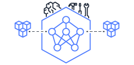
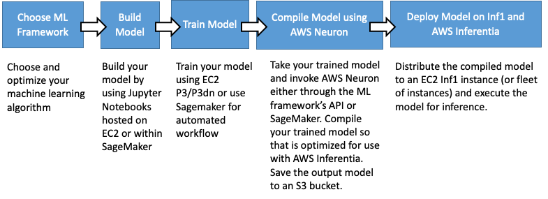

# AWS Neuron  

## Table of Contents

1. AWS Neuron Overview
2. Getting started

## AWS Neuron overview

AWS Neuron is a software development kit (SDK) enabling high-performance deep learning inference using AWS Inferentia custom designed machine learning chips. With Neuron, you can develop, deploy and run high-performance inference predictions with complex neural networks on top of Inferentia based EC2 Inf1 instances. Neuron is designed from the ground-up to allow for maximum scalability in optimizing both for highest throughput and lowest latency for a wide variety of use-cases.

Neuron is pre-integrated into popular machine learning frameworks like TensorFlow, MXNet and Pytorch to provide a seamless training-to-inference workflow. It includes a compiler, runtime library, as well as debug and profiling utilities with a TensorBoard plugin for visualization. In most cases developers will only have to change a few lines of code to use Neuron from within a framework. Developers can integrate Neuron to their own custom frameworks/environments as well.

### Neuron developer flow

Since Neuron is pre-integrated with popular frameworks, it can be easily incorporated into modern applications to provide high-performance inference predictions. Neuron is built to enable the above steps to be done from within an ML framework with the addition of the compilation step and load the model. Neuron allows customers to keep training in 32-bit floating point for best accuracy and auto-convert the 32-bit trained model to run at speed of 16-bit using bfloat16 model.

Since ML models constantly evolve, we’ve designed AWS Neuron to give builders of ML solutions a future-proof development environment, utilizing an ahead-of-time compiler that ensures Neuron will optimally utilize the hardware when new operators and neural-net models are developed.

Once a model is trained to the required accuracy, the model should be compiled to an optimized binary form, referred to as a Neuron Executable File Format (NEFF), which is in turn loaded by the Neuron runtime to execute inference input requests on Inferentia chips. The compilation step may be performed on any EC2 instance or on-premises. We recommend using a high-performance compute server of choice (C/M/R/Z instance types), for the fastest compile times and ease-of-use with a prebuilt DLAMI. Developers can also install Neuron in their own environments; this approach may work well for example when building a large fleet for inference, allowing the model creation, training and compilation to be done in the training fleet, with the NEFF files being distributed by a configuration management application to the inference fleet. 

### Deployment 

AWS Neuron provides developers flexibility to deploy their inference applications, and optimize for high-throughput and low-latency to meet their specific application requirements. For latency constrained applications, Neuron can use the large on-chip cache built into the Inferentia devices, and cache models on chip (see NeuronCore-Pipeline). Neuron can also split large models, that do not fit in the cache of a single Inferentia device, across multiple chips, and utilize a high-speed chip-to-chip interconnect to perform the calculation across multiple devices. Once deployed, NeuronCore Pipeline appears as one Neuron virtual device to the framework/application. 

With Neuron developers can assign different models to separate NeuronCore Groups in a flexible and scalable way. This allows to run the same or multiple models in parallel. NeuronCore Groups may be useful for increasing accuracy through majority-vote, or when different models need to run as a pipeline. With NeuronCore Groups developers can maximize the hardware utilization by controlling the NeuronCore compute resources allocated to each NeuronCore Group to ensure it fits their specific application requirements.
 

### Profiling and debugging

Neuron includes a set of tools and capabilities to help developers monitor and optimize their Neuron based inference applications. Neuron tools can be incorporated into scripts to automate Neuron devices operation and health monitoring, and include discover and usage utilities, data-path profiling tools, and visualization utilities. Using a tensorboard plugin you can inspect and profile graphs execution. For more details refer to: [Getting started: Neuron Tensorboard profiling](./docs/neuron-tools/getting-started-tensorboard-neuron.md)

# Getting started and more information:

## Installing Neuron
To use Neuron you can use a pre-built Amazon Machine Images (DLAMI) or DL containers or install Neuron software on your own instances. 

### DLAMI

Refer to the [AWS DLAMI Getting Started](https://docs.aws.amazon.com/dlami/latest/devguide/gs.html) guide to learn how to use the DLAMI with Neuron. When first using a released DLAMI, there may be additional updates to the Neuron packages installed in it. 

### DL Containers
Inferentia support for [AWS DL Containers](https://docs.aws.amazon.com/dlami/latest/devguide/deep-learning-containers-ec2.html) is coming soon. You can configure ECS to run on Inf1 by following these instructions [TODO](./).

### Install Neuron in your own AMI
You can [Install Neuron in your own AMI](./docs/guide-repo-config.md#user-guide-configuring-linux-for-repository-updates) if you already have an environment you'd like to continue using, or planning on running inference without a framework.

## Using Neuron Runtime
* [Neuron Runtime Readme](./docs/neuron-runtime/readme.md)

## Start using one of the supported frameworks:

TensorFlow-Neuron [TensorFlow-Neuron readme](./docs/tensorflow-neuron/readme.md) provides useful pointers to install and use Neuron from within the TensorFlow framework.
 

MXNet-Neuron [MXNet-Neuron readme ](./docs/mxnet-neuron/readme.md) provides useful pointers to install and use Neuron from within the MXNet framework.

## Debugging, profiling and other tools:
* [Getting started: Neuron Tensorboard profiling](./docs/neuron-tools/getting-started-tensorboard-neuron.md)
* [Neuron utilities](./docs/neuron-tools/Readme.md)

