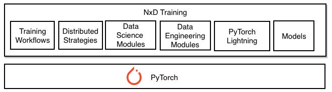
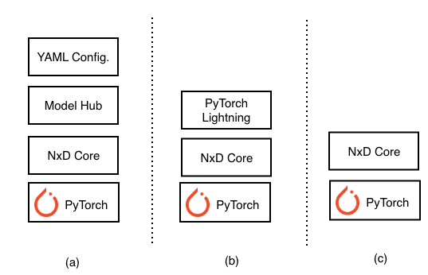

.. _nxdt-archived:
.. _nxdt:
.. _nxd-training-overview:
.. _nxd-training-api-guide:
.. _nxd_training_appnotes:
.. _nxdt_developer_guide:
.. _nxdt_tutorials:
.. _nxdt_misc:
.. _training-torch-neuronx:

.. meta::
   :robots: noindex, nofollow
   :description: Archived documentation for NxD Training (NeuronX Distributed Training) and the XLA-based torch-neuronx training flow, deprecated in Neuron 2.32.
   :date-modified: 2026-07-24

:nosearch:

NxD Training (archived)
=======================

.. warning::

   This section is archived. **NxD Training (NeuronX Distributed Training)** and the
   XLA-based ``torch-neuronx`` training flow have reached end-of-support as of Neuron 2.32 and are no
   longer actively maintained. The content below is preserved for historical reference and
   may describe features, APIs, or workflows that no longer work with current Neuron
   releases. For current PyTorch training on Trainium, see :doc:`/frameworks/torch/index`.

This page consolidates the archived documentation for NxD Training and the XLA-based
``torch-neuronx`` training experience — the library overview, setup and configuration,
tutorials, developer guides, migration guides, application notes, and reference material
that previously lived under ``libraries/nxd-training/`` and
``frameworks/torch/torch-neuronx/`` (training). Individual archived pages are listed in the
sections below and in the navigation tree for this page.

.. toctree::
   :hidden:
   :maxdepth: 1

   /archive/nxd-training/installation_guide
   /archive/nxd-training/config_overview
   /archive/nxd-training/features
   /archive/nxd-training/pytorch-neuron-programming-guide
   /archive/nxd-training/pytorch-neuron-debug
   /archive/nxd-training/torch-neuron-envvars
   /archive/nxd-training/training-troubleshooting
   /archive/nxd-training/known_issues
   /archive/nxd-training/cpu_mode_developer_guide
   /archive/nxd-training/new_model_guide
   /archive/nxd-training/new_dataloader_guide
   /archive/nxd-training/optimizer_lr_scheduler_flow
   /archive/nxd-training/migration_nemo_nxdt
   /archive/nxd-training/migration_nnm_nxdt
   /archive/nxd-training/nxd-training-tp-appnote
   /archive/nxd-training/nxd-training-pp-appnote
   /archive/nxd-training/nxd-training-cp-appnote
   /archive/nxd-training/nxd-training-amr-appnote
   /archive/nxd-training/analyze_for_training
   /archive/nxd-training/bert
   /archive/nxd-training/mlp
   /archive/nxd-training/finetune_hftrainer
   /archive/nxd-training/zero1_gpt2
   /archive/nxd-training/checkpoint_conversion
   /archive/nxd-training/hf_llama3_8B_pretraining
   /archive/nxd-training/hf_llama3_8B_SFT
   /archive/nxd-training/hf_llama3_8B_SFT_LORA
   /archive/nxd-training/hf_llama3_8B_DPO_ORPO
   /archive/nxd-training/hf_llama3_70B_pretraining

Overview
--------

NxD Training (NeuronX Distributed Training) was a PyTorch library for end-to-end distributed
training on AWS Trainium instances, built on top of the NxD Core library. It offered turnkey
support for model pre-training, supervised fine-tuning (SFT), and parameter-efficient
fine-tuning (PEFT) with LoRA, and was compatible with NVIDIA's NeMo (except for
Trainium-specific features).

Key capabilities included:

* Turnkey workflows for pre-training, SFT, and PEFT (LoRA).
* Distributed strategies [#f1]_: data parallelism, tensor parallelism, sequence parallelism,
  pipeline parallelism, and ZeRO-1.
* PyTorch Lightning integration for organized training code.
* Ready-to-use model samples in HuggingFace and Megatron-LM formats.
* Experiment management with checkpointing, logging, and S3 storage support.

NxD Training exposed three usage interfaces, letting developers work at the level of
abstraction that suited their needs:

* **YAML configuration files** — high-level distributed training with minimal code changes.
* **PyTorch Lightning APIs** — standardized training workflows over NxD Core primitives.
* **NxD Core primitives** — low-level APIs for custom model integration and advanced use.

.. _nxdt_figure:

   NxD Training

.. _nxdt_usage_figure:

   Using NxD Training through (a) configuration files, (b) PyTorch Lightning APIs, and
   (c) NxD Core primitives.

Setup and configuration
------------------------

Installation and configuration guidance for the archived NxD Training library:

* :ref:`Installation guide <nxdt_installation_guide>`
* :ref:`YAML configuration settings <nxdt_config_overview>`
* :ref:`Features <nxdt_features>`

Tutorials
---------

End-to-end training tutorials for the XLA ``torch-neuronx`` and NxD Training flows. These
tutorials are archived and may not run on current Neuron releases.

*torch-neuronx training tutorials:*

* :ref:`BERT pretraining <hf-bert-pretraining-tutorial>`
* :ref:`Multi-layer perceptron (MLP) training <neuronx-mlp-training-tutorial>`
* :ref:`HuggingFace BERT fine-tuning <torch-hf-bert-finetune>`
* :ref:`ZeRO-1 GPT-2 pretraining <zero1-gpt2-pretraining-tutorial>`
* :ref:`Analyze a model for training <torch-analyze-for-training-tutorial>`

*NxD Training library tutorials:*

* :ref:`Llama3 8B pretraining <hf_llama3_8B_pretraining>`
* :ref:`Llama3 8B supervised fine-tuning (SFT) <hf_llama3_8B_SFT>`
* :ref:`Llama3 8B SFT with LoRA <hf_llama3_8B_SFT_LORA>`
* :ref:`Llama3 8B DPO/ORPO alignment <hf_llama3_8B_DPO_ORPO>`
* :ref:`Llama3 70B pretraining <hf_llama3_70B_pretraining>`
* :ref:`Checkpoint conversion <checkpoint_conversion>`

Developer guides
----------------

Guides for extending and customizing NxD Training — integrating new models and dataloaders,
customizing the optimizer/LR-scheduler flow, and running in CPU mode:

* :ref:`Integrate a new model <nxdt_developer_guide_integrate_new_model>`
* :ref:`Integrate a new dataloader <nxdt_developer_guide_integrate_new_dataloader>`
* :ref:`Register the optimizer and LR scheduler <nxdt_developer_flow_register_optimizer_lr_scheduler>`
* :ref:`CPU-mode developer guide <cpu_mode_overview>`

Migration guides
----------------

For teams moving from earlier training stacks to NxD Training:

* :ref:`Migrate from NeuronX NeMo Megatron (NNM) <nxdt_developer_guide_migration_nnm_nxdt>`
* :ref:`Migrate from NVIDIA NeMo <nxdt_developer_guide_migration_nemo_nxdt>`

Application notes
-----------------

Deep dives on the distributed strategies and memory-optimization techniques NxD Training
used:

* :ref:`Tensor parallelism <nxd_training_tp_appnote>`
* :ref:`Pipeline parallelism <nxd_training_pp_appnote>`
* :ref:`Context parallelism <nxd_training_cp_appnote>`
* :ref:`Activation memory reduction <nxd_training_amr_appnote>`

Reference and troubleshooting
-----------------------------

Reference material and troubleshooting for the XLA ``torch-neuronx`` training flow:

* :ref:`PyTorch NeuronX programming guide <pytorch-neuronx-programming-guide>`
* :ref:`Debugging guide <pytorch-neuronx-debug>`
* :ref:`Environment variables <pytorch-neuronx-envvars>`
* :ref:`Training troubleshooting <pytorch-neuron-traning-troubleshooting>`
* :ref:`Known issues <nxdt_known_issues>`

Additional examples
--------------------

Reference sample repositories on GitHub (external; may also be unmaintained):

* `AWS Neuron Reference for NeMo Megatron <https://github.com/aws-neuron/neuronx-nemo-megatron>`_
* `AWS Neuron Samples for EKS <https://github.com/aws-neuron/aws-neuron-eks-samples>`_
* `AWS Neuron Samples for AWS ParallelCluster <https://github.com/aws-neuron/aws-neuron-parallelcluster-samples>`_
* `AWS Neuron Samples (torch-neuronx training) <https://github.com/aws-neuron/aws-neuron-samples/tree/master/torch-neuronx/training>`_

.. [#f1] Distributed strategies are implemented in the NxD Core library.
