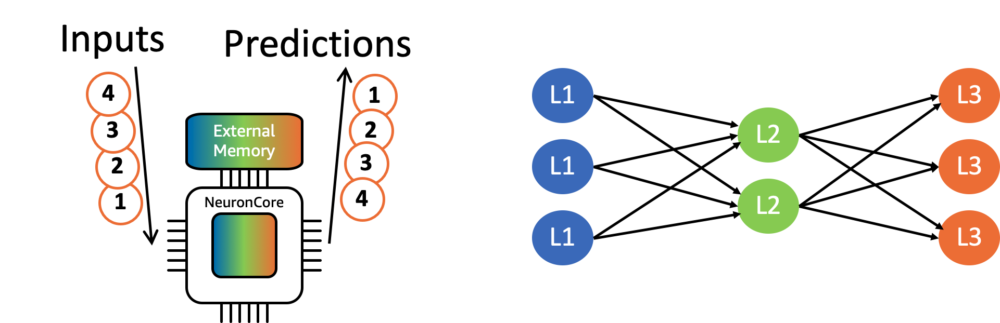

.. _neuron-batching:

Neuron Batching
===============

Batching refers to the process of grouping multiple inference requests
together and processing them as a group. Batching is typically used as
an optimization for throughput at the expense of higher latency.
Batching is usually implemented on a layer-by-layer basis, which allows
for each set of weights in a given layer to be reused for each inference
in the batch before needing to retrieve additional new weights. This
enables Neuron to better amortize the cost of reading weights from the
external memory (i.e. read weights from the memory once, and use them in
multiple calculations), and thus improve the overall hardware
efficiency.

The concept of batched inference is illustrated in the example below,
with a single NeuronCore performing batched computation of a 3 layer
neural network with a batch-size of 4. The NeuronCore reads weights from
the external memory, and then performs the corresponding computations
for all 4 inference-requests, before reading the next set of weights,
thus better amortizing the cost of reading the weights from the memory.

|Image:|

Neuron uses an ahead-of-time compiler, so to enable batching in Neuron,
a model should be explicitly compiled for a target batch-size by setting
the input-tensor batch dimension accordingly. Users are encouraged to
evaluate multiple batch sizes, in order to determine the optimal
latency/throughput deployment-point (which is model/application
dependent).

During inference, dynamic batching can be used to process a larger
client-side inference batch-size, and allow the framework to
automatically break up the user-batch into smaller batch sizes, to match
the compiled batch-size. This technique increases the achievable
throughput by hiding the framework-to-neuron overhead, and amortizing it
over a larger batch size. To enable dynamic batching in TensorFlow, user
would set the argument ``dynamic_batch_size=True`` during call to
``tfn.saved_model.compile`` method.

For example, the TensorFlow code snippet below enables batching, with
dynamic-batching and a batch-size of N=4 when compiling a model to
Inferentia target:

.. code:: python

   import numpy as np
   import tensorflow.neuron as tfn

   # To change the batch size, change the first dimension in example_input
   batch_sz = 4
   example_input = np.zeros([batch_sz, 224, 224, 3], dtype='float16')

   # Note: Users should temporarily use the following compilation flags when
   # batch size is larger than 1. These flags are only applicable to CNNs
   # (ResNet50 and similar models) and will be deprecated in the future.
   compiler_args = ['--batching_en', '--rematerialization_en', '--spill_dis',
                    '--sb_size', str((batch_sz + 6)*10),
                    '--enable-replication', 'True']

   tfn.saved_model.compile("rn50_fp16",
                           "rn50_fp16_compiled/1",
                           model_feed_dict={'input_1:0': example_input },
                           dynamic_batch_size=True,
                           compiler_args=compiler_args)

The following TensorFlow code snippet shows that the model can accept
inference requests with arbitrary batch size:

.. code:: python

   import tensorflow as tf
   import tensorflow.neuron as tfn

   predictor = tf.contrib.predictor.from_saved_model("rn50_fp16_compiled/1")
   rt_batch_sz_list = [1, 4, 7, 8, 1024]
   for rt_batch_sz in rt_batch_sz_list:
       example_input = np.zeros([rt_batch_sz, 224, 224, 3], dtype='float16')
       model_feed_dict = {'input_1:0': example_input}
       result = predictor(model_feed_dict)

.. note::

   Users should temporarily use the following compilation flags when
   batch size is larger than 1:
   ``--batching_en --rematerialization_en --spill_dis --sb_size <(batch_size + 6)*10> --enable-replication=True``.
   These flags are only applicable to CNNs (ResNet50 and similar models)
   and will be deprecated in the future.

.. note::

   Depending on the neural network size, Neuron will have a maximum
   batch size that works optimally on Inferentia. Currently, FP16
   ResNet50 is supported up to batch 5 only. Additionally, ResNet50 with
   FP32 input is limited to batch 1 only. These limitations are being
   addressed and will be fixed in a future releases of the compiler. If
   a unsupported batch size is used, an internal compiler error message
   will be displayed (see `Known
   Issues <./performance-tuning.md#known-issues>`__).

