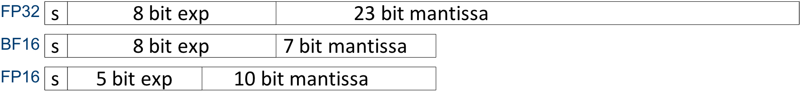

# Application Note: Neuron Data-Types

Neuron enables developers to choose from multiple data-types. The supported data-types are FP32, FP16, BF16, and INT8. Developers can train their models on their platform of choice (e.g. EC2 P3 instances), and then easily move their trained models to EC2 Inf1 for execution.

## FP16/BF16 models:

Models natively trained in FP16/BF16 will be executed in their trained data-types. This is a straightforward migration from the training platform to Inf1.

## FP32 models:
Neuron SDK supports **automatic model conversion** from FP32 to BF16. This capability allows developers to train their models using FP32 format for the highest accuracy, and achieve performance benefits without having to worry about low-precision training (e.g. no need for loss-scaling during training). ML models are typically robust to FP32 to BF16 conversion, with minimal to none impact on accuracy. This, however, is model dependent, and thus users are encouraged to benchmark the accuracy of the auto-converted model against the original FP32 trained model.

