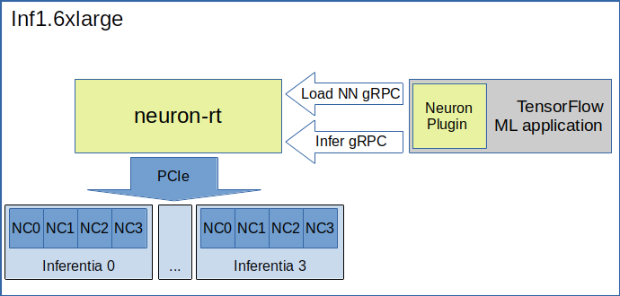
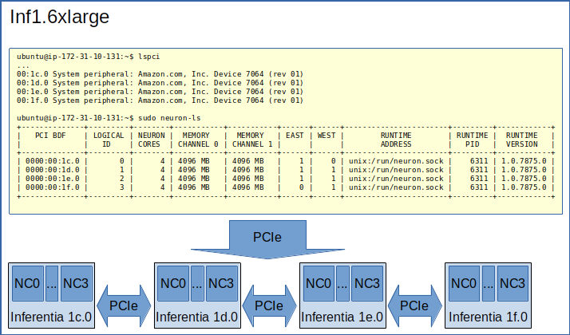
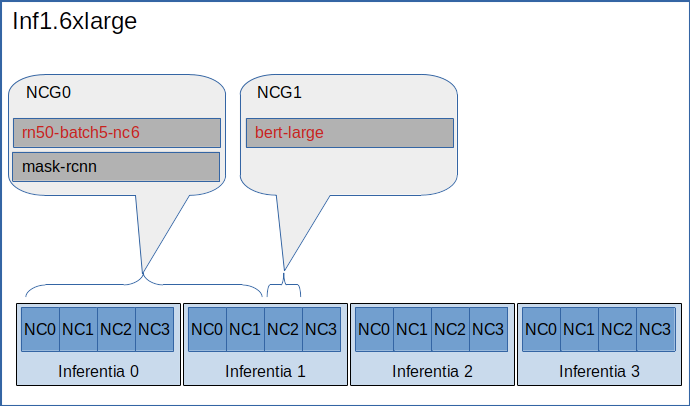
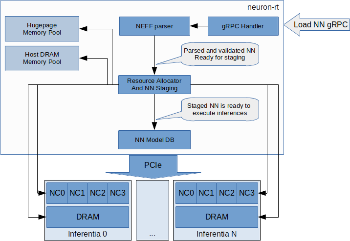
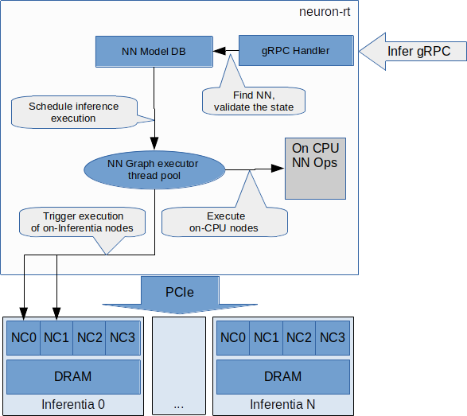

# Neuron Runtime — Theory of Operation

## Overview

Neuron Runtime (referred to as RT in this document) is a user space process for controlling Neuron devices present in EC2 Inf1 instance types.  Depending on the configuration, a single instance of the RT controls anywhere from one Neuron device to all Neuron devices available on one instance. Each Neuron device contains four NeuronCores, which means four NeuronCores are the lowest level of granularity for dividing NeuronCores among multiple instances of the RT. RT uses a kernel mode driver(aws-neuron-dkms) to communicate to the accelerator.

The RT provides an interface for loading of compiled Neural Networks and for the execution of inference requests against the loaded Neural Networks.  In addition to the inference execution interface the RT provides interfaces for monitoring hardware health and performance, for profiling the inference performance and for collecting Neural Networks execution statistics.

RT interfaces are implemented using gRPC framework.  A client, typically an ML framework such as TensorFlow, makes gRPC calls to the RT for Neural Network loading, inference execution and monitoring.

The RT is installed and run as a Linux systemd service.  Default installation directory is: **/opt/aws/neuron**.  RT service starts automatically during system start and can be controlled via the standard Linux commands:

```
ubuntu@ip-172-31-12-231:~$ sudo systemctl stop neuron-rtd
ubuntu@ip-172-31-12-231:~$ sudo systemctl start neuron-rtd
ubuntu@ip-172-31-12-231:~$ sudo systemctl status neuron-rtd
● neuron-rtd.service - Neuron Runtime Daemon
   Loaded: loaded (/lib/systemd/system/neuron-rtd.service; enabled; vendor preset: enabled)
   Active: active (running) since Thu 2020-03-19 23:43:23 UTC; 5s ago
 Main PID: 13388 (neuron-rtd)
    Tasks: 17 (limit: 4915)
   CGroup: /system.slice/neuron-rtd.service
           └─13388 /opt/aws/neuron/bin/neuron-rtd -c /opt/aws/neuron/config/neuron-rtd.config

Mar 19 23:43:09 ip-172-31-12-231 systemd[1]: Starting Neuron Runtime Daemon...
Mar 19 23:43:23 ip-172-31-12-231 systemd[1]: Started Neuron Runtime Daemon.
ubuntu@ip-172-31-12-231:~$ 
```

RT uses the standard Linux syslog facility for logging:

```
ubuntu@ip-172-31-12-231:~$ tail /var/log/syslog
Mar 19 23:43:09 ip-172-31-12-231 nrtd[13388]: [TDRV:reset_mla] Resetting 0000:00:1f.0
Mar 19 23:43:23 ip-172-31-12-231 nrtd[13388]: [TDRV:tdrv_init_one_mla_phase2] Initialized Inferentia: 0000:00:1f.0
Mar 19 23:43:23 ip-172-31-12-231 nrtd[13388]: [NRTD:RunServer] Server listening on unix:/run/neuron.sock
```



### Figure 1.  Typical Neuron deployment. 

Figure 1 shows an an example of a typical Neuron deployment. In this example a single RT daemon is managing all four Neuron devices on an inf1.6xlarge instance.  The RT provides Neural Network loading and running inferences services for the TensorFlow application.  The application communicates with the RT using gRPC interface via the Neuron Plugin embedded in TensorFlow. 

By default, all Neuron devices are managed by a single RT as shown below. 

### Figure 2. Physical topology

Figure 2 shows a physical topology of inf1.6xlarge with four Neuron devices connected by East/West PCIe links.  “neuron-ls” reads the Neuron driver and displays the order in which Neuron devices are connected.

## RT command line options

The RT can be started with optional command line parameters that are mostly used for troubleshooting:

```
ubuntu@ip-172-31-12-231:~$ /opt/aws/neuron/bin/neuron-rtd -h
neuron-rtd -t <neuron PCI BDF> [ -t <neuron PCI BDF> ..] [-g <server:port>] [-c configuration_file] [-l log-level] [-x] [-v] [-h]
```

* -t \<BDF\> can be repeated multiple times; ignores infa-map.json and services Neuron devices identified by the PCI Bus Device Function (BDF)
* -g \<server:port | socket_name\> change the default gRPC endpoint, for example -g 0.0.0.0:5555 accepts gRPC requests on TCP port 5555
* -c \<configuration file\> use specified configuration file instead of default configuration file
* -l \<log level\>  more verbose logging, use -l 6 for debug logging and -l 7 for trace (very verbose) logging
* -x  send log output to the console in addition to syslog
* -v  print RT build version
* -h  print this help menu

## RT service file

Neuron Runtime systemd service configuration files are installed under **/etc/systemd/system/multi-user.target.wants**

```
ubuntu@ip-172-31-12-231:~$ ls /etc/systemd/system/multi-user.target.wants/neuron-rtd.service
/etc/systemd/system/multi-user.target.wants/neuron-rtd.service
ubuntu@ip-172-31-12-231:~$
```

If changing command line options in the service files, reload systemd

```
ubuntu@ip-172-31-12-231:~$ systemctl daemon-reload
```

and then restart the daemon

```
ubuntu@ip-172-31-12-231:~$ sudo systemctl stop neuron-rtd
ubuntu@ip-172-31-12-231:~$ sudo systemctl start neuron-rtd
```

## RT configuration file

See here: [Runtime Configurable Parameters](./nrt-configurable-parameters.md)

## Running a single RT daemon vs. multiple RT daemons

The default installation of RT is configured to manage all Neuron devices available on an instance.  In some cases it might be beneficial to run multiple instances of the RT and have each instance manage a group of the Neuron devices.  The group must always consist Neuron devices that are serially connected.  For example, referring to Figure 2, Neuron devices 1c.0, 1d.0 and 1e.0 can placed in a group and be managed by one instance of the RT.  Neuron device 1f.0 can be placed in a different group and managed by another instance of the RT.  However, Neuron devices 1c.0 and 1e.0 cannot be placed in one group because they are not connected.

Dividing Neuron devices among multiple instances of the RT daemons provides process level separation among Neural Networks.  For example, a crash of one of the RT daemons does not stop inferences running on devices managed by other RT daemons.  

On the other hand, dividing Neuron devices makes NeuronCore allocation less flexible.  For example, on inf1.6xlarge each of the four Neuron devices can be managed by a separate instance of RT.  That would make it impossible to load a Neural Network that requires more than four Neuron Cores to execute.  

See: https://github.com/aws/aws-neuron-sdk/blob/master/docs/neuron-runtime/nrt_start.md#create-a-configuration-file-for-each-instance for details on how to configure multiple instances of the RT daemons.

## RT with containers

This section will be updated in the future.

## RT gRPC

All RT provided Neuron services are accessible via a gRPC interface.

By default, the RT uses Unix Domain Socket gRPC endpoint: **/run/neuron.sock. ** The endpoint can be changed by passing a -g command line option to neuron-rtd as explained [here](#rt-command-line-options)

## NEFF (Neuron Executable File Format)

 The Neuron Compiler compiles a Neural Network (NN) into a set of instructions and memcpy operations.  The output of the compiler is a NEFF file that  consists of:

* sets of instructions and memcpy operations to execute on Neuron Cores
* parameters associated with the sets of instructions, e.g. weights and biases
* an optional loadable module with nodes to be executed on the host CPUs
* parameters associated with nodes that are executed on the host CPUs
* NEFF graph to connect multiple Neuron and CPU nodes together.
* NEFF header containing version information, the Neural Network name, the number of NCs required to execute this NN, etc.

## NEFF graph - Neuron and CPU nodes

A Neural Network (NN) compiled to execute on Neuron devices is represented by a NEFF graph consisting of one or more nodes.  A node is compiled to execute on a set of one or more NeuronCores or on CPUs.  In the optimal case a NEFF consists of a single Neuron node, i.e. the entire Neural Network can be compiled to run on Neuron devices.   

A Neural Network might contain operators that are not supported by the  Neuron compiler.  In most cases these operators can be “partitioned out” by a framework, e.g. by TensorFlow.  Partitioned operators are not offloaded to the Neuron device and are simply executed by the framework as before.  However, in some cases it is more efficient to have Neuron execute unsupported operators, for example if an operator is in the middle of a large NN that otherwise executes fully on Neuron.  In that case, the compiler splits the network into Neuron and CPU subgraphs and compiles them separately.  Each subgraph then becomes a node in the NEFF graph and executes on the appropriate target hardware. 

## Neuron Core Group

inf1 instances are available with a different number of Neuron Cores - 4 to 64 Neuron Cores depending on the instance size.  Neuron Cores can be combined into Neuron Core Groups (NCG).   An NCG is a basic unit of NN scheduling.  NNs loaded on different NCGs can execute inferences in parallel.  Only one of the NNs loaded on the same NCG can be active and execute inferences at any given time.

NCG is created either explicitly by making a call to Neuron RT or implicitly by loading a Neural Network without specifying a previously created NCG.  Implicitly created NCG cannot be used for loading additional NNs which means a loaded NN has an exclusive use of all NCs in that NCG.  An NC that is a member of one NCG, either explicit or implicit, cannot be a member of any other NCG.

### Figure 3.  NCG example


Figure 3 shows an example where two NCGs have been created.  The first NCG contains 6 NCs and have two Neural Networks loaded.  The second NCG contains one NC and has one Neural Network loaded.  The rest of the NCs are unused.  The Neural Networks in red are active and can execute inferences.

## Neural Network Loading

A Neural Network (NN) is loaded on a Neuron Core Group.  More than one NN can be loaded on the same set of NeuronCores but only one of the NNs sharing a set of NCs can be active.  A loaded NN can be either in a running (active) state - loaded and ready to execute inferences, or in a stopped state - loaded but not ready to execute inferences.  See the chapter [Neuron Core Group](#neuron-core-group) for details about sharing a set of NCs among multiple loaded NNs.

When a Neural Network is no longer needed it can be unloaded.  Unloading frees all resources such as the instance and Neuron devices DRAM consumed by the Neural Network.  Unloading can also free NCs use by the Neural Network, see [Neuron Core Group](#neuron-core-group) for details.


### Figure 4.  Neural Network load

Figure 4 illustrates Neural Network load flow.  A client (typically the framework) invokes load() gRPC request.  The NEFF to be loaded is passed as part of the request.  The RT parses and validates the NEFF.  If valid, all resources required to run inferences are allocated.  The resources include: one or more NCs, DRAM on one or more Neuron devices and the host resources.  Loaded NN is now ready to run inferences.  After successful load gRPC request returns a handle that uniquely identifies the loaded NN.  The handle is used to identify NN in the subsequent start, stop, infer and unload operations.

The same Neural Network can be loaded multiple times on different sets of NCs to support data-parallel execution of inference requests.

## Neural Network load modes

RT supports two Neural Network load modes  - a **normal** mode and a **shared NC** mode.  In the **normal** mode a Neural Network uses the number of NCs equal to the sum of all NCs required by all Neuron nodes in the NEFF.  For example, a NEFF contains two Neuron nodes, the first node was compiled in model-parallel mode and requires 4 NCs to run, the second node requires a single NC.  The **normal** mode loading of this NEFF requires 5 NCs.  In the **shared NC** mode the load requires the number of NCs equivalent to the number of NCs used by the largest Neuron NEFF node.  In this example the number if 4.  Note that for NEFFs with only a single Neuron node both modes have identical NC requirement.

**Shared NC** mode could reduce the number of Neuron Cores used by a Neural Network.  However, **shared NC** mode might have a  significant negative impact on both inference latency and inference throughput.  The latency is impacted by the need to switch among multiple on-Neuron nodes running on the same set of NCs.  The throughput is additionally impacted by the fact that only one inference request can be executed at a time, i.e. the pipelining [Inference pipelining](#inference-pipelining) is disabled.

Note that as currently deployed, the load mode is selected indirectly by the Neuron Plugin.  The number of NCs to use is passed to the framework via an environment variable.  If the number of NCs is greater or equal to the total number of NCs required by a Neural Network, the network is loaded in **normal** mode.  Otherwise the network is loaded in **shared NC** mode.  The load will fail if the number of NCs made available to the framework is less then the minimum number of NCs required by the Neural Network.

## Explicit vs. implicit loading on an NCG

A Neural Network can be loaded on either an explicit NCG if the NCG is specified as part of load operation, or an implicit NCG if the NCG is not specified as part of load operation.

**Neural Network load using explicit NCG:**

1. Create an NCG containing a number of NCs, the call returns NCG handle that uniquely identifies this NCG
2. Pass NCG handle to NN load.  If NCG contains enough NCs for all on-Infernetia NEFF nodes the NN is loaded in **normal** mode.  If NCG contains enough NCs to accommodate the largest of on-Inferntia nodes the NN is loaded in **shared NC** mode.  Otherwise the load fails.  When successful, the load returns a handle uniquely identifying the loaded NN.
3. If multiple NNs share the same NCG repeat step [2] once per NN.
4. Start one of the loaded NNs
5. Inference requests can be submitted for the running NN.
6. Stop the NN and start a different NN.
7. Inference requests can be submitted for the newly started NN.
8. At any point, independent from running inferences, new NNs can be loaded on the NCG and any stopped NNs can be removed from the NCG.
9. After the last NN is removed from the NCG, the NCG can be destroyed.  All NCs are returned back to the free NC pool.

**Neural Network load using implicit NCG:**

1. Load NN without specifying an NCG handle.  If there are enough free NCs Neuron RT automatically create an NCG and load the NN.  The load always uses **normal** mode.  If there are not enough free NCG the load fails.
2. If the load is successful the NN is started automatically.  Neuron RT returns a handle to a successfully loaded NN.
3. Inference requests can be submitted
4. Unload of the NN automatically destroys the implicit NCG and returns NCs to the free NC pool.

## Basic inference flow

Once a Neural Network is successfully loaded and started the RT can start receiving inferences requests for this Neural Network.  An inference request consists of the NN handle uniquely identifying the NN and a set of IFMAPs (inference inputs).  An inference request can execute synchronously - the call blocks until the inference is completed, or asynchronously - the call returns immediately and returns a unique cookie identifying pending inference request.  The cookie can then be used by a subsequent call to check inference completion and to retrieve inference results (OFMAPs).

Both the synchronous and the asynchronous infer API calls return an inference result.  It contains a status code that either indicates a successful completion or a failure with the failure specific error code see [Runtime return codes](./nrt-return-codes.md).  In case of a failure in addition to return code the inference result also contains a verbose list of errors that led to the failure.   On successful completion the inference result contains a set of OFMAPs.


### Figure 5. Inference flow

Figure 5 illustrates an inference flow.  At this point a Neural Network has been loaded, staged and is running.  The network state is stored in the NN Model DB.  An inference request is submitted via gRPC.  After parsing and validating the request the RT schedules inference execution.  A worker thread from the thread pool executes CPU nodes on the instance CPU and triggers execution of the Neuron nodes on Neural Cores of one or more Neuron devices.


## Inference pipelining

Inference pipelining can significantly increase inference throughput when running on Neuron devices.  The improvement is achieved in two different ways.

1. By having the next set of IFMAPs ready before the previous inference is completed.
2. By having NCs and CPU nodes execute multiple in-flight inference request in parallel - available when running NNs compiled for 
model-parallel mode.

An inference queue is used to support inference pipelining.  The queue size is statically configured during Neural Network load operation and cannot be changed after the NN has been loaded.  Increasing the queue size consumes more DRAM (on an instance, on Neuron devices or both) roughly in proportion to the total size of all IFMAPs, OFMAPs and intermediate tensors used to connect multiple NEFF nodes together.  Determining the optimal queue size for a given NN might require some experimentation but a good starting point is:
`ninfer = total number of NCs in this NN + total number of CPU nodes in this NN + 1`

Note that for Neural Networks loaded in **shared NC** mode, inference pipelining is not available. 

## Shared memory for inference IFMAPs and OFMAPs

The sizes of IFMAPs and OFMAPs tensors vary with the neural networks and can be quite large (over 2MB).  By default, gRPC transport used to communicate with Neuron RT introduces additional data copying operations.   Client tensors are first copied to the gRPC protobuf and then from the protobuf to the RT tensors in the inference request.  The tensors are copied in the opposite direction in the inference response.  This additional copying may noticeably impact inference latency and throughput.

For Neural Networks with large IFMAPs or OFMAPs, gRPC with shared memory could be used to improve both the inference latency and the inference throughput.  When a client uses shared memory for IFMAPs or OFMAPs the client allocates the shared memory using regular OS services - mmap().  If the shared memory is used for IFMAPs the client then copies IFMAPs to the allocated shared memory and passes the name of the shared memory in gRPC infer() call instead of copying IFMAPs into the protobuf.  Similarly on the way back the RT copies OFMAPs into the shared memory allocated by the client instead of passing them through the protobuf.

Shared memory could be used independently for either or both IFMAPs and OFMAPs.

Currently, Neuron Plugin always uses shared memory for both IFMAPs and OFMAPs.
