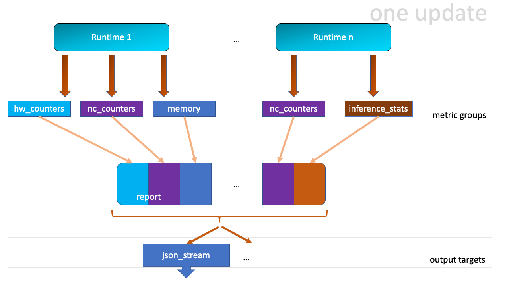

# neuron-monitor User Guide

**neuron-monitor** is a Neuron tool which can run concurrently with one or more Neuron Runtime processes, collecting metrics and stats from these runtimes as well as from the entire system. It outputs the collected data in the format specified by the requested ***output targets***, for example: as a JSON streamed to stdout.

Runtime and system metrics and stats are divided into ***metric groups*** which can be enabled as required. Both ***metric groups*** and ***output targets*** are specified using a configuration file as described in the [Running neuron-monitor](#running-neuron-monitor) section.

As detailed in the [Execution model](#execution-model) section, **neuron-monitor** runs a continuous loop consisting of:

* collecting the runtime/system data for the metric groups which, based on the elapsed time since their last update, need to be updated
* taking the newly collected data and merging it into a large report
* serializing that report to JSON (and, in the future, possibly other formats) and streaming it to stdout from where it can be consumed by other tools - an example of such a tool is provided in the form of a [script which pushes data to Cloudwatch](#companion-scripts) and is installed in `/opt/aws/neuron/bin/neuron-monitor-cloudwatch.py`
* waiting until at least one ***metric group*** needs to be collected


## Running neuron-monitor

neuron-monitor takes the following 2 optional arguments:

```
--verbose= Verbosity level (default: 0)
 -c, --config-file= Path to configuration file
```

* `--verbose n`, where **n** can be 0 to 4, controls the amount of debugging and verbose information sent to stderr; **0: no output**, **4: maximum verbosity**, default is 0

* `-c, --config-file path`, where **path** is a valid path to a neuron-monitor JSON configuration file

Example:

```
neuron-monitor -c monitor.conf
```

Not specifying any option will enable collecting all the metric groups with a period of 1 second.

Example of a configuration file which enables all currently available **metric groups** for a single runtime with a global update period of 1 second:

```
{
  "period": "1s",
  "runtimes": [
    {
      "address": "unix:/run/neuron.sock",
      "metrics": [
        {
          "type": "nc_counters"
        },
        {
          "type": "memory"
        },
        {
          "type": "runtime_cpu_usage"
        },
        {
          "type": "inference_stats"
        },
        {
          "type": "hw_counters"
        }
      ]
    }
  ],
  "system_metrics": [
    {
      "type": "cpu_usage"
    }
  ],
  "output_targets": [
    {
      "type": "json_stream"
    }
  ]
}
```

### JSON objects and fields in the settings file

* `"runtimes"` - array of objects specifying which runtimes to monitor and what metric groups are enabled for each runtime
    * `"address"` - address of this runtime
    * `"metrics"` - array of objects specifying which metric groups to capture for this runtime
        * `"type"` - type of metric group
* `"period"` - the ***root***, the ***runtime*** and the ***metric groups*** objects (both system-wide and runtime-specific) can contain a ```period``` field; if not specified, it's inherited from its parent
    * ```"period"``` is a string containing ```value<unit>```, where unit can be **s** (seconds), or **m** (minutes), for example: `"period": "1m"` or `"period": "20s"`
    * If the ```"period"``` can’t be determined for a certain metric group (for example, it’s missing from the metric group object and all its parents), the monitor will throw an error and exit:
        ```
           {
              // <- Add "period" here
              "runtimes": [
                {
                  // <- and/or here
                  "address": "unix:/run/neuron.sock",
                  "metrics": [
                    {
                      // <- and/or here, otherwise this config will not be valid
                      "type": "nc_counters"
                    }
                }
            }

* `"system_metrics"` - array of objects specifying which system level metric groups are enabled
* `"output_targets"` - array of objects specifying which ***output targets*** are active

### Currently supported runtime-level metric groups

* ["nc_counters"](#nc_counters) - Neuron core related metrics
* ["memory"](#memory) - runtime memory usage data
* ["runtime_cpu_usage"](#runtime_cpu_usage) - runtime CPU utilization data
* ["inference_stats"](#inference_stats) - runtime-wide inference stats, including error count and latency
* ["hw_counters"](#hw_counters) - counters for memory ecc events

### Currently supported system-wide metric groups

* ["cpu_usage"](#cpu_usage) - system-wide CPU usage

### Currently supported output targets

* ["json_stream"](#the-json_stream-output-format) - continuously outputs JSON data to stdout from where it can be redirected to an executable that can process that data

## Execution model



The program runs an infinite loop and whenever one or more metric groups needs updating, the corresponding data gets pulled from the runtimes (or the system) and gets consolidated in a monolithic report which is sent to the active ***output targets***, such as: the ```json_stream``` target which outputs the JSON format described below.

## The json_stream output format

Whenever the report gets updated, a complete JSON is written to stdout. This is its structure:

```
{
  "runtime_data": [
    {
      "runtime_index": 0,
      "error": "",
      "report": {
        "nc_counters": {
            [...]
        },
        "inference_stats": {
            [...]
        },
        "memory": {
            [...]
        },
        "hw_counters": {
            [...]
        },
        "runtime_cpu_usage": {
            [...]
        }
      }
    }
  ],
  "system_data": {
    "cpu_usage": {
            [...]
    }
  },
  "instance_data": {
    "instance_id": "i-0011223344556677a",
    "instance_type": "inf1.xlarge",
    "ami_id": "ami-0011223344556677b"
  }
}
```

* `"runtime_data"` is an array containing one entry per each runtime specified in the settings file
    * `"runtime_index"` is the zero-based index of this runtime in the configuration file
    * `"error"` specifies any error that occurred when collecting data from this runtime
    * `"report"` will contain the results for the runtime-level metric groups; their formats are described below
* `"system_data"` is similar to `"runtime_data"`‘s `"report"` but only contains system-level metric groups (not associated to any runtime) 

There is also some extra instance information added to the root object regardless of the configuration:

```
  "instance_data": {
    "instance_id": "i-0011223344556677a",
    "instance_type": "inf1.xlarge",
    "ami_id": "ami-0011223344556677b"
  }
```

Each ***metric group*** requested in the settings file will get an entry in the resulting output. The general format for such an entry is:

```
"metric_group": {
  "period": 1.015, // Actual captured period, in seconds
  "error": "",     // Error, if any occurred, otherwise an empty string
  [...]            // Metric group specific data
}
```

## Runtime level metric groups

### "nc_counters"

```
        "nc_counters": {
          "period": 1.000113182,
          "neuron_cores": {
            "0": {
              "alignment_corrections": 12341,
              "matmul_utilization": 42.01,
              "active_models": [
                "my_model:my_subgraph1"
              ]
            },
            "1": {
              "alignment_corrections": 12342,
              "matmul_utilization": 42.02,
              "active_models": [
                "my_model:my_subgraph2"
              ]
            },
            "2": {
              "alignment_corrections": 12343,
              "matmul_utilization": 42.03,
              "active_models": [
                "my_model:my_subgraph3"
              ]
            },
            "3": {
              "alignment_corrections": 12344,
              "matmul_utilization": 42.04,
              "active_models": [
                "my_model:my_subgraph4"
              ]
            }
          },
          "estimated_cycles": 1000113182,
          "error": ""
        }
```

* `"neuron_cores"` is an object containing data for all the Neuron cores that were active when the data was captured, indexed by neuron core index: `"nc_index": { nc_data }`
    * `"matmul_utilization"` - matmul utilization in percent during the captured period
    * `"alignment_corrections"` - number of memory alignment corrections done by the Neuron core during the captured period
    * `"active_models"` - array containing strings formatted as `"model_name:subgraph_name"` which represent what models and subgraphs are currently loaded and associated with that neuron core
* `"estimated_cycles"` - estimated number of cycles executed by a single Neuron core during the captured period
* `"error"` - string containing any error that occurred when collecting the data

### "inference_stats"

```
        "inference_stats": {
          "period": 1.030613214,
          "error_summary": {
            "generic": 0,
            "numerical": 0,
            "transient": 0,
            "runtime": 0,
            "hardware": 0
          },
          "inference_summary": {
            "completed": 123,
            "completed_with_err": 0,
            "completed_with_num_err": 0,
            "timed_out": 0,
            "incorrect_input": 0,
            "failed_to_queue": 0
          },
          "latency_stats": {
            "total_latency": {
              "p0": 0.01100001,
              "p1": 0.01100002,
              "p25": 0.01100004,
              "p50": 0.01100008,
              "p75": 0.01100010,
              "p99": 0.01100012,
              "p100": 0.01100013
            },
            "device_latency": {
              "p0": 0.01000001,
              "p1": 0.01000002,
              "p25": 0.01000004,
              "p50": 0.01000008,
              "p75": 0.01000010,
              "p99": 0.01000012,
              "p100": 0.01000013
            }
          },
          "error": ""
        },
```

* `"error_summary"` is an object containing the error counts for the captured period indexed by their type
    * `"generic"` - generic inference errors
    * `"numeric"` - NAN inference errors
    * `"transient"` - recoverable errors, such as ECC corrections
    * `"runtime"` - runtime errors
    * `"hardware"` - hardware errors such as uncorrectable ECC issues
* `"inference_summary"` is an object containing all inference outcome counts for the captured period indexed by their type
    * `"completed"` - inferences completed successfully
    * `"completed_with_err"` - inferences that ended in an error other than numeric
    * `"completed_with_num_err"` - inferences that ended in a numeric error
    * `"timed_out"` - inferences that took longer than the runtime configured timeout value
    * `"incorrect_input"` - inferences that failed to start due to incorrect input being provided
    * `"failed_to_queue"` - inference requests that were rejected due to runtime not being able to queue them
* `"latency_stats"` contains two objects containing latency percentiles for the inferences executed during the captured period. If there are no inferences being executed during this time, the two objects will be `null` (i.e. `"total_latency": null`)
    * `"total_latency"` - total latency for an inference as measured by the runtime
    * `"device_latency"` - time spent by an inference exclusively on the Neuron device
* `"error"` - string containing any error that occurred when collecting the data

### "memory"

```
        "memory": {
          "period": 1.030366715,
          "runtime_memory": {
            "host": 1000000,
            "device": 2000000
          },
          "models": [
            {
              "name": "my_model",
              "uuid": "aaaaaaaaaaabbbbbbbbbbb0000000000099999999999",
              "memory_usage": {
                "host": 250000,
                "device": 500000
              },
              "subgraphs": {
                "sg00": {
                  "memory_usage": {
                    "host": 250000,
                    "device": 500000
                  },
                  "neuron_core": 2,
                  "neuron_device": 0
                }
              }
            },
            {
              "name": "my_model",
              "uuid": "aaaaaaaaaaabbbbbbbbbbb0000000000099999999999",
              "memory_usage": {
                "host": 250000,
                "device": 500000
              },
              "subgraphs": {
                "sg00": {
                  "memory_usage": {
                    "host": 250000,
                    "device": 500000
                  },
                  "neuron_core": 0,
                  "neuron_device": 0
                }
              }
            },
            {
              "name": "my_model",
              "uuid": "aaaaaaaaaaabbbbbbbbbbb0000000000099999999999",
              "memory_usage": {
                "host": 250000,
                "device": 500000
              },
              "subgraphs": {
                "sg00": {
                  "memory_usage": {
                    "host": 250000,
                    "device": 500000
                  },
                  "neuron_core": 1,
                  "neuron_device": 0
                }
              }
            },
            {
              "name": "my_model",
              "uuid": "aaaaaaaaaaabbbbbbbbbbb0000000000099999999999",
              "memory_usage": {
                "host": 250000,
                "device": 500000
              },
              "subgraphs": {
                "sg00": {
                  "memory_usage": {
                    "host": 250000,
                    "device": 500000
                  },
                  "neuron_core": 3,
                  "neuron_device": 0
                }
              }
            }
          ],
          "error": ""
        },
```

* `"runtime_memory"` summarizes the amount of memory used by the runtime at the time of capture
    * `"current"` - current amount of memory used by the runtime
    * all memory usage objects contain these two fields:
        * `"host"` - host DRAM usage in bytes
        * `"device"` - Neuron device DRAM usage in bytes
* `"models"` - array containing objects representing loaded models
    * `"name"` - name of the model
    * `"uuid"` - unique id for the model
    * `"memory_usage"` - total memory usage for the model
    * "`subgraphs"` - object containing all the subgraph for the model indexed by their name: `"subgraph_name": { subgraph_data }`
        * `"memory_usage"` - memory usage for this subgraph
        * `"neuron_core"` - Neuron core index with which the subgraph is associated
        * `"neuron_device"` - Neuron device index on which the subgraph is loaded
* `"error"` - string containing any error that occurred when collecting the data

### "hw_counters"

```
        "hw_counters": {
          "period": 1.030359284,
          "devices": [
            {
              "device_index": 0,
              "mem_ecc_corrected": 0,
              "mem_ecc_uncorrected": 0,
              "sram_ecc_uncorrected": 0
            }
          ],
          "error": ""
        },
```

* `"devices"` - array containing ECC data for all Neuron devices controlled by this runtime for the captured period
    * `"device_index"` - Neuron device index
    * `"mem_ecc_corrected"` - Number of corrected ECC events in the Neuron device’s DRAM
    * `"mem_ecc_uncorrected"` - Number of uncorrected ECC events in the Neuron device’s DRAM
    * `"sram_ecc_uncorrected"` - Number of uncorrected ECC events in the Neuron device’s SRAM
* `"error"` - string containing any error that occurred when collecting the data

### "runtime_cpu_usage"

```
        "runtime_cpu_usage": {
          "period": 1.030604818,
          "cpu_usage": {
            "user": 42.01,
            "system": 12.34
          },
          "error": ""
        }
```

* `"cpu_usage"` - object showing CPU usage in percentages for the runtime during the captured period
    * `"user"` - percentage of time spent in user code for this runtime
    * `"system"` - percentage of time spent in kernel code for this runtime
* `"error"` - string containing any error that occurred when collecting the data


## System level metric groups

### "cpu_usage"

```
  "system_data": {
    "cpu_usage": {
      "period": 0.999974868,
      "average_usage": {
        "user": 32.77,
        "nice": 0,
        "system": 22.87,
        "idle": 39.36,
        "io_wait": 0,
        "irq": 0,
        "soft_irq": 0
      },
      "usage_data": {
        "0": {
          "user": 34.41,
          "nice": 0,
          "system": 27.96,
          "idle": 37.63,
          "io_wait": 0,
          "irq": 0,
          "soft_irq": 0
        },
        "1": {
          "user": 56.84,
          "nice": 0,
          "system": 28.42,
          "idle": 14.74,
          "io_wait": 0,
          "irq": 0,
          "soft_irq": 0
        },
        "2": {
          "user": 31.18,
          "nice": 0,
          "system": 9.68,
          "idle": 59.14,
          "io_wait": 0,
          "irq": 0,
          "soft_irq": 0
        },
        "3": {
          "user": 27.37,
          "nice": 0,
          "system": 25.26,
          "idle": 47.37,
          "io_wait": 0,
          "irq": 0,
          "soft_irq": 0
        }
      },
      "context_switch_count": 123456,
      "error": ""
    }
  },
```

* each CPU usage object contains the following fields:
    * `"user"` - percentage of time spent in user code
    * `"nice"` - percentage of time spent executing niced user code
    * `"system"` - percentage of time spent executing system code
    * `"idle"` - percentage of time spent idle
    * `"io_wait"` - percentage of time spent waiting for IO operations
    * `"irq"` - percentage of time spent servicing hardware interrupts
    * `"soft_irq"` - percentage of time spent servicing software interrupts
* `"average_usage"` - contains the average usage across all CPUs during the captured period
* `"usage_data"` - contains per CPU usage during the captured period
* `"context_switch_count"` - contains the number of CPU context switches during the captured period
* `"error"` - string containing any error that occurred when collecting the data

## Companion scripts

neuron-monitor is installed with one example Python companion script: **neuron-monitor-cloudwatch.py**.
It requires Python3 and the [boto3 Python module](https://boto3.amazonaws.com/v1/documentation/api/latest/guide/quickstart.html#quickstart).
It is installed to: ```/opt/aws/neuron/bin/neuron-monitor-cloudwatch.py```.

```
neuron-monitor | neuron-monitor-cloudwatch.py --namespace <namespace> --region <region>
```


For example:

```
neuron-monitor | neuron-monitor-cloudwatch.py --namespace neuron_monitor_test --region us-west-2
```


The script also supports specifying 1 second resolution for the metrics data, using the `--high-resolution-metrics` option, for example:

```
neuron-monitor | neuron-monitor-cloudwatch.py --namespace neuron_monitor_test --region us-west-2 --high-resolution-metrics
```

**Please note that using this option will result in higher costs.**

Whenever the runtime is unreachable for one update (for example, it was restarting) or there is an error posting to Cloudwatch, the script will output an error message to stderr. It will continue outputting a message to stderr for each failure on each update. You can capture these messages to a file or redirect them to `/dev/null`.


```
neuron-monitor | neuron-monitor-cloudwatch.py --namespace neuron_monitor_test --region us-west-2 2> monitor_cloudwatch_err.txt
```

### Customizing the companion script:

The companion script was kept simple so it can be easy to customize. Each runtime metric group has a handler function which receives the data from the monitor as an argument. For example:


```
def process_nc_counters(instance_info, rt_index, data):
    metrics = []
    common_dims = create_common_dims(instance_info, rt_index)
    for nc_idx, nc_data in data['neuron_cores'].items():
        dims = [create_dim('NeuronCore', nc_idx)]
        metrics.append(create_metric('MatmulUtilization', nc_data['matmul_utilization'],
                                     'Percent', dims + common_dims))
    return metrics
```

The `data` argument will contain the `‘nc_counters’` data for the runtime with the index `rt_index` as described [here](#nc_counters). You can add new dimensions by expanding the `dims` array, add new metrics by adding to the `metrics` array or rename any item. By changing the `create_common_dims` function you can control what dimensions are assigned to all the metrics.
