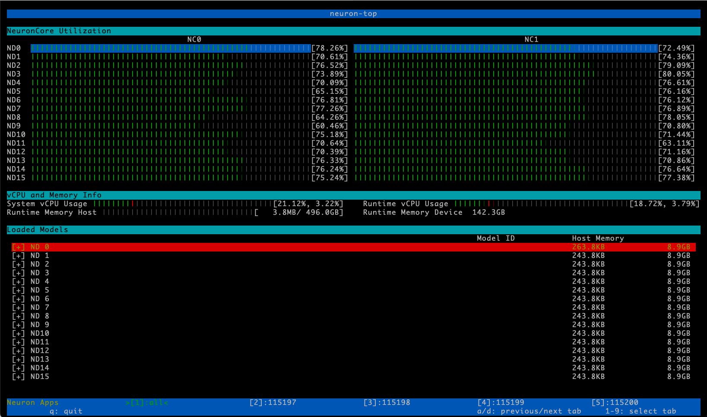

.. _hf-bert-pretraining-tutorial:

Hugging Face BERT Pretraining Tutorial
======================================

This tutorial explains how to run Hugging Face BERT-Large model
pretraining on Trainium using PyTorch Neuron.

The Hugging Face BERT pretraining example demonstrates the steps
required to perform single-node, multi-accelerator PyTorch model
training using the new AWS EC2 Trn1 (Trainium) instances and the AWS
Neuron SDK. This tutorial is an adaptation of an existing `BERT
example <https://github.com/NVIDIA/DeepLearningExamples/blob/master/PyTorch/LanguageModeling/BERT/run_pretraining.py>`__
with the following important characteristics:

-  Framework: PyTorch/XLA
-  Model: Hugging Face BertForPreTraining
-  Optimizer: AdamW
-  Scheduler: Hugging Face's get_linear_schedule_with_warmup
-  Allreduce occurs before optimizer step, after gradient accumulations
   (following DeepSpeed's Smart Gradient Accumulation)

As done in the original BERT paper, BERT pretraining happens in two
phases. In the first phase (phase 1) BERT maximum sequence length is fixed
at 128 tokens, while in phase 2 it is fixed at 512 tokens.

Neuron provides access to Trainium devices through an extension of PyTorch/XLA - a library that includes the familiar PyTorch interface along with XLA-specific additions. For additional details
relating to PyTorch/XLA, please refer to the `official PyTorch/XLA
documentation <https://pytorch.org/xla/>`__.

.. contents:: Table of Contents
   :local:
   :depth: 3

.. include:: ../note-performance.txt

Phase 1 BERT-Large pretraining
------------------------------

Setting up the training environment on trn1.32xlarge
~~~~~~~~~~~~~~~~~~~~~~~~~~~~~~~~~~~~~~~~~~~~~~~~~~~~

The BERT training script ``dp_bert_large_hf_pretrain_hdf5.py``
can run on a Trainium instance (trn1.32xlarge) that contains the
appropriate Neuron runtime and Python dependencies.

First, on a trn1.32xlarge instance, follow the installation instructions at:

* :ref:`Install PyTorch Neuron on Trn1 <pytorch-neuronx-install>`

Please set the storage of instance to *512GB* or more if you intent to run multiple experiments and save many checkpoints.

For all the commands below, make sure you are in the virtual environment that you have created above before you run the commands:

.. code:: shell

   source ~/aws_neuron_venv_pytorch_p37/bin/activate

Next, download the Python-based training script ``dp_bert_large_hf_pretrain_hdf5.py`` and ``requirements.txt`` and install the requirements:

.. code:: shell

   mkdir -p ~/examples/dp_bert_hf_pretrain
   cd ~/examples/dp_bert_hf_pretrain
   wget https://raw.githubusercontent.com/aws-neuron/aws-neuron-samples/master/torch-neuronx/training/dp_bert_hf_pretrain/dp_bert_large_hf_pretrain_hdf5.py
   wget https://raw.githubusercontent.com/aws-neuron/aws-neuron-samples/master/torch-neuronx/training/dp_bert_hf_pretrain/requirements.txt
   python3 -m pip install -r requirements.txt

Downloading tokenized and sharded dataset files
~~~~~~~~~~~~~~~~~~~~~~~~~~~~~~~~~~~~~~~~~~~~~~~

To download the tokenized and sharded dataset files needed for this tutorial, please run the following commands:

.. code:: shell

   mkdir -p ~/examples_datasets/
   pushd ~/examples_datasets/
   aws s3 cp s3://neuron-s3/training_datasets/bert_pretrain_wikicorpus_tokenized_hdf5/bert_pretrain_wikicorpus_tokenized_hdf5_seqlen128.tar .  --no-sign-request
   tar -xf bert_pretrain_wikicorpus_tokenized_hdf5_seqlen128.tar
   rm bert_pretrain_wikicorpus_tokenized_hdf5_seqlen128.tar
   aws s3 cp s3://neuron-s3/training_datasets/bert_pretrain_wikicorpus_tokenized_hdf5/bert_pretrain_wikicorpus_tokenized_hdf5_seqlen512.tar .  --no-sign-request
   tar -xf bert_pretrain_wikicorpus_tokenized_hdf5_seqlen512.tar
   rm bert_pretrain_wikicorpus_tokenized_hdf5_seqlen512.tar
   popd

``~/examples_datasets/bert_pretrain_wikicorpus_tokenized_hdf5_seqlen128`` will now have the tokenized and sharded dataset files for phase 1 pretraining and ``~/examples_datasets/bert_pretrain_wikicorpus_tokenized_hdf5_seqlen512`` for phase 2 pretraining.

Number of workers
~~~~~~~~~~~~~~~~~

You will be using torchrun (`PyTorch's Elastic Launch <https://pytorch.org/docs/stable/elastic/run.html>`__) to run some of the commands in this tutorial. When running the training script, you can configure the number of
NeuronCores to use for training by using torchrun's :option:`--nproc_per_node` option.

.. note::

    Currently Neuron Runtime only support 1 and 2 worker configurations on trn1.2xlarge and 1, 2, 8, and 32-worker configurations on trn1.32xlarge.

BFloat16 and stochastic rounding in phase 1
~~~~~~~~~~~~~~~~~~~~~~~~~~~~~~~~~~~~~~~~~~~

Phase 1 pretraining performance can be increased by using full BFloat16 casting
and stochastic rounding. Full BFloat16 casting and stochastic rounding can be enabled by setting environment
variable ``XLA_USE_BF16=1`` when
launching the pretraining job.
To achieve maximum performance while maintaining loss
convergence characteristics, we are using batch size of 16 and
gradient accumulation microsteps of 32 to maintain global batch size of 16384 for phase 1.
The batch size and gradient accumulation microstep changes can be set by
launching the BERT pretraining script ``dp_bert_large_hf_pretrain_hdf5.py`` with
command-line arguments ``--batch_size=16 --grad_accum_usteps=32``, as seen in the following steps.

Pre-compilation
~~~~~~~~~~~~~~~

PyTorch Neuron evaluates operations lazily during execution of the training loops, which means it builds a symbolic
graph in the background and the graph is executed in hardware only when the tensor is printed, transfered to CPU, or ``xm.mark_step()`` is encountered (``xm.mark_step()`` is implicitly called by ``pl.MpDeviceLoader/pl.ParallelLoader``). During execution of the training loops, PyTorch Neuron can build multiple graphs depending on the number of conditional paths taken. For BERT-Large pretraining, PyTorch Neuron builds multiple unique graphs that should be compiled before running on the NeuronCores. PyTorch Neuron will compile those graphs only if they are not in the XLA in-memory cache or the persistent cache. To reduce the compilation time of these graphs, you can pre-compile those graphs using the utility ``neuron_parallel_compile`` (provided by the ``libneuronxla`` package, a transitive dependency of ``torch-neuronx``) as shown:

.. code:: shell

   cd ~/examples/dp_bert_hf_pretrain
   neuron_parallel_compile XLA_USE_BF16=1 torchrun --nproc_per_node=32 \
   dp_bert_large_hf_pretrain_hdf5.py \
   --steps_this_run 10 \
   --batch_size 16 \
   --grad_accum_usteps 32 |& tee compile_log.txt

This command performs a fast trial run of the training script to build
graphs and then do parallel compilations on those graphs using multiple processes of Neuron Compiler before
populating the on-disk persistent cache with compiled graphs. This helps make
the actual training run faster because the compiled graphs will loaded from the persistent cache.
Currently it takes ~13 minutes to compile the BERT-Large model training step using the pre-compilation script (compare to ~40 minute if not using the pre-compilation script).

.. note::

    The trial run during pre-compilation currently outputs invalid loss numbers. Please disregard them.

.. note::

    The command after ``neuron_parallel_compile`` should match the actual run command, except for the option :option:`--steps_this_run` which shortens the trial run just enough to allow the tool to build all the graphs needed for the actual run.

If you interrupt
the run and restart the execution without changing model configurations or training hyperparameters, the new run will detect the cached
graphs in the persistent cache (on-disk) and reload the compiled graphs for
execution, avoiding any recompilation time.

Changes made to the BERT model configuration (layers, hidden
size, attention heads in the get_model function), batch size (using
:option:`--batch_size` option), optimizer or number of workers may trigger
graph recompilation. It is best to rerun the pre-compilation step above if these changes are made.

You can adjust the following hyperparameters without changing the model
and causing recompilation:

-  Number of global steps to run (:option:`--steps_this_run` option)
-  Learning rate (:option:`--lr` option)
-  Gradient accumulation steps > 1 (:option:`--grad_accum_usteps` option). If
   1 then there's no gradient accumulation and the graphs change causing
   recompilation.

Initiating a Training Job
~~~~~~~~~~~~~~~~~~~~~~~~~

After running the pre-compilation step, continue
with the actual phase 1 pretraining by running one of the following
set of commands to launch 32 data parallel distributed training workers:

.. code:: bash

   cd ~/examples/dp_bert_hf_pretrain
   XLA_USE_BF16=1 torchrun --nproc_per_node=32 \
   dp_bert_large_hf_pretrain_hdf5.py \
   --batch_size 16 \
   --grad_accum_usteps 32 |& tee run_pretrain_log.txt

As the training script launches, you will initially see several console
messages indicating that the Neuron Runtime is initializing:

.. code:: bash

   Using Neuron Runtime
   Using Neuron Runtime
   Using Neuron Runtime
   Using Neuron Runtime
   Using Neuron Runtime
   ...

A few moments later, you will see the Training Configuration and Model
Configuration in the output:

.. code:: bash

   --------TRAINING CONFIG----------
   Namespace(batch_size=16, data_dir='~/examples_datasets/
   bert_pretrain_wikicorpus_tokenized_hdf5_seqlen128/', debug=False,
   enable_pt_autocast=False, grad_accum_usteps=32, local_rank=0, lr=0.0004,
   max_pred_len=20, max_steps=28125, metrics_file='/tmp/test_dict.json',
   minimal_ckpt=False, num_ckpts_to_keep=1, output_dir='./output',
   phase1_end_step=28125, phase2=False, resume_ckpt=False, resume_step=-1,
   seed=12349, seq_len=128, shards_per_ckpt=1, steps_this_run=28125, warmup_steps=2000)

.. code:: bash

   --------MODEL CONFIG----------
   BertConfig {
   "_name_or_path": "bert-large-uncased",
   "architectures": [
   "BertForMaskedLM"
   ],
   "attention_probs_dropout_prob": 0.1,
   "classifier_dropout": null,
   "gradient_checkpointing": false,
   "hidden_act": "gelu",
   "hidden_dropout_prob": 0.1,
   "hidden_size": 1024,
   "initializer_range": 0.02,
   "intermediate_size": 4096,
   "layer_norm_eps": 1e-12,
   "max_position_embeddings": 512,
   "model_type": "bert",
   "num_attention_heads": 16,
   "num_hidden_layers": 24,
   "pad_token_id": 0,
   "position_embedding_type": "absolute",
   "transformers_version": "4.15.0",
   "type_vocab_size": 2,
   "use_cache": true,
   "vocab_size": 30522
   }

As the worker processes begin training on the BERT dataset, you will
begin to see training metrics and the learning rate logged to the
console approximately every training step. The metrics include
average_loss, step_loss, and throughput:

.. code:: bash

    LOG Thu Sep 29 22:30:10 2022 - (0, 78) step_loss : 9.1875  learning_rate : 1.56e-05  throughput : 2873.14
    LOG Thu Sep 29 22:30:16 2022 - (0, 79) step_loss : 8.9375  learning_rate : 1.58e-05  throughput : 2878.09
    LOG Thu Sep 29 22:30:22 2022 - (0, 80) step_loss : 9.0000  learning_rate : 1.60e-05  throughput : 2875.31
    LOG Thu Sep 29 22:30:27 2022 - (0, 81) step_loss : 9.0000  learning_rate : 1.62e-05  throughput : 2877.35
    LOG Thu Sep 29 22:30:33 2022 - (0, 82) step_loss : 8.8750  learning_rate : 1.64e-05  throughput : 2872.55
    LOG Thu Sep 29 22:30:39 2022 - (0, 83) step_loss : 9.0000  learning_rate : 1.66e-05  throughput : 2876.17
    LOG Thu Sep 29 22:30:44 2022 - (0, 84) step_loss : 9.1250  learning_rate : 1.68e-05  throughput : 2872.48
    LOG Thu Sep 29 22:30:50 2022 - (0, 85) step_loss : 9.0000  learning_rate : 1.70e-05  throughput : 2873.39

By default, the training script will store all output files under
``~/examples/dp_bert_hf_pretrain/output``. The output files consist of
the following:

-  PyTorch model checkpoint files, with names containing the global step
   of the checkpoint (ckpt_2000.pt, ckpt_4000.pt, etc.). Currently, the
   training script saves a checkpoint after every dataset shard.
   The frequency of saving checkpoint can be reduced by increasing the number of
   dataset shards per checkpoint, using option :option:`--shards_per_ckpt`.
   Furthermore, the number of checkpoints kept at a given time is limited by :option:`--num_ckpts_to_keep` option (currently default to 1).

-  TensorBoard log files (each training run will store its logs in a
   subdirectory with prefix ``neuron_tblogs_``).

Monitoring Progress of the Training Job
~~~~~~~~~~~~~~~~~~~~~~~~~~~~~~~~~~~~~~~

Using a single Trn1 instance with 32 NeuronCores, the current BERT
phase 1 pretraining will finish in about 45 hours. During this time, you will
see the average loss metric begin at about 11.2 and ultimately converge to about 1.4.

Monitoring Training Job Progress using neuron-top
~~~~~~~~~~~~~~~~~~~~~~~~~~~~~~~~~~~~~~~~~~~~~~~~~

With the training job still running, launch a second SSH connection into
the trn1 instance, and use the ``neuron-top`` command to examine the
aggregate NeuronCore utilization. If you have not modified the :option:`--nproc_per_node` option
in the run command, you should observe that
all 32 NeuronCores are participating in the training job, with
utilization fluctuating around 80%.

Monitoring Training Job Progress using TensorBoard
~~~~~~~~~~~~~~~~~~~~~~~~~~~~~~~~~~~~~~~~~~~~~~~~~~

The demo includes TensorBoard-compatible logging, which allows the
learning rate and training metrics to be monitored in real-time. By
default, the training script logs metrics to the following TensorBoard
log directory ``~/examples/dp_bert_hf_pretrain/output/neuron_tblogs_<date/time>_<training configs>``.

In order to view your training metrics in TensorBoard, first run the
following commands in your SSH session:

.. code:: bash

   cd ~/examples/dp_bert_hf_pretrain
   tensorboard --logdir ./output

Once running, open a new SSH connection to the instance and port-forward
TCP port 6006 (ex: ``-L 6006:127.0.0.1:6006``). Once the tunnel is
established, TensorBoard can then be accessed via web browser at the
following URL: `http://localhost:6006 <http://localhost:6006/>`__.
Please note that you will not be able to access TensorBoard if you
disconnect your port-forwarding SSH session to the Trainium instance.
[Image: image.png]

Finishing the tutorial
~~~~~~~~~~~~~~~~~~~~~~

Once you are ready, there are a couple of options for finishing
the BERT pretraining demo:

1. **Allow the training script to run to completion**. If you would like
   to observe the training script run to completion, it is recommended
   to launch the training script from a terminal multiplexer such as
   ``tmux`` or ``screen``, and then detach the session so that the
   training script can run in the background. With this approach, you
   can safely let the training script run unattended, without risk of an
   SSH disconnection causing the training job to stop running.
2. **Stop the training job early**. To stop the training job early,
   press CTRL-C in the terminal window in which you launched the
   training script. In some cases, if you manually cancel a job using
   CTRL-C and then later want to run the job again, you might first need
   to execute ``sudo rmmod neuron; sudo modprobe neuron`` in order to
   reload/reset the Neuron driver.

Phase 1 BERT-Large pretraining on two instances
-----------------------------------------------

If you have two trn1.32xlarge instances with EFA-enabled interfaces, using `EFA-enabled security group <https://docs.aws.amazon.com/AWSEC2/latest/UserGuide/efa-start-nccl-base.html#nccl-start-base-setup>`__, and setup using :ref:`Install PyTorch Neuron on Trn1 <pytorch-neuronx-install>`, you can run
multi-instance BERT-Large pretraining. The following example demonstrate running BERT phase 1 pretraining on two instances.
To ensure that the global batch size remains at 16384 for phase 1, the gradient accumulation microstep count is reduced by half when the number of instances is 2.
NOTE: To run on multiple instances, you will need to use trn1.32xlarge instances and using all 32 NeuronCores on each instance.

On the rank-0 Trn1 host (root), run with ``--node_rank=0`` using torchrun utility, and ``--master_addr`` set to rank-0 host's IP address:

.. code:: shell

   cd ~/examples/dp_bert_hf_pretrain
   export FI_EFA_USE_DEVICE_RDMA=1
   export FI_PROVIDER=efa
   export BUCKET_CAP_MB=512
   XLA_USE_BF16=1 torchrun --nproc_per_node=32 --nnodes=2 --node_rank=0 --master_addr=<root IP> --master_port=2020 \
   dp_bert_large_hf_pretrain_hdf5.py \
   --batch_size 16 \
   --grad_accum_usteps 16 |& tee run_pretrain_log.txt

On another Trn1 host, run with ``--node_rank=1``, and ``--master_addr`` also set to rank-0 host's IP address:

.. code:: shell

   cd ~/examples/dp_bert_hf_pretrain
   export FI_EFA_USE_DEVICE_RDMA=1
   export FI_PROVIDER=efa
   export BUCKET_CAP_MB=512
   XLA_USE_BF16=1 torchrun --nproc_per_node=32 --nnodes=2 --node_rank=1 --master_addr=<root IP> --master_port=2020 \
   dp_bert_large_hf_pretrain_hdf5.py \
   --batch_size 16 \
   --grad_accum_usteps 16 |& tee run_pretrain_log.txt

It is important to launch rank-0 worker with ``--node_rank=0`` to avoid hang.

To train on multiple instances, it is recommended to use a ParallelCluster. For a ParallelCluster example, please see `Train a model on AWS Trn1 ParallelCluster <https://github.com/aws-neuron/aws-neuron-parallelcluster-samples>`__.

Phase 2 BERT-Large pretraining
------------------------------

As mentioned above, BERT pretraining happens in two
phases. In phase 1, the sequence length is 128.
In phase 2, the sequence length increases to 512.
This additional training phase will further reduce the pretraining
loss and improve the metrics for the fine-tune tasks that usually
follow. The setup is very similar to the phase 1, with some differences
in training environment and command line arguments highlighted below.

Training Environment
~~~~~~~~~~~~~~~~~~~~

The following dataset and checkpoint are required:

* ``~/examples_datasets/bert_pretrain_wikicorpus_tokenized_hdf5_seqlen512`` is WikiCorpus training dataset that is preprocessed (tokenized and pre-masked) for phase 2.

* ``~/examples/dp_bert_hf_pretrain/output/ckpt_<phase1_end_step>.pt`` is the final checkpoint from phase 1.  It’s generated automatically at the end of phase 1 pretraining. For convenience, one can also download the example available at ``s3://neuron-s3/training_checkpoints/pytorch/dp_bert_large_hf_pretrain/ckpt_28125.pt``, which is collected after 28125 training steps in phase 1. Phase 2 will continue training by loading this checkpoint. During its progression, phase 2 continues to generate its own checkpoints in output directory, following the naming convention ``ckpt_<global_steps>.pt``

Initiating a Training Job
~~~~~~~~~~~~~~~~~~~~~~~~~

To launch the phase 2 pretraining job, run the same python script ``dp_bert_large_hf_pretrain_hdf5.py``
as before except with different options for phase 2. Again, we are using full BFloat16 casting and stochastic rounding
by setting environment variable ``XLA_USE_BF16=1``. For phase 2, we are using global batch size of 32768, with worker device batch size of 2
and gradient accumulation microsteps of 512.

.. code:: shell

    cd ~/examples/dp_bert_hf_pretrain
    XLA_USE_BF16=1 torchrun --nproc_per_node=32 dp_bert_large_hf_pretrain_hdf5.py \
        --data_dir ~/examples_datasets/bert_pretrain_wikicorpus_tokenized_hdf5_seqlen512/ \
        --lr 2.8e-4 \
        --phase2 \
        --resume_ckpt \
        --phase1_end_step 28125 \
        --batch_size 2 \
        --grad_accum_usteps 512 \
        --seq_len 512 \
        --max_pred_len 80 \
        --warmup_steps 781 \
        --max_steps 1563 \
        |& tee run_pretrain_log_phase2.txt

The output below is expected as the job is initiated. Step 28125 is the phase1_end_step in this run, which could be different if phase1 training stops at a different global step.

.. code:: shell

    Worker 21 resuming from checkpoint ./output/ckpt_28125.pt at step 28125
    Worker 23 resuming from checkpoint ./output/ckpt_28125.pt at step 28125
    Worker 27 resuming from checkpoint ./output/ckpt_28125.pt at step 28125
    Worker 26 resuming from checkpoint ./output/ckpt_28125.pt at step 28125
    Worker 20 resuming from checkpoint ./output/ckpt_28125.pt at step 28125
    Worker 22 resuming from checkpoint ./output/ckpt_28125.pt at step 28125

    --------TRAINING CONFIG----------
    Namespace(batch_size=2, data_dir='/home/ec2-user/examples_datasets/
    bert_pretrain_wikicorpus_tokenized_hdf5_seqlen512/', debug=False,
    enable_pt_autocast=False, grad_accum_usteps=512, local_rank=0, lr=0.0002,
    max_pred_len=80, max_steps=28125, metrics_file='/tmp/test_dict.json',
    minimal_ckpt=False, num_ckpts_to_keep=1, output_dir='./output',
    phase1_end_step=28125, phase2=True, resume_ckpt=True, resume_step=-1,
    seed=12349, seq_len=512, shards_per_ckpt=1, steps_this_run=32, warmup_steps=781)

    --------MODEL CONFIG----------
    BertConfig {
      "_name_or_path": "bert-large-uncased",
      "architectures": [
        "BertForMaskedLM"
      ],
      "attention_probs_dropout_prob": 0.1,
      "classifier_dropout": null,
      "gradient_checkpointing": false,
      "hidden_act": "gelu",
      "hidden_dropout_prob": 0.1,
      "hidden_size": 1024,
      "initializer_range": 0.02,
      "intermediate_size": 4096,
      "layer_norm_eps": 1e-12,
      "max_position_embeddings": 512,
      "model_type": "bert",
      "num_attention_heads": 16,
      "num_hidden_layers": 24,
      "pad_token_id": 0,
      "position_embedding_type": "absolute",
      "transformers_version": "4.15.0",
      "type_vocab_size": 2,
      "use_cache": true,
      "vocab_size": 30522
    }

As the phase 2 training proceeds, similar metrics to phase 1 will appear on the console, showing the loss, learning rate, and throughput:

.. code:: shell

    LOG Tue Sep 27 20:56:35 2022 - (0, 26) step_loss : 4.3438  learning_rate : 6.66e-06  throughput : 494.55
    LOG Tue Sep 27 20:57:40 2022 - (0, 27) step_loss : 4.0938  learning_rate : 6.91e-06  throughput : 495.67
    LOG Tue Sep 27 20:58:46 2022 - (0, 28) step_loss : 4.1875  learning_rate : 7.17e-06  throughput : 496.18
    LOG Tue Sep 27 20:59:53 2022 - (0, 29) step_loss : 4.0000  learning_rate : 7.43e-06  throughput : 495.31
    LOG Tue Sep 27 21:00:58 2022 - (0, 30) step_loss : 4.2500  learning_rate : 7.68e-06  throughput : 495.60
    LOG Tue Sep 27 21:02:05 2022 - (0, 31) step_loss : 4.3125  learning_rate : 7.94e-06  throughput : 495.50
    LOG Tue Sep 27 21:03:10 2022 - (0, 32) step_loss : 4.4688  learning_rate : 8.19e-06  throughput : 496.02

Tools
-----

While running the tutorial, try experimenting with the following Neuron
tools, which help monitor and evaluate compute utilization in real-time:

neuron-ls
~~~~~~~~~

The ``neuron-ls`` command describes the number of Neuron devices present
in the system, along with the associated NeuronCore count, memory, and
PCI device information:

You will find that the Trn1 instance has 16 Neuron devices, each with 2
NeuronCores. This configuration allows you to train the model using a
total of 32 workers, one per NeuronCore, within a single instance.

Additional information regarding neuron-ls can be found in the
`neuron-ls user
guide <https://awsdocs-neuron.readthedocs-hosted.com/en/latest/neuron-guide/neuron-tools/neuron-ls.html>`__.

neuron-top
~~~~~~~~~~

The ``neuron-top`` command presents a high-level view of the Neuron
environment, including the utilization of each of the NeuronCores, any
models that are currently loaded onto one or more NeuronCores, process
IDs for any processes that are leveraging the Neuron runtime, and basic
system statistics relating to vCPU and memory usage.

Please note that ``neuron-top`` can either display aggregate NeuronCore
utilization for 'all' processes (the default), or alternatively display
the NeuronCore utilization for a particular process. You can toggle
through the aggregate and per-process views using the ``a`` and ``d``
keys. The screenshot below illustrates the default aggregate view:

Please refer to the `neuron-top user
guide <https://awsdocs-neuron.readthedocs-hosted.com/en/latest/neuron-guide/neuron-tools/neuron-top-user-guide.html>`__
for additional details.

Generating tokenized and sharded dataset files
~~~~~~~~~~~~~~~~~~~~~~~~~~~~~~~~~~~~~~~~~~~~~~

This section is for generating tokenized and sharded dataset files from WikiCorpus dataset. If you just want the pregenenerated dataset files, please see ``Downloading tokenized and sharded dataset files`` section above.

On a c5n.18xlarge instance launched with Deep Learning Conda AMI and 512GB disk space, you can generate the preprocessed datasets from WikiCorpus dataset using NVidia's DeepLearningExamples for BERT pretraining. The preprocessing converts the WikiCorpus dataset to tokenized data and shard the data into multiple shards for parallel loading. The full flow takes about 8.7 hours:

.. code:: shell

    source activate pytorch_latest_p37
    cd ~/
    git clone https://github.com/NVIDIA/DeepLearningExamples.git
    cd DeepLearningExamples
    git checkout 81b9010096b6f9812e3977b607669f6ec8b16561
    sudo mkdir -m a=rwx /workspace
    cp -rf PyTorch/LanguageModeling/BERT /workspace/bert
    cd /workspace
    git clone https://github.com/attardi/wikiextractor.git
    cd wikiextractor
    git checkout 6408a430fc504a38b04d37ce5e7fc740191dee16
    cd /workspace/bert
    # increase num processes and shards
    ex -s "+%s/\(bertPrep\.py\)\( --action create_hdf5_files\)/\1 --n_processes 32 --n_test_shards 1024 --n_training_shards 1024\2" "+wq" data/create_datasets_from_start.sh
    export BERT_PREP_WORKING_DIR=/workspace/data/
    time ./data/create_datasets_from_start.sh wiki_only |& tee log

After execution is finished, phase 1 pre-tokenized and sharded dataset is located at:

``/workspace/data/hdf5_lower_case_1_seq_len_128_max_pred_20_masked_lm_prob_0.15_random_seed_12345_dupe_factor_5/wikicorpus_en/``

Copy this entire directory to ``~/examples_datasets/bert_pretrain_wikicorpus_tokenized_hdf5_seqlen128`` of the trn1.32xlarge machine.

Phase 2 pre-tokenized dataset is located at:

``/workspace/data/hdf5_lower_case_1_seq_len_512_max_pred_80_masked_lm_prob_0.15_random_seed_12345_dupe_factor_5/wikicorpus_en/``

Copy this entire directory to ``~/examples_datasets/bert_pretrain_wikicorpus_tokenized_hdf5_seqlen512`` of the trn1.32xlarge machine.

Known issues and limitations
----------------------------

BERT-large compilation limitations
~~~~~~~~~~~~~~~~~~~~~~~~~~~~~~~~~~

Optimal BERT-large phase 1 (sequence length 128) batch size is currently 8 for FP32 and 16 for full BF16 with stochastic rounding.
Optimal BERT-large phase 2 (sequence length 512) batch size is currently 1 for FP32 and 2 for full BF16 with stochastic rounding.

BERT-large pretraining with pretokenized dataset hangs when using xm.save
~~~~~~~~~~~~~~~~~~~~~~~~~~~~~~~~~~~~~~~~~~~~~~~~~~~~~~~~~~~~~~~~~~~~~~~~~

Currently, BERT-large pretraining with pretokenized dataset hangs when
``xm.save`` is used outside of the main training loop.

.. code:: python

   Loop through HDF5 sharded dataset files:
       Train on one HDF5 sharded dataset file
           Loop through batched samples:
               Training iteration
       Save checkpoint using xm.save

The reason is that xm.save has a synchronization point. However, the
HDF5 shared data files do not have the same number of training samples
so the workers cannot all reach xm.save in the same iteration.

The workaround is to use ``xm._maybe_convert_to_cpu`` to ensure tensors
are moved to CPU followed by ``torch.save`` as done in the BERT-large
pretraining tutorial:

.. code:: python

   cpu_data = xm._maybe_convert_to_cpu(data)

BERT-large two worker pretraining hangs or run out of host memory during checkpointing on trn1.2xlarge
~~~~~~~~~~~~~~~~~~~~~~~~~~~~~~~~~~~~~~~~~~~~~~~~~~~~~~~~~~~~~~~~~~~~~~~~~~~~~~~~~~~~~~~~~~~~~~~~~~~~~~

On trn1.2xlarge, where there's limited host memory and CPU resources,
the BERT-large two worker pretraining may hang or run out of host memory during
checkpointing. This problem can be worked around by not saving optimizer and
LR scheduler states in the checkpoint. This is enabled by :option:`--minimal_ckpt` option
of the pretraining script.

BERT precompilation using neuron_parallel_compile hangs when using torchrun
~~~~~~~~~~~~~~~~~~~~~~~~~~~~~~~~~~~~~~~~~~~~~~~~~~~~~~~~~~~~~~~~~~~~~~~~~~~

We use neuron_parallel_compile in front of the short run command to do precompilation. However, the following command hangs when running BERT parallel compilation with torchrun:

.. code:: bash

    neuron_parallel_compile XLA_USE_BF16=1 torchrun --nproc_per_node=32 --nnodes=1 dp_bert_large_hf_pretrain_hdf5.py --steps_this_run 5

    ...
    Updating train metrics in provide results.json file
    Current data: {'num_workers': 32, 'epoch': 0, 'steps': 5, 'microsteps': 320, 'loss': -22172234.0, 'train_time_minutes': 0.7424166639645894, 'throughput_average': 1839.0391805624324, 'throughput_peak': 1840.0107059878164, 'batch_size': 8, 'max_length': 128}
    Updating with data: {'num_workers': 32, 'epoch': 0, 'steps': 5, 'microsteps': 320, 'loss': -22172234.0, 'train_time_minutes': 0.7826640844345093, 'throughput_average': 1744.4691285659471, 'throughput_peak': 1745.4964663587539, 'batch_size': 8, 'max_length': 128}
    Checkpointing...
    Checkpointing done...
    (hangs)

The fix is to add xm.rendezvous at the end of training to ensure all workers sync up before exiting the script dp_bert_large_pretrain_hdf5.py.

.. code:: python

    def _mp_fn(index, flags):
        torch.set_default_tensor_type('torch.FloatTensor')
        train_bert_hdf5(flags)
        xm.rendezvous("_mp_fn finished")

Troubleshooting
---------------

The following are troubleshooting tips related to this tutorial. See
`PyTorch Neuron on Trainium Troubleshooting
Guide <../../troubleshoot.html>`__ for additional troubleshooting
tips.

.. _modulenotfounderror-no-module-named-torch--torch_xla-transformers-etc:

ModuleNotFoundError: No module named 'torch' , 'torch_xla', 'transformers', etc
~~~~~~~~~~~~~~~~~~~~~~~~~~~~~~~~~~~~~~~~~~~~~~~~~~~~~~~~~~~~~~~~~~~~~~~~~~~~~~~

If you encounter 'ModuleNotFoundError' messages while attempting to run
the demo scripts, please ensure that you have activated the appropriate
Python *virtualenv* which contains all of the demo dependencies:

.. code:: bash

   cd ~
   source <python virtual environment path>/bin/activate

