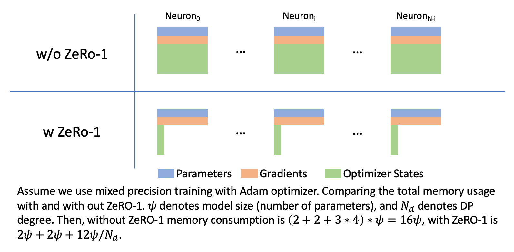

.. _zero1-gpt2-pretraining-tutorial:

ZeRO-1 Tutorial
===============

What is ZeRO-1?
---------------

ZeRO-1 (Zero Redundancy Optimizer Stage 1,
https://arxiv.org/abs/1910.02054) is an optimization technique for
large-scale deep learning models. It is a memory efficient variation of
data parallelism. ZeRO leverages the aggregate computation and memory
resources of data parallelism to reduce the memory and compute
requirements of each accelerator used for model training. ZeRO reduces
the memory consumption of each accelerator by partitioning the various
model training states (weights, gradients, and optimizer states) across
the available devices in the distributed training hardware. ZeRO is
being implemented as incremental stages of optimizations. In stage 1,
the optimizer states (e.g., for Adam optimizer, 32-bit weights, and the
first, and second moment estimates) are partitioned across the
processes, so that each process updates only its partition.

We implemented an XLA-friendly version of ZeRO-1 and it has
been merged in open-source PyTorch/XLA project. Users can use it to
enable ZeRO-1 algorithm by simply wrapping the origin optimizer as shown
below.

::

   # Before:
   optimizer = torch.optim.Adam(model.parameters(), lr=0.0001)

   # After
   optimizer = ZeroRedundancyOptimizer(model.parameters(), torch.optim.Adam, lr=0.0001)

Then just call ``optimizer.step()`` directly, the wrapped optimizer will
handle the distributed operations automatically.

The above code snippet illustrates the basic usage. Generally, users can
use ZeRO-1 optimizer like a normal optimizer. In addition,
``ZeroRedundancyOptimizer`` also provides other features: enable
gradient clipping or use other data type for wrapped optimizer. Note
that though the most of optimizers can be used with ZeRO-1, optimizers
that compute norm for parameters (e.g. LAMB) might lead to accuracy
disparities compared to using original local optimizer when using
ZeRO-1, because these optimizers cannot get full parameters but shards.

Usage
-----

To enable ZeRO-1 optimizer, just import it and replace origin optimizer
with ZeRO-1 wrapped version

::

   from torch_xla.distributed.zero_redundancy_optimizer import ZeroRedundancyOptimizer
   ...
   ...

   device = xm.xla_device()
   model = model.to(device)

   optimizer = ZeroRedundancyOptimizer(model.parameters(), AdamW, lr=0.001)

Then in training loop, just call ``optimizer.step()`` , note that we
should not use ``xm.reduce_gradients()`` or ``xm.optimizer_step()`` as
gradient reduction will be handle by ZeRO-1.

::

       ...
       loss.backward()
       xm**.**mark_step**()**
       optimizer.step()
       xm**.**mark_step**()**

ZeRO-1 optimizer also provides some additional features, user can pass
these arguments to the wrapper constructor:

-  change ``optimizer_dtype`` to choose data used by optimizer, default
   is ``torch.float32``
-  change ``grad_clipping`` to enable grad clipping, default is true
-  change ``max_norm`` to determine the maximum norm value used by grad
   clipping, default is 1.0

GPT2-XL Pretraining Tutorial
----------------------------
Update 10/02:This tutorial is currently broken and the AWS Neuron team is working on the fix. 

Table of Contents:
///
-  Setup
-  Dataset
-  Training

--------------

Setup
~~~~~

We use single Trn1.32xlarge instance. Follow :ref:`Install PyTorch Neuron on
Trn1 <setup-torch-neuronx>` to setup the environment first. For all the commands below, make sure
you are in the virtual environment that you have created above before
you run the commands:

**requirements.txt:** We pin the following Hugging Face Library versions
necessary for the tutorial

::

   transformers==4.27.3
   accelerate==0.17
   datasets==2.10.1
   tensorboard==2.12.2

::

   source ~/aws_neuron_venv_pytorch/bin/activate

::

   git clone https://github.com/aws-neuron/aws-neuron-samples.git
   cd aws-neuron-samples/torch-neuronx/training/zero1_gpt2
   python3 -m pip install -r requirements.txt

The specific files you need for this tutorial:

-  config_1p5B_gpt2.json: The model configuration used in the tutorial
   for GPT 2.7B Neo
-  neuron_utils.py: includes utility functions and the logging tools
-  run_clm_no_trainer.py: the main training script that runs the actual
   training
-  run_clm.sh: the shell script to launch the training job

Dataset
~~~~~~~

For the dataset, we use the wikitext dataset, specifically
``wikitext-103-raw-v1,`` provided by the HuggingFace
https://huggingface.co/datasets/wikitext. The data will be preprocessed
the first time running through the training script and then preprocessed
data will be cached in the HuggingFace cache directory for any future
training runs.

If the main process downloads the dataset, tokenizes the data and groups
them together successfully, the expected output would be as below at the
beginning of the training.

::

   ***** Running training *****
     Num examples = 114248
     Num Epochs = 29
     Instantaneous batch size per device = 1
     Total train batch size (w. parallel, distributed & accumulation) = 32
     Gradient Accumulation steps = 1
     Total optimization steps = 100000

Training
~~~~~~~~

The GPT2 python fine-tuning script is adapted from the example
`run_clm_no_trainer.py <https://github.com/huggingface/transformers/blob/main/examples/pytorch/language-modeling/run_clm_no_trainer.py>`__
in
https://github.com/huggingface/transformers/tree/main/examples/pytorch/language-modeling.
It incorporates the Accelerate
https://github.com/huggingface/accelerate. Given its experimental stage,
some modifications are needed, along with the bridge code to XLA.
Particularly, some workarounds to support Accelerate for the training
script are listed in "Known Issues Workarounds and Limitations" below.

In this example, we use GPT2-xl as example, and show the training steps
with mixed precision (bfloat16 and float32)

-  single node training:

::

   # compile graphs
   neuron_parallel_compile bash run_clm.sh MIXED wikitext-103-raw-v1
   bash run_clm.sh MIXED wikitext-103-raw-v1

-  multi-node training, run:

::

   sbatch run_clm_compile.slurm

then

::

   sbatch run_clm.slurm

Known Issues, **Work-arounds and Limitations**
~~~~~~~~~~~~~~~~~~~~~~~~~~~~~~~~~~~~~~~~~~~~~~

1. Activation checkpointing + Custom FAL Dropout: We have implemented a
   version of dropout that caches the masks obtained during the first
   forward pass which will be reused again during the forward pass when
   activation checkpointing is enabled. All the scripts have the
   following flag turned on: export NEURON_ENABLE_NOSEED_DROPOUT=1.

2. Error message: ``ValueError: invalid literal for int() with base 10: ''``.
   Simply re-run the script can solve this issue. This issue is already solved
   in the newer versions of transformers, see https://github.com/huggingface/transformers/pull/22427.

3. Accelerator API workarounds:

   -  Error message: "Gradient accumulation is not supported on TPU.
      Please set gradient_accumulation_steps to 1 and don’t pass in a
      GradientAccumulationPlugin object." More context here:
      https://github.com/huggingface/accelerate/pull/479. The training
      still works by commenting out the assertion and avoid using the
      accumulation wrapper with accelerator.accumulate(model)
   -  Accelerator.prepare call: We have noticed that using the optimizer
      returned by this API are not directly reusable. It is due to gaps
      in configuring accelerate API for XLA devices.
