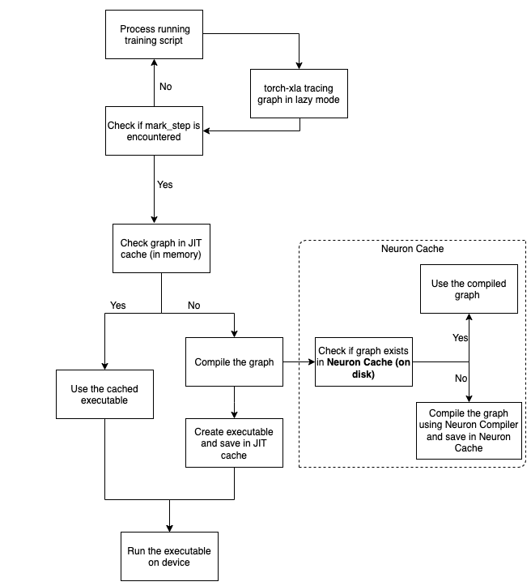

.. _neuron-caching:

Neuron Persistent Cache
=======================

PyTorch Neuron (``torch-neuronx``) uses ``torch-xla``, and ``torch-xla`` operates in lazy mode. In other words, every operation in training script
is recorded in a graph. The graph is executed only when the results are requested by 
the user when they use ``print`` or ``xm.mark_step``.  Requesting results tells 
``torch-xla`` that the recorded graph needs to be executed. 

Before executing the graph on a Neuron device, ``torch-xla`` would call Neuron Compiler (``neuronx-cc``) to compile the graph into Neuron specific 
graph. Then the graph is executed on the :ref:`NeuronCore/s <neuroncores-arch>`. Compiling the graph involves 
running optimizations that can make use of the :ref:`NeuronCore/s <neuroncores-arch>` efficiently. Running these 
optimizations can be expensive and can result in long compile times. To save the 
users from compiling these graphs at every iteration, ``torch-xla`` maintains an 
in-memory cache called Just in Time (JIT) cache. When the user re-runs the same graph (eg. 2nd 
iteration of the training run), torch-xla would check in this JIT cache and re-use 
the cached compilation result, thereby avoiding the wait times.

Since the JIT cache is an in-memory cache, it needs to be constructed every time the training script is 
run. Hence, if the user re-runs the training script, a new JIT cache is created. This causes a compilation for the first training graph.
To avoid such  compilations across training runs, PyTorch Neuron (``torch-neuronx``) has built an on-disk 
``Neuron Persistent Cache``. Since this cache is on-disk, its persistent across training runs. So 
now, when a graph is compiled for the fist time, the compilation result is saved in 
``Neuron Persistent Cache``. When the user re-runs the training script, since the JIT cache is not 
ready, it would send the graph for compilation. PyTorch Neuron (``torch-neuronx``) would then check if 
the compiled result is present in the ``Neuron Persistent Cache``, if yes, it would return with the 
compiled result. This on-disk cache thereby avoids compilations across training runs. 
This cache is enabled by default for Neuron's PyTorch/XLA flow (training) as well as
transformers-neuronx LLM inference package.
The default cache path is the directory ``/var/tmp/neuron-compile-cache``.

Look at the diagram below on the end to end flow:

|Image:|

As seen from the diagram, the operations are recorded in a graph in lazy mode and only 
when a mark_step is hit, the graph is executed. Before execution, the graph passes through
two caches to check if we have compiled the graph sometime in the past. If yes, we reuse 
the compilation result and execute with it. This avoid duplicate compilations.
One thing to note, both JIT cache and Neuron Cache are complementary to each other.
JIT cache prevents duplicate compilation within a run and Neuron Cache prevents duplicate 
compilations across training runs. For example, within a training script, we have a training 
loop that iterates through the dataset. The first iteration would trace a unique graph 
and the following iteration would trace a graph that is similar to the first one. In this case,
the subsequent iterations would hit the JIT cache and reuse the result. However, to save 
users from compiling for the first iteration graph, ``Neuron Persistent Cache`` would be used. In this case,
the very first time when the script is run, the ``Neuron Persistent Cache`` would be updated. Going forward 
when we re-run the training script, compilation results from ``Neuron Persistent Cache`` would be used.

To better understand how ``Neuron Persistent Cache`` works, consider the example below:

.. code:: python

   import torch
   import torch_xla
   import torch_xla.core.xla_model as xm
   device = xm.xla_device()
   t1 = torch.randn(3, 3).to(device)
   t2 = t1 / 0.5
   x = t2.cpu()

Running the above example produces the following logs:

.. code:: bash

   2023-08-25 21:51:36.000433: INFO ||NCC_WRAPPER||: Compile cache path: /var/tmp/neuron-compile-cache
   .
   Compiler status PASS

Re-running the above script would fetch the graph from the 
neuron cache and you would see logs as follows:

.. code:: bash

   2023-08-25 21:52:23.000451: INFO ||NCC_WRAPPER||: Compile cache path: /var/tmp/neuron-compile-cache
   2023-08-25 21:52:23.000453: INFO ||NCC_WRAPPER||: Using a cached neff at /var/tmp/neuron-compile-cache/neuronxcc-2.8.0.25+a3ad0f342/MODULE_198775565831884870+d41d8cd9/model.neff. Exiting with a successfully compiled graph.

As you can see, the next run picks the compiled graph from
cache, thereby saving the compilation time.
The cache uses hash of the Neuron compiler flags and XLA graph as the
key. If the Neuron compiler version or XLA graph changes, you will see
recompilation. Examples of changes that would cause XLA graph change
include:

-  Model type and size
-  Batch size
-  Optimizer and optimizer hyperparameters
-  Location of xm.mark_step()

All compilation results are saved in the cache. To disable the cache, you 
can pass ``--no_cache`` option via NEURON_CC_FLAGS:

.. code:: python

   os.environ['NEURON_CC_FLAGS'] = os.environ.get('NEURON_CC_FLAGS', '') + ' --no_cache'

The default cache path is the directory ``/var/tmp/neuron-compile-cache``.
To change the cache's location, pass ``cache_dir=<cache_url>``
option via ``NEURON_CC_FLAGS`` or ``NEURON_COMPILE_CACHE_URL=<cache_url>`` environment variables:

.. code:: python

   os.environ['NEURON_CC_FLAGS'] = os.environ.get('NEURON_CC_FLAGS', '') + ' --cache_dir=<cache URL>'

.. code:: python

   os.environ['NEURON_COMPILE_CACHE_URL'] = '<cache_URL>'

The cache URL specified using ``--cache_dir`` is prioritized over that specified using ``NEURON_COMPILE_CACHE_URL`` if both are set.
If ``<cache_url>`` starts with ``s3://``, it will use the AWS S3 URL as the cache location, provided that the corresponding S3 bucket exists and is both readable and writeable.

You can change the verbose level of the compiler by adding ``log_level`` to either ``WARNING``, ``INFO``
or ``ERROR``. This can be done as follows:

.. code:: python

   os.environ['NEURON_CC_FLAGS'] = os.environ.get('NEURON_CC_FLAGS', '') + ' --log_level=INFO'

A graph compilation can fail because of a compilation error or an environment issue (for example, compilation is interrupted by ctrl-C). The graph would be marked as failed and subsequent rerun would encounter message like below:

.. code:: bash

    INFO ||NCC_WRAPPER||: Got a cached failed neff at /var/tmp/neuron-compile-cache/neuronxcc-2.8.0.25+a3ad0f342/MODULE_12486829708343293975+d41d8cd9/model.neff. Will skip compilation, please set --retry_failed_compilation for recompilation. 

To retry compilation,
add ``--retry_failed_compilation`` in ``NEURON_CC_FLAGS`` environment variable. When the script is reran, all the previously failed compilations are recompiled and fresh results are saved in the cache.

.. code:: python

   os.environ['NEURON_CC_FLAGS'] = os.environ.get('NEURON_CC_FLAGS', '') + ' --retry_failed_compilation'

