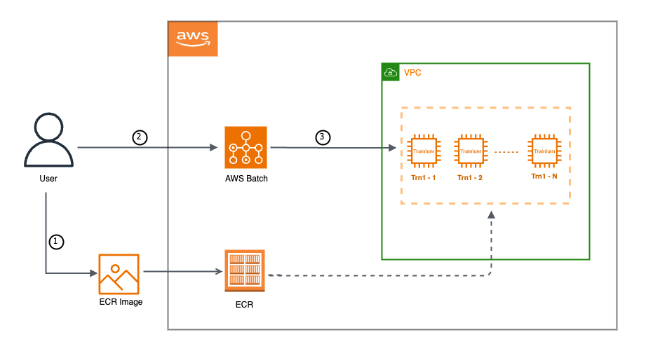

.. _batch-training:

Train your model on AWS Batch
=============================

.. contents:: Table of Contents
   :local:
   :depth: 3

Description
------------

AWS Batch provides a scalable and cost-effective solution for running batch computing workloads in the AWS Cloud. Integrating Trainium with AWS Batch provides an efficient and cost-effective way of training deep learning models at scale.
Once you configure your training job, AWS Batch effectively manages the orchestration, execution, and dynamic scaling of compute resources for your extensive machine learning workloads. To learn more about AWS Batch, see `here <https://docs.aws.amazon.com/batch/latest/userguide/what-is-batch.html>`_.

How does AWS Batch work with Trainium
-------------------------------------

As depicted in the illustration above, our workflow begins by building a ``Docker container image for Trainium`` and pushing it to Amazon Elastic Container Registry (ECR). Following this, we configure our AWS Batch environment with the required capabilities, and subsequently submit the training job.

Please follow the below mentioned steps to run your training jobs on ``AWS Batch`` with ``Trainium``.

#. **Before you begin, please ensure that you have the following prerequisites completed:**

   * ``AWS VPC`` with at least one ``Subnet`` and ``EFA Enabled Security Group`` (learn more about EFA-enabled security group `here <https://docs.aws.amazon.com/AWSEC2/latest/UserGuide/efa-start.html#efa-start-security>`_). Please make sure subnet needs to be private, and the VPC needs to have a NAT gateway to allow internet connectivity for the private subnet.
   * ``AWS ECR`` repository
   * ``AWS CLI`` installed and configured with permissions for the above mentioned AWS resources
   * ``Docker``
   * ``jq``

#. **Setup to start working with AWS Batch**

   Connect to your EC2 instance(``x86_64-based Linux instance``) and clone the ``aws-neuron-samples`` repo. Once done, navigate to aws batch scripts directory.

   .. code:: shell

      cd ~/
      git clone https://github.com/aws-neuron/aws-neuron-samples.git
      cd ~/aws-neuron-samples/torch-neuronx/training/aws-batch/scripts

#. **Configure resource requirements**

   Update the ``build_configs_and_setup.sh`` with your environment variables. Once done, execute the bash script using the command ``./build_configs_and_setup.sh``.

#. **Build the required docker image and publish it to ECR**

   Run ``./build_docker_image.sh`` to build a Neuron Deep-Learning Container image using the latest Neuron packages and push this image to ECR.

#. **Prepare the AWS infrastructure required to submit the batch job**

   Run ``./create_resources.sh`` to create all AWS Batch resources needed for your training workload. Below is the brief description of various AWS Batch components this script will create for you -

   * ``Placement Group`` enables you to influence the placement of your EC2 (Elastic Compute Cloud) instances within the AWS infrastructure.
   * ``Launch Template`` allows you to define a set of instance configuration parameters, including the Amazon Machine Image (AMI), instance type, key pair, security groups, and other settings, in a template format.
   * ``Compute Environment`` helps you to specify configuration that specifies the type of compute resources you want to use for your batch jobs. It includes details such as the EC2 instance types, the minimum and maximum number of instances, the VPC configuration, and other settings related to the compute environment.
   * ``Job Definition`` is a blueprint that specifies how a batch job should be run. It encapsulates information about the job, such as the Docker image to be used, the command to execute within the container, the CPU and memory requirements, job dependencies, and other settings.
   * ``Job Queue`` acts as a queueing mechanism for managing and scheduling the execution of batch computing workloads. By using job queues, AWS Batch provides a scalable and efficient way to process batch workloads, managing the allocation of resources and ensuring optimal use of compute capacity.

#. **Submit the job to AWS-Batch**

   Run ``./submit_job.sh`` to submit a basic all-reduce job in the provisioned AWS Batch environment

#. **Monitor the AWS-Batch job**

   You can use Amazon CloudWatch Logs to monitor, store, and view all your logs from AWS Batch job. To learn more about it, please see `here <https://docs.aws.amazon.com/batch/latest/userguide/batch-eks-cloudwatch-logs.html>`_.

.. note::
    * Replace ``allreduce.py`` and ``allreduce.sh`` with your custom training script. You can further tailor your ``Dockerfile`` to include any additional dependencies specific to your needs.
    * You have the option to leverage ``trn1n.32xlarge`` instances as an alternative to ``trn1.32xlarge``. To make this transition, you only need to make adjustments to the ``launch template`` and ``job definition`` in order to accommodate the use of 16 EFA (Elastic Fabric Adapter) devices, whereas the current setup for ``trn1`` employs 8 EFA devices. Please check out `this document <https://awsdocs-neuron.readthedocs-hosted.com/en/latest/frameworks/torch/torch-neuronx/setup-trn1-multi-node-execution.html?highlight=multi-node>`_ to start with ``trn1n.32xlarge`` for multi-node execution.