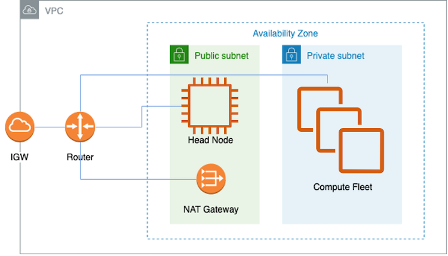

Train your model on ParallelCluster
===================================

.. contents:: Table of Contents
   :local:
   :depth: 3

Description
------------

This document explains how to use AWS ParallelCluster to build HPC compute environment 
that uses Trn1 compute nodes to run your distributed ML training job. Once the nodes are 
launched, we will run a training task to confirm that the nodes are working, and use 
slurm commands to check the job status. In this tutorial, we will use AWS `pcluster` command
to run a yaml file in order to generate the cluster. As an example, we are going to launch
multiple Trn1.32xl nodes in our cluster.

We are going to set up our ParallelCluster infrastructure as below:

As shown in the figure above, inside a VPC, there are two subnets, a public and a private
ones. Head Node resides in the public subnet, while the compute fleet (in this case, trn1
instances) are in the private subnet. A Network Address Translation (NAT) gateway is also 
needed in order for nodes in the private subnet to connect to clients outside the VPC. In 
the next section, we are going to describe how to set up all the necessary infrastructure 
for trn1 ParallelCluster.

Setup environment
-----------------

1. Install prerequisite infrastructure:

Follow `these setup <https://github.com/aws-neuron/aws-neuron-parallelcluster-samples/tree/ga#user-content-prerequisite-infrastructure>`_ instructions to install VPC and all the necessary components for ParallelCluster. 

2. Create and launch ParallelCluster 

Follow `these creating cluster <https://github.com/aws-neuron/aws-neuron-parallelcluster-samples/tree/ga#user-content-create-a-cluster>`_ instructions to launch ParallelCluster in the infrastructure.

1. Launch training job

Follow `these running training <https://github.com/aws-neuron/aws-neuron-parallelcluster-samples/tree/ga#user-content-launch-training-job>`_ instructions to submit a model training script as a slurm job.
