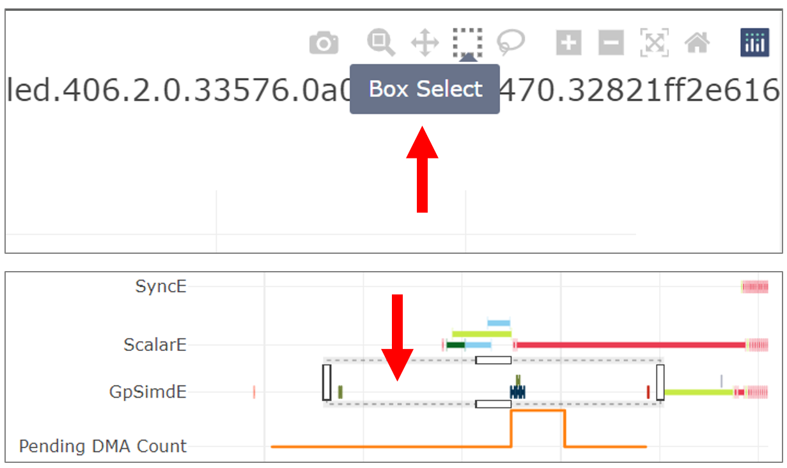

.. _neuron_profile_for_nki:

Profiling NKI kernels with Neuron Profile
==========================================

In this tutorial, we use Neuron Profile to view the execution trace of a NKI kernel captured on a NeuronCore.
In doing so, we learn about:

-  Installation and usage of Neuron Profile.
-  Inspecting a detailed execution timeline of compute engine instructions and DMA engine activities generated from your NKI kernel.

As background, `Neuron Profile
<https://awsdocs-neuron.readthedocs-hosted.com/en/latest/tools/neuron-sys-tools/neuron-profile-user-guide.html>`_ is
the tool you need to visualize where time is being spent during kernel execution on NeuronDevices, which is crucial for
identifying performance bottlenecks and opportunities of your kernel. Neuron Profile produces runtime execution data
for every instruction executed on each compute engine and also every data movement activity completed by DMA engines.
Neuron Profile also reports key performance metrics such as compute engine and memory bandwidth utilization, which
allows developers to quickly find out the achieved hardware efficiency of their kernel. Profiling typically has near
zero overhead thanks to the dedicated on-chip profiling hardware in NeuronDevices.

Install Neuron Profile
-----------------------

Make sure you have the latest version of the ``aws-neuronx-tools``, which includes updated profiling support for NKI
kernels. Neuron Profile is included within this package and is installed to ``/opt/aws/neuron/bin``.

The ``aws-neuronx-tools`` package comes pre-installed on `Neuron DLAMIs <https://awsdocs-neuron.readthedocs-hosted.com/en/latest/dlami/index.html>`_. For detailed installation instructions see `Neuron Profile User Guide: Installation <https://awsdocs-neuron.readthedocs-hosted.com/en/latest/tools/neuron-sys-tools/neuron-profile-user-guide.html#installation>`_.

.. _nki-neuron-profile-capture:

Profile a NKI Kernel
-----------------------

.. _nki-neuron-profile-capture-cmdline:

Profile using ``neuron-profile capture``
~~~~~~~~~~~~~~~~~~~~~~~~~~~~~~~~~~~~~~~~~

To profile a NKI kernel the required steps are (1) enable ``NEURON_FRAMEWORK_DEBUG`` to tell the compiler to save the
``NEFF`` file, (2) execute the NKI kernel to generate the ``NEFF``, and (3) run ``neuron-profile capture`` to generate a
``NTFF`` profile. Each step is described in more detail below.

We will profile a NKI kernel which computes the element-wise exponential of an input tensor of any 2D shape. The rest of
this tutorial will use a performance profile generated from this kernel as an example. Full code of
``prof-kernel.py``:

.. literalinclude:: examples/prof-kernel.py
   :language: python
   :linenos:

To profile this NKI kernel, follow these steps:

1. Enable Neuron debug output by setting the ``NEURON_FRAMEWORK_DEBUG`` environment variable. This will trigger the
Neuron compiler to save the Neuron Executable File Format (NEFF) artifact to the current directory after compilation of
your NKI kernel. The NEFF contains all hardware instructions required to execute your NKI kernel on a NeuronDevice, as
well as metadata and debug info needed for profiling. For example, add the following lines to your NKI kernel source
file:
::

   import os
   os.environ["NEURON_FRAMEWORK_DEBUG"] = "1"
   os.environ["NEURON_CC_FLAGS"]= " --disable-dge "

.. note::
   Use the flag ``--disable-dge`` to temporarily disable a new compiler feature which is interfering with
   DMA debugging information display in neuron-profile. This is highly recommended to improve NKI performance
   debugging experience until we release a software fix for this issue.

2. Compile your NKI kernel to create a NEFF in your current directory:
::

   $ python3 prof-kernel.py

.. note::
   Find your NEFF named similarly to ``MODULE_0_SyncTensorsGraph.13_12659246067793504316.neff``.

3. Profile the NEFF. This profiling step executes the NEFF on the NeuronDevice and records a raw execution trace into
an Neuron Trace File Format (NTFF) artifact.
::

   $ neuron-profile capture -n <path_to_neff> -s profile.ntff --profile-nth-exec=2

This will save your NTFF profile to ``profile_exec_2.ntff``.

.. note::
   The ``--profile-nth-exec=2`` option will profile your NEFF twice on the NeuronDevice and output a NTFF profile
   for the second iteration. This is recommended to avoid one-time warmup delays which can be seen in the first
   iteration of execution.

In :ref:`View Neuron Profile UI <nki-view-neuron-profile-ui>`, we will view the profile in a user-friendly format using the
Neuron Profile UI.

.. _profile-using-nki-profile:

Profile using ``nki.profile``
~~~~~~~~~~~~~~~~~~~~~~~~~~~~~~~~~

You may also use the :doc:`nki.profile <api/generated/nki.profile>` API to generate a NEFF and NTFF programmatically.

Below is an example NKI kernel decorated by :doc:`nki.profile <api/generated/nki.profile>`.
Full code of ``prof-kernel-profile.py``:

.. literalinclude:: examples/prof-kernel-profile.py
   :language: python
   :linenos:

To use :doc:`nki.profile <api/generated/nki.profile>` to create a NEFF file, NTFF profile, and dump reports in your specified
directory, execute the example NKI kernel with:
::

   $ python3 prof-kernel-profile.py

In :ref:`View Neuron Profile UI <nki-view-neuron-profile-ui>`, we will view the profile in a user-friendly format using the
Neuron Profile UI.

.. _nki-view-neuron-profile-ui:

View Neuron Profile UI
-----------------------

Neuron Profile has an interactive web based UI used to view execution traces. In this section we will open Neuron
Profile UI and view NKI specific profiling information. NKI specific information can be found in several places
including instruction hover details, instruction click details, search results, and box select results. This section
assumes that you followed the previous step to create a NEFF and NTFF.

To view the Neuron Profile web UI, execute the ``view`` command:
::

   $ neuron-profile view -n <path_to_neff> -s <path_to_ntff> --db-bucket=my_kernel

The above command should print a URL that you can click to open the web UI:
::

   View profile at http://localhost:3001/profile/my_kernel

.. note::
   You must keep the ``view`` command running when viewing profiles.

.. note::
   The ``--db-bucket=my_kernel`` argument is used to set a custom URL for the profile. Omitting this argument will
   generate a URL with a unique ID.

If ``neuron-profile view`` is run on a remote instance, you may need to use port forwarding to access the web UI. From
your local machine, SSH to the remote instance and forward ports 3001 (the default ``neuron-profile`` HTTP server port)
and 8086 (the default InfluxDB port). Then in the browser, go to ``localhost:3001`` to view the profiles.
::

   $ ssh <user>@<ip> -L 3001:localhost:3001 -L 8086:localhost:8086

.. _nki-fig-neuron-profile-ui-overview:

   Screenshot of the Neuron Profile UI.

If you hover over any engine instruction in the timeline with your mouse, you will see instruction details in a pop-up
box.

.. _nki-fig-neuron-profile-instruction-hover:

   Instruction hover details including the line of NKI source code that generated this instruction.

If you click on any engine instruction in the timeline with your mouse, you will see instruction details in a
panel below the timeline.

.. _nki-fig-neuron-profile-instruction-details:

   Instruction click details including the line of NKI source code that generated this instruction.

Search
~~~~~~~~~~

You can search for instructions associated with a specific line of NKI source code (for example
"prof-kernel.py:33"). Or you can search for all instructions that have an associated line of NKI
code by searching for "``/./``", as seen below. This can be used to find the slowest NKI kernel instruction, for
example line "prof-kernel.py:37" seen in :numref:`Fig. %s <nki-fig-neuron-profile-search-results>` below. This helps
with identifying performance bottlenecks while optimizing a NKI kernel. For help on what kinds of searches are possible,
click on the help tooltip in the search panel. Search queries are saved into your browser's URL so that you can share or
revisit the same search using that URL.

.. _nki-fig-neuron-profile-search-help:

.. figure:: ./img/neuron-profile-search-help.png
   :align: center
   :class: outlined-image
   :width: 500

   Search panel and search help tooltip.

.. _nki-fig-neuron-profile-search-results:

   Search results. The line of NKI source code that generated each instruction will appear in the search result summary.

Box Select
~~~~~~~~~~~~

You can click and drag on the timeline to select a range of instructions using the Box Select functionality. A summary
will be produced that includes which lines of NKI source code produced these instructions. This helps with understanding
a portion of the timeline. Selecting a large number of instructions may take some time to retrieve from the database.

.. _nki-fig-neuron-profile-box-select-help:

   Click on the "Box Select" button and then click and drag on a region of the timeline.

.. _nki-fig-neuron-profile-box-select-results:

   Box select results. The line of NKI source code that generated each instruction will appear in the box select
   summary.

.. note::
   An empty value for "nki_source_location" means that the instruction is not associated with a NKI source code line.

View NKI Source Code in Neuron Profile
--------------------------------------------------

You may optionally include NKI source code file contents for display in Neuron Profile. This feature loads your NKI
source code into an integrated code viewer, side-by-side with the execution timeline in the web UI. Including the
source code makes it easier to navigate between instruction trace and NKI source code and also to track the version of
code that produced the profile. Note, even without uploading the source code to Neuron Profile, the NKI source filename
and line number are always available in instruction detail view as discussed in :ref:`View Neuron Profile UI <nki-view-neuron-profile-ui>`.

To include NKI source code in the Neuron Profile UI you can use the ``view`` command with the ``--nki-source-root``
argument to pass in the folder of NKI source code:
::

   $ neuron-profile view -n <path_to_neff> -s <path_to_ntff> --nki-source-root /home/ubuntu/my_nki/ --db-bucket=my_kernel

To open the NKI source code viewer, click on an instruction that has a "Nki source location" field as shown in
:numref:`Fig. %s <nki-fig-neuron-profile-instruction-details>`. In the instruction's details panel, the
"nki_source_location" field should appear as a link. Clicking on the link will open the NKI source code viewer and
highlight the associated line of NKI code. Inside the source code viewer, you can also click on any line of NKI source
code to search for all instructions that were generated by that line of code.

.. _nki-fig-neuron-profile-source-code-view:

   NKI source code view.

View Neuron Profile output as JSON
-----------------------------------

As an alternative to the Neuron Profile web UI, a JSON format output is available. The JSON output includes the profile
summary and all events in the execution trace. To generate the JSON output, execute the following command:

::

   $ neuron-profile view --output-format json --output-file profile.json -n <path_to_neff> -s <path_to_ntff>
   $ cat profile.json
   {
      "summary": [
         {
            "total_time": 0.017,
            "event_count": 11215,
            [...]
         }
         "instruction": [
            {
                  "timestamp": 10261883214,
                  "duration": 148,
                  "label": "TensorMatrix",
                  "opcode": "MATMUL",
                  "nki_source_location": "prof-kernel.py:33",
                  [...]
            },
   }

See also
----------

- `Neuron Profile User Guide <https://awsdocs-neuron.readthedocs-hosted.com/en/latest/tools/neuron-sys-tools/neuron-profile-user-guide.html>`_

.. - `NKI Performance Guide <TBD>`_

.. CSS Styles

.. raw:: html

   
