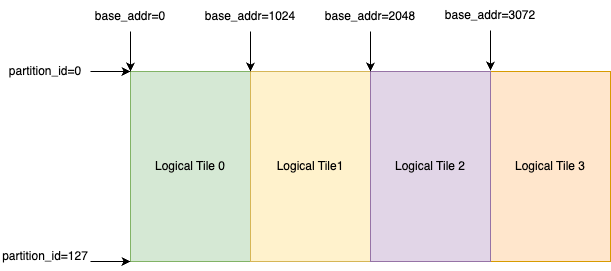

.. _nki_direct_allocation_guide:

NKI Direct Allocation Developer Guide
=======================================

In this document, we will discuss how to perform direct allocation in NeuronCore on-chip memory (SBUF and PSUM)
correctly and efficiently to improve NKI kernel performance. This document is organized into five sections:

- :ref:`Background: NKI Tensors Semantics <alloc_bg>`
- :ref:`Introduction to NKI Direct Allocation API <alloc_api_intro>`
- :ref:`Development Best Practices <alloc_dev_practices>`
- :ref:`Common Errors <alloc_common_errors>`
- :ref:`Known Limitations <known_limits>`

.. _alloc_bg:

Background: NKI Tensors Semantics
---------------------------------------------

As discussed in :ref:`NKI programming model <pm_represent_data>`, a multi-dimensional NKI Tensor in SBUF/PSUM
must have a dimension mapped to the partition (P) dimension of the physical memory,
labeled using :doc:`nl.par_dim <api/generated/nki.language.par_dim>`. We also define any NKI Tensor with
the first dimension as the partition dimension is considered a NKI Tile,
which is the data type that NKI compute APIs operate on. The remaining dimensions after the partition dimension
in a NKI Tile are considered free (F) dimensions. The free dimensions describe how data is organized within each SBUF/PSUM
partition.

To introduce NKI allocation API, let's define the block (``B``) dimension as any dimension before the partition dimension in a
NKI Tensor. Therefore, a NKI Tensor has three types of dimensions: ``(B, P, F)``. Note, a NKI Tensor can have one or more
dimensions in both ``B`` and ``F``, but there can only be one dimension in ``P`` due to Neuron ISA requirements.
The block dimension effectively describes how many ``(P, F)`` NKI Tiles the tensor has, which commonly corresponds to how many
NKI API compute API invocations we need to process the entire tensor.

As an example, we can declare a NKI Tensor in SBUF as follows:

.. code-block::

  nki_tensor = nl.ndarray((16, nl.par_dim(128), 512), dtype=nl.bfloat16, buffer=nl.sbuf)

  for i_block in nl.affine_range(16):
    nki_tensor[i_block, :, :] = nl.load(...)
    ...                       = nl.exp(nki_tensor[i_block, :, :])

Here, ``nki_tensor`` has a block dimension of 16, and we use it as an intermediate SBUF tensor for loading data
from device memory and feeding inputs to the exponential operator. The different tiles in ``nki_tensor`` are processed
by different iterations of a loop constructed with ``nl.affine_range(...)``, indicating no loop-carried dependency
across iterations.

In fact, the block dimension of ``nki_tensor`` as defined above is only considered **logical** in NKI.
Neuron Compiler inspects the above code and uses a heuristic-driven allocator to decide how many physical tiles
are allocated to each tensor. The key performance goal of the allocator is to achieve instruction parallelism
across different engines in NeuronCore while minimizing memory usage in the on-chip memory.

Let's first consider the case where ``nki_tensor`` has only one physical tile, ``T``, allocated in SBUF. The different loop
iterations will end up completely serialized:

.. code-block::

       i_block = 0
    1. nl.load(nki_tensor[0, :, :]) => write ``T``
    2. nl.exp(nki_tensor[0, :, :])  => read ``T``

       i_block = 1
    3. nl.load(nki_tensor[1, :, :]) => write ``T``
    4. nl.exp(nki_tensor[1, :, :])  => read ``T``

    ...

Here, we say only one logical tile in ``nki_tensor`` is alive at a time, because there is only one physical tile as the
backing storage for ``nki_tensor``. However, in NeuronCore, ``nl.load`` and ``nl.exp`` are executed using two independent
resources: DMA Engine and Scalar Engine. In this serialized execution, there is no instruction parallelism achieved
between these engines.

An obvious improvement is to adopt "double buffering", by allocating two physical tiles for ``nki_tensor``,
``T0`` and ``T1``. Now, the execution enables much better computation and data movement overlapping:

.. code-block::

       i_block = 0
    1. nl.load(nki_tensor[0, :, :]) => write ``T0``

       i_block = 0 & 1
    2. nl.load(nki_tensor[1, :, :]) => write ``T1`` | nl.exp(nki_tensor[0, :, :]) => read ``T0``

       i_block = 1 & 2
    3. nl.load(nki_tensor[1, :, :]) => write ``T0`` | nl.exp(nki_tensor[1, :, :]) => read ``T1``

    ...

Here, we reuse, or rotate, the same physical tiles across the loop iterations. No physical tile is being read from
and written to in the same time step, while the DMA and Scalar Engines can operate in parallel. Besides DMA and Scalar
Engines, NeuronCore also consists of Tensor, Vector, Gpsimd Engines that can execute instructions in parallel.

Given the amount of parallelism available in hardware and the complex parallel programs seen in common machine learning workloads,
the heuristic-based memory allocator in Neuron Compiler may not yield the optimal allocation decisions.
Bad allocation decisions typically lead
to sub-optimal engine parallelism and/or on-chip memory over-subscription causing excessive spills of
intermediate data to device memory. With NKI direct allocation API, programmers can now bypass the compiler allocator
and take full control of memory allocation in SBUF/PSUM for NKI Tensors.

.. _alloc_api_intro:

Direct Allocation API
-------------------------

This section will go over the SBUF allocation in detail, including ``ncc.sbuf.alloc()`` API that provides the most
flexibility for tensor allocation and ``ncc.sbuf.mod_alloc()`` API that provides ease-of-use using
a modulo allocation strategy. Both of these APIs can be used to replace the automatic allocated buffer type
``buffer=nl.sbuf`` when declaring a NKI tensor:

.. code-block::

  # Automatic allocation
  nki_tensor = nl.ndarray((16, nl.par_dim(128), 512), ..., buffer=ncc.sbuf.auto_alloc())
  nki_tensor = nl.ndarray((16, nl.par_dim(128), 512), ..., buffer=nl.sbuf) # alias of auto_alloc

  # Direct allocation, full flexibility
  nki_tensor = nl.ndarray((16, nl.par_dim(128), 512), ..., buffer=ncc.sbuf.alloc(...))

  # Direct allocation, modulo allocation
  nki_tensor = nl.ndarray((16, nl.par_dim(128), 512), ..., buffer=ncc.sbuf.mod_alloc(...))

The PSUM allocation APIs, ``ncc.psum.alloc()`` and ``ncc.psum.mod_alloc()``
follow a highly similar design. For more information on the semantics of these APIs, check out
:doc:`API reference page for allocation control <api/nki.compiler>`.

``ncc.sbuf.alloc()``
^^^^^^^^^^^^^^^^^^^^^^^^^^^^^

This SBUF allocation API enables user to control:

- the number of physical tiles to allocate for a given NKI Tensor, and
- the exact mapping between logical tile and physical tile in SBUF

``ncc.sbuf.alloc()`` accepts a single input parameter, ``func``, which is a user-defined callable object
that takes in:

1. a tuple of integers ``idx`` representing a logical block index,
2. an integer ``pdim_size`` for the number of partitions the logical tile has, and
3. an integer ``fdim_size`` for the number of bytes the logical tile has per partition.

The ``func`` returns a tuple of two integers, ``(start_partition, byte_addr)``, representing the memory location
of the mapped physical tile for the given logical block. ``start_partition`` indicates the starting partition of
physical tile and must follow these ISA rules:

- If ``64 < pdim_size <= 128``, ``start_partition`` must be 0
- If ``32 < pdim_size <= 64``,  ``start_partition`` must be 0 or 64
- If ``0  < pdim_size <= 32``,  ``start_partition`` must be one of 0/32/64/96

The ``byte_addr`` indicates the byte offset into each partition the physical tile allocation starts from.
For example, on NeuronCore-v2, a valid ``byte_addr`` can be any integer values from 0 (inclusive) to
``192KiB-16KiB=(192-16)*1024`` (exclusive). 192KiB is the physical size of a SBUF partition
and 16KiB is allocated for compiler internal usage.
Refer to :doc:`NeuronDevice Architecture Guide <nki_arch_guides>` for the physical SBUF partition size
on each NeuronCore version.
In addition, ``byte_addr`` must be aligned to ``nki.language.constants.sbuf_min_align``.

At compile time, the compiler will statically evaluate ``func`` over indices of all the
logical tiles defined in the NKI tensor to calculate physical addresses for each tile. As an
example, consider the following simple allocation that allocates four physical tiles back to back along the free
dimension of SBUF, with every logical tile mapped to a different physical tile sequentially.

.. code-block:: python

  def simple_1d_alloc_func(idx, pdim_size, fdim_size):
    idx, = idx # unpack the tuple
    return (0, idx * fdim_size)

  t = nl.ndarray((4, par_dim(128), 512), dtype=nl.bfloat16,
                 buffer=ncc.sbuf.alloc(simple_1d_alloc_func))

In this example, the compiler will query `simple_1d_alloc_func` with ``idx`` ranging from ``(0, )`` to ``(3, )``,
``pdim_size=128``, and ``fdim_size=512*sizeof(nl.bfloat16)=1024``. We can visualize the final allocation in
:numref:`Fig. %s <nki-fig-alloc-simple>`.

.. _nki-fig-alloc-simple:

   Visualization of ``simple_1d_alloc_func`` in SBUF.

This ``ncc.sbuf.alloc`` API provides great flexibility through the customizable function to perform
logical to physical tile mapping. With Python closures, the function can carry arbitrary metadata,
which enables programmers to define their own memory allocator. As another example, here's a simple
allocator that queries a global variable ``next_addr`` to keep track of the next available byte address
in the free dimension.

.. code-block:: python

  next_addr = 0
  def simple_1d_alloc_factory(total_fdim_size):
    base_addr = next_addr
    next_addr += total_fdim_size

    def simple_1d_alloc_func(idx, pdim_size, fdim_size):
      # unpack the tuple
      idx, = idx

      # hard-code to partition 0, since each tile takes up 128 partitions
      start_partition = 0

      return (start_partition, base_addr + idx * fdim_size)

    return simple_1d_alloc_func

  # Using simple_1d_alloc_factory, next_addr is automatically incremented.
  # Physical tiles of t0 and t1 start at 0 and 4096, respectively
  t0 = nl.ndarray((4, par_dim(128), 512), dtype=nl.bfloat16,
                  buffer=ncc.sbuf.alloc(simple_1d_alloc_factory(512*2*4)))
  t1 = nl.ndarray((4, par_dim(128), 512), dtype=nl.bfloat16,
                  buffer=ncc.sbuf.alloc(simple_1d_alloc_factory(512*2*4)))

``ncc.sbuf.mod_alloc()``
^^^^^^^^^^^^^^^^^^^^^^^^^^^^^^^^^^

Alternative to the ``ncc.sbuf.alloc()`` API which requires programmers to define an allocation algorithm
from scratch, NKI also provides the ``ncc.sbuf.mod_alloc()`` API which invokes a pre-defined
modulo allocation scheme in Neuron Compiler.

Modulo allocation works as follows. Suppose that we allocate
**two** physical tiles for a tensor with a logical shape of ``(8, par_dim(128), 512)``. The eight logical tiles
are assigned to the two physical tiles by taking a modulo of two on the logical tile index (that is, block index).
Therefore, logical tiles with index ``(0, ), (2, ), (4, ), (6, )`` share
the same physical tile, while logical tiles ``(1, ), (3, ), (5, ), (7, )`` share
the other physical tile.

The ``ncc.sbuf.mod_alloc`` API takes four input parameters:

1. ``base_addr`` indicates the starting byte offset within each SBUF partition of the physical tiles.
2. ``base_partition`` indicates the starting SBUF partition of the physical tiles.
3. ``num_par_tiles`` indicates the number of physical tiles to be allocated along the partition dimension of SBUF.
   This is only applicable for tiles that use fewer than 64 partitions per ISA constraints.
4. ``num_free_tiles`` indicates the number of physical tiles to be allocated along the free dimension of SBUF.

Given the above input parameters and the modulo allocation scheme, Neuron Compiler is then able to calculate
the physical tile memory location, ``(start_partition, byte_addr)`` for each logical tile in the tensor.
Note, this is the same information that the callable allocation function passed into ``ncc.sbuf.mod_alloc()``
would return. See :doc:`API reference manual for ncc.sbuf.mod_alloc <api/generated/nki.compiler.sbuf.mod_alloc>`
for the exact formula to calculate ``(start_partition, base_addr)``.

Next, we discuss a common use case of ``ncc.sbuf.mod_alloc``, which specifies only
the ``base_addr`` and ``num_free_tiles`` fields while leaving the remaining parameters to default
(``base_partition=0`` and ``num_par_tiles=(1,)``) .

.. code-block:: python

  nki_tensor = nl.ndarray((4, par_dim(128), 512), dtype=nl.bfloat16,
                          buffer=ncc.sbuf.mod_alloc(base_addr=0, num_free_tiles=(2, )))

This produces the following allocation:

.. list-table:: Modulo Allocation Example
  :header-rows: 1

  * - Logical Tile Index
    - Physical Tile ``start_partition``
    - Physical Tile ``byte_addr``
  * - (0, )
    - 0
    - 0 + (0 % 2) * 512 * sizeof(nl.bfloat16) = 0

  * - (1, )
    - 0
    - 0 + (1 % 2) * 512 * sizeof(nl.bfloat16) = 1024

  * - (2, )
    - 0
    - 0 + (2 % 2) * 512 * sizeof(nl.bfloat16) = 0

  * - (3, )
    - 0
    - 0 + (3 % 2) * 512 * sizeof(nl.bfloat16) = 1024

The above example is an easy way to implement double buffering without having to define a callable function
manually like how we did for ``ncc.sbuf.alloc()``. We can also implement multi-buffering
using ``ncc.sbuf.mod_alloc()`` by changing the value of ``num_free_tiles`` (or ``num_par_tiles``
when each tile occupies less than 64 partitions).

.. _alloc_dev_practices:

Development Best Practices
----------------------------

First and foremost, direct allocation APIs are considered advanced NKI features for performance optimizations.
We highly recommend using direct allocation API only after your kernel is functionally correct with automatic allocation.
Automatic allocation is invoked when NKI tensors are declared with ``buffer=nl.sbuf`` (alias of ``ncc.sbuf.auto_alloc``)
or ``buffer=nl.psum`` (alias of ``buffer=ncc.psum.auto_alloc``).

The rest of this section goes over best practices of direct allocation APIs to optimize kernel performance.

#1. Hoist allocations outside of the loop-nests you want to block across
^^^^^^^^^^^^^^^^^^^^^^^^^^^^^^^^^^^^^^^^^^^^^^^^^^^^^^^^^^^^^^^^^^^^^^^^^^^

To parallelize a loop, every tensor used in the loop must have
multiple live tiles so that the different hardware engines can read/write from/to different memory locations
in parallel.
To achieve this, make sure to allocate tensors with logical block dimensions above any loop
you want to run in parallel. For example, the following loop will be serialized because ``t`` has only one tile alive,

.. code-block:: python

  for i in affine_range(8):
      t = nl.ndaraay((128, 512), dtype=..., buffer=ncc.sbuf.mod_alloc(base_addr=0))
      t[i] = ...
      # do something with t

To improve parallelism, programmers should hoist the tensor declaration and allocation above the loop, like this:

.. code-block:: python

  t = nl.ndaraay((8, 128, 512), dtype=...,
                buffer=ncc.sbuf.mod_alloc(base_addr=0, num_free_tiles=(8,))
  for i in affine_range(8):
      t[i] = ...
      # do something with t

#2. Avoid PSUM Bank Collisions
^^^^^^^^^^^^^^^^^^^^^^^^^^^^^^^

As discussed in :doc:`NeuronDevice Architecture Guide <nki_arch_guides>`,
PSUM in each NeuronCore has eight banks that can accumulate
TensorE matrix multiplication results independently.
Especially in complex loops where PSUM tensors have multiple logical block dimensions, programmers should pay close attention
to PSUM bank allocations so that they do not collide.

*More examples coming soon.*

.. TODO: Need examples. This optimization isn't very intuitive.

.. _alloc_common_errors:

Common Errors
-----------------------

This section goes over the common compilation error programmers may encounter while using direction allocation APIs.

#1. Mixing direct allocation with automatic allocation.
^^^^^^^^^^^^^^^^^^^^^^^^^^^^^^^^^^^^^^^^^^^^^^^^^^^^^^^^^

Automatically allocated tensors from default arguments or lowering need to be explicitly
passed to those NKI APIs or their allocations will collide. When direct allocation is
used, all tensors, including the tensor returned from a instruction, in that kernel must
also use direct allocation. For example,

.. code-block:: python

  t = nl.load(input) # t is a new tensor, this will fail

  # the correct way
  t = nl.ndarray(shape=..., buffer=ncc.sbuf.alloc(...))
  t[...] = nl.load(input)

#2. Calling compute APIs that introduce implicit tensors while direction allocation is used.
^^^^^^^^^^^^^^^^^^^^^^^^^^^^^^^^^^^^^^^^^^^^^^^^^^^^^^^^^^^^^^^^^^^^^^^^^^^^^^^^^^^^^^^^^^^^^^^^

Certain NKI compute APIs implicitly create constant or intermediate tensors that are not
in programmers' control. For example, invoking :doc:`nisa.nc_transpose <api/generated/nki.isa.nc_transpose>`
with ``engine=nisa.tensor_engine``
creates an identity matrix under the hood, which cannot be allocated explicitly using direct allocation APIs.
Similarly, many high-level nki.language APIs, such as `nl.softmax <api/generated/nki.language.softmax>`,
are lowered down to several nisa APIs
in the compiler. The intermediate tensors between these lowered nisa APIs also cannot be explicitly allocated
by NKI programmers.

Therefore, due to restrictions discussed in common error #1, such APIs are not allowed when direction allocation
is used in the kernel. A compiler error would occur when this is violated.

#3. Lifetime Conflicts
^^^^^^^^^^^^^^^^^^^^^^^^^^^^^

Each NKI kernel has its own address space, and any physical tiles that must be alive simultaneously
due to compute definitions of the kernel should be assigned unique addresses in the kernel address space.
For example, tensors below have partially overlapping physical memory addresses, which would cause errors
if the two tensors need to be alive at the same time.

.. code-block:: python

  # t0 physical tiles occupy:
  # partition [0:128],
  # byte_addr [0:512*num_free_tiles*sizeof(nl.bfloat16)] = [0:2048]
  t0 = nl.ndarray((4, par_dim(128), 512), dtype=nl.bfloat16,
                   buffer=ncc.sbuf.mod_alloc(base_addr=0, num_free_tiles=(2, )))

  # t1 physical tiles occupy:
  # partition dim - [0:128],
  # free dim (byte_addr) - [1024:1024+512*num_free_tiles*sizeof(nl.bfloat16)] = [1024:3072]
  t1 = nl.ndarray((4, par_dim(128), 512), dtype=nl.bfloat16,
                   buffer=ncc.sbuf.mod_alloc(base_addr=1024, num_free_tiles=(2, )))

Another common lifetime conflict error is when the number of physical tiles is insufficient to
hold all the logical tiles that need to be alive at the same time. For example,

.. code-block:: python

  # Lifetime conflict #
  t1 = nl.ndarray((8, par_dim(128), 512),
    buffer=ncc.sbuf.mod_alloc(byte_addr=0, num_free_tiles=(2, )))

  for i in nl.affine_range(8):
    t1[i] = nl.load(...)

  # End of loop: we need all eight logical tiles in t1 to be
  # alive in SBUF so that we can start the next loop.
  # Only two tiles can be alive according to our allocation above -> ERROR

  for i in nl.affine_range(8):
    result[i] = nl.exp(t1[i])

  ##############

  # Correct way #
  for i in nl.affine_range(4):
    t1 = nl.ndarray((2, par_dim(128), 512),
                    buffer=ncc.sbuf.mod_alloc(byte_addr=0, num_free_tiles=(2, )))
    for i in nl.affine_range(2):
      t1[i] = nl.load(...).
      result[i] = nl.exp(t1[i]) # t[i] are dead after iteration, thus no error

Neuron Compiler has built-in checks for such lifetime conflicts. For example, when there is a
PSUM tensor lifetime conflict, an error like "``[SCH713] Violation of accumulation group interleaving``"
will be thrown. However, **the lifetime checks in
the current release are in-complete**, which may not catch all the lifetime violations in the kernel.

If the kernel using direction allocation API generates incorrect results numerically, one plausible cause is
the kernel has tensor lifetime conflicts that are not caught during compilation. One way to verify this is to
re-compile the same kernel with automatic allocation forced on using the ``force_auto_alloc`` decorator.

.. _known_limits:

Known Limitations
-----------------

#. When direct allocation API is used, HBM tensors cannot be declared unless they are used as kernel outputs.

   * All tensors declared with ``buffer=nl.shared_hbm`` must be returned as the result of the kernel.

   * Tensors declared with ``buffer=nl.hbm`` or ``buffer=nl.private_hbm`` are not allowed.

   * A compilation error ``Non IO HBM tensor is not supported in allocated NKI kernel: <list of tensor names>``
     will be thrown when such a tensor is encountered.

#. For ``ncc.psum.mod_alloc``, the ``base_addr`` and ``start_partition`` input fields must be 0.
   This implies that only one physical tile can live in a PSUM bank at a time and the PSUM tile must start
   from partition 0.

#. A PSUM tile cannot cross bank boundaries. Therefore, the size of the free dimension of each tile
   has a maximum of 2KiB, or 512 FP32 elements.

#. The compiler's ability to check for race condition and lifetime conflicts is limited. It is not guaranteed
   to catch all race conditions.

.. TODO: the error message is very cryptic.