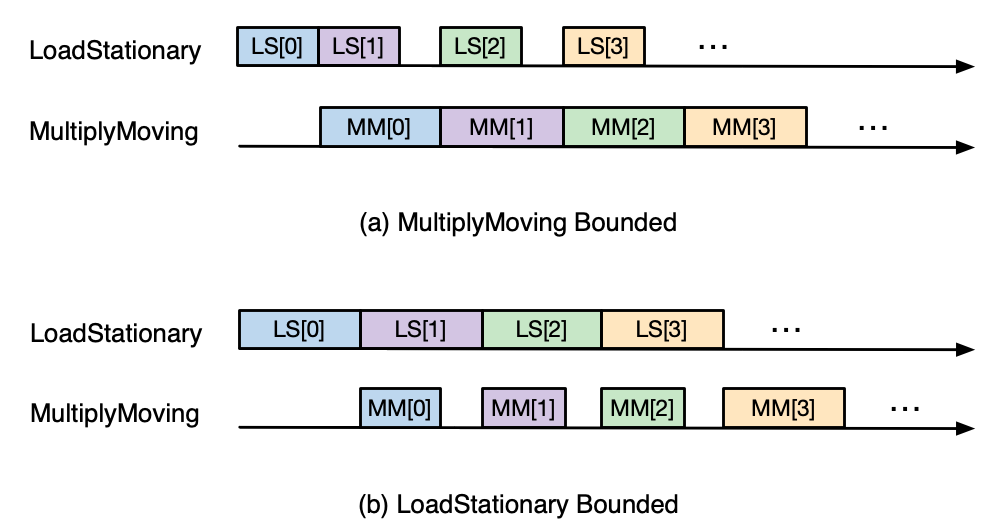

.. _nki_perf_guide:

NKI Performance Guide
=====================

In this document, we describe a recipe to find performance bottlenecks of NKI kernels and apply common software optimizations
to address such bottlenecks. During this process, we will showcase how to leverage :doc:`neuron-profile <neuron_profile_for_nki>`,
a GUI-based performance profiler designed for NeuronDevices, to guide your performance optimization efforts. Before proceeding
with this document, please make sure to read through :doc:`Trainium/Inferentia2 Architecture Guide <trainium_inferentia2_arch>`
to familiarize yourself with Neuron hardware architecture.

Ideally, performance optimization efforts would end with one of two possible outcomes: the execution of a NKI kernel is
either strictly **compute-bound** or **memory-bound**. In the context of NeuronDevices, compute-bound means at least one
of the compute engines is active close to 100% of the kernel execution time (90%+ is considered good in practice),
while memory-bound typically means the achieved device memory bandwidth utilization (MBU) is close to 100% (60%+
is considered good in practice). For compute-bound kernels that are matrix-multiplication dominated, we should also aim
for close to 100% model flops utilization (MFU) in the execution. All of these metrics are available under the ``Summary``
tab in ``neuron-profile`` GUI:

.. _perf_guide_mbu:

   MBU metric in neuron-profile.

.. _perf_guide_compute_metrics:

   Compute-related metrics in neuron-profile.

The rest of this document is divided into three sections, focusing on three categories of performance optimizations. The
first section covers optimizations to maximize achieved arithmetic intensity, with the goal of minimizing compute engine
idle periods due to unnecessary data movement. The second and third sections dive into optimizations to improve compute
engine and data movement efficiency, respectively.

Improving Arithmetic Intensity
------------------------------

Arithmetic intensity of a computation workload is commonly defined as the average number of computation operations performed
per byte of data accessed from memory. In the context of NeuronDevices, the definition refers to data accessed from *device
memory* (HBM), since the on-chip memory (SBUF) has sufficient bandwidth to keep all compute engines busy.

When arithmetic intensity is overly low, compute engines would be consuming data much faster than DMA engines fetching data
from device memory into the on-chip memory SBUF. In this case, the execution is bounded by the available device memory bandwidth.
Once arithmetic intensity is beyond certain threshold, that is, ratio of maximum compute throughput over memory bandwidth,
the performance bottleneck shifts to how fast compute engines can perform computation, which leads to a compute-bound execution.

Figure below visualizes the `Roofline Model <https://en.wikipedia.org/wiki/Roofline_model#:~:text=The%20roofline%20model%20is%20an,benefit%20and%20priority%20of%20optimizations.>`_\
, which captures this idea by plotting the projected attainable compute throughput with respective to the arithmetic intensity
of an algorithm.

.. _perf_guide_roof:

   The Roofline Model.

*Algorithmic* arithmetic intensity is an intrinsic characteristic of the particular workload and solely dependent on the
compute algorithm. In reality, due to limited capacity in SBUF, the *achieved* arithmetic intensity of a NKI kernel implementation
of such workload could be lower than the algorithmic arithmetic intensity. This could lead to excessive compute engine idle
time blocked by completion of data movements. The two typical reasons behind this are *input data reloading* and *intermediate
data spillage*. Let's discuss how to identify their symptoms in ``neuron-profile`` and how to mitigate these issues to improve
arithmetic intensity next.

Opt #1. Exploit temporal locality to minimize input data reloading
~~~~~~~~~~~~~~~~~~~~~~~~~~~~~~~~~~~~~~~~~~~~~~~~~~~~~~~~~~~~~~~~~~~~~~~~~~~

**Symptom**: In neuron-profile, if a NKI kernel triggers DMAs (\ ``nl.load``\ ) for the same input tensor multiple times,
you would see the relevant DMA activities (on the timeline row with a label starting with ``q`` and ending with ``IO``\
) being highlighted in an orange box. Hovering over the “+” sign of the box in top-left corner, a performance warning pop-up
will show up, indicating which input tensor is being reloaded, the size of it and how many times it was reloaded. For example,
figure below is a screenshot of such warning pop-up showing the ``u`` input tensor defined in my NKI kernel was reloaded
~7 times:

.. _perf_guide_input_reload_warning:

   Performance warning on input data reloading.

**Optimization**: Input tensor reloading could be avoided if the same data stay in SBUF across all the operations that consume
it at different points of the execution. However, keeping too much data in SBUF across operations can increase the memory
pressure in SBUF, leading to more spilling of intermediate data. Therefore, avoiding input reload should be a trade-off
programmers need to make carefully. Figure below illustrates this trade-off conceptually.

.. _perf_guide_input_reloading:

   SBUF usage impact with and without input reloading.

A classic example of using this optimization technique is in a matrix multiplication kernel, where we need to exploit data
reuse in the same rows of the left hand-side input matrix across different columns of the right hand-side matrix. See
:doc:`Matmul NKI Tutorial Optimization 1-3 <tutorials/matrix_multiplication>` for more
detailed discussion. Another great example is in the :ref:`Fused Mamba <tut_mamba_loop_reordering>`
kernel tutorial, where programmers can minimize reloading of largest input tensors through loop reordering.

.. _perf_guide_opt2:

Opt #2.  Fuse operations to minimize intermediate data spilling
~~~~~~~~~~~~~~~~~~~~~~~~~~~~~~~~~~~~~~~~~~~~~~~~~~~~~~~~~~~~~~~~~~~~~~~~

**Symptom**: In ``neuron-profile`` , we can find many useful data movement related metrics in the ``Summary`` tab:

.. _perf_guide_summary:

   ``neuron-profile`` Summary tab.

Below we highlight four relevant metrics to assess severity of data spilling under the ``data_movement`` section (tip: hovering
over any metric name will show a detailed description of the metric):

.. _perf_guide_data_metrics:

   Data movement metrics

Here, ``spill_save_bytes`` refers to the total size of intermediate data in bytes the workload spills from SBUF into device
memory, while ``spill_reload_bytes`` indicates total size of spilled data in bytes the workload reloads back into SBUF.
By comparing ``spill_save_bytes`` against ``sb_read_bytes``\ , you can get a feel on how much of the data movement traffic
from SBUF to device memory is related to spilling. Similarly, comparing ``spill_reload_bytes`` against ``sb_write_bytes``
indicates how much of traffic from device memory back to SBUF is related to spilling. If the spill related traffic takes
up a significant portion (for example over 30%), it is likely worthwhile to take a close look at this optimization.

**Optimization**: To reduce spilling, the key is to find operator fusion opportunities in the kernel. To achieve fusion, we
typically also need to slice up computation of each operator and perform computation for a portion of the input tensor at
a time. As a simple example, assume a chain of operators ``op0 → op1`` on a large input tensor ``kernel_in_hbm`` that cannot
fit in SBUF all at once. If we were to do the operators one at a time, we will effectively have the following sequence of
events:

.. code-block::

   for tile in kernel_in_hbm:
       tile_sbuf = load(tile)
       op0_out_sbuf = op0(tile_sbuf)
       # compiler generated spilling, or NKI programmers explicitly perform a store
       spill_save(op0_out_sbuf, op0_out_hbm)

   for tile in op1_out_device_memory:
       tile_sbuf = spill_reload(tile)
       op1_out_sbuf = op1(tile_sbuf)
       store(op1_out_sbuf, kernel_out_hbm)

However, if we fuse the operators from above:

.. code-block::

   for tile in kernel_in_hbm:
       tile_sbuf = load(tile)
       op0_out_sbuf = op0(tile_sbuf)
       op1_out_sbuf = op1(op0_out_sbuf)
       store(op1_out_sbuf, kernel_out_hbm)

Inside a NKI kernel, operator fusion is exactly done as the above through explicit loop fusion.

One great use of this optimization is the self attention operator commonly found in Transformer models. Self attention performs
a chain of operators: matmul_0 → softmax → matmul_1, where matmul_0 of a single attention head produces a large intermediate
tensor shape that overflows SBUF in common Transformer models with a context length in the thousands. See
:doc:`Fused Attention Tutorial <tutorials/fused-self-attn>` for more detailed discussion.

**Optimization Gotchas**:
Certain code patterns in NKI might lead to unexpected spilling from programmers' perspectives. We are working on improving
these in future releases. As an example, buffers sometimes need to be declared within the inner loop to avoid spilling.
In other words, instead of:

.. code-block::

   buf = nl.ndarray((2, 4, nl.par_dim(128), 512), buffer=nl.sbuf)
   for i0 in nl.affine_range(2):
     for i1 in nl.affine_range(4):
        buf[i0, i1, ....] = nl.load(...)
        ...

we need to implement:

.. code-block::

   for i0 in nl.affine_range(2):
     for i1 in nl.affine_range(4):
        buf = nl.ndarray((nl.par_dim(128), 512), buffer=nl.sbuf)
        buf[...] = nl.load(...)

With the above aforementioned optimizations, the kernel execution should achieve an arithmetic intensity that is somewhat
close to the algorithmic arithmetic intensity. At this point, you should be able to observe from the execution timeline
in ``neuron-profile`` whether the kernel spends more time in compute or DMA engines. The ``engine/dma_active_time_percent``
metrics reported in the Summary tab should also give you good hints. If your kernel execution is dominated by computation,
we recommend going over :ref:`Optimizing Compute Efficiency <perf_guide_compute>`
first to optimize compute efficiency. Otherwise, jump straight to :ref:`Optimizing Data Movement Efficiency <perf_guide_memory>`
to understand how to optimize data movement efficiency.

.. _perf_guide_compute:

Optimizing Compute Efficiency
-----------------------------

Compute efficiency optimizations typically fall into two categories:

#. “time” domain engine utilization: reduce engine idle time to keep the compute engine *on critical path* as busy as possible,
   such as enabling pipelining among engines.
#. “spatial” domain engine utilization: within the engine active periods, increase instruction efficiency to use as many
   hardware units within the engine as possible, such as combining multiple instructions into one.

Let's dive into each category below.

Reducing engine idle time
~~~~~~~~~~~~~~~~~~~~~~~~~~~~~~~

To improve the active time of a compute engine, we need to understand the exact reasons for the engine to enter an idle
state. In neuron-profile, we can focus on the execution trace of the bottlenecked engine and zoom into the visually large
engine idle gaps. For example, in the below profile, we expect VectorE to be the bottlenecked engine and therefore focus
on the idle gaps on VectorE:

.. _perf_guide_engine_idle:

   Engine idle gaps.

*Side note*\ , for faster GUI rendering, neuron-profile enables data sampling by default and “hides” certain instructions
from the timeline with a large profile. To confirm whether an engine indeed has an idle gap, we recommend zooming into a
smaller region of the profile and turn on “Show unsampled data” in ``View Edit Settings`` to make sure all instructions
are rendered:

.. _perf_guide_unsampled:

   Show unsampled data in neuron-profile.

For each engine idle gap, you can find out the reasons why the engine cannot execute instructions by inspecting the **semaphore
wait condition** of the first instruction executed on the engine after the gap. Broadly speaking, these semaphore wait conditions
are either waiting for 1) other compute engine instructions or 2) DMA activities to finish. We have different techniques
to shrink the idle gaps caused by either of these wait conditions (that is, engine stall reasons).

.. _perf_guide_opt3:

Opt #3.  Overlap execution across compute engines through pipelining
^^^^^^^^^^^^^^^^^^^^^^^^^^^^^^^^^^^^^^^^^^^^^^^^^^^^^^^^^^^^^^^^^^^^^^^^^^^^^

**Symptom**: The semaphore wait condition of the first instruction after an idle gap is on a semaphore name that matches a
compute engine name in NeuronCore: Vector, Scalar, GpSimd and Tensor. These semaphores are associated with instruction completion
on the corresponding compute engine.

For example, the below ``TENSOR_TENSOR`` instruction on VectorE is waiting for ``S[4] (Scalar)`` to reach a value of 36.
This means VectorE was waiting for ScalarE to finish certain instructions.

.. _perf_guide_wait_engine:

.. figure:: img/nki_perf_guide/fig10.png
   :align: center
   :width: 100%

   Semaphore wait on another compute engine.

**Optimization**: When there is a sequence of operators on different compute engines, we can slice the computation in a way
that the compute engines can process tiles of the original operator in a pipeline fashion. As an example, let’s assume we
have two operator back to back on a large (say, thousands of elements) tensor ``X``\ : ``X → op0 → Y → op1 → Z``. ``op0``
is performed on ScalarE while ``op1`` is on VectorE. For simplicity, let’s assume tensor ``X/Y/Z`` have the same shape.

Figure below shows two possible execution timelines with and without engine pipelining. Without pipelining, VectorE is fully
idle when ScalarE is executing ``op0`` on tensor ``X`` in the first half of the execution. Similarly, ScalarE is idle while
VectorE is running ``op1``. However, with pipelining, ScalarE is able to produce partial results in tiles and unblock VectorE
as soon as the first tile is processed. Overall, engine pipelining shortens the end to end latency to complete ``op0`` and
``op1``\ , through shrinking engine idle time and improving hardware utilization.

.. _perf_guide_engine_pipe:

.. figure:: img/nki_perf_guide/fig11.png
   :align: center
   :width: 80%

   Engine timeline with and without engine pipelining.

Choosing a proper tile size is crucial to the performance of such engine pipelining. It is up to NKI programmers to make
this choice in kernel implementation and iterate on it using performance profiling data in neuron-profile. For complex kernels,
we often need to schedule a pipeline among all engines: Tensor/Scalar/Vector/GpSimd Engine.

For example, in Transformer's self-attention layer, in addition to fusing matmul_0(Q, K) → softmax → matmul_1(softmax_out,
V) in a single kernel to minimize spilling as discussed in :ref:`Opt #2 <perf_guide_opt2>`,
we also need to form a complex engine pipeline for the operators to maximize utilization of the compute engines:

* matmul_0/matmul_1: TensorE
* softmax:

  * exponential: ScalarE
  * summation: VectorE
  * scale by reciprocal of summation: ScalarE
  * for causal self attention, triangular masking: GpSimdE

See :doc:`Fused Self Attention <tutorials/fused-self-attn>` tutorial for more detailed discussion.

.. _perf_guide_opt4:

Opt #4.  Overlap data loading with computation
^^^^^^^^^^^^^^^^^^^^^^^^^^^^^^^^^^^^^^^^^^^^^^^^^^^^^^^^^

**Symptom**: The semaphore wait condition of the first instruction after an idle gap is on a semaphore name that starts with
letter ``q``. These semaphores are associated with completion of DMA activities.

For example, hovering on an instruction will bring up the key instruction details as follows:

.. _perf_guide_wait_input:

.. figure:: img/nki_perf_guide/fig12.png
   :align: center
   :width: 100%

   Instruction waiting for input data loading.

In this particular screenshot, the ``EVENT_SEMAPHORE`` instruction could not start earlier even though VectorE was idle
because it was waiting for semaphore S[22] (\ ``qSyncIO0``\ ) to reach a value of 240. The semaphore is only incremented
whenever the corresponding DMA activities shown on the ``qSyncIO0`` execution trace are completed. Clicking on the DMA activities
on ``qSyncIO0`` immediately before the ``EVENT_SEMAPHORE`` instruction, you may follow the ``nki_source_location`` to find
out which line of code is related to this DMA activity (\ ``nl.load()`` call).

Similarly, if an instruction is blocked on ``S[47] (qSyncSpillReload0``\ ), that means it is blocked by DMA activities for
spilling:

.. _perf_guide_wait_spill:

   Instruction waiting for spilled data reloading.

Clicking on the DMA activities on ``qSyncSpillReload0`` immediately before the ``EVENT_SEMAPHORE`` instruction, you may
find out the name of the intermediate NKI tensor that was spilled/reloaded. For example, the below DMA transfer reloads
the tensor named ``deltaU`` as defined in our NKI kernel. Note, spill/reload DMA transfers are generated by Neuron Compiler
automatically by analyzing SBUF usage in NKI kernels. Therefore, these DMA transfers do not have an associated explicit
NKI API call or ``nki_source_location`` information.

.. _perf_guide_spill_variable:

   Spilled tensor variable name.

**Optimization**: Overlapping data loading with compute is highly similar to enabling compute engine pipelining in Opt #3,
since DMA engines can move data in parallel to compute engine execution, just like how compute engines can run different
operators in parallel.

.. _perf_guide_overlap_comp_mem:

   DMA and engine timeline with and without overlapping.

However, it is also possible that even after maximizing overlapping of compute and data movement the best you can, the data
movement duration is still not hidden behind compute even though your kernel has a compute-bound arithmetic intensity. In
these cases, the most common cause is the data movement in your kernel is not using the DMA engines *efficiently*. Refer
to a :ref:`later section <perf_guide_memory>` to
see relevant optimization techniques to improve DMA bandwidth utilization.

As a concrete example, we demonstrate how to properly overlap compute and data movement in a compute-bound (VectorE as the
bottlenecked engine) kernel in :ref:`Mamba tutorial <tut_mamba_tiling>`.

Improving engine efficiency
~~~~~~~~~~~~~~~~~~~~~~~~~~~~

Once done with “avoiding engine idle gaps” as much as possible, we can focus on improving “engine efficiency” during the
busy periods of the engine. We will start with two optimizations techniques that are generally applicable to all compute
engines, followed by TensorE-specific optimization techniques.

Opt #5a: Use sufficiently large input tiles in free dimension
^^^^^^^^^^^^^^^^^^^^^^^^^^^^^^^^^^^^^^^^^^^^^^^^^^^^^^^^^^^^^^^^^^^^^^^^^^^^^^

**Symptom**: Certain operators might trigger many back-to-back instructions with small free dimension sizes in the input
tensors. For example, in the below profile, ScalarE is busy with many repeated ``activation`` instructions with IDENTITY
(scale/bias enabled) activation function, which is equivalent to calling ``nki.isa.tensor_scalar(op0=nl.multiply, op1=add)``
APIs. If you click on one of the instructions to pull up the instruction detailed view, you can see the source tensor access
pattern is ``fp32@20580[1,1,1][1,1,1]`` , where the first set of bracket indicates 3D strides and the second set indicates
3D shape in FP32 elements. More detailed discussion of ISA access pattern can be found by clicking on the ``i`` button at
the end of the ``Operands`` row.

In this example, each of the back-to-back instructions is reading **one** element per partition from SBUF, which would take
about one engine cycle to perform useful computation within the instruction. Such instructions are extremely inefficient
since the static instruction overhead in the order of ~100 cycles would be limiting the overall throughput.

To make things worse, these instructions also have data dependency (read after write) between consecutive instructions,
which means the next instruction cannot start data read until the previous instruction has all of its output committed to
the local SRAM. In neuron-profile, you can inspect data dependency between instructions by clicking on an instruction of
interests (\ ``Inst1`` in the below profile), which will highlight the clicked instruction and also the instruction that
produces input for the clicked instruction (\ ``Inst0`` in the below profile). The dependency information can also be viewed
in the details “instruction dependency pcs”. In fact, all the neighboring instructions also have a similar dependency patterns
in this profile.

With the above inefficiencies, the initiation interval (the time between the starting points of two consecutive instructions)
for these instructions on ScalarE is around ``189 ns (264 ScalarE cycles on NC-v2)`` , which is much higher than the useful
computation cost (one ScalarE cycle throughput-wise).

.. _perf_guide_small_instr:

   Many back-to-back ScalarE instructions with small tensor shapes

**Optimization**: The trick of this optimization is to increase the free dimension size of instruction input tiles. As discussed
in the :doc:`architecture guide <trainium_inferentia2_arch>`, NeuronCore compute engines
typically require at least 128 elements/partition in the source tensor to be efficient. However, it is worth mentioning
that increasing free dimension sizes might not be trivial due to the high-level computation definition. We suggest developers
walking through the `architecture guide <trainium_inferentia2_arch.html>`_ in detail to better understand capabilities of
different compute engines, and mapping/reformulating the high-level operators onto the engines using the most suitable instructions.
Such instructions could be invoked either through the high-level ``[nki.lanaguage](api/nki.language.html)`` or low-level
``[nki.isa](api/nki.isa.html)`` APIs.

In addition, keep in mind there is a trade-off in choosing the free dimension size in instruction input tiles: Too small
of a tile size exposes significant instruction overhead leading to inefficient engine execution, while too large of a tile
size often leads to inefficient pipelining between engines (working against :ref:`Opt #3 <perf_guide_opt3>`)
and high memory pressure in SBUF (working against Opt #2).

As an example, a naive implementation of the prefix sum scan operation in Mamba v1 would trigger ``seq_len`` back-to-back
single element ``nki.isa.tensor_scalar`` instructions as shown in the above profile example, where ``seq_len`` is the sequence
length of the model typically in the range of thousands. A more efficient way to implement this operation is through a special
VectorE instruction ``nisa.tensor_tensor_scan``.
See the `Mamba tutorial <tutorials/fused_mamba>` for more discussion.

Opt #5b: Use sufficiently large input tiles in partition dimension
^^^^^^^^^^^^^^^^^^^^^^^^^^^^^^^^^^^^^^^^^^^^^^^^^^^^^^^^^^^^^^^^^^^^^^^^^^^^^^^^^^^

**Symptom**: When instructions use input/output tiles that span fewer than 128 partitions, they typically under-utilize
the compute engine capabilities. This is because each SBUF/PSUM partition has a one-to-one mapping to parallel vector lanes
in the compute engines. As an example, the ``TENSOR_TENSOR`` instruction (equivalent to ``nki.tensor_tensor``\ ) on VectorE
takes a source tensor in SBUF that occupies 64 partitions only, as indicated by the ``channels=64`` instruction operand
field. If we were to increase the ``channels`` field to 128, the instruction would have taken the same amount of time as
``channels=64``.

.. _perf_guide_le128_part:

   An instruction that read/write less than 128 partitions.

Similarly, for a ``MultiplyMoving`` instruction (Matmul opcode in neuron-profile) TensorE, if the instruction reads/writes
tiles do not span the full SBUF/PSUM partitions, we would be underutilizing TensorE. As an example, the below ``MultiplyMoving``
instruction only writes to 96 partitions in PSUM, as indicated by the operand ``128*96``\ , which means the instruction
only uses 128 rows and 96 columns of the processing elements out of the available 128x128 systolic array.

.. _perf_guide_le128_col:

   MultiplyMoving instruction that uses <128 TensorE columns

**Optimization**:
If we see **many back-to-back** **instructions** on the compute engine that have fewer than 128 partitions in the input/output
tiles as discussed above, we should consider an optimization called “partition vectorization”.

As an example, say we have two ``nki.isa.nc_matmul()`` instructions with each generating a 64-partition PSUM tile of the
same shape. Then VectorE needs to run ``nki.isa.tensor_reduce()`` on both tiles to generate a reduction result. Note, on
trn1/inf2, VectorE cannot run the two independent ``nki.isa.tensor_reduce()`` instructions in parallel in this case, even
though the total number of compute lanes required for these instructions does not exceed 128. To improve VectorE utilization
in this case, we can:

#. The two ``nc_matmul()`` instructions write to disjoint PSUM partitions: partition 0-63 for the first ``nc_matmul`` and
   partition 64-127 for the second one.
#. Invoke a single ``nki.isa.tensor_reduce()`` instruction to process output of both ``nki.isa.nc_matmul()`` instructions.

The below pseudo-code illustrates the above computation without and with partition vectorization.

.. code-block::

   import neuronxcc.nki.isa as nisa
   import neuronxcc.nki.language as nl

   ################################################################
   # option 1: No partition vectorization
   # two 64-partition vector instructions running serially

   # By default, NKI creates mm_tile0 and mm_tile1 in partition 0-63
   mm_tile0 = nisa.nc_matmul(...)
   mm_tile1 = nisa.nc_matmul(...)

   # Both nki.isa.reduce instructions move data from psum partition 0-63
   # in a serialized fashion
   reduce0 = nisa.tensor_reduce(mm_tile0, ...)
   reduce1 = nisa.tensor_reduce(mm_tile1, ...)

   ################################################################
   # option 2: Partition vectorization
   # vectorized into one 128-partition vector instructions

   # Here, we explicitly declare a 128-partition tensor in PSUM
   mm_tile = nl.zeros((128, ...), np.float32, buffer=nl.psum)

   i_output0_p = nl.arange(64)[:, None]
   i_output1_p = 64 + nl.arange(64)[:, None]
   # Assign first part of mm_tile to partition 0-63
   mm_tile[i_output0_p, ...] = nki.isa.nc_matmul(...)
   # Assign second part of mm_tile to partition 64-127
   mm_tile[i_output1_p, ...] = nki.isa.nc_matmul(...)

   # A single nki.isa.reduce instruction, using all 128 partitions
   reduce = nisa.tensor_reduce(mm_tile, ...)

Option #2 above is able to perform the reduction 2x faster, by vectorizing the partition dimension and performing a single
reduction instead of two.

Opt #6: Combine instructions
^^^^^^^^^^^^^^^^^^^^^^^^^^^^^^^^^^^^^^^^^^^^^^^^^^^^^^^^^^^^^^^^^^

**Symptom**: Even though the majority of popular ML models are matrix multiplication heavy, certain operators can be vector/scalar
operation heavy instead, such as self-attention in Transformer models. These operators typically have a performance bottleneck
in VectorE or ScalarE or both. As an example, the below profile shows the inner loop of self attention, where either VectorE
or ScalarE is busy at any moment in time, while TensorE has clear engine idle gaps.

.. _perf_guide_vector_scalar_bound:

   A VectorE/ScalarE-bound profile.

**Optimization**: A common optimization to tackle vector/scalar-operation-heavy operators is **combining instructions** using
low-level ``nki.isa`` APIs. Combining instructions can leverage the deep pipelined stages within VectorE and ScalarE engine
data path to increase hardware utilization per instruction and reduce the instruction count. Check out the
:doc:`architecture guide <trainium_inferentia2_arch>` to learn what operations can be done in a pipeline fashion
in a single VectorE/ScalarE instruction.

For example, below pseudo-code showcase combining three instructions into a single one on ScalarE. ``impl 1`` and ``impl
2`` are functionally equivalent, but ``impl 2`` is 3x faster in terms of latency by touching the input ``data`` only once
and running all three operations (multiply, add, exp) in a pipeline.

.. code-block::

   # input: data (tile[128, 512]), scale (tile[128, 1]) , bias (tile[128, 1])

   # impl 1:
   scaled = nki.language.multiply(data, scale)
   shifted = nki.language.add(scaled, bias)
   exp = nki.language.exp(shifted)

   # impl 2:
   exp = nki.isa.activation(nki.language.exp, data,
                            bias, scale)

Check out :doc:`nki.isa APIs <api/nki.isa>`
to understand low-level ISA API semantics, limitations, engine mapping, and rough estimates of performance cost.

See :doc:`Fused Mamba <tutorials/fused_mamba>` tutorial for a concrete example to
combine matrix-vector multiplication and exponential evaluation in a single ``nisa.activation`` instruction. Similarly,
in :doc:`Fused Self Attention <tutorials/fused-self-attn>` tutorial, we combine the subtraction of the maximum with exponential
in a single ``nisa.activation`` instruction in the Softmax operator.

Opt #7: TensorE only: Leverage fast weight load
^^^^^^^^^^^^^^^^^^^^^^^^^^^^^^^^^^^^^^^^^^^^^^^

**Symptom**: Let's consider a matrix multiplication between two matrices of shape ``[M, K]`` and ``[K, N]``\ , with one of
the following conditions:

#. M is significantly smaller than 128, while N is much larger than 128, or
#. the other way around: N is significantly smaller than 128, while M is much larger than 128

In NKI, if the matrix with ``min(M, N)`` dimension is mapped to the **stationary tensor** (\ ``x`` input tensor in ``nl.matmul``
and ``nisa.nc_matmul``\ ) for the TensorE ``LoadStationary`` instruction (details see :ref:`architecture guide <arch_guide_tensor_engine>`
), we will typically end up under-utilizing TensorE more severely compared to mapping such matrix to the **moving tensor**.

In ``neuron-profile``\ , programmers can identify also this inefficient case by inspecting the ``src`` access patterns for
LoadStationary and MultiplyMoving instructions on TensorE. For example, the below screenshot indicates a stationary tensor
with 1 element per partition and a moving tensor with 128 elements per partition:

.. _perf_guide_matrix_vector_instr:

   Example instructions for matrix-vector multiplication.

If you have many back-to-back TensorE instructions with the above pattern, we recommend applying the below optimization.

**Optimization**: The key idea of this optimization is to simply swap the stationary and moving tensor positions for the given
matmul in NKI, in order to leverage the “Fast LoadStationary” support in TensorE (more discussion in
:ref:`architecture guide <arch_guide_tensor_engine_perf>`). To better understand the intuition behind this, let's walk
through a concrete example.

Consider a ``[1, 128] x [128, 128]`` matrix multiplication as below:

.. _perf_guide_matrix_vector:

   Illustration of matrix-vector multiplication.

Since K=128 is the contraction dimension, it will get mapped to the partition dimension of the SBUF for both the ``x`` and
``y`` matrices. M and N will therefore get mapped to the free dimension of the SBUF.  and we will refer to ``x`` as the
“short” tensor, and ``y`` as the “long” tensor (short and long in the free dimension, respectively). We have two possible
ways of performing this computation on the TensorE, which we'll refer to as “Short Moving” and “Short Stationary“, depending
on which tensor has the short free dimension.

.. _perf_guide_matrix_vector_2way:

.. figure:: img/nki_perf_guide/fig23.png
   :align: center
   :width: 100%

   Two possible TensorE instruction mapping for matrix-vector multiplication.

Based on the multiplication property of transpose, we have ``A×B=(B.T×A.T).T``. Meanwhile, based on the semantics of TensorE, when
we want to compute ``A×B``, we need to call ``nc_matmul(A.T, B)``, and for ``BT×AT``, we need to call
``nc_matmul(B.T.T, A.T)`` -> ``nc_matmul(B, A.T)``. Notice how the parameters
to ``nc_matmul`` are swapped! Thus, when we swap stationary and moving tensors and perform the matrix multiplication, the
output tensor will be transposed from the original output.

Recall, if there is a difference in initiation interval between ``LoadStationary`` and ``MultiplyMoving``, one of them
can end up limiting the throughput of TensorE:

.. _perf_guide_tensor_perf:

   Two possible TensorE performance characteristics.

In the above scenarios, we expect TensorE performance to be bound by whichever instruction reads the longer tensor - LoadStationary
in “Short Moving”, and MultiplyMoving in “Short Stationary”. However, with TensorE Fast LoadStationary, TensorE can perform
``LoadStationary`` **up to 4x** faster than a ``MultiplyMoving`` with the same free axis size.

So in the two above scenarios:

#. Short Moving - ``LoadStationary`` initiation interval is roughly equal to the number of elements divided by 4 (because
   of fast LoadStationary), and ``MultiplyMoving`` initiation interval is dominated TensorE instruction turnaround time ``MM_INIT_LATENCY
   (64 cycles on trn1)``. Therefore, we have  ``LS_II ~= 128/4 = 32 cycles`` , and ``MM_II ~= max(1, MM_INIT_LATENCY=64 cycles)``
   which leads to issuing a MM roughly every 64 cycles.
#. Short Stationary - ``MultiplyMoving`` initiation interval will dominate, which leads to issuing a MM roughly every 128
   cycles.

Because of the above, we will prefer to map short tensors to the moving tensor in ``MultiplyMoving`` instruction in TensorE.

A classic example is a matrix-vector product. This is commonly seen in auto-regressive token generation in LLMs, where most
of the matmuls occur only on a single token (vector) as the feature map, while the weight tensor remains large and hence
must be broken into tiles to meet TensorE tile size constraints.

Opt #8: TensorE only: Mitigating overhead from tensor transposes
^^^^^^^^^^^^^^^^^^^^^^^^^^^^^^^^^^^^^^^^^^^^^^^^^^^^^^^^^^^^^^^^

**Symptom**: Since TensorE accounts for over 90% of the hardware FLOPS on a NeuronCore, we would like the engine to perform
useful computations as much as possible, especially in matmul-heavy kernels. The most common “not useful” computation that
could occupy precious TensorE cycles is tensor PF-transposes, which swap the partition and free dimensions of a NKI tile.
When you have a profile with TensorE visually extremely busy, we recommend doing a sanity check on how much of the TensorE
activities are performing transposes. One easy way to check is by selecting ``Instruction Type`` as the ``Instruction Grouping``
in ``View Settings`` :

.. _perf_guide_transpose_setting:

   Change view settings to visualize transposes.

With this instruction coloring, TensorE instructions will be highlighted in two different colors: one for Transpose and
one for Regular (useful matmuls). As an example, the below profile has an execution trace with TensorE being the performance
bottleneck. Visually, we can see the bulk of the TensorE execution is for regular matmuls, but there is a noticeable chunk
of engine time spent on transpose-induced instructions in red. Note, the colors for transpose versus regular instructions
are chosen randomly by the profiler each time. You should hover over the instructions to check the ``Instruction Type``
field on the pop-up to confirm the color mapping.

.. _perf_guide_transpose_timeline:

   Example timeline with a transpose instruction type.

**Optimization**: The key goal of this optimization is to reduce the number of transpose-induced instructions on TensorE,
when such instructions are taking up a large portion of the execution. Before diving into techniques to reduce transposes,
it is important to understand the root cause of these transposes.

At a high level, tensor transposes are needed to adjust the data layout of tensors to match the partition dimension requirements
of different ISA instructions. Refer to the :doc:`architecture guide <trainium_inferentia2_arch>`
for layout requirements of each compute engine. Transposes are inserted explicitly into NKI kernels through
:doc:`nl.transpose <api/generated/nki.language.transpose>` or :doc:`nisa.sb_transpose <api/generated/nki.isa.nc_transpose>`
APIs, or calling ``nl.matmul`` with ``transpose_x=False``. These transposes are most commonly lowered down to Tensor Engine.

Broadly speaking, there are 2 different types of tensor transposes, with different root causes:

#. IO tensor transpose (abbreviated as IO transpose)
#. intermediate tensor transpose (abbreviated as intermediate transpose)

**IO transpose.** These transposes are ** done on NKI kernel IO (input/output) tensors, which must reside in device memory
in current NKI releases. The transposes are needed when the NKI compute API consuming input tensors or producing the output
tensors expect a different layout than their IO layout in device memory. To simplify discussion, we dive into input tensor
layout discussion below, but the same reasoning also applies to output tensors.

For example, say we have an input tensor in device memory with layout ``[out_channel=128, in_channel=128]`` (major-to-minor
ordering), but the ``nisa.nc_matmul`` call in our NKI kernel expects ``[in_channel, out_channel]`` as input tile layout.
In this case, we can perform a :doc:`nl.load <api/generated/nki.language.load>` to load the input
into SBUF, with ``out_channel`` being the partition dimension because ``out_channel`` is the most major dimension in device
memory. Then, a PF-transpose on TensorE is required before the loaded data can be consumed by ``nisa.nc_matmul`` . Alternatively,
we can invoke :doc:`nl.load_transpose2d <api/generated/nki.language.load_transpose2d>`
to transpose the input tensor on the fly in the DMA engine, with a major caveat of much lower DMA bandwidth compared to
``nl.load``. ``nl.load_transpose2d`` could make sense in a compute-bound kernel, but should certainly be avoided in memory-bound
kernels.

Either way, an IO transpose is inevitable here *due to* the IO tensor layout choice we made as NKI programmers. In the naive
case scenario where we only care about reaching the best performance for a single kernel, we can carefully decide on the
IO tensor layout to make sure it is compatible with the NKI compute API layout requirements. When the input tensor is consumed
by multiple compute APIs with conflicting layout requirements, IO-transposes cannot be avoided but should still be minimized
as much as possible with a careful trade-off.

However, NKI kernels are often injected into a larger model defined at the framework such as PyTorch and JAX, in which case
the kernel IO tensors are also input/output of the surrounding framework operators. These cases will require more complex
reasoning on the optimal IO tensor layout for the NKI kernel, but the optimization goal of minimizing IO transposes remains
the same.

One last complexity in deciding IO tensor layout is the layout choice also has a potential impact on DMA efficiency. See
more discussion in a :ref:`later section <perf_guide_memory>`
discussion optimizing data movement efficiency.

**Intermediate Transpose.** These transposes are done on intermediate tensors produced within a NKI kernel. These transposes
arise due to layout requirement mismatches between producer and consumer NKI compute APIs.

There are two common techniques to reduce intermediate transposes: 1) swapping moving/stationary tensors in ``nisa.nc_matmul``
(or equivalently, ``nl.matmul``) and 2) mapping a computation to an alternative engine with different layout requirements.

One example for technique 1) is in an operator chain commonly seen in Transformer models: ``linear_layer`` → ``layernorm``.
Normally, we tend to map the weight ``[hidden_size, 4xhidden_size]`` tensor in ``linear_layer`` to the stationary tensor
and the input feature map ``[hidden_size, seq_len]`` to the moving tensor when performing ``nisa.nc_matmul`` on TensorE.
The output feature map of this matmul will be in a layout of ``[4xhidden_size, seq_len]``. However, the first step in ``layernorm``
to calculate mean and variance, ``nisa.bn_stats``\ , requires ``4xhidden_size`` to be the free dimension because we need
to calculate mean/variance within a single token. Therefore, a naive implementation of this operator chain will trigger
a PF-transpose between the ``nisa.nc_matmul`` and ``nisa.bn_stats`` instructions. However, if we were to instead map the
weight tensor to the moving tensor and input feature map to stationary tensor, we can skip this PF-transpose entirely because
the ``nisa.nc_matmul`` output will be in the expected layout by ``nisa.bn_stats``.

An example for technique 2) is in a similar operator chain: ``linear_layer → RMSnorm`` with the same intermediate tensor
dimensions as the above example. ``RMSnorm`` is considered a cheaper normalization operator compared compared ``Layernorm``\
, because it replaces the mean/variance calculation with squared and summation. Unlike ``nisa.bn_stats`` for mean/variance
calculations which must be done along the free dimension, for ``RMSnorm`` the scalar squared operator has no layout requirement
and the summation can be done along either dimensions: use VectorE ``nisa.tensor_reduce`` for free dimension summation or
use TensorE ``nisa.nc_matmul`` for partition dimension summation (see :ref:`TensorE alternative use case <arch_sec_tensor_engine_alternative_use>`
in the architecture guide). Since ``RMSnorm`` can be done with either ``[4xhidden_size, seq_len]`` or ``[seq_len, 4xhidden_size]``\
, we should make the layout choice based on more surrounding operator: ``RMSnorm`` in Transformer models is typically followed
by yet another ``linear_layer``\ , which requires the ``[4xhidden_size, seq_len]`` layout. Therefore, to minimize intermediate
transposes in an operator chain like ``linear_layer → RMSnorm → linear_layer`` , we should map the weight tensor of the
first ``linear_layer`` to the stationary tensor and leverage TensorE to perform cross-partition summation for ``RMSnorm``.

.. _perf_guide_memory:

Optimizing Data Movement Efficiency
-----------------------------------

The key goal of optimizing memory-bound kernels is to keep the DMA engines running at high bandwidth utilization as much
as possible. If you are seeing major DMA engine idle gaps in neuron-profile, you should first find ways to hide compute
behind DMA activities using techniques discussed in :ref:`Opt #4 <perf_guide_opt4>`.
The rest of this section is going to focus on optimizations to improve DMA bandwidth utilization. All the optimizations
below are applicable to a common symptom: computation blocked by DMA activities, which are keeping the DMA engines “busy”
but at low bandwidth utilization (< 60%):

.. _perf_guide_busy_dma:

   Busy DMA engines with relatively idle compute engines.

Note, the current NKI release only supports running a kernel on a single NeuronCore (subject to changes in future releases).
Therefore, the optimizations below will focus solely on movement between device memory and on-chip memory SBUF for now.

.. _perf_guide_opt9:

Opt #9: Perform sufficiently large DMA transfers
~~~~~~~~~~~~~~~~~~~~~~~~~~~~~~~~~~~~~~~~~~~~~~~~~

**Symptoms**: A quick way to determine whether the DMA transfers are moving large enough amount of data per transfer is to
visualize the DMA activities per engine in ``neuron-profile``:

.. _perf_guide_dma_setting:

.. figure:: img/nki_perf_guide/fig28.png
   :align: center
   :width: 70%

   Change view settings to visualize DMA transfer per DMA engine.

With the above view settings, each DMA transfer will be shown with a continuous bar on the execution trace, grouped by DMA
engines. Below is a profile example with small DMA transfers going on all 16 DMA engines. Visually, we can see DMA engine
empty gaps (due to DMA overhead) are taking up more time than active DMA transfers. Hovering over some of DMA transfers,
we can also see a transfer size of 4B, which is extremely tiny. For reference, the transfer size on Trainium/Inferential2
should be larger than 32KiB to achieve ideal bandwidth.

.. _perf_guide_tiny_dma:

   Example timeline with tiny DMA transfers.

For comparison, here's another profile with sufficiently large DMA transfers, achieving close 70% DMA throughput utilization:

.. _perf_guide_large_dma:

   Example timeline with large DMA transfers.

**Optimizations**: Refer to the architecture guide for more detailed discussion on DMA engines and intuitions behind the need
for large DMA transfer sizes to achieve good DMA efficiency. Here, we will discuss simple rule of thumbs in NKI to trigger
large DMA transfers: maximize the partition and free dimension sizes in both :doc:`nl.load <api/generated/nki.language.load>`
and :doc:`nl.store <api/generated/nki.language.store>`. For example, the below data loading will trigger
16 DMA transfers that can be run on all 16 DMA engines, which each transfer loading 8 SBUF partitions' worth of data with
a transfer size of 32KiB:

.. code-block::

   import neuronxcc.nki.language as nl

   def load_store_32kib_contiguous(in_tensor, out_tensor):
       # both in_tensor and out_tensor have FP32 data type, 4B/element
       assert in_tensor.dtype == out_tensor.dtype == nl.float32
       # both have shape 128x1024 in device memory
       assert in_tensor.shape == out_tensor.shape == [128, 1024]

       # partition dim size is at maximum supported by the architecture: 128
       # free dim size is at the ideal size to achieve good bandwidth usage: 1024
       # Beyond 1024 has diminished return on bandwidth and
       # runs the risk of degrading compute/data movement pipelining efficiency
       i_p, i_f = nl.mgrid[0:128, 0:1024]

       # This access pattern should map to 16 DMA transfers (1 transfer/DMA engine),
       # with each DMA transfer moving 8 partitions worth of data:
       # 8 partitions * 1024 elements * 4B/element = 32 KiB
       data_tile = nl.load(in_tensor[i_p, i_f])

       # Do some useful computation
       ...

       # Store, similar size as the load
       nl.store(out_tensor[i_p, i_f], data_tile)

Opt #10: Minimize use of DMA transposes.
~~~~~~~~~~~~~~~~~~~~~~~~~~~~~~~~~~~~~~~~

**Symptom**: Excessive use of DMA transposes, invoked through ``nl.load_transpose2d``, can degrade DMA bandwidth significantly.
In ``neuron-profile``, you can find out whether  ``nl.load_transpose2d`` is taking up substantial amount of execution
time by using the search functionality, which will highlight all the DMA activities that perform transposes on the fly:

.. _perf_guide_search_transpose:

   Search for DMA activities that perform transposes.

**Optimizations**: Refer to :ref:`Opt #8 <perf_guide_opt9>`
for a detailed discussion on how to eliminate the need of transposes on device memory input data. When the transposes are
inevitable and the kernel is memory bound, we recommend replacing ``nl.load_transpose2d`` with ``nl.load()`` and ``nisa.nc_transpose()``.
For example, if you have an ``in_tensor`` of shape [8192, 128] in device memory but you would like an SBUF tile of shape
[128, 8192] spread across 128 partitions for computation, the following two code snippets can achieve the same functionality:

.. code-block::

   # Option 1, low DMA bandwidth usage:
   sbuf_opt1 = nl.load_transpose2d(in_tensor[0:8192, 0:128])

   # Option 2, better DMA bandwidth usage, fastest transpose:
   sbuf_opt2 = nl.ndarray((128, 8192), dtype=in_tensor.dtype)
   for i_in_tile in nl.affine_range(8192 // 128):
       i_start = i_in_tile*128
       current_tile = nl.load(in_tensor[i_start:i_start+128, 0:128])
       sbuf_opt2[0:128, i_start:i_start+128] = nisa.nc_transpose(current_tile)

Option 2 above is especially great for cases where ``nl.load_transpose2d`` is slowing down data movement in the critical
path and TensorE is otherwise idle. Occasionally Option 1 can still be the right call, when the amount of data to be transposed
is small and the overhead of ``nl.load_transpose2d`` can be well hidden behind other useful computation.
