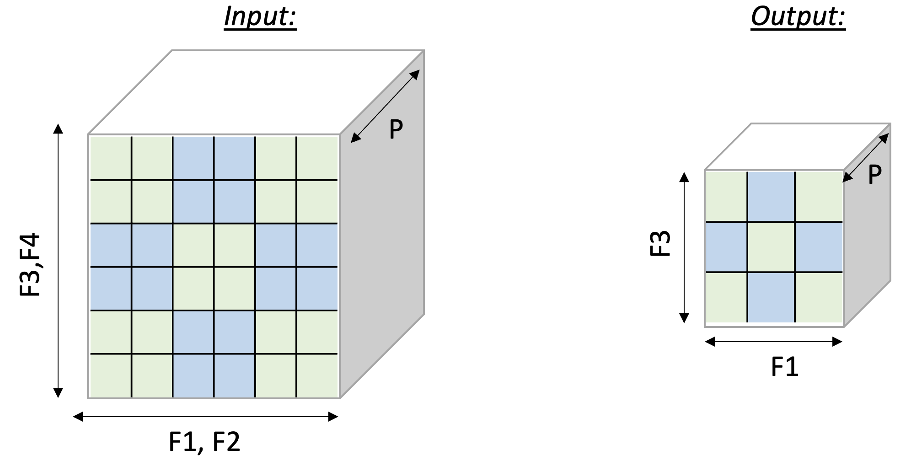

AveragePool2D
=============

In this tutorial, we examine a case of
dimensionality reduction. We implement a 2D AveragePool operation, which
is used in many vision neural networks.
In doing so, we learn about:

-  NKI syntax and programming model.
-  multi-dimensional memory access patterns in NKI.

The 2D AveragePool operation takes
``C x [H,W]`` matrices and reduces each matrix along the ``H`` and ``W``
axes. To leverage free-dimension flexible indexing, we can map the ``C``
(parallel) axis to the ``P`` dimension and ``H/W`` (contraction)
axes to the ``F`` dimension.
Performing such a 2D pooling operation requires a 4D memory access
pattern in the ``F`` dimension, with reduction along two axes.
:ref:`Figure <nki-fig-avgpool>`
below illustrates the input and output tensor layouts.

.. :

   2D-Pooling Operation (reducing on axes F2 and F4)

PyTorch
-------

Compute kernel
^^^^^^^^^^^^^^

.. literalinclude:: ../examples/average_pool2d/average_pool2d_nki_kernels.py
   :language: python
   :linenos:
   :lines: 9-10, 12-60

Launching kernel and testing correctness
^^^^^^^^^^^^^^^^^^^^^^^^^^^^^^^^^^^^^^^^

To execute the kernel, we prepare tensors ``in_tensor`` and an empty tensor
``out_nki``, and call ``tensor_avgpool_kernel_``:

.. literalinclude:: ../examples/average_pool2d/average_pool2d_torch.py
   :language: python
   :linenos:
   :lines: 7-10, 14-35

JAX
-------

Compute kernel
^^^^^^^^^^^^^^

Let's reuse the same NKI kernel implementation defined for PyTorch above:

.. literalinclude:: ../examples/average_pool2d/average_pool2d_nki_kernels.py
   :language: python
   :linenos:
   :lines: 9-10, 12-60

We define ``tensor_avgpool_kernel`` as a caller to the NKI kernel.  We create
a partial function ``partial(tensor_avgpool_kernel_, pool_size=pool_size)``
in order for JAX to be able to pass a Python object to the kernel function.

.. literalinclude:: ../examples/average_pool2d/average_pool2d_jax.py
   :language: python
   :linenos:
   :lines: 7, 9, 11, 15-20

We write a reference JAX implementation of ``AveragePool2D`` as JAX does
not have a primitive for it.

.. literalinclude:: ../examples/average_pool2d/average_pool2d_jax.py
   :language: python
   :linenos:
   :lines: 10-11, 23-27

Launching kernel and testing correctness
^^^^^^^^^^^^^^^^^^^^^^^^^^^^^^^^^^^^^^^^

To execute the kernel, we prepare array ``in_array`` and invoke the kernel caller function ``tensor_avgpool_kernel``:

.. literalinclude:: ../examples/average_pool2d/average_pool2d_jax.py
   :language: python
   :linenos:
   :lines: 30-45

Download All Source Code
--------------------------

Click the links to download source code of the kernels and the testing code
discussed in this tutorial.

* NKI baremetal implementation: :download:`average_pool2d_nki_kernels.py <../examples/average_pool2d/average_pool2d_nki_kernels.py>`
* PyTorch implementation: :download:`average_pool2d_torch.py <../examples/average_pool2d/average_pool2d_torch.py>`
    * You must also download :download:`average_pool2d_nki_kernels.py <../examples/average_pool2d/average_pool2d_nki_kernels.py>`
      into the same folder to run this PyTorch script.
* JAX implementation: :download:`average_pool2d_jax.py <../examples/average_pool2d/average_pool2d_jax.py>`
    * You must also download :download:`average_pool2d_nki_kernels.py <../examples/average_pool2d/average_pool2d_nki_kernels.py>`
      into the same folder to run this JAX script.

You can also view the source code in the Github repository `nki_samples <https://github.com/aws-neuron/nki-samples/blob/main/src/tutorials/average_pool2d/>`_

Example usage of the scripts:
^^^^^^^^^^^^^^^^^^^^^^^^^^^^^^^^^^^^^^

Run NKI baremetal implementation:

.. code-block::

   python3 average_pool2d_nki_kernels.py

Run PyTorch implementation:

.. code-block::

   python3 average_pool2d_torch.py

Run JAX implementation:

.. code-block::

   python3 average_pool2d_jax.py
