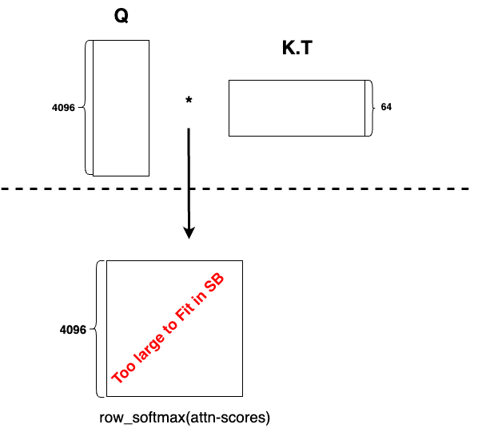
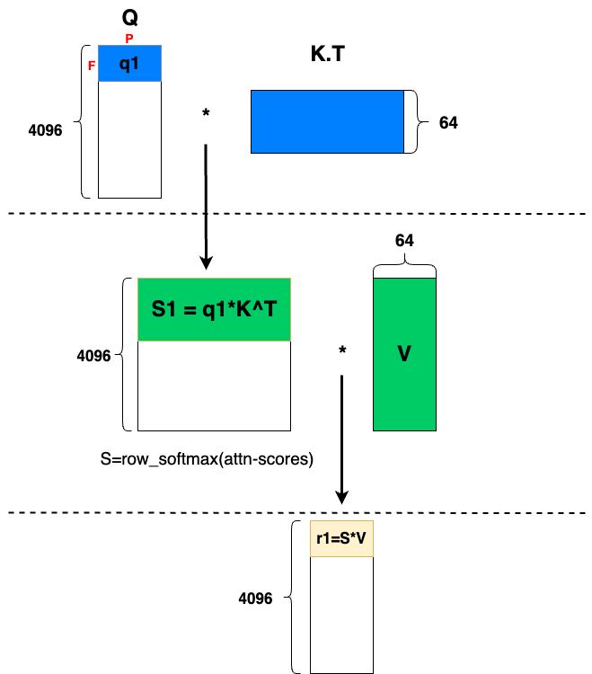
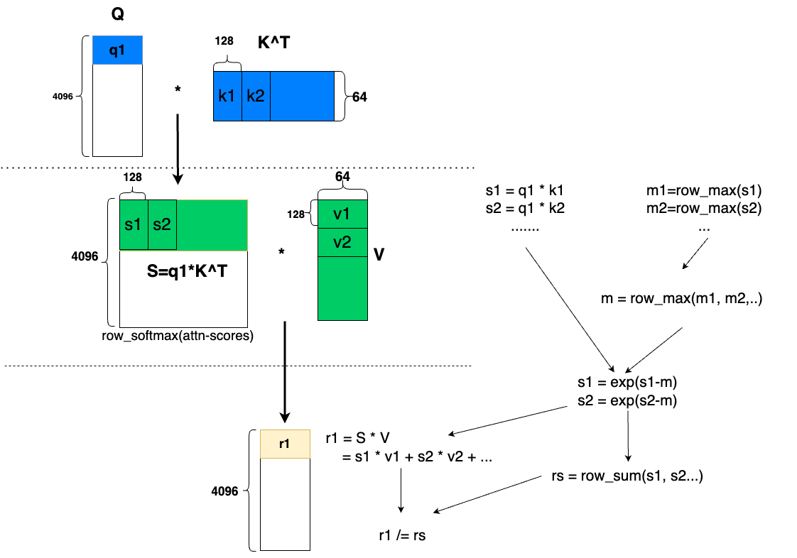

Fused Self Attention
====================

In this tutorial, we implement a kernel to perform the self attention seen in Stable Diffusion 2.1(SD2.1) from 
Stability AI. The model is available `here <https://huggingface.co/stabilityai/stable-diffusion-2-1-base>`__. 
In doing so, we learn about:

- The NKI syntax and programming model
- Layout, tiling, and memory management considerations when performing attention computation in NKI
- Fusion techniques for implementing efficient attention kernel

Background
----------
In SD2.1, the core computation of the self attention is the following. Given

- ``Q: (seqlen, d_head)``
- ``K: (seqlen, d_head)``
- ``V: (seqlen, d_head)``

where ``d_head`` and ``seqlen`` represents the head dimension and the seqlen length of 
the model. The batch dimensions have been removed for simplicity. We would like to compute, 

.. math::
    S = Q * K.T

    R = \text{softmax}(S)*V

When generating images of size ``512x512``, 

.. math::
    \text{seqlen} = 4096

    \text{d_head} = 64

We assume the data type of all inputs and outputs to be ``bfloat16``.

Naive Algorithm
---------------

.. _nki-fig-attn-naive:

    Naively multiple Q and K.T produces a large intermediate matrix

:numref:`Fig. %s <nki-fig-attn-naive>` shows the scenario if we compute the attention naively. 
We would first compute ``S=Q * K.T``, which has a size of ``[4096, 4096]``. Since the result 
is in ``bfloat16``, this intermediate matrix has a size of ``4096 * 4096 * 2 bytes = 32MB``, 
far exceeding the total space available in the SBUF(24MB on NeuronCore-v2). This means that we 
have to spill data from SBUF to HBM after S is computed, and load it back into SBUF when we compute 
softmax. This leads to lots of data movements between HBM and SBUF, degrading performance.

Fusion to Save SBUF Space
-------------------------
To avoid exhausting SBUF space, we would like to avoid computing the entirety of the multiplication 
of ``Q`` and ``K.T`` at once. One way is to fuse the softmax computation with the second
matrix multiplication.

.. _nki-fig-attn-fusion:

    We only need to compute `S1` to produce `r1`

As shown in the :numref:`Fig. %s <nki-fig-attn-fusion>`, in order to produce one block 
of the final result, we only need to compute the highlighted strip ``S1`` to compute 
the block ``r1`` in the final result.

Recall the TensorEngine on NeuronCore-v2 can process a maximum 128 contraction dimension, 
and the free dimension of the left hand side matrix has a maximum of 128. 
In the matrix multiplication ``S1 = q1 * K.T``, as labeled 
in :numref:`Fig. %s <nki-fig-attn-fusion>`, the size of the free dimension of ``q1`` should 
be 128 and ``S1`` has a shape of ``[128, 4096]``. Therefore, the size of ``S1`` 
is ``128 * 4096 * 2 bytes=1MB``, which is 32 times smaller than computing the full intermediate matrix.

We can then produce the entire result by looping over the tiles in Q.

Softmax implementation
----------------------

.. _nki-fig-attn-tiled:

    Softmax implementation

We need to perform softmax activation on ``Q*K.T``, the scheme is shown in the :numref:`Fig. %s <nki-fig-attn-tiled>`. 
We first compute partial row-wise maximum on each ``s_i`` tile to produce ``m1, m2...`` , then we find the 
global row-wise maximum ``m`` of ``S`` by computing row-wise maximum on ``m1, m2...`` . 
After subtracting ``m`` from ``s1, s2...`` , we compute the natural exponential and sum them together to find the 
row-wise sum ``rs``. 

In a regular softmax, we would divide each ``s1, s2...`` with ``rs``, however, here we 
can delay the division to after we compute r1 due to the associativity of scalar-matrix multiplication. 
Since ``rs`` is smaller than ``r1``, we save FLOPS by delaying the division. This is also a major 
optimization deployed in `FlashAttention-v2 <https://arxiv.org/abs/2307.08691>`__.

We finally multiply ``s_i`` and ``v_i``, and sum them together to get ``r1``. By looping 
over tiles in Q, we produce the entire result ``R``.

Compute kernel
--------------

.. nki_example:: ../examples/sd_attention/sd_attention_nki_kernels.py
    :language: python
    :linenos:
    :marker: NKI_EXAMPLE_31

Launching kernel and testing correctness
----------------------------------------

Below we write a reference PyTorch implementation of the attention and verify our
NKI kernel output against the reference in the same script as the kernel.

.. nki_example:: ../examples/sd_attention/sd_attention_torch.py
    :language: python
    :linenos:
    :marker: NKI_EXAMPLE_32

Download All Source Code
--------------------------

Click the links to download source code of the kernels and the testing code
discussed in this tutorial.

* Kernel Definition, accuracy testing and performance benchmark using baremetal mode: :download:`sd_attention_nki_kernels.py <../examples/sd_attention/sd_attention_nki_kernels.py>` 
* Use the kernel in PyTorch: :download:`sd_attention_torch.py <../examples/sd_attention/sd_attention_torch.py>`

You can also view the source code in the GitHub repository `nki_samples <https://github.com/aws-neuron/nki-samples/blob/main/src/tutorials/sd_attention/>`_

Example usage of the scripts:
^^^^^^^^^^^^^^^^^^^^^^^^^^^^^^^^^^^^^^

**Performance mode**

Check performance numbers of the attention kernel

.. code-block::

   python3 sd_attention_nki_kernels.py --mode perf

**Accuracy mode**

Run PyTorch reference implementation and check correctness:

.. code-block::

   python3 sd_attention_torch.py

Run barmetal mode and check correctness:

.. code-block::

   python3 sd_attention_nki_kernels.py --mode accuracy
