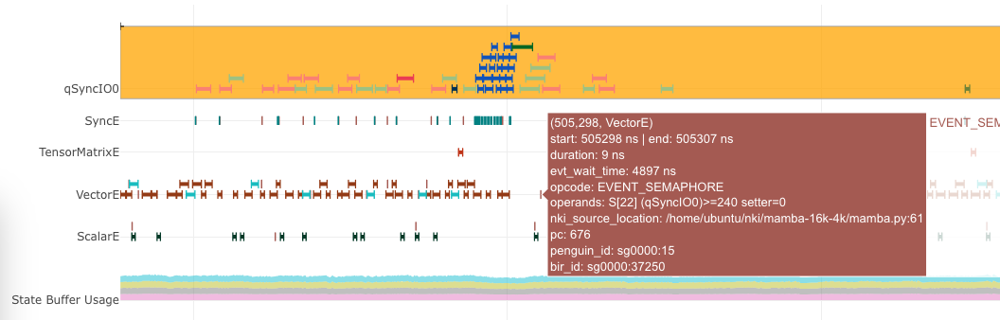

Fused Mamba
==============

In this tutorial, we implement a NKI kernel for the `Mamba Large Language Model <https://arxiv.org/abs/2312.00752>`_,
a State Space Model (SSM) which replaces
the attention of a regular Transformer model with a custom layer inspired by Recurrent Neural Networks. We will walk through
the core computation step-by-step and map it to NKI APIs to form a functional kernel. Next, by scaling the input shapes
of the kernel (both channel size and sequence length), we will iterate on a more hardware-efficient kernel implementation
to improve the scaling efficiency.

In this tutorial, we learn about:

* Mapping different vector operations efficiently to NeuronCore compute engines, such as associative scan and element-wise
  operations between tensors
* Leveraging data reuse and tiling to reduce excessive data movement and keep compute engines busy
* Using :doc:`neuron-profile <../neuron_profile_for_nki>` to identify performance bottlenecks and opportunities

PyTorch Reference Implementation
--------------------------------

Before jumping to NKI, let's examine the compute definition of a Mamba-v1 layer using the below PyTorch script
(``mamba_torch.py``):

.. literalinclude:: ../examples/fused_mamba/mamba_torch.py
   :language: python
   :linenos:
   :lines: 8-101

The input tensor shapes are as follows:

* ``delta: [batch, channels, seq_len]``
* ``u: [batch, channels, seq_len]``
* ``A: [channels, state_size]``
* ``B: [batch, state_size, seq_len]``
* ``C: [batch, state_size, seq_len]``

The key model parameters are:

* ``batch``\ : batch size of the model.
* ``seq_len``\ : sequence length of the model.
* ``channels``\ : hidden size of a token.
* ``state_size``\ : number of model states.

We use ``[batch=1, seq_len=512, channels = 256, state_size = 16]`` as a simple test case for initial performance evaluation.

Running the above Python script will compile the ``PyTorch`` compute graph using Neuron Compiler and generate a Neuron executable
file (NEFF) in the same directory. We can then profile the NEFF on a single NeuronCore using :doc:`neuron-profiler <../neuron_profile_for_nki>`.
Figure below is a screenshot of the profile. We see this initial PyTorch implementation takes **151.83 ms** to execute *on
device*.

.. _fig_mamba_torch_ref:

   Profile of Mamba PyTorch Implementation

Zooming into a portion of the profile, we notice the compute activities on different engines (TensorE/VectorE/ScalarE/GpSimdE)
are quite sparse compared to data movement activities (the qSyncIO0 and qVectorSpillReload rows):

.. _fig_mamba_torch_ref_zoomed:

   Profile of Mamba PyTorch Implementation (Zoomed-in)

In this seemingly “memory-bound” execution trace, the achieved DMA throughput is also extremely low, hovering around
0.33% utilization throughout execution. Therefore, we are stressing neither the compute nor the memory subsystem, hinting
the workload is running at low efficiency on the NeuronCore. In the rest of this tutorial, we will showcase how to re-write
the above computation using NKI to achieve a device execution latency of **172.93 usec** , which is a **878x speedup**
compared to the PyTorch reference implementation.

Mapping Mamba Layer to NeuronCore
---------------------------------

In this section, we will discuss how the computation can be mapped onto the NeuronCore architecture. We will also highlight
the importance of choosing appropriate data layouts to achieve good compute efficiency.

Recall we have the following input tensor shapes in device memory:

* ``delta: [batch_size, channels, seq_len]``
* ``u: [batch_size, channels, seq_len]``
* ``A: [channels, state_size]``
* ``B: [batch_size, state_size, seq_len]``
* ``C: [batch_size, state_size, seq_len]``

In fact, the above tensor layout has been chosen carefully based on the computation done in NeuronCore, which we will discuss
in more detail below.

In Mamba models, both ``seq_len`` and ``channels`` are typically in the thousands (such as ``seq_len=16K, channels=4K``),
while ``batch_size`` and ``state_size`` are much smaller by 2-3 order of magnitudes (such as ``batch_size=4, state_size=16``).
To simplify visualization of computation
on multi-dimensional tensors, let's hold ``batch`` and ``state_size`` dimension constant and focus on computation per batch
per state. Note, the ``batch_size`` dimension is considered a fully parallel axis in a Mamba layer, while ``state_size``
is only a partial parallel axis where results from different states will be accumulated together.

By extracting ``batch`` and ``state_size`` dimensions, we get the following input tensor shapes in device memory:

* ``delta_i: [channels, seq_len]``
* ``u_i:     [channels, seq_len]``
* ``A_i:     [channels]``
* ``B_i:     [seq_len]``
* ``C_i:     [seq_len]``

Next, let's visualize the data flow and computation using 2D matrices or vectors step-by-step.

Step 1: Element-wise multiplication of ``delta_i`` and ``A_i``
^^^^^^^^^^^^^^^^^^^^^^^^^^^^^^^^^^^^^^^^^^^^^^^^^^^^^^^^^^^^^^^^^^^^^^

We have the following PyTorch reference code for Step 1:

.. code-block::

   # delta[batch, channels, seq_len]
   # A    [channels, state_size]
   delta[:, :, None, :] * A[None, :, :, None]

   # Holding batch and state_size constant
   # delta_i: [channels, seq_len]
   # A_i:     [channels]
   delta_i[:, :] * A_i[:]

After the above transformation, the multiplication between ``delta_i`` and ``A_i`` involves a **broadcasting** across the
``seq_len`` dimension of ``delta_i``. In NKI, free-dimension broadcast can often be folded into the actual computation instruction
at no additional performance cost, while partition-dim broadcast often requires a separate instruction on TensorE (see TensorE
alternative use case in :ref:`Trainium/Inferentia2 Architecture Guide <arch_sec_tensor_engine_alternative_use>`).
As a result, we have two options for executing Step 1.

**Option 1: Map ``seq_len`` to free dimension.** Element-wise multiplication of ``delta_i`` and ``A_i`` on NeuronCore can
be done through :doc:`nisa.tensor_scalar <../api/generated/nki.isa.tensor_scalar>`
on either VectorE or ScalarE, which automatically broadcast ``A_i`` along the free dimension to match the ``seq_len`` dimension
in ``A_i``.

Note, the ``channels`` dimension is mapped to SBUF partition dimension. Since the input ``channels`` dimension has a size
of 256 in our initial setup, which exceeds the architectural limitation of ``nl.tile_size.pmax=128`` , we must **tile**
``delta_i`` in the ``channels`` dimension (tiled dimension denoted as ``channels_tiled``\ ) and feed one tile into ``nisa.tensor_scalar``
at a time. Figure below illustrates the computation done for Option 1.

.. _fig_mamba_step1_opt1:

   Step 1, Option 1: `nisa.tensor_scalar`

As an example, the associated NKI code for batch ``i_batch``\ , state ``i_state`` and tile ``i_tile_channels`` in ``channels``
is:

.. code-block::

   # Input shape in device memory matches the computation layout
   # Device memory layout:
   # delta_i: [channels, seq_len]
   # A_i:     [channels]

   # Computation layout in SBUF:
   # delta_i: [par_dim(channels), seq_len]
   # A_i:     [par_dim(channels)]

   deltaA_i = nisa.tensor_scalar(delta_i, op0=nl.multiply, operand0=A_i)

Note, with this compute layout option, the ``delta_i`` tensor shape ``[channels, seq_len]`` in device memory can be loaded
into SBUF efficiently with ``seq_len`` as the free dimension and fed into VectorE/ScalarE for computation. No extra transposes
are needed.

**Option 2: Map ``seq_len`` to partition dimension.** Alternatively, if we choose a transposed layout for ``delta_i`` in
SBUF for computation, we will need a partition-dimension broadcast of ``A_i`` using a separate instruction on TensorE
(``A_i.broadcast_to(...)``) and then a :doc:`nisa.tensor_tensor <../api/generated/nki.isa.tensor_tensor>`
operation between ``delta_i`` and the broadcast ``A_i`` on VectorE. As a reminder, we need to tile the ``seq_len`` dimension
to meet the tile size constraint ``nl.tile_size.pmax=128``. Figure below illustrates the computation done for Option 2.

.. _fig_mamba_step1_opt2:

   Step 1, Option 2: p-dim broadcast + `nisa.tensor_tensor`

The associated NKI code is as follows:

.. code-block::

   # Input shape in device memory does NOT match the computation layout
   # Device memory layout:
   # delta_i: [channels, seq_len]
   # A_i:     [channels]

   # Computation layout in SBUF:
   # delta_i: [par_dim(seq_len_tiled), channels]
   # A_i:     [par_dim(1), channels]

   A_i_bcast = A_i.broadcast_to((nl.tile_size.pmax, channels))
   deltaA_i = nisa.tensor_tensor(delta_i, A_i_bcast, op=ml.multiply)

Assuming the same ``delta_i`` device memory layout ``[channels, seq_len]``\ , before performing the ``nisa.tensor_tensor``
instruction, we will need to either:

* Do a regular load of ``delta_i`` into SBUF using :doc:`nl.load <../api/generated/nki.language.load>` and an explicit transpose on the loaded ``delta_i`` using
  ``nl.transpose`` to make ``seq_len`` lie in the free dimension, or
* Do a transposed load of ``delta_i`` using :doc:`nl.load_transpose2d <../api/generated/nki.language.load_transpose2d>`,
  which is significantly less efficient in memory bandwidth usage compared to ``nl.load``

If Option2 was chosen as the compute layout, we would have incentives to define the ``delta`` input tensor shape as ``[seq_len,
channels]`` in device memory instead.

From computation perspectives, Option 2 is less efficient than Option 1 because:

#. Option 2 needs an extra TensorE instruction performing partition dimension broadcast.
#. ``nisa.tensor_tensor`` is 2x slower than ``nisa.tensor_scalar`` for our input data type FP32 (see API doc for instruction
   cost estimates).

Therefore, for Step 1 only, Option 1 is the winner compared to Option 2. Let's continue with the rest of the steps to see
if we need to revise this selection due to surrounding operator layout preferences.

Step 2: Exponential of deltaA_i.
^^^^^^^^^^^^^^^^^^^^^^^^^^^^^^^^

Step 2 is evaluating exponential on ``deltaA_i`` from the previous step:

.. code-block::

   torch.exp(...)

In NeuronCore, evaluating an exponential function on a tensor is considered a scalar operation, which runs on ScalarE. This
operation can be invoked through :doc:`nl.exp <../api/generated/nki.language.exp>`
or :doc:`nisa.activation <../api/generated/nki.isa.activation>`.
However, ScalarE is able to perform a “pipelined multiply-add” on the input before evaluating a non-linear function (detail
see :ref:`Trainium/Inferentia2 Architecture Guide <arch_sec_scalar_pipelined_fma>`).
In other words, we can fold Step 1 (Option 1) ``nisa.tensor_scalar`` and Step 2 into a single ScalarE instruction at
no additional cost. This functionality is only exposed in the ``nisa.activation`` API. This folding is not feasible if we
chose Option 2 ``nisa.tensor_tensor`` in Step 1. Figure below illustrates our new execution plan to combine Step 1 and 2
into ``nisa.activation`` :

.. _fig_mamba_step2:

   Step 1&2: ``nisa.activation``

The associated NKI code is as follows:

.. code-block::

   # Input shape in device memory matches the computation layout
   deltaA_i = nisa.activation(op=nl.exp, data=delta_i, scale=A_i)

Step 3: Element-wise multiplication of delta_i, B_i and u_i.
^^^^^^^^^^^^^^^^^^^^^^^^^^^^^^^^^^^^^^^^^^^^^^^^^^^^^^^^^^^^

PyTorch reference code for Step 3 is:

.. code-block::

   # delta[batch, channels, seq_len]
   # B:   [batch, state_size, seq_len]
   # u:   [batch, channels, seq_len]
   delta[:, :, None, :] * B[:, None, :, :] * u[:, :, None, :]

   # Holding batch and state_size constant
   # delta_i: [channels, seq_len]
   # B_i:     [seq_len]
   # u_i:     [channels, seq_len]
   delta_i[:, :] * B_i[None, :] * u_i[:, :]

This step involves similar compute layout and instruction choices as Step 1:

* ``channels`` is either partition or free dimension for both ``delta_i`` and ``u_i``
* multiplication with ``B_i`` is either through ``nisa.tensor_tensor`` or ``nisa.tensor_scalar``

Since we preferred Step 1 to consume ``delta_i`` using ``channels`` as the partition dimension in previous steps, it is
wise to follow the same layout choice here for ``delta_i`` to avoid any transposes. Given this layout choice, the multiplication
with ``B_i`` will have to be a ``nisa.tensor_tensor``. Figure below visualizes the computation in Step 3:

.. _fig_mamba_step3:

   Step 3: p-dim broadcast + 2x ``nisa.tensor_tensor``

The associated NKI code is as follows:

.. code-block::

   # Input shape in device memory does NOT match the computation layout
   # Device memory layout:
   # delta_i: [channels, seq_len]
   # u_i:     [channels, seq_len]
   # B_i:     [seq_len]

   # Computation layout in SBUF:
   # delta_i: [par_dim(channels_tiled), seq_len]
   # u_i:     [par_dim(channels_tiled), seq_len]
   # B_i:     [par_dim(1), seq_len]

   deltaU_i = nisa.tensor_tensor(delta_i, u_i, op=ml.multiply)
   B_i_bcast = B_i.broadcast_to((nl.tile_size.pmax, seq_len))
   deltaBu_i = nisa.tensor_tensor(deltaU_i, B_i_bcast, op=ml.multiply)

Step 4: Associative scan between deltaA_i and deltaBu_i
^^^^^^^^^^^^^^^^^^^^^^^^^^^^^^^^^^^^^^^^^^^^^^^^^^^^^^^

In this step, we use an associative scan operator between ``deltaA`` and ``deltaBu`` to aggregate information across time
sequentially (sequence length, e.g. sequence of tokens), from the past to the present. Here is a PyTorch reference implementation:

.. code-block::

   # deltaA:   [batch_size, channels, state_size, seq_len]
   # deltaB_u: [batch_size, channels, state_size, seq_len]
   out = torch.empty(batch_size, channels, state_size, seq_len,
                     device=deltaA.device, dtype=deltaA.dtype)

   for i in range(seq_len):
       # starting state is 0
       prev_state = out[..., i - 1] if i > 0 else 0
       # multiply deltaA by the previous time step state and then add deltaB_u
       out[..., i] = deltaA[..., i] * prev_state + deltaB_u[..., i]

By holding batch and state_size dimensions constant, we get ``deltaA_i`` and ``deltaBu_i`` both with
``[channels_tiled, seq_len]``, where ``channels_tiled`` is the partition dimension.
The associative scan between these two tile shapes can
be implemented in NKI naively through the following loop:

.. code-block::

   scan_i = nl.ndarray((channels_tiled, seq_len), ...)

   # Peeling the first iteration out, which is
   # equivalent to loop iterator dependent control flow within the loop
   scan_i[0:channels_tiled, 0] = deltaBu[0:channels_tiled, 0]

   for i in nl.sequential_range(seq_len - 1):
      scan_i[0:channels_tiled, i+1] =    deltaA_i[0:channels_tiled, i+1] * scan_i[0:channels_tiled, i]
                                       + deltaBu_i[0:channels_tiled, i+1]

Within the loop, the current implementation invokes one instruction for multiplication and another for addition. Since both
instructions are performed among tiles of shape ``[channels_tiled, 1]``, we can combine
these two instructions using :doc:`nisa.tensor_scalar <../api/generated/nki.isa.tensor_scalar>`
which supports two operators in a pipelined fashion within an instruction at the same cost as a single operator. Below is
a new implementation that could provide 2x speedup compared to the above:

.. code-block::

   scan_i = nl.ndarray((channels_tiled, seq_len), dtype=deltaA.dtype, buffer=nl.sbuf)
   scan_i[0:channels_tiled, 0] = deltaBu[i_p, 0]

   for i in nl.sequential_range(seq_len - 1):
      scan_i[0:channels_tiled, i+1] = nisa.tensor_scalar(
           deltaA[0:channels_tiled, i+1],
           op0=nl.multiply,
           operand0=scan_i[0:channels_tiled, i],
           op1=nl.add,
           operand1=deltaBu[0:channels_tiled, i+1])

However, the above loop nest will turn into ``seq_len`` many instructions with input tiles that have a single element per
partition in SBUF. In addition, every ``nisa.tensor_scalar`` instruction has a data dependency on the output of the previous
instruction. As discussed in the :ref:`Trainium/Inferentia2 Architecture Guide <arch_sec_vector_engine_perf>`,
these two traits combined in the instruction sequence is considered extremely *inefficient* on ScalarE/VectorE, where
the static instruction overhead instead of the useful execution time would be dominating the engine timeline.

Conveniently, NKI exposes another instruction :doc:`nisa.tensor_tensor_scan <../api/generated/nki.isa.tensor_tensor_scan>`
on VectorE, which can perform the above loop nest in a *single* instruction by caching the intermediate scan result from
the previous time step internally in VectorE without going through SBUF.

.. code-block::

   scan_i = nisa.tensor_tensor_scan(deltaA_i, deltaBu_i, initial=0,
                                    op0=np.multiply, op1=np.add)

Note, the shape of ``scan_i`` is exactly the same as the input ``deltaA_i/deltaBu_i``\ : ``[channels_tiled, seq_len]``.

Step 5: Element-wise multiplication of C_i and scan_i
^^^^^^^^^^^^^^^^^^^^^^^^^^^^^^^^^^^^^^^^^^^^^^^^^^^^^

The PyTorch reference implementation is:

.. code-block::

   # scan_res: [batch_size, channels, state_size, seq_len]
   # C:        [batch_size, state_size, seq_len]
   scanC = C[:, None, :, :] * scan_res

   # Holding batch and state constant
   # scan_i: [channels_tiled, seq_len]
   # C_i:    [seq_len]
   scanC_i = C_i[None, :] * scan_i[:, :]

You know the drill - Since ``channels_tiled`` is the partition dimension in ``scan_i`` from the previous step, we need to
perform a partition-dimension broadcast on ``C_i`` before invoking ``nisa.tensor_tensor``\ :

.. _fig_mamba_step5:

   Step 5: p-dim broadcast + ``nisa.tensor_tensor``

The corresponding NKI code is:

.. code-block::

   C_i_bcast = C_i.broadcast((nl.tile_size.pmax, seq_len))
   scanC_i = nisa.tensor_tensor(scan_i, C_i_bcast, op=ml.multiply)

Step 6: Accumulation of scanC_i along ``state_size`` dimension
^^^^^^^^^^^^^^^^^^^^^^^^^^^^^^^^^^^^^^^^^^^^^^^^^^^^^^^^^^^^^^^^^^

So far in Step 1-5, all the computation is logically parallel across the ``state_size`` dimension in a Mamba layer. The
next step of computation introduces data dependency along the ``state_size`` dimension for the first time. The PyTorch reference
implementation is:

.. code-block::

   # scan_res: [batch_size, channels, state_size, seq_len]
   # C:        [batch_size, state_size, seq_len]
   # -2 dim is state_size
   scanC.sum(dim=-2)

   # Holding batch constant only.
   # scan_i_states: [channels_tiled, state_size, seq_len]
   (scanC_i).sum(dim=-2)

In NKI, we can accumulate the ``scanC_i`` results across states element-wise using ``state_size-1`` number of ``nisa.tensor_tensor``
instructions:

.. _fig_mamba_step6:

   Step 6: ``state_size-1`` number of ``nisa.tensor_tensor``

Since we will be looping over different states, we can also declare an empty accumulation buffer ``scanC_accum`` of shape
``[channels_tiled, seq_len]`` outside of the loop structure and accumulate into this buffer at the end of the every loop
iteration using ``+=`` operator. The use of a single accumulation buffer avoids allocating memory for ``scanC_i`` across
all states in SBUF. The corresponding NKI code is:

.. code-block::

   scanC_accum = nl.zeros(...)

   for i_state in nl.affine_range(state_size):
       scanC_i = ...
       scanC_accum += scanC_i

Initial NKI Kernel
------------------

Putting all the pieces together from the previous section, we can arrive at the below kernel implementation ``mamba_v1``:

.. literalinclude:: ../examples/fused_mamba/mamba_nki_kernels.py
   :language: python
   :linenos:
   :lines: 7-10, 15-86

In the above code example,

* We have three levels of loop nests. From the outer-most to inner-most:
    * Iterating over ``batch``: Different batch samples perform completely different computation. ``A`` tensor is the only
      input parameter that is shared among batch samples.
    * Iterating over ``state_size``: Different states perform parallel computation until Step 6 as discussed in the previous
      section. Both ``delta`` and ``u`` tensors are shared across different states.
    * Iterating over ``channels``: This is the most-inner dimension where we tile the input channels dimension into ``nl.tile_size.pmax=128``
      chunks. Both ``B`` and ``C`` tensors are shared across different ``channels``.
* The kernel above assumes channels is a multiple of ``nl.tile_size.pmax=128`` . We can relax this by adding a ``mask``
  parameter in all the NKI API call in the kernel. To simplify the code example, we omit this change.
  See :ref:`NKI API Masking <nki-mask>` for more information.
* We declare an empty intermediate tensor ``scanC_accum`` to hold partial summation from every state.
* Within the inner loop, we process data for ``nl.tile_size.pmax=128`` channels for one batch sample in one state.
    * We use the :ref:`slicing syntax <nki-basic-tensor-indexing>`
      to index a tensor. For example, ``delta[i_batch, channel_start:channel_start+channel_psize, 0:seq_len]`` grabs data from
      the input ``delta`` tensor for the current range of channels at the current batch sample.
    * Note, in tensor slicing, the first index dimension from the left with a slicing range will be chosen as the partition
      dimension. When loading ``B``, since we intend to load only one state's worth of data into one partition of SBUF (discussed
      in Step 3), we need to explicitly slice the state using: ``nl.load(B[i_batch, **i_state:i_state+1**, 0:seq_len])``. Otherwise,
      ``nl.load(B[i_batch, **i_state**, 0:seq_len])`` will treat ``seq_len`` as the partition dimension, which is not what we
      planned for in Step 3 and would also trigger a NKI compilation error since ``seq_len`` exceeds ``nl.tile_size.pmax``.
    * We accumulate partial ``scanC_i`` results into the accumulation buffer using the ``+=`` operator. This creates a loop-carried
      dependency for ``scanC_accum`` on the ``i_state`` loop.

Performance Check
^^^^^^^^^^^^^^^^^

Let's re-run neuron-profile on the above NKI kernel:

.. _fig_mamba_v1_profile:

   Profile of initial Mamba kernel implementation ``mamba_v1``

Hooray! This NKI kernel implementation now takes ``172.93`` usec, which is **878x** speedup compared to the reference PyTorch
implementation. Based on the profile, VectorE is the busiest compute engine in the Mamba layer. This makes sense because
the bulk of computation in the kernel is in ``nisa.tensor_tensor``\ , which can only run on VectorE.

Therefore, our goal is to keep VectorE as busy as possible throughout execution. Note, every NEFF execution involves certain
start-up and tear-down overhead. We can use the ``Selection Summary`` feature in ``neuron-profile`` to find out the percentage
of time VectorE is busy during the actual execution period:

.. _fig_mamba_v1_profile_zoomed:

   Profile of initial Mamba kernel implementation ``mamba_v1`` (zoomed in)

As indicated by the above profile, VectorE is active over **98.71%** of the time, which is rather impressive. However,
remember we used small input shapes as a toy example to get started: ``[batch=1, seq_len=512, channels = 256, n = 16]``.
Next, let's increase the ``channels`` and ``seq_len`` dimensions one by one and observe how VectorE efficiency changes.

Increasing input ``channels`` size
--------------------------------------

Let's increase the size of ``channels`` by 16x, from 256 to a more realistic value 4096. We obtain the following profile:

.. _fig_mamba_v1_profile_4k_chan:

   Profile of ``mamba_v1`` kernel with 4K channels

The new device execution time with increased channels is now **2.34 ms**. We can see that VectorE active duration has
dropped to **92.16%** during the core execution period, compared to **98.71%** previously with the toy example. Let’s zoom
into an arbitrary region of the profile to see what could be causing VectorE to go idle:

.. _fig_mamba_v1_profile_4k_chan_sem:

   ``mamba_v1`` kernel blocking on input tensor loading

By identifying a gap where VectorE is completely idle, we can hover over the first executed instruction after the gap
to find out what's the reason for idleness in the instruction semaphore wait condition. In the above screenshot, the instruction
is pending on ``S[22]`` to reach a value of 240, which is set by ``qSyncIO0`` activities. This means VectorE has been waiting
for input tensors to be loaded before performing more computation. If you hover over ``qSyncIO0`` activities during the
VectorE idle period, you can also see the exact input tensor name defined in NKI being loaded in the DMA:

.. _fig_mamba_v1_profile_4k_chan_load_var:

   DMA loading tensor u in ``mamba_v1`` profile

We can find similar VectorE gaps through the execution trace. At this point, we can conclude one of the reasons why we have
a lower VectorE active time percentage is due to *blocking* input tensor loading (``nl.load``) activities in the DMA.
Next, let's spend some time analyzing DMA efficiency.

Zooming out, we can make several observations. First, we see two orange boxes around the ``qSyncIO0`` row. Hovering over
the top left corners of the boxes shows two similar performance warnings for loading IO tensors:

.. _fig_mamba_v1_profile_4k_chan_reload:

   Performance warnings for reloading ``u`` and ``delta`` tensors

This indicates we reload both the input ``u`` and ``delta`` tensors around 7 times. This could be inevitable
when we don't have sufficient on-chip memory (SBUF) to allow full reuse of the input data tensors. However, the profiler
shows we are only hitting around 50% capacity usage throughout execution:

.. _fig_mamba_v1_profile_4k_chan_sb:

   Low SBUF usage

Therefore, the input tensor reloading is likely not justified, and we should investigate whether we can optimize the
NKI kernel to avoid it.

.. _tut_mamba_loop_reordering:

Minimizing data reloading by loop reordering
^^^^^^^^^^^^^^^^^^^^^^^^^^^^^^^^^^^^^^^^^^^^

To understand why delta and u are being reloaded, let's revisit our input tensor shapes:

* ``delta: [batch_size, channels, seq_len]``
* ``u:     [batch_size, channels, seq_len]``
* ``A:     [channels, state_size]``
* ``B:     [batch_size, state_size, seq_len]``
* ``C:     [batch_size, state_size, seq_len]``

Let's hold ``batch_size`` constant since the majority of input tensors have completely different slices for different batch
samples:

* ``delta: [channels, seq_len]``
* ``u:     [channels, seq_len]``
* ``A:     [channels, state_size]``
* ``B:     [state_size, seq_len]``
* ``C:     [state_size, seq_len]``

``delta`` and ``u`` tensors have the same shape with ``channels`` as the outer dimensions, while ``B`` and ``C`` have the
same shape with ``state_size`` as the outer dimension. All four of these input tensors have ``seq_len`` as the inner dimension.
Therefore, we say ``delta/u`` is reused across different states, while ``B/C`` are reused across different channels. Given
this conflicting reuse dimensions, we further say it is more important to **prioritize reuse of ``delta/u``** because
the expected size of ``channels`` is much higher than ``state_size``:

* ``state_size`` is now 16 and typically stay small
* ``channels`` is now 4096 and typically in the thousands

In NKI, we can prioritize ``delta/u`` reuse through loop ordering. Recall in the initial NKI kernel implementation, we have
the following inner loops:

.. code-block::

   ...
   for i_state in nl.affine_range(state_size):
       for i_channel_tile in nl.affine_range(n_channel_tile):
           # step 1-6
   ...

Since these two loops are executed serially within a single NeuronCore, the loop instances will be unrolled by Neuron Compiler.
With the channel dimension in the fastest dimension, we will need to load ``delta/u`` across all channels in the first state,
and then likely reload them again in the later states due to a large total memory size in ``delta`` and ``u`` (16MB in this
case).

To prioritize reuse of ``delta/u``\ , we should reorder the above loop nests. To further enforce the reuse, we can hoist
the ``nl.load`` calls for ``delta/u`` outside of the ``i_state`` inner loop:

.. code-block::

   ...
   for i_channel_tile in nl.affine_range(n_channel_tile):
       delta_i = nl.load(...)
       u_i = nl.load(...)

       for i_state in nl.affine_range(state_size):
           # step 1-6
   ...

As a side effect of this loop re-ordering, we can also spot a loop fusion opportunity since we have two ``i_channel_tile``
loop nests at the same level now:

.. code-block::

   scanC_accum = nl.zeros((n_channel_tile, nl.par_dim(channel_psize), seq_len), ...)
   ...

   # First i_channel_tile loop
   for i_channel_tile in nl.affine_range(n_channel_tile):
       delta_i = nl.load(...)
       u_i = nl.load(...)

       for i_state in nl.affine_range(state_size):
           # step 1-6

   # Second i_channel_tile loop
   for i_channel_tile in nl.affine_range(n_channel_tile):
       nl.store(..., scanC_accum[i_channel_tile, 0:channel_psize, 0:seq_len])

   ...

By fusing the two ``i_channel_tile`` loop nests into a single loop nest, we can pull the declaration of ``scanC_accum``
inside the ``i_channel_tile`` loop and further reduce the ``scanC_accum`` size requirement by a factor of ``n_channel_tile``
:

.. code-block::

   ...

   # First i_channel_tile loop
   for i_channel_tile in nl.affine_range(n_channel_tile):
       scanC_accum = nl.zeros((nl.par_dim(channel_psize), seq_len), ...)

       delta_i = nl.load(...)
       u_i = nl.load(...)

       for i_state in nl.affine_range(state_size):
           # step 1-6

       nl.store(..., scanC_accum[i_channel_tile, 0:channel_psize, 0:seq_len])

   ...

Let's modify our initial NKI kernel implementation accordingly to get ``mamba_v2``:

.. literalinclude:: ../examples/fused_mamba/mamba_nki_kernels.py
   :language: python
   :linenos:
   :lines: 88-155

We recapture the profile for the new kernel implementation:

.. _fig_mamba_v2:

   Profile of ``mamba_v2`` kernel with loop reordering optimization

The device execution time is now **1.61 ms**, which is a **31%** reduction in latency compared to our initial kernel implementation.
We can also see VectorE active duration is back up to 99.63% and the performance warnings on input tensor reloading are
now gone. In case you are curious, the above loop reordering optimization alone provides around 30% of latency reduction,
while the loop fusion optimization contributes the remaining 1% performance boost. This makes sense because the loop reordering
addresses our key performance concern around input data reloading, while reducing intermediate tensor size is only a nice-to-have
given we were quite low on SBUF usage to begin with.

Increasing input ``seq_len`` size
-------------------------------------

Next, let's increase the input ``seq_len`` by **16x**, from 512 to 8192 and recompile the above NKI kernel. Below is the
associated performance profile:

.. _fig_mamba_v2_8K_seqlen:

   Profile of ``mamba_v2`` kernel with 8K seq_len

The new profile now takes **53.33 ms**, which is **33x longer** than the previous profile. VectorE active duration has
dropped down to a new low: 58.93%. Compared to the profile captured with a smaller ``seq_len``, we notice new DMA activity
rows ``qSyncSpillReload0`` and ``qVectorSpillReload0`` , which are associated with data movement traffic for intermediate
data spill from SBUF into device memory or reload back to SBUF. Zooming into a smaller portion of the profile:

.. _fig_mamba_v2_8K_seqlen_zoomed:

   Poor overlap of computation and data movement

We can see VectorE enters idle states due to a blocking semaphore wait for ``qSyncSpillReload0`` activities,
which indicates the extra spill/reload is indeed degrading overall computation performance. In addition, we can see low
SBUF usage peaking at merely 50%. Computation and data movement are also not overlapped properly, leading to low average
utilization in both compute engines and DMA throughput in the overall timeline.

Intuitively, increasing ``seq_len`` of the kernel increases the active tile sizes of input and intermediate tensors in the
free dimension, which could cause severe fragmentations in SBUF and excessive data movements to spill/reload tensors in
SBUF. To mitigate these inefficiencies, we must **tile** the ``seq_len`` dimension in our NKI kernel through a new loop
level.

.. _tut_mamba_tiling:

Mitigate spilling by tiling ``seq_len``
^^^^^^^^^^^^^^^^^^^^^^^^^^^^^^^^^^^^^^^^^^^

We have **three** key considerations when adding this new loop level:

1. tile size selection,
2. loop-carried dependency handling
3. loop ordering with other loop nests.

**Tile size of ``seq_len``.** Since previously with ``seq_len=512`` in our toy example, we were able to achieve close to
100% VectorE utilization, let's set the tile size ``seq_len_fsize`` to 512 as a starting point. We can revisit this decision
as needed once we obtain a new profile.

**Loop-carried dependency.** Splitting ``seq_len`` into chunks is straightforward for all computation steps except for Step
4. In the associative scan operation, the next loop iteration requires results from the previous iteration for computation.
As a result, we will introduce another loop-carried dependency here with the scan tiles. This dependency can be handled
through the ``initial`` input parameter:

.. code-block::

   scan_init = nl.zeros((channel_psize, 1), ...)

   for i_seq_len_tile in static_range(seq_len // seq_len_fsize):
       scan_i = nisa.tensor_tensor_scan(deltaA, deltaBu, initial=scan_init,
                                             op0=np.multiply, op1=np.add)
       scan_init = scan_i[0:channel_psize, seq_len_fsize-1]

Note, we choose to use ``static_range`` instead of ``affine_range`` due to the new loop-carried dependencies.

**Loop ordering.** Recall from our latest NKI kernel implementation, we have the following loop nest:

.. code-block::

   ...
   for i_batch in nl.affine_range(batch_size):

       for i_channel_tile in nl.affine_range(n_channel_tile):
           scanC_accum = nl.zeros((nl.par_dim(channel_psize), **seq_len**), ...)

           delta_i = nl.load(delta[i_batch, channel_start:channel_start+channel_psize, 0:**seq_len**])
           u_i = nl.load(u[i_batch, channel_start:channel_start+channel_psize, 0:**seq_len**])

           for i_state in nl.affine_range(state_size):
               A_i = nl.load(A[channel_start:channel_start+channel_psize, i_state])

               B_i = nl.load(B[i_batch, i_state:i_state+1, 0:**seq_len**])
               C_i = nl.load(C[i_batch, i_state:i_state+1, 0:**seq_len**])

               deltaA = ...
               deltaBu = ...
               scanC = ...
               ...
               scanC_accum += ...

            nl.store(..., scanC_accum[i_channel_tile, 0:channel_psize, 0:**seq_len**])
   ...

Let's denote the above loop ordering as ``[batch_size, n_channel_tile, state_size]``\ , and our key question here is where
to insert ``seq_len`` in this list.

Appending ``seq_len`` to the above list, that is, making ``seq_len`` the new inner-most loop, would involve the least amount
of code changes to our current NKI kernel. However, it will lead to the least amount of SBUF usage reduction, since this
loop ordering won't be tiling ``scanC_accum``, ``delta_i`` and ``u_i`` tensors. Given ``seq_len=8192`` and FP32 data types,
these three tensors will occupy 8192\ *4B*\ 3 = 96 KiB/partition, half of the available SBUF capacity. Let's go ahead and
experiment this loop ordering in a new kernel ``mamba_v3``:

.. _fig_mamba_v3:

   Profile of ``mamba_v3`` kernel with seq_len tiling optimization

With the above profile, the kernel now takes **27.8 ms**\ , which is **48%** reduction in latency compared to no ``seq_len``
tiling. VectorE is now 94.85% active, and we no longer have spilling related DMA activities.

Finally, since the key advantage of Mamba compared to Transformer models is Mamba's computation and latency should scale
linearly with respect to ``seq_len``, instead of quadratically in Transformers, let's plot the measured kernel latencies across different
``seq_len`` up to 8K (what we have optimized so far) and compare it against “perfect latencies” assuming linear scaling
from ``seq_len=512``. We evaluate scaling efficiency using ``perfect latency / measured latency``,
which is a higher the better metric. Finally, to showcase the importance of the last seq_len tiling optimization for scaling seq_len,
we also compare scaling efficiency for ``mamba_v2`` (no seq_len tiling) and ``mamba_v3`` (seq_len tiling).

.. list-table::
   :header-rows: 1

   * - seq_len
     - Perfect Latency (ms)
     - mamba_v2 Measured Latency (ms)
     - mamba_v2 Scaling Efficiency
     - mamba_v3 Measured Latency (ms)
     - mamba_v3 Scaling Efficiency
   * - 512
     - N/A
     - 1.6
     - N/A
     - 1.6
     - N/A
   * - 1024
     - 3.2
     - 4.4
     - 72.73%
     - 3.3
     - 96.97%
   * - 2048
     - 6.4
     - 8.9
     - 71.91%
     - 6.6
     - 96.97%
   * - 3072
     - 9.6
     - 13.1
     - 73.28%
     - 10.1
     - 95.05%
   * - 4096
     - 12.8
     - 17.6
     - 72.73%
     - 13.3
     - 96.24%
   * - 5120
     - 16
     - 23.7
     - 67.51%
     - 17.3
     - 92.49%
   * - 6144
     - 19.2
     - 27.5
     - 69.82%
     - 19.6
     - 97.96%
   * - 7168
     - 22.4
     - 41.3
     - 54.24%
     - 24.2
     - 92.56%
   * - 8192
     - 25.6
     - 52.2
     - 49.04%
     - 27.8
     - 92.09%

The above data shows the last NKI kernel implementation ``mamba_v3`` can reach 90%+ scaling efficiency up to 8K ``seq_len``.
To support even larger ``seq_len``, we will need more aggressive tiling by pulling the ``seq_len`` loop level further
towards the outer-loop level to tile more input/intermediate tensors to keep spilling low and VectorE busy.

Download All Source Code
--------------------------

Click the links to download source code of the kernels and the testing code
discussed in this tutorial.

* PyTorch reference implementation: :download:`mamba_torch.py <../examples/fused_mamba/mamba_torch.py>`
* Three versions of NKI kernels: :download:`mamba_nki_kernels.py <../examples/fused_mamba/mamba_nki_kernels.py>`

You can also view the source code in the Github repository `nki_samples <https://github.com/aws-neuron/nki-samples/blob/main/src/tutorials/fused_mamba/>`_

Example usage of the scripts:
^^^^^^^^^^^^^^^^^^^^^^^^^^^^^^^^^^^^^^

**Performance mode**

Run PyTorch reference implementation to generate a NEFF for profiling:

.. code-block::

   python3 mamba_torch.py --mode perf

Check performance numbers of mamba_v1/mamba_v2/mamba_v3:

.. code-block::

   python3 mamba_nki_kernels.py --mode perf --version v1 v2 v3 --batch 1 --seq_len 2048 --channels 512 --state_size 16

**Accuracy mode**

Check mamba_v1 NKI kernel accuracy against PyTorch implementation:

.. code-block::

   python3 mamba_torch.py --mode accuracy

Check optimized Mamba kernel (mamba_v2, mamba_v3) accuracy against mamba_v1:

.. code-block::

   python3 mamba_nki_kernels.py --mode accuracy --version v1 v2 v3 --batch 1 --seq_len 2048 --channels 512 --state_size 16
