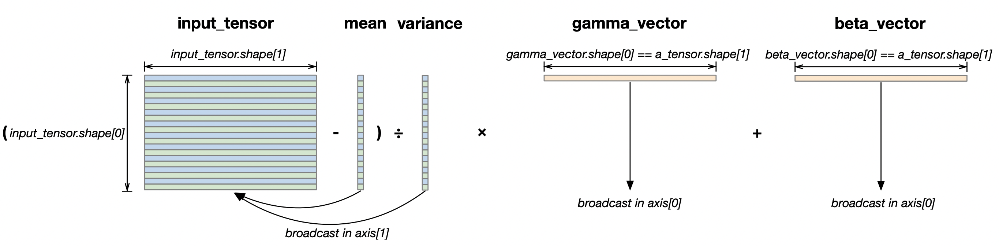

LayerNorm
=============

In this tutorial, we implement a kernel to perform LayerNorm of a **2D tensor**, 
as described in `Layer Normalization <https://arxiv.org/abs/1607.06450v1.pdf>`__.
LayerNorm is a common normalization mechanism used in Transformer models, similar to :doc:`RMSNorm <./rmsnorm>`. 
However, LayerNorm requires more vector operations to optimize compute efficiency in Vector Engine.
In doing so, we will revisit the key concepts we learned in the :doc:`RMSNorm <./rmsnorm>` and additionally learn about:

- Using nki.isa APIs to efficiently compute mean and variance, and minimize the number of traversals over input data by combining multiple vector instructions into one
- Take surrounding compute into consideration when deciding tensor layouts

Before diving into LayerNorm for a 2D tensor, let's go over the LayerNorm operator for a
**1D vector** ``y`` defined as below:

.. math::
    y = \frac{x - \mathbb{E}[x]}{\sqrt{\mathrm{var}[x] + \epsilon}} * \gamma  + \beta

The parameters are:

- :math:`x`: Input 1D vector
- :math:`y`: Output 1D vector, same shape as x
- :math:`\mathbb{E}[x]`: Mean of x
- :math:`\mathrm{var}[x]`: Variance of x
- :math:`\epsilon` : A small constant scalar for numerical stability
- :math:`\gamma`, :math:`\beta`: LayerNorm affine transform parameters, each has the same shape as x

In Transformer models, we typically need to perform LayerNorm on a 2D input tensor
(with shape: ``[sequence_length, hidden_size]``), 
where the first dimension is sequence_length long corresponding to the number of tokens currently being processed, and the second dimension is the embedding dimension of each token. 

Different tokens (i.e., rows in the ``[sequence_length, hidden_size]`` 2D vector) undergo different 1D LayerNorm independently. 
Therefore, we need to calculate different mean and variance for different rows and broadcast (i.e., share) the same :math:`\gamma` , :math:`\beta` parameters across the rows. 

Figure below visualizes the tensor shape involved in 2D-LayerNorm, 
where ``input_tensor`` is 2D input vector and ``gamma_vector`` and ``beta_vector`` are affine transform parameters:

.. _nki-fig-layernorm:

   LayerNorm tensor shapes

Compared to :doc:`RMSNorm <./rmsnorm>`, LayerNorm requires calculations of mean and variance, instead of simple square and summation. 
Also, LayerNorm performs two instances of free-axis broadcast and two instances of partition-axis broadcast, while :doc:`RMSNorm <./rmsnorm>` requires one instance of each. 
Therefore, LayerNorm involves way more computation (vector operations in particular) than :doc:`RMSNorm <./rmsnorm>`. 

Implement NKI kernel
--------------------

Next, we will present two versions of LayerNorm implementation, starting from a naive version using nki.language APIs and ending with an optimized version using nki.isa APIs.

Version 1: nki.language APIs only
~~~~~~~~~~~~~~~~~~~~~~~~~~~~~~~~~~

.. literalinclude:: ../examples/layernorm/layernorm_nki_kernel.py
   :language: python
   :linenos:
   :lines: 7-11, 16-59

* To adhere to NKI's tile-size considerations (:ref:`Tile Size Considerations <nki-tile-size>`),
  we limit the partition axis size of ``input_tensor`` tile to be 128 (nl.tile_size.pmax).
* Load ``gamma`` and ``beta``, and perform the partition-axis broadcast:
    * The multiplication with ``shift_scale_tensor`` requires broadcasting of ``gamma`` and ``beta`` across all partitions(``broadcast_to()`` API)
* The trip count of the compute loop is ``math.ceil(input_tensor.shape[0]/nl.tile_size.pmax)``.
  In cases where ``input_tensor.shape[0]`` is not a multiple of nl.tile_size.pmax, we can disable
  ineffectual data movement or compute in the last iteration using the ``mask`` field.
* Within the compute loop:
    * We load one tile of ``input_tensor`` with shape ``(nl.tile_size.pmax, input_tensor.shape[1])``
      using ``nl.load`` API. We guard the loading boundary by specifying
      ``mask=(i * nl.tile_size.pmax + i_p_io < input_tensor.shape[0])``, which ensures we don't access out-of-bound
      memory when the number of rows in ``input_tensor`` is not a multiple of nl.tile_size.pmax.
    * Compute the ``mean`` and ``variance`` using :doc:`nki.language.mean <../api/generated/nki.language.mean>`
    * Normalize one tile of ``input_tensor`` using ``mean`` and ``variance``. The ``variance`` is preprocessed using :doc:`nki.language.rsqrt <../api/generated/nki.language.rsqrt>`
    * Scale the normalized tile using `gamma` and add `beta`
    * Finally, we store the normalized tile back into HBM using the
      :doc:`nl.store <../api/generated/nki.language.store>` API.
      We guard the store boundary similar to load boundary using the ``mask`` field.

Next, we will optimize the above implementation using ``nki.isa`` APIs in version 2

Version 2: ``nki.isa`` APIs to calculate mean/variance and perform shift/scale
~~~~~~~~~~~~~~~~~~~~~~~~~~~~~~~~~~~~~~~~~~~~~~~~~~~~~~~~~~~~~~~~~~~~~~~~~~~~~~~~~

.. literalinclude:: ../examples/layernorm/layernorm_nki_kernel.py
   :language: python
   :linenos:
   :lines: 61-123

* Considering the free dimension size limit of :doc:`nki.isa.bn_stats <../api/generated/nki.isa.bn_stats>`, which is 512(nl.tile_size.bn_stats_fmax),
  the trip count of :doc:`bn_stats <../api/generated/nki.isa.bn_stats>` compute loop is ``math.ceil(input_tensor.shape[1]/nl.tile_size.bn_stats_fmax)``.
* Used :doc:`nki.isa.bn_stats <../api/generated/nki.isa.bn_stats>` and :doc:`nki.isa.bn_aggr <../api/generated/nki.isa.bn_aggr>` to calculate the mean and variance
* Used :doc:`nki.isa.tensor_scalar <../api/generated/nki.isa.tensor_scalar>` to do shift and scale of mean and variance in a single instruction

Performance in Version 1 and Version 2
~~~~~~~~~~~~~~~~~~~~~~~~~~~~~~~~~~~~~~~

Let's assume the data type for the kernel is float32 and that the SBUF partition is sufficiently large to hold the intermediate data simultaneously without significant spilling. 
Define the variable ``N`` = ``input_tensor.shape[1]``.

* Compute mean and variance:
    * Version 1 : The performance cost of the mean calculation is ``N`` Vector Engine cycles, and the variance calculation is ``N`` Scalar Engine + ``2N`` Vector Engine cycles. 
    * Version 2 : By replacing these calculations with :doc:`bn_stats <../api/generated/nki.isa.bn_stats>` and :doc:`bn_aggr <../api/generated/nki.isa.bn_aggr>` APIs, the cost is roughly reduced to ``N`` Vector Engine cycles, ignoring the cost of :doc:`nki.isa.bn_aggr <../api/generated/nki.isa.bn_aggr>`, assuming ``N`` is sufficiently large.

* Perform shift and scale of mean and variance in a single instruction: 
    * Version 1 : The performance cost of the shift/scale calculation requires two small instructions (nl.rsqrt(var + epsilon)) and two instructions with each iterating over ``N`` elements per partition (shift and scale, ``2N``). 
    * Version 2 : By replacing these calculations with the :doc:`tensor_scalar <../api/generated/nki.isa.tensor_scalar>` API, the cost is reduced to ``N`` Vector Engine cycles

The latency measured on trn1 using an input tensor of (300, 1000) shows a 14.9% improvement.

.. code-block:: text

   >>>> Running version v1.
   Latency results are:
   NCLatency:
   p0 = 2306us
   p1 = 2306us
   p10 = 2308us
   p25 = 2309us
   p50 = 2311us
   p90 = 2313us
   p99 = 2314us
   p100 = 2314us

   >>>> Running version v2.
   Latency results are:
   NCLatency:
   p0 = 1963us
   p1 = 1963us
   p10 = 1965us
   p25 = 1966us
   p50 = 1969us
   p90 = 1972us
   p99 = 1974us
   p100 = 1975us

Launching kernel and testing correctness
----------------------------------------

Below is a reference PyTorch implementation of LayerNorm, which we use to verify our NKI kernel output against the reference output

.. literalinclude:: ../examples/layernorm/layernorm_torch.py
   :language: python
   :linenos:
   :lines: 7-88

Download All Source Code
--------------------------

Click the links to download source code of the kernels and the testing code
discussed in this tutorial.

* PyTorch reference implementation: :download:`layernorm_torch.py <../examples/layernorm/layernorm_torch.py>`
* Two versions of NKI kernels: :download:`layernorm_nki_kernel.py <../examples/layernorm/layernorm_nki_kernel.py>`

You can also view the source code in the Github repository `nki_samples <https://github.com/aws-neuron/nki-samples/blob/main/src/tutorials/layernorm/>`_

Example usage of the scripts
-----------------------------

**Performance mode**

Check the performance numbers for nki_layernorm_kernel_v1 and nki_layernorm_kernel_v2, 
and generate NEFF files for profiling:

.. code-block::

   python3 layernorm_nki_kernel.py --mode perfs

**Accuracy mode**

Check NKI kernel accuracy against PyTorch implementation:

.. code-block::

   python3 layernorm_torch.py --version v1
   python3 layernorm_torch.py --version v2

Check optimized Layernorm kernel(nki_layernorm_kernel_v2) accuracy against nki_layernorm_kernel_v1:

.. code-block::

   python3 layernorm_nki_kernel.py --mode accuracy

**Input tensor size**

.. code-block::

   python3 layernorm_torch.py --nrows 4096 --ncols 8192
   python3 layernorm_nki_kernel.py --nrows 4096 --ncols 8192

