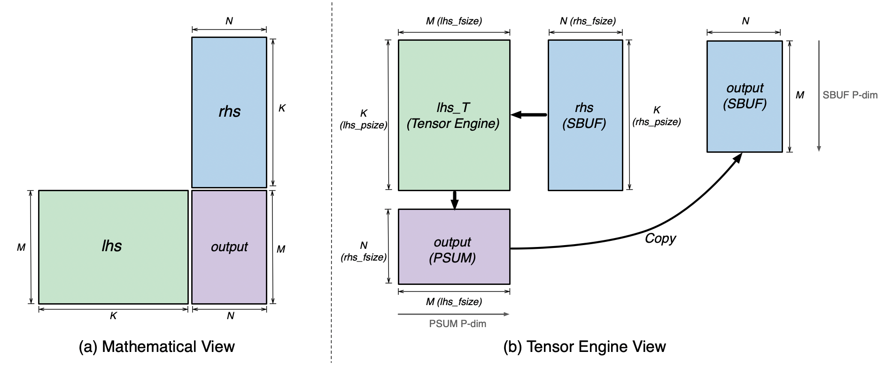
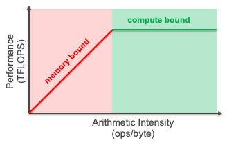
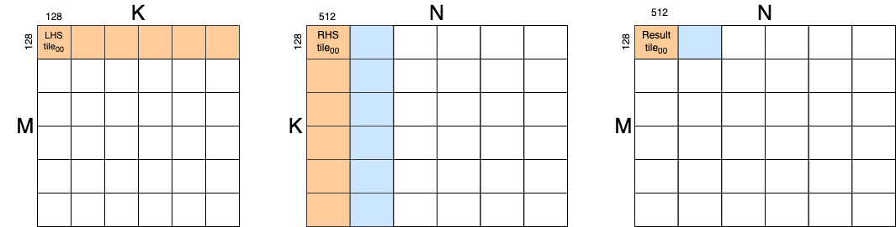
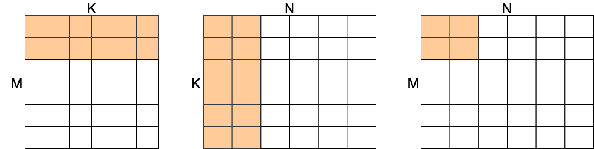
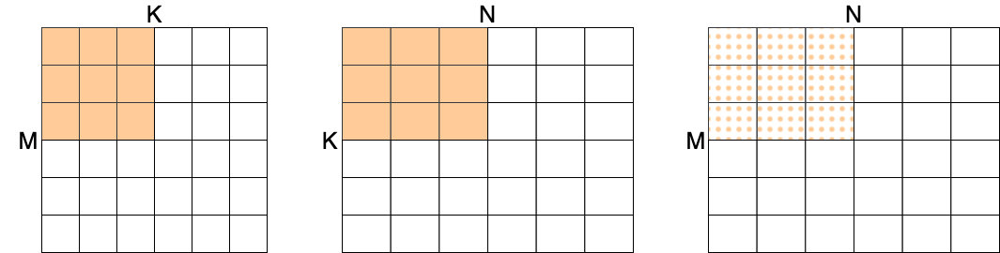

Matrix multiplication
=====================

In this tutorial, we will start with a simple NKI matrix multiplication kernel
and optimize it step by step. In doing so, we learn about:

-  The NKI syntax and programming model.
-  Layout, tiling, and memory management considerations when performing
   matrix multiplication in NKI.
-  Best practices for validating and benchmarking your custom kernel
   against a reference native torch implementation.

Basic compute kernel
----------------------

.. _nki-fig-mm-view:

   MxKxN Matrix Multiplication Visualization

:numref:`Fig. %s <nki-fig-mm-view>` illustrates how a simple matrix
multiplication: ``lhs [M, K] * rhs [K, N] = output [M, N]`` would be mapped to the
Tensor Engine (TensorE) and SRAMs from its original mathematical view. Note, the PSUM
partition dimension is rotated 90 degrees from SBUF partition dimension solely for layout visualization.
The copy preserves the ``output`` tile layout from PSUM to SBUF, by copying data from each PSUM partition
to the corresponding SBUF partition.

The NKI example below implements a compute kernel for a single-tile matrix
multiplication. It computes a ``64(M) x 128(K) x 512 (N)`` matrix
multiplication operation.

.. nki_example:: ../examples/matrix_multiplication/matrix_multiplication_nki_kernels.py
   :language: python
   :linenos:
   :marker: NKI_EXAMPLE_16

In this example, we define the NKI kernel as ``nki_matmul_basic_:``

1. We define indices to access the LHS and RHS input tensors.
2. To adhere to NKI's layout considerations (:ref:`Layout Considerations
   <nki-pm-layout>`),
   we map the contraction axis of both LHS and RHS to the P-dimension,
   which means we load LHS in transposed form.
3. To adhere to NKI's tile size considerations (:ref:`Tile Size
   Considerations <nki-pm-tile>`),
   we limit the matmul instruction arguments to tiles of up to
   ``[128,128]`` for LHS, and ``[128,512]`` for RHS.
4. Using the ``nl.load`` operation, we load the inputs from HBM tensors
   to SBUF tiles.
5. We then use the ``nl.matmul`` operation to perform the matrix
   multiplication. Note that we set the ``transpose_x`` argument to
   ``True``, since the LHS argument is transposed. Also note that the *64x128*
   dimension here actually under-utilizes the TensorE, but it helps to
   distinguish the M, K and N dimensions for education purposes in this first
   code example.
6. ``nl.matmul`` always writes its result to PSUM, and since
   ``nl.store`` only moves data from SBUF to HBM, we copy the
   multiplication result from PSUM back to SBUF using ``nl.copy``.

We can then execute the kernel and verify correctness against the torch
implementation as follows. Note that we use `torch.allclose` to tolerate
numerical error inherent to floating-point arithmetic.

.. nki_example:: ../examples/matrix_multiplication/matrix_multiplication_torch.py
   :language: python
   :linenos:
   :marker: NKI_EXAMPLE_17

.. _tutorial_matmul_tiling:

Tiling matrix multiplications
-------------------------------

.. TODO
  Stretch goal (not urgent): use nki masking to support non-multiples

So far, we've limited our matrix multiplication to the tile sizes
allowed by NKI's tile size and layout constraints. Next, we'll see how
to handle larger matrix multiplications. Let's start with a pseudo-code
for tiling an ``[M,K] @ [K,N]`` matrix-multiplication.
Note that we assume the left-hand-side matrix (``[M,K]``) is already transposed
to LHS_T (``[K,M]``) for optimal performance of the underlying TensorE.

::

   # LHS_T: left-hand-side matmul argument (shape [K,M])
   # RHS: right-hand-side matmul argument (shape [K,N])
   # RES: matmul result (shape [M,N])

   # Tile LHS_T free dimension
   for m in range(0, M, 128):
     # Tile RHS free dimension
     for n in range(0, N, 512):
       # Zero-out the accumulator buffer
       accum = zeros((128, 512))
       # Tile contraction dimension
       for k in range(0, K, 128):
         lhsT_tile = LHS_T[m : m+128, k : k+128]
         rhs_tile = RHS[k : k+128, n : n+512]
         accum += dot(lhsT_tile, rhs_tile)
       RES[m : m+128, n : n+512] = accum

This form of tiling can be achieved in NKI as follows:

.. nki_example:: ../examples/matrix_multiplication/matrix_multiplication_nki_kernels.py
   :language: python
   :linenos:
   :marker: NKI_EXAMPLE_18

Note the use of ``nl.mgrid`` to define indices, this is the same as the
``mgrid`` in NumPy. It is similar to the other way to define indexes through
``nl.arange`` but it enables a more concise way to introduce indexes from
multiple dimensions.  ``nl.affine_range`` is used to define loop-level
iterators.  The loops defined with ``affine_range`` are *not* unrolled by the
compiler, which enables faster compilation.

There is an alternative way to implement this tiled matrix multiplication kernel
using the SPMD programming model.  We can use the SPMD model to launch ``(M/128)
x (N/512)`` instances of the kernel to complete the innermost loop. For more
details, refer to the :ref:`SPMD programming model <nki-pm-spmd>`.

Optimization 1: Removing Redundant Loads
----------------------------------------

Currently, every ``nl.matmul`` is accompanied with two ``nl.load`` calls in the
inner loop, both of which move data from HBM to SBUF. Let's introduce a metric,
arithmetic intensity, to help understand why this is problematic. The arithmetic
intensity of a workload is defined as the number of computation operations
performed per byte of data accessed from HBM on average. The reason why we do
not consider data accessed from SBUF in this metric is because the SBUF
bandwidth (~20x higher than HBM) is high enough to sustain the peak computation
throughput in TensorE.

.. _nki-fig-roofline:

   Roofline Model: The Relationship Between Arithmetic Intensity and Performance

:numref:`Fig. %s <nki-fig-roofline>`  shows the roofline model, which models the
relationship between arithmetic intensity of a workload and its achievable
performance on a given computing platform. To saturate TensorE in a
NeuronCore-v2, the arithmetic intensity threshold of a workload is 222
Flops/Byte for ``bfloat16`` data type.  Inside the inner loop of
``nki_matmul_tiled_``, accessing ``lhsT_tile`` and ``rhs_tile`` requires
160 KB of data read from HBM, while the ``nl.matmul`` call involves 16 MFlops.
This leads to an arithmetic intensity of 102, which is significantly lower than
the saturation threshold of 222. Therefore, ``nki_matmul_tiled_``
operates in the memory bound region of the roofline model and under-utilizes
TensorE.  To make the best out of TensorE, we need to improve the arithmetic
intensity of the matmul kernel.

With NKI, programmers can control when and how to load data from HBM into SBUF
and also perform computation. We will demonstrate in the upcoming steps how to
increase the arithmetic intensity of the matmul kernel using NKI, thereby
maximizing the utilization of TensorE.

First, we notice that in ``nki_matmul_tiled_``, the same tiles from
``lhsT`` and ``rhs`` matrices are loaded more than once across different
iterations of the inner loop. The following example reduces these redundant
loads through hoisting them out of the innermost loop.

.. _nki-fig-mm-after-load-hoisting:

   Memory Pattern After Hoisting Loads Out of the Innermost Loop

.. nki_example:: ../examples/matrix_multiplication/matrix_multiplication_nki_kernels.py
   :language: python
   :linenos:
   :marker: NKI_EXAMPLE_19

Optimization 2: Reuse More Load Through Blocking
-----------------------------------------------------------

While hoisting the load out of the innermost loop eliminates some redundant
loads, we can push this further by reordering the computation and the associated
memory accesses. The technique we are going to use is called *blocking*.
Blocking explicitly improves temporal locality and reduces memory accesses. It
is very similar to the tiling step we did earlier in spirit.

Note that we reserve the word "tile" for defining the granularity of computation
and “tiling” for the previous optimization technique that maps the high-level
computation onto multiple matrix multiplication instructions executed on the TensorE.
TensorE processes a specific "tile size" in a single
instruction, leveraging the inherent parallelism in matrix multiplication.

Here, we do blocking, by grouping the work associated with a set of tiles
together at another loop nest level. Blocking effectively interleaves a set of
compute instructions and loading (DMA) instructions. This optimization does not
bring us additional parallelism in computation, but rather improve the
arithmetic intensity. This shifts a memory-bound matrix multiplication
implementation to a compute-bound one, in order to fully leverage the compute
capabilities of TensorE.

:numref:`Fig. %s <nki-fig-mm-after-blocking-free>` below visualizes the memory pattern
after blocking both free dimensions.

.. _nki-fig-mm-after-blocking-free:

   Memory Pattern After Blocking Free Dimensions

.. nki_example:: ../examples/matrix_multiplication/matrix_multiplication_nki_kernels.py
   :language: python
   :linenos:
   :marker: NKI_EXAMPLE_20

Optimization 3: Further Blocking and DMA Efficiency Optimization
----------------------------------------------------------------

Next, let's also consider blocking the contraction dimension.
Without blocking the contraction dimension, each block of computation leads to
the final result of each output block directly, since the input blocks in both
``lhs_T`` and ``rhs`` cover the entire contraction dimension.  After contraction
dimension blocking, the accumulation is separated into different groups.
We can accumulate the partial sum from each computation block back to an
SBUF tensor for the final result. 
A small amount of HBM traffic might also be 
introduced if the partial sum cannot be kept in SBUF before being consumed. 
On the bright side, we can increase the block size for the free dimensions, 
which continues to improve the arithmetic intensity.

.. _nki-fig-mm-after-blocking-all:

   Memory Pattern After Blocking All Dimensions

One final step we can do with NKI is to optimize the layout of the loaded tiles
to improve DMA efficiency.  This is done through arranging the order of
dimensions in `nl.ndarray` and marking the partition dimension.

By putting all these optimizations together, we can use NKI to implement
optimized matrix multiplication for different sizes.
Note that different sizes of input matrices require different optimization
plans.  The following code optimizes for large matrix multiplication where the
free dimensions of both input matrices are multiples of 2048 and the contraction
dimension is a multiple of 512.

With the blocking configuration in the code (16 tiles or 2048 numbers in the
``M`` dimension; 2 tiles or 1024 numbers in the ``N`` dimension; and 8 tiles or
1024 numbers in the ``K`` dimension), this computation has an arithmetic
intensity of 683 Flops/Byte (2048*1024*1024/(2048*1024 + 1024*1024)). This is
certainly above the threshold of 222. 

At the same time, this blocking configuration keeps all the tensors within the
SBUF limit as much as possible.  With all matrices in BF16 data type, the
``lhsT_tiles`` requires 4MB and ``rhs_tiles`` requires 2MB SBUF memory. The
``result_tiles`` requires ``4 * NUM_BLOCK_M`` MB SBUF memory, where
``NUM_BLOCK_M`` is ``M // 2048``. Thus, as long as ``M <= 8192``, the required
SBUF memory is under the 24 MB budget (4 + 2 + 4 * (8192 // 2048) == 22 MB).
When the ``M`` dimension becomes bigger, spilling and reloading of the
``result_tiles`` will happen, but because the frequency is relatively low, the
computation can still be sufficient.

Since the K blocking loop is hand optimized for our ideal data locality, we do
not actually want the compiler to rewrite this loop during its vectorization and 
other loop-level optimization passes. To communicate this we use 
``nl.sequential_range()`` to construct the K blocking loop.

.. nki_example:: ../examples/matrix_multiplication/matrix_multiplication_nki_kernels.py
   :language: python
   :linenos:
   :marker: NKI_EXAMPLE_21

Testing Correctness and Benchmarking
------------------------------------

To test the correctness of the kernels, we compare the result with the
``torch.matmul`` with ``torch.allclose``.

.. nki_example:: ../examples/matrix_multiplication/matrix_multiplication_torch.py
   :language: python
   :linenos:
   :marker: NKI_EXAMPLE_22

Output from the test:

::

   Checking correctness of nki_matmul_tiled
   NKI and Torch match
   Checking correctness of nki_matmul_hoist_load
   NKI and Torch match
   Checking correctness of nki_matmul_block_free_dimension
   NKI and Torch match
   Checking correctness of nki_matmul_fully_optimized
   NKI and Torch match

To test for performance of each kernel here, we can use NKI's benchmark
capability to measure the performance of the four different kernels on
``[4096,8192] @ [8192,8192]`` matrix multiplication.

.. nki_example:: ../examples/matrix_multiplication/matrix_multiplication_nki_kernels.py
   :language: python
   :linenos:
   :marker: NKI_EXAMPLE_23

+-----------------------+---------------+----------------------------------------------+
| Kernels               | Latency (ms)  | Hardware FLOPs Utilization (HFU, %)          |
+=======================+===============+==============================================+
| Original Tiled        | 51.80         | 10.98                                        |
+-----------------------+---------------+----------------------------------------------+
| Optimization 1        | 42.96         | 13.24                                        |
+-----------------------+---------------+----------------------------------------------+
| Optimization 2        | 22.07         | 26.51                                        |
+-----------------------+---------------+----------------------------------------------+
| Optimization 3        | 6.97          | 85.24                                        |
+-----------------------+---------------+----------------------------------------------+

As shown in the table above, with all the optimizations, the matrix
multiplication kernel is 7x faster comparing to the original tiled version.  We
also profile the four different kernel implementations for the HFU (hardware
FLOPs utilization). With all the optimizations, the final version reaches a HFU
of 85.2%.
The performance numbers here are specific to input matrix sizes (``[4096,8192] @
[8192,8192]``), data types (BF16), and server instance (Trn1.32xlarge).

Download All Source Code
--------------------------

Click the links to download source code of the kernels and the testing code
discussed in this tutorial.

* All matrix multiplication NKI kernels: :download:`matrix_multiplication_nki_kernels.py <../examples/matrix_multiplication/matrix_multiplication_nki_kernels.py>`
* PyTorch implementation: :download:`matrix_multiplication_torch.py <../examples/matrix_multiplication/matrix_multiplication_torch.py>`

You can also view the source code in the GitHub repository `nki_samples <https://github.com/aws-neuron/nki-samples/blob/main/src/tutorials/matrix_multiplication/>`_

Example usage of the scripts:
^^^^^^^^^^^^^^^^^^^^^^^^^^^^^^^^^^^^^^

Run benchmarking of different NKI kernels:

.. code-block::

   python3 matrix_multiplication_nki_kernels.py 

Run PyTorch implementation to validate the NKI results against the PyTorch
implementation:

.. code-block::

   python3 matrix_multiplication_torch.py
