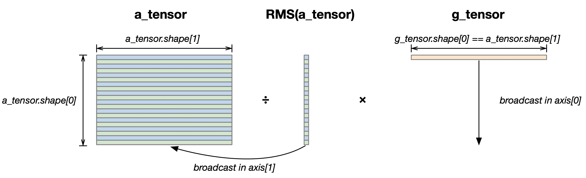

RMSNorm
=============

In this tutorial, we implement a kernel to perform RMSNorm of a **2D tensor**,
as described in `Root Mean Square Layer Normalization <https://arxiv.org/pdf/1910.07467v1.pdf>`__.
In doing so, we learn about:

- The NKI syntax and programming model
- Broadcasting tensors in different axis
- Mapping embarrassingly parallel vector operations efficiently to the NeuronCore
- Disable ineffectual data movement or compute within a tile using an execution mask

Before diving into RMSNorm of 2D input, let's go over the RMSNorm operator for a
**1D vector** ``a`` defined as below:

.. math::
    \bar{a_i} = \frac{a_i}{\text{RMS}(a)}g_i,\text{ where RMS}(a) = \sqrt{\frac{1}{n}\sum_{i=0}^n{a_i^2}}

Note, ``g`` is the RMSNorm weight, which has the same shape as the input vector ``a``.
The function RMS(a) produces a single scalar element, and we divide every element
in the input vector ``a`` by the ``RMS(a)`` scalar (i.e., a broadcast divide).

In Transformer models, we typically perform RMSNorm on a 2D input tensor instead
(with shape ``[sequence length, embedding size]``). 2D-RMSNorm simply performs 1D-RMSNorm
as discussed above for *every row* of the input 2D tensor. The ``g`` RMSNorm weight vector
is shared (i.e., broadcasted) across the rows for the multiplication.
:ref:`Figure <nki-fig-rmsnorm>` below visualizes
the tensor shapes involved in 2D-RMSNorm, where `a_tensor` is the 2D input tensor and
`g_tensor` is the 1D RMSNorm weight:

.. _nki-fig-rmsnorm:

   RMSNorm tensor shapes

We are going to map the rows (``a_tensor.shape[0]``) to the partition dimension of the SBUF
once we load the tensor from HBM. This is a natural layout choice since each SBUF partition
has a one-to-one mapping to a parallel vector lane in the compute engines for calculating
``RMS(a_tensor)``.

Note, the division of ``RMS(a_tensor)`` requires broadcasting of one scalar across all elements
of ``a_tensor`` within each partition, which is considered a free-axis broadcast and supported
by the flexible memory access pattern in hardware. On the other hand, the multiplication
with g_tensor requires broadcasting of a vector across all partitions, which is considered
a partition-axis broadcast and must invoke another instruction for the broadcasting
(``broadcast_to()`` API, details see below implementation) .

Compute kernel
--------------

.. nki_example:: ../examples/rmsnorm/rmsnorm_nki_kernels.py
   :language: python
   :linenos:
   :marker: NKI_EXAMPLE_42

In this example, we implement RMSNorm for a 2D input tensor in ``nki_rmsnorm_kernel``:

* We assume each SBUF partition is large enough to fit at least one row of ``a_tensor``
  and one copy of ``g_tensor`` simultaneously.
* We load ``g_tensor`` once into the SBUF outside the main loop that iterates over tiles of
  ``a_tensor`` to achieve maximum reuse. The g_tensor is reshaped into a 2D tensor because
  SBUF is a two-dimensional memory and hence expects at least two dimension for any SBUF tensor.
  A reshape of an HBM tensor without changing the underlying storage format is in fact a
  no-op with no performance cost in the final compiled executable.
* To adhere to NKI's tile-size considerations (:ref:`Tile Size Considerations <nki-tile-size>`),
  we limit the partition axis size of ``g_tensor`` tile to be 128.
* The trip count of the compute loop is ``math.ceil(a_tensor.shape[0]/128)``.
  In cases where ``a_tensor.shape[0]`` is not a multiple of 128, we can disable
  ineffectual data movement or compute in the last iteration using the ``mask`` field
  (discussions below).
* Within the compute loop:

    * We load one tile of ``g_tensor`` with shape ``(128, g_tensor.shape[1])``
      using ``nl.load`` API. We guard the loading boundary by specifying
      ``mask=(i * 128 + ix < num_rows)``, which ensures we don't access out-of-bound
      memory when the number of rows in ``a_tensor`` is not a multiple of 128.
    * We perform the free-axis broadcast multiply (``division of RMS(a)``) using
      ``nl.multiply(a_tile, rms_reciprocal)``, which is lowered into
      :doc:`nki.isa.tensor_scalar <../api/generated/nki.isa.tensor_scalar>`
      instruction under the hood.
    * To broadcast multiply with the RMSNorm weight g_tensor, we need to
      perform a partition-axis broadcast of the g_tensor. The number of partitions
      to broadcast to depends on how many active rows are being normalized in the
      current loop iteration: ``min(num_rows - i * 128, 128)``. Next, we can do
      element-wise multiplication of the broadcasted ``g_tensor`` and the intermediate
      normalized tile ``out_tile``, which is lowered into
      :doc:`nki.isa.tensor_tensor <../api/generated/nki.isa.tensor_tensor>`
      instruction under the hood.
    * Finally, we store the normalized tile back into HBM using the
      :doc:`nl.store <../api/generated/nki.language.store>` API.
      We guard the store boundary similar to load boundary using the ``mask`` field.

Launching kernel and testing correctness
----------------------------------------

PyTorch
^^^^^^^^^^^^^^^^^^^^^^^^^^^^^^^^^^^^^^^^

Below we write a reference PyTorch implementation of RMSNorm and verify our
NKI kernel output against the reference in the same script as the kernel.

.. nki_example:: ../examples/rmsnorm/rmsnorm_torch.py
   :language: python
   :linenos:
   :marker: NKI_EXAMPLE_43

Output:
  
::

    2024-07-27 15:22:50.000670:  7592  INFO ||NEURON_CACHE||: Compile cache path: /var/tmp/neuron-compile-cache
    2024-07-27 15:22:50.000672:  7592  INFO ||NEURON_CC_WRAPPER||: Call compiler with cmd: neuronx-cc compile --target=trn1 --framework=XLA /tmp/ubuntu/neuroncc_compile_workdir/54c8e689-108c-433e-832a-f9282acdf114/model.MODULE_7170924315921358669+d41d8cd9.hlo_module.pb --output /tmp/ubuntu/neuroncc_compile_workdir/54c8e689-108c-433e-832a-f9282acdf114/model.MODULE_7170924315921358669+d41d8cd9.neff --verbose=35
    DGE ON Levels: {'scalar_dynamic_offset', 'io'}
    .
    Compiler status PASS
    output_nki=tensor([[0.8418, 1.3092, 0.7372,  ..., 0.1458, 0.8831, 0.2339],
            [0.1745, 0.3416, 0.1519,  ..., 0.3358, 0.1832, 0.4795],
            [0.0111, 1.1799, 0.8628,  ..., 0.3107, 0.8328, 0.5663],
            ...,
            [1.1213, 0.5449, 0.3020,  ..., 0.4050, 0.4838, 0.0834],
            [0.8246, 0.5027, 0.2745,  ..., 0.4069, 1.0456, 1.0978],
            [0.6415, 0.3637, 0.1462,  ..., 0.2441, 1.0535, 0.4138]],
           device='xla:0')
    2024-07-27 15:22:51.000907:  7592  INFO ||NEURON_CACHE||: Compile cache path: /var/tmp/neuron-compile-cache
    2024-07-27 15:22:51.000908:  7592  INFO ||NEURON_CC_WRAPPER||: Call compiler with cmd: neuronx-cc compile --target=trn1 --framework=XLA /tmp/ubuntu/neuroncc_compile_workdir/6d2046fc-c02d-4d3d-8746-50399ad50832/model.MODULE_18272098496972694952+d41d8cd9.hlo_module.pb --output /tmp/ubuntu/neuroncc_compile_workdir/6d2046fc-c02d-4d3d-8746-50399ad50832/model.MODULE_18272098496972694952+d41d8cd9.neff --verbose=35
    DGE ON Levels: {'scalar_dynamic_offset', 'io'}
    .
    Compiler status PASS
    output_torch=tensor([[0.8418, 1.3092, 0.7372,  ..., 0.1458, 0.8831, 0.2339],
            [0.1745, 0.3416, 0.1519,  ..., 0.3358, 0.1832, 0.4795],
            [0.0111, 1.1799, 0.8628,  ..., 0.3107, 0.8328, 0.5663],
            ...,
            [1.1213, 0.5449, 0.3020,  ..., 0.4050, 0.4838, 0.0834],
            [0.8246, 0.5027, 0.2745,  ..., 0.4069, 1.0456, 1.0978],
            [0.6415, 0.3637, 0.1462,  ..., 0.2441, 1.0535, 0.4138]],
           device='xla:0')
    2024-07-27 15:22:53.000466:  7592  INFO ||NEURON_CACHE||: Compile cache path: /var/tmp/neuron-compile-cache
    2024-07-27 15:22:53.000467:  7592  INFO ||NEURON_CC_WRAPPER||: Call compiler with cmd: neuronx-cc compile --target=trn1 --framework=XLA /tmp/ubuntu/neuroncc_compile_workdir/32c983cd-2c40-4723-8342-d4422107708c/model.MODULE_968738949480579147+d41d8cd9.hlo_module.pb --output /tmp/ubuntu/neuroncc_compile_workdir/32c983cd-2c40-4723-8342-d4422107708c/model.MODULE_968738949480579147+d41d8cd9.neff --verbose=35
    DGE ON Levels: {'io', 'scalar_dynamic_offset'}
    .
    Compiler status PASS
    NKI and Torch match

JAX
^^^

Below we write a reference JAX implementation of RMSNorm and verify our
NKI kernel output against the reference in the same script as the kernel.

.. nki_example:: ../examples/rmsnorm/rmsnorm_jax.py
   :language: python
   :linenos:
   :marker: NKI_EXAMPLE_44

Download All Source Code
--------------------------

Click the links to download source code of the kernels and the testing code
discussed in this tutorial.

* NKI baremetal implementation: :download:`rmsnorm_nki_kernels.py <../examples/rmsnorm/rmsnorm_nki_kernels.py>`
* PyTorch reference implementation: :download:`rmsnorm_torch.py <../examples/rmsnorm/rmsnorm_torch.py>`
* JAX reference implementation: :download:`rmsnorm_jax.py <../examples/rmsnorm/rmsnorm_jax.py>`

You can also view the source code in the GitHub repository `nki_samples <https://github.com/aws-neuron/nki-samples/blob/main/src/tutorials/rmsnorm/>`_

Example usage of the scripts:
^^^^^^^^^^^^^^^^^^^^^^^^^^^^^^^^^^^^^^
  
 Run NKI baremetal implementation:

 .. code-block::

    python3 rmsnorm_nki_kernels.py

 Run PyTorch implementation:
  
 .. code-block::
  
    python3 rmsnorm_torch.py
  
 Run JAX implementation:
  
 .. code-block::
  
    python3 rmsnorm_jax.py
  
