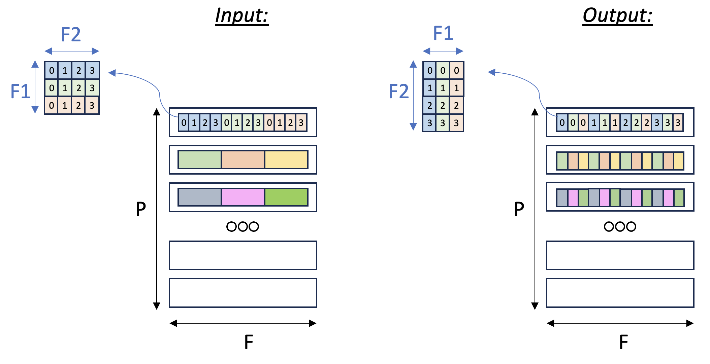

Transpose2D
===========

In this tutorial, we transpose a tensor along two of its axes using NKI.
In doing so, we learn about:

-  The NKI syntax and programming model.
-  Multi-dimensional memory address patterns in NKI.

As background, there are two main types of transposition in NKI:

1. Transposition between the partition-dimension axis and one of the
   free-dimension axes, which is achieved via the
   :literal:`nki.isa.nc_transpose` instruction.
2. Transposition between two axes on the free-dimension, which is achieved
   via a ``nki.language.copy`` instruction, with indexing manipulation
   in the free axis to re-arrange the data.

In this example, we'll focus on the second case: consider a
three-dimensional input tensor ``[P, F1, F2]``, where the ``P`` axis is mapped
to the different SBUF partitions and the ``F1`` and ``F2`` axes are
flattened and placed in each partition, with ``F1`` being the major
dimension. Our goal in this example is to transpose the ``F1`` and
``F2`` axes with a parallel dimension ``P``,
to re-arrange the data within each partition. :ref:`Figure <nki-fig-transpose>`
below illustrates the input and output tensor layouts.

.. _nki-fig-transpose:

   Tensor F1:F2 Transpose

PyTorch
-------

Compute kernel
^^^^^^^^^^^^^^

.. literalinclude:: ../examples/transpose2d/transpose2d_nki_kernels.py
   :language: python
   :linenos:
   :lines: 9-65

Launching kernel and testing correctness
^^^^^^^^^^^^^^^^^^^^^^^^^^^^^^^^^^^^^^^^

To execute the kernel, we prepare tensors ``a`` and an empty tensor
``a_t_nki``, and call the ``tensor_transpose2D_kernel_``:

.. literalinclude:: ../examples/transpose2d/transpose2d_torch.py
   :language: python
   :linenos:
   :lines: 7-9, 14-34

JAX
---

Compute kernel
^^^^^^^^^^^^^^

We can reuse the same NKI compute kernel defined for PyTorch above.

.. literalinclude:: ../examples/transpose2d/transpose2d_nki_kernels.py
   :language: python
   :linenos:
   :lines: 9-65

We also define ``transpose2D`` as a caller to the NKI kernel. We create
a partial function ``partial(tensor_transpose2D_kernel_, shape2D=shape2D)``
in order for JAX to be able to pass a Python object to the kernel function.

.. literalinclude:: ../examples/transpose2d/transpose2d_jax.py
   :language: python
   :linenos:
   :lines: 8, 10-11, 14-20

Launching kernel and testing correctness
^^^^^^^^^^^^^^^^^^^^^^^^^^^^^^^^^^^^^^^^

To execute the kernel, we prepare array ``a`` and
call the caller function ``transpose2D``:

.. literalinclude:: ../examples/transpose2d/transpose2d_jax.py
   :language: python
   :linenos:
   :lines: 8-9, 23-37

.. _tutorial_transpose2d_code:

Download All Source Code
--------------------------

Click the links to download source code of the kernels and the testing code
discussed in this tutorial.

* NKI baremetal implementation: :download:`transpose2d_nki_kernels.py <../examples/transpose2d/transpose2d_nki_kernels.py>`
* PyTorch implementation: :download:`transpose2d_torch.py <../examples/transpose2d/transpose2d_torch.py>`
    * You must also download :download:`transpose2d_nki_kernels.py <../examples/transpose2d/transpose2d_nki_kernels.py>`
      into the same folder to run this PyTorch script.
* JAX implementation: :download:`transpose2d_jax.py <../examples/transpose2d/transpose2d_jax.py>`
    * You must also download :download:`transpose2d_nki_kernels.py <../examples/transpose2d/transpose2d_nki_kernels.py>`
      into the same folder to run this JAX script.

You can also view the source code in the Github repository `nki_samples <https://github.com/aws-neuron/nki-samples/blob/main/src/tutorials/transpose2d/>`_

Example usage of the scripts:
^^^^^^^^^^^^^^^^^^^^^^^^^^^^^^^^^^^^^^

Run NKI baremetal implementation:

.. code-block::

   python3 transpose2d_nki_kernels.py

Run PyTorch implementation:

.. code-block::

   python3 transpose2d_torch.py

Run JAX implementation:

.. code-block::

   python3 transpose2d_jax.py
