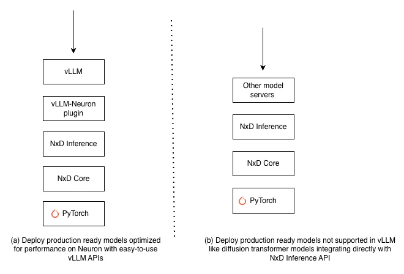

.. _neuron-inference-overview:

AI Inference on Neuron
======================

.. contents:: Table of contents
   :local:
   :depth: 2

Overview
--------

AWS Neuron provides optimized AI inference on AWS Trainium and Inferentia instances across diverse AI workloads, from Large Language Models (LLMs) to image/video generation models and custom machine learning architectures. The Neuron SDK enables optimized performance tuning for both latency-sensitive applications like interactive chatbots and high-throughput batch processing workloads. Whether you're building real-time generative AI applications, agentic AI systems, or processing offline batch requests, the Neuron SDK provides the flexibility to optimize inference for your specific performance requirements.

Deploying Production-Ready Models on Trainium/Inferentia
--------------------------------------------------------

The Neuron SDK enables deployment of production-ready popular LLM models like Meta Llama-3.3-70B and OpenAI gpt-oss-120B using vLLM. 
For model architectures not supported through vLLM, such as diffusion transformer models (Flux), you can integrate with other model servers directly using NxD Inference APIs.

.. _neuron_inference_deployment_figure:

   Figure 1: Neuron Inference Deployment options

Deploy Production-Ready Models with vLLM
^^^^^^^^^^^^^^^^^^^^^^^^^^^^^^^^^^^^^^^^

vLLM on Neuron offers a streamlined deployment experience using the standard vLLM V1 APIs with minimal code changes. Once you :ref:`install the latest Neuron SDK <nxdi-setup>`, you can easily get started using vLLM to serve
production-ready models. Below is an example of starting vLLM serving for the Llama-3.1-8B model:

.. code-block:: python

      ##install the vllm-neuron plugin which automatically installs the right vLLM version that is supported
      git clone https://github.com/vllm-project/vllm-neuron.git
      cd vllm-neuron
      pip install --extra-index-url=https://pip.repos.neuron.amazonaws.com -e .

      ##start the vLLM server to start serving inference requests (sample config for Trn1 instance)
      vllm serve meta-llama/Meta-Llama-3-8B-Instruct --tensor-parallel-size 32 --max-num-seqs 4 --max-model-len 128 --block-size 32 --num-gpu-blocks-override 256

Neuron also offers :ref:`AMIs <neuron-dlami-overview>` with pre-installed Neuron SDK dependencies to quickly test your inference workloads and :ref:`pre-built inference containers<neuron_containers>` that you can use
to get started with your production workloads in Kubernetes environments.

You can refer to the :ref:`detailed developer guide on vLLM V1 support <nxdi-vllm-user-guide-v1>` for the list of features and models supported through vLLM.

If you are looking to deploy a model in vLLM that is not yet supported out of the box on Neuron, you can refer to the :ref:`implementing custom models section below <neuron-inference-implement-custom-models>`.

Integrate with NxD Inference APIs for Custom Model Serving Deployments
^^^^^^^^^^^^^^^^^^^^^^^^^^^^^^^^^^^^^^^^^^^^^^^^^^^^^^^^^^^^^^^^^^^^^^^

If you are looking to deploy models beyond standard LLM architectures, such as Diffusion Transformers which are not supported in vLLM, NxD Inference provides direct API integration options that you can
integrate with general-purpose model serving frameworks like FastAPI or Triton Inference Server. You can refer to the `Flux tutorial <https://awsdocs-neuron.readthedocs-hosted.com/en/latest/libraries/nxd-inference/tutorials/flux-inference-tutorial.html>`_ to learn how to integrate directly with NxD Inference APIs.

Similarly, if you want to integrate LLM model serving with model serving options other than vLLM, you can integrate directly with NxD Inference. However, you will need to make custom changes to the scheduler along with any modifications required to make it compatible with your desired model server.

.. _neuron-inference-implement-custom-models:

Implementing Custom Models or Performance Optimizations
---------------------------------------------------------

NxD Inference Library
^^^^^^^^^^^^^^^^^^^^^^

NxD Inference is a PyTorch-based open-source library that provides reference implementations for optimizing popular dense LLM models, MoE LLM models, and image generation models like Llama-3.3-70B, gpt-oss-120B, and Flux on Neuron.
The NxD Inference library provides key model building blocks such as different attention techniques, distributed strategies like Tensor Parallel, Expert Parallelism, speculative decoding techniques, and NKI kernels for popular model architectures that you can use to quickly
build custom LLM and other ML model architectures. 

You can use the :ref:`model onboarding guide <nxdi-onboarding-models>` to get started implementing custom models on Neuron. Similarly, you can extend and implement custom performance optimizations on models
already implemented in NxD Inference. Once you have implemented the model in NxD Inference, you can either integrate it with vLLM as described in the :ref:`model onboarding guide <nxdi-onboarding-models-vllm>` or integrate it with another model serving framework.

NxD Inference is an open-source library with `source code publicly available on GitHub <https://github.com/aws-neuron/neuronx-distributed-inference>`_. We invite you to contribute
custom model implementations or performance optimizations by opening a PR on GitHub.

Implementing Custom Models Directly on PyTorch
^^^^^^^^^^^^^^^^^^^^^^^^^^^^^^^^^^^^^^^^^^^^^^
If you want to implement models directly on PyTorch without using the NxD Inference library and need more fine-grained control, you can use the :ref:`NxD Core library<neuronx_distributed_api_guide>` that offers Neuron essential primitives like tracing and compilation. The `Llama-3.2-1B <https://github.com/aws-neuron/neuronx-distributed/tree/main/examples/inference/llama>`_ example provides a sample reference implementation showing how to build custom models with the NxD Core library.
