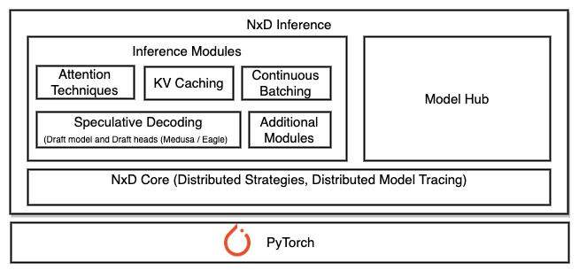
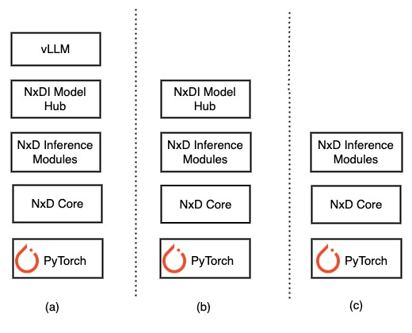

.. _nxdi-overview:

NxD Inference Overview
=======================

.. contents:: Table of contents
   :local:
   :depth: 2

Overview
--------

NxD Inference  (where NxD stands for NeuronX Distributed) is an open-source PyTorch-based inference library that simplifies deep learning model deployment on AWS Inferentia and Trainium instances. Introduced with Neuron SDK 2.21 release, 
it offers advanced inference capabilities, including features such as continuous batching and speculative decoding for high performance inference. Additionally, it supports inference engine for vLLM for seamless integration with the majority of customers' production deployment systems. ML developers can use NxD Inference library at different levels of abstraction that fits their inference use case.

NxD Inference(NxDI) library offers the following benefits:

* **Production ready models**: NxD Inference provides production ready models like  Llama-3.1, DBRX, and Mixtral that you can quickly deploy for high performance inference. 

* **LLM Inference Features**:  NxD Inference provides support for various LLM inference features like KV Cache, Multi-Head Attention (MHA), Grouped Query Attention (GQA), Flash Attention, Quantization, MoE , Continuous Batching and Speculative Decoding enabling high performance inference.  

* **Modular Design**:  Inference features in NxDI like KV Caching are implemented with a modular design, allowing developers to easily incorporate them into new models or customize and extend them.

* **Distributed Strategies**: NxD Inference enables distributing inference workload of large models across multiple NeuronCores in a single instance using Tensor parallelism and Sequence Parallelism. Pipeline parallelism and multi-node inference will be supported in future Neuron releases. 

* **Support for NKI Kernels**:  NxD Inference provides support for integrating custom NKI kernels on Trainium and  Inferentia instances. 

* **Open Source and SW Release**:  NxD Inference library is provided as pip wheel and corresponding source code is made available on `GitHub <https://github.com/aws-neuron/neuronx-distributed-inference>`_ . We encourage developers to contribute new model implementations or feature optimizations to the NxDI library by submitting a pull request.

.. _nxdi_figure:

   NxD Inference High level Overview

Using NxD Inference Library
---------------------------

ML developers can use NxD Inference library at different levels of abstraction. As shown in the below diagram :numref:`Fig. %s <nxdi_use-cases-figure>`, developers can use NxDI library in 3 different ways.

* **Deploy production ready models with vLLM**:  NxDI supports production ready models like Llama-3.1, DBRX and Mixtral that can be easily deployed directly through vLLM. Customers can integrate their inference scripts directly with vLLM API. 

* **Deploy production ready models with NxDI**:   For customers who are not using vLLM, they can integrate with NxDI models directly for use cases such as static batching.   For continuous batching, customers can also integrate with NxDI API to implement a custom model server with scheduler(other than vLLM) . See :numref:`Fig. %s <nxdi_use-cases-figure>` b) for reference.

* **Integrate with Inference modules and NxD Core primitives**:   As described in :numref:`Fig. %s <nxdi_use-cases-figure>` c), customers who are looking to onboard new models which are not in NxDI model hub can integrate with inference modules and NxD Core primitives. In addition, customers who are looking to integrate with model servers other than vLLM can also integrate directly with NxD Inference modules and NxD core primitives.

.. _nxdi_use-cases-figure:

   Using NxD Inference through various abstractions 