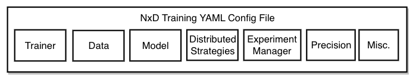

.. _nxd-training-overview:

NxD Training Overview
=====================
.. contents:: Table of contents
   :local:
   :depth: 2

NxD Training
-------------------

NxD Training (where NxD stands for NeuronX Distributed) library is a collection of open-source tools and libraries 
designed to empower customers to train PyTorch models on AWS Trainium instances. 
:ref:`Introduced with Neuron 2.20 release <introduce-nxd-training>`, it combines both ease-of-use and access to 
most advanced features through additional features built on top of :ref:`NxD Core<neuronx-distributed-index>` library. 
Additionally, NxD training addresses the needs of a broad range of users including those looking to create their training 
jobs from scratch to ones with existing workflows in other frameworks. It is compatible with
training platforms like NVIDIA’s NeMo and provides users a migration path to switch their NeMo workflows to NxD Training.

Specifically, :ref:`NxD Training <nxdt_figure>` opens a world of benefits to ML developers by offering a rich 
feature set and greater productivity through:

*  **Training Workflows**: Developers benefit from turnkey support for multiple workflows such as model Pre-training, Supervised Finetuning (SFT),  
   and Parameter Efficient Finetuning (PEFT) using Low Rank Adapters (LoRA) [#f1]_. For these workflows, precision types supported include  
   (a) FP32 for both baseline and for master weights when using ZeRO-1, 
   and (b) BF16 combined with :ref:`stochastic rounding <neuron-rounding-modes>`.

*  **Distributed Strategies**: Splitting training workload over multiple nodes shortens the job duration. This is made possible through distributed strategies 
   that are the techniques used to shard large scale models across multiple Neuron Cores. NxD Training Distributed Strategies are implemented in the 
   :ref:`NxD Core <neuronx-distributed-index>` library and include:
   Data Parallelism, 
   `Tensor-parallelism <https://awsdocs-neuron.readthedocs-hosted.com/en/latest/libraries/neuronx-distributed/tensor_parallelism_overview.html#tensor-parallelism-overview>`_, 
   `Sequence-Parallelism <https://awsdocs-neuron.readthedocs-hosted.com/en/latest/libraries/neuronx-distributed/activation_memory_reduction.html#sequence-parallelism>`_,  
   `Pipeline-parallelism <https://awsdocs-neuron.readthedocs-hosted.com/en/latest/libraries/neuronx-distributed/pipeline_parallelism_overview.html>`_  (including 1F1B pipeline 
   schedule and interleaved pipeline schedule), and `ZeRO-1 <https://awsdocs-neuron.readthedocs-hosted.com/en/latest/frameworks/torch/torch-neuronx/tutorials/training/zero1_gpt2.html#what-is-zero-1>`_.

*  **Data Science  Modules**: The integration of datasets, dataloaders, tokenizers and other data wrangling tools makes it easy to prepare and use large-scale training data.

*  **Data Engineering Modules**: Integrated *Experiment Manager* allows for saving training outputs through checkpointing and evaluating results through enhanced logging. It comes with 
   multiple options
   for optimally loading/saving checkpoints such as sharded checkpoints, last-K checkpoints, asynchronous checkpoints, auto-resume from checkpoints and storage in S3 buckets.

*  **PyTorch Lightning**: The library has support for training frameworks like PyTorch Lightning that help with organizing training code. 

*  **Models**: Users can start on NxD Training with ready-to-use samples based on HuggingFace and Megatron-LM model formats. It has support for advanced LLM architecture blocks such as 
   `Grouped Query Attention layer <https://awsdocs-neuron.readthedocs-hosted.com/en/latest/libraries/neuronx-distributed/api_guide.html#gqa-qkv-linear-module>`_. 

*  **SW Releases**: Availability on GitHub, both as pip wheel and source code, serves the developer needs for usage of and modifications to the library.

.. _nxdt_figure:

    
    `NxD Training`

Using NxD Training
------------------

ML developers often need access to training code at different levels of abstraction. As shown in :ref:`figure <nxdt_usage_figure>`, using NxD Training is possible  
using three interfaces: 

*   High-level `YAML <https://yaml.org/>`_  configuration file used in conjunction with models in NxD Training's model hub
*   `PyTorch Lightning (PTL) <https://github.com/Lightning-AI/pytorch-lightning>`_ APIs and Trainer in conjunction with NxD Core primitives
*   :ref:`NxD Core <neuronx-distributed-index>` foundational API, also refered to as NxD Core primitives

All three usage mechanisms employ the underlying NxD Core library either directly through programming interfaces or 
configuration files and developers can choose the method that meets 
their needs.

.. _nxdt_usage_figure:

.. figure:: ./images/nxdt_ux.jpg

    `Using NxD Training through (a) Configuration Files (b) PyTorch Lightning APIs, and (c) NxD Core primitives`

Configuration File
^^^^^^^^^^^^^^^^^^

NxD Training supports a top-level access for distributed training using YAML based configuration files. 
This option is available for models that are available in the model zoo or custom ones enabled after following 
the steps listed in :ref:`model integration guide <nxdt_developer_guide_integrate_new_model>` inside NxD Training. With this usage model, only the configuration parameters 
inside the YAML file need to be set and no further code changes are necessary. This facilitates easy experimentation with various configuration settings and automating the workflow.
Figure below shows the major 
settings available inside YAML configuration file and more details on how to exercise these options are in 
:ref:`YAML Configuration Settings <nxdt_config_overview>`. Existing users of NeuronX NeMo Megatron (NNM) or NVIDIA NeMo 
can review :ref:`NNM <nxdt_developer_guide_migration_nnm_nxdt>` amd :ref:`NeMo <nxdt_developer_guide_migration_nemo_nxdt>` 
migration guides, respectively, to map the configuration parameters to NxD Training.

    `Top level settings for NxD Training through configuration file`

PyTorch Lightning APIs
^^^^^^^^^^^^^^^^^^^^^^

`PyTorch Lightning <https://github.com/Lightning-AI/pytorch-lightning>`_ is a library that abstracts out model 
training workflows and eliminates the boilerplate code to setup training loops. Through its inheritable classes for 
training loops, data and customizable callbacks for checkpointing and distributed strategies, developers can set 
training workflows in a standardized and compact manner. 

As shown in :ref:`user interfaces to NxD Training, Figure (b) <nxdt_usage_figure>`, overall training scripts can be built 
using PyTorch Lightning and making use of NxD Core library. 
This requires overriding the base classes of PyTorch Lightning such as ``LightningModule``, ``DataModule``; 
configuring optimizer and LR scheduler;setting appropriate callbacks; and launching the ``Trainer``.
For more details, refer to NxD Core's PyTorch Lightning :ref:`developer guide <ptl_developer_guide>` 
and :ref:`sample tutorial <llama2_tp_pp_ptl_tutorial>`. 

NxD Core Primitives
^^^^^^^^^^^^^^^^^^^^^^^^^^^^^^^^^^^^^^^^^^

NxD Core primitives are basic APIs that can be stitched together to build complete training workflows for AWS Trainium instances. 
Addtionally, these primitives are required for integrating a new custom model into NxD Training or 
using the model directly via NxD Core library.

NxD Core library has support for all the essential training features - model sharding, handling collective communications, 
memory reduction, checkpointing, optimizer setting and profiling. 
For example, tensor parallelism through NxD Core is achieved by converting the linear layers, common in attention modules 
of transformer-architecture based models, to parallel layers. For pipeline parallelism, NxD Core offers ability for both manual and automatic
selection of pipeline cut points in the model graph. 
Additional options for sequence parallelism and activation recomputation help with memory reduction.
For all these parallelism options, NxD Core library automatically ensures efficient management of all the required collective communications across Neuron Cores.

Exact details on how these capabilities can be exercised are described in :ref:`NxD Core developer guide <neuronx_distributed_developer_guide>`. 
For background information and description of NxD Core primitives, users are referred to 
NxD Core's :ref:`app notes <neuronx_distributed_appnotes>`, and :ref:`API guide <neuronx_distributed_api_guide>`, respectively. 
Following these steps, once a new model is onboarded using NxD Core APIs, its training workflow can be streamlined using
NxD Training's experiment manager and data science/engineering modules.

.. [#f1] Supported through NxD Core.
..
   With NxD Core, model sharding is made possible using 
   coversion of linear layers to ``RowParallel``/ ``ColumnParallel`` layers for tensor parallelism; wrapping model class into ``NxDPPModel`` for pipeline parallelism; and setting suitable flags for sequence parallelism.
   NxD Core provides sample implementations for optimizer and checkpointing code and they can then be integrated inside an overall model training script.
   Details on how these capabilities can be exercised are detailed in :ref:`NxD Core developer guide <neuronx_distributed_developer_guide>`. For background information and interface descriptions, users are referred to 
   NxD Core's :ref:`app notes <neuronx_distributed_appnotes>`, and :ref:`API guide <neuronx_distributed_api_guide>`, respectively. Once a new model is onboarded using NxD Core APIs, its training workflow can be streamlined using
   NxD Training's experiment manager and data science/engineering modules.
