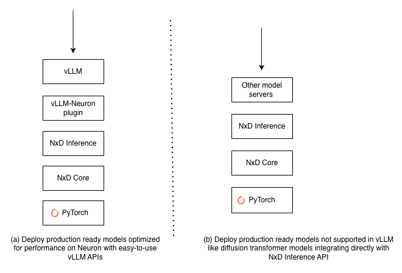

.. meta::
    :description: AI inference on AWS Neuron — deploy production-ready models on Trainium and Inferentia.
    :keywords: neuron, inference, vllm, nxd inference, trainium, inferentia, llm serving
    :date-modified: 08/17/2026

.. _neuron-inference-overview:

AI Inference on Neuron
======================

Overview
--------

AWS Neuron provides optimized AI inference on AWS Trainium and Inferentia
instances across diverse AI workloads, from Large Language Models (LLMs) to
image/video generation models and custom machine learning architectures. The Neuron SDK
enables optimized performance tuning for both latency-sensitive applications like
interactive chatbots and high-throughput batch processing workloads. Whether
you're building real-time generative AI applications, agentic AI systems, or
processing offline batch requests, the Neuron SDK provides the flexibility to optimize
inference for your specific performance requirements.

Deploying Production-Ready Models on Trainium/Inferentia
---------------------------------------------------------

The Neuron SDK enables deployment of production-ready popular LLM models like
Meta Llama-3.3-70B and OpenAI gpt-oss-120B using vLLM. For model architectures not
supported through vLLM, such as diffusion transformer models (Flux), you can
integrate with other model servers directly using NxD Inference APIs.

   Neuron Inference Deployment options

Deploy Production-Ready Models with vLLM
^^^^^^^^^^^^^^^^^^^^^^^^^^^^^^^^^^^^^^^^^

**Option 1: vLLM with NxD Inference (recommended)**

vLLM with NxD Inference uses the ``neuronx-distributed-inference`` library for
model execution. It supports Inf2, Trn1, and Trn2 instances. Supports vLLM 0.16
via plugin version 0.5.x.

Once you :ref:`install the latest Neuron SDK <nxdi-setup>`,
you can get started using vLLM to serve production-ready models:

.. code-block:: bash

    git clone --branch "0.5.3" https://github.com/vllm-project/vllm-neuron.git
    cd vllm-neuron
    pip install --extra-index-url=https://pip.repos.neuron.amazonaws.com -e .

    # Start the vLLM server
    vllm serve meta-llama/Meta-Llama-3-8B-Instruct \
        --tensor-parallel-size 32 \
        --max-num-seqs 4 \
        --max-model-len 128 \
        --block-size 32 \
        --num-gpu-blocks-override 256

Neuron also offers :ref:`AMIs <neuron-dlami-overview>`
with pre-installed Neuron SDK dependencies and
:ref:`pre-built inference containers <neuron_containers>`
for production workloads in Kubernetes environments.

You can refer to the :ref:`detailed developer guide on vLLM support <nxdi-vllm-user-guide-v1>`
for the list of features and models supported through vLLM with NxD Inference.

**Option 2: vLLM Neuron (Beta — Trn2/Trn3 only)**

vLLM Neuron is an enhanced vLLM plugin that does not depend on NxD Inference —
model implementations live directly within the plugin. It supports advanced
inference features including disaggregated inference, segmented prefill, and
EAGLE3 speculative decoding.

vLLM Neuron is currently in Beta and active development. It supports vLLM 0.24.0
on Trn2 and Trn3 instances.

.. code-block:: bash

    git clone -b release-0.24.0.1.1.0 https://github.com/vllm-project/vllm-neuron.git
    cd vllm-neuron
    pip install --extra-index-url=https://pip.repos.neuron.amazonaws.com -e .

    vllm serve openai/gpt-oss-20b \
        --tensor-parallel-size 8 \
        --max-model-len 8192 \
        --max-num-batched-tokens 4096 \
        --max-num-seqs 4

For Inf2 and Trn1, or models not yet supported, use Option 1.
See the :doc:`vLLM Neuron documentation </vllm-neuron/docs/index>`.

Integrate with NxD Inference APIs for Custom Model Serving Deployments
^^^^^^^^^^^^^^^^^^^^^^^^^^^^^^^^^^^^^^^^^^^^^^^^^^^^^^^^^^^^^^^^^^^^^^^

If you are looking to deploy models beyond standard LLM architectures, such as
Diffusion Transformers which are not supported in vLLM, NxD Inference provides
direct API integration options that you can integrate with general-purpose model
serving frameworks like FastAPI or Triton Inference Server. You can refer to the
`Flux tutorial <../nxd-inference/tutorials/flux-inference-tutorial.html>`_
to learn how to integrate directly with NxD Inference APIs.

Similarly, if you want to integrate LLM model serving with model serving options
other than vLLM, you can integrate directly with NxD Inference. However, you
will need to make custom changes to the scheduler along with any modifications
required to make it compatible with your desired model server.

Implementing Custom Models or Performance Optimizations
--------------------------------------------------------

NxD Inference Library
^^^^^^^^^^^^^^^^^^^^^

NxD Inference is a PyTorch-based open-source library that provides reference
implementations for optimizing popular dense LLM models, MoE LLM models, and image
generation models like Llama-3.3-70B, gpt-oss-120B, and Flux on Neuron. The NxD
Inference library provides key model building blocks such as different attention
techniques, distributed strategies like Tensor Parallel, Expert Parallelism,
speculative decoding techniques, and NKI kernels for popular model architectures
that you can use to quickly build custom LLM and other ML model architectures.

You can use the :ref:`model onboarding guide <nxdi-onboarding-models>`
to get started implementing custom models on Neuron. Similarly, you can extend
and implement custom performance optimizations on models already implemented in
NxD Inference. Once you have implemented the model in NxD Inference, you can
either integrate it with vLLM as described in the
:ref:`model onboarding guide <nxdi-onboarding-models-vllm>`
or integrate it with another model serving framework.

NxD Inference is an open-source library with
`source code publicly available on GitHub <https://github.com/aws-neuron/neuronx-distributed-inference>`_.
We invite you to contribute custom model implementations or performance
optimizations by opening a PR on GitHub.

Implementing Custom Models in vLLM Neuron (Beta)
^^^^^^^^^^^^^^^^^^^^^^^^^^^^^^^^^^^^^^^^^^^^^^^^^

If you are targeting Trn2/Trn3 and looking to implement custom model
implementations using the enhanced vLLM Neuron plugin (Beta), see the
:doc:`model onboarding guide </vllm-neuron/docs/model-dev/onboarding-models>`
and :doc:`vLLM Neuron documentation </vllm-neuron/docs/index>`.

Implementing Custom Models Directly on PyTorch
^^^^^^^^^^^^^^^^^^^^^^^^^^^^^^^^^^^^^^^^^^^^^^^

If you want to implement models directly on PyTorch without using the NxD
Inference library and need more fine-grained control, you can use the
:ref:`NxD Core library <api_guide>`
that offers Neuron essential primitives like tracing and compilation. The
`Llama-3.2-1B <https://github.com/aws-neuron/neuronx-distributed/tree/main/examples/inference/llama>`_
example provides a sample reference implementation showing how to build custom
models with the NxD Core library.

If you are developing custom models on Inf2 and Trn1 directly on PyTorch, you
can use PyTorch/XLA 2.9 for Inf2/Trn1, which is described in
:doc:`maintenance mode </about-neuron/whats-new>`.
