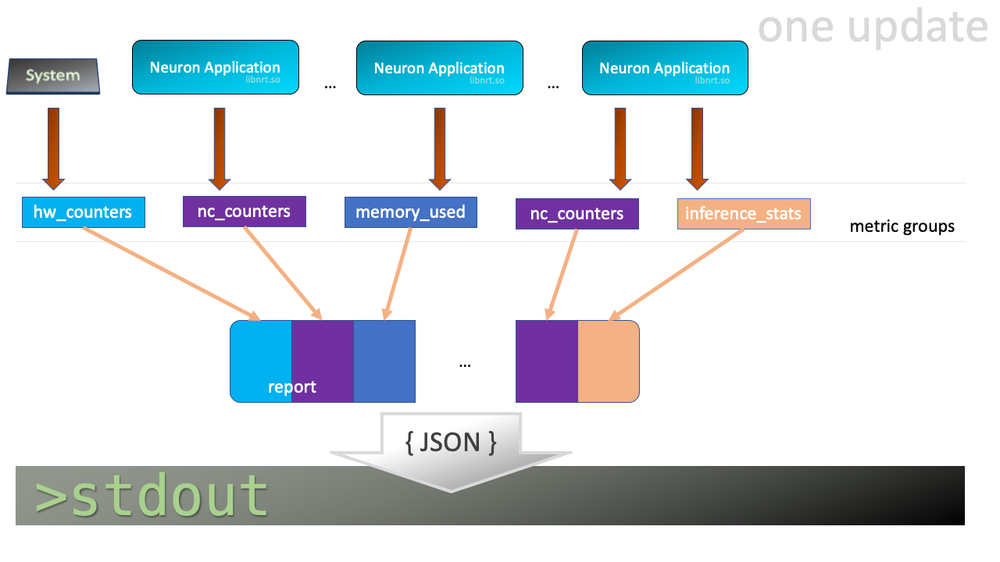

.. _neuron-monitor-ug:

Neuron Monitor User Guide
=========================

.. contents::
   :local:
   :depth: 2

Overview
--------

**neuron-monitor** collects metrics and stats from the Neuron
Applications running on the system and streams the collected data to
``stdout`` in ``JSON`` format. It is provided as part of the
``aws-neuron-tools`` package.

These metrics and stats are organized into **metric groups** which can
be configured by providing a configuration file as described in :ref:`using-neuron-monitor`

When running, **neuron-monitor** will:

-  Collect the data for the metric groups which, based on the elapsed
   time since their last update, need to be updated
-  Take the newly collected data and consolidate it into a large report
-  Serialize that report to JSON and stream it to stdout from where it
   can be consumed by other tools - such as the sample
   `neuron-monitor-cloudwatch.py <#neuron-monitor-cloudwatchpy>`__ and
   `neuron-monitor-prometheus.py <#neuron-monitor-prometheuspy>`__
   scripts.
-  Wait until at least one **metric group** needs to be collected and
   repeat this flow

.. _using-neuron-monitor:

Using neuron-monitor
--------------------

.. _monitor_cli:

.. rubric:: neuron-monitor CLI

.. program:: neuron-monitor

.. option:: neuron-monitor [parameters]

    neuron-monitor accepts the following optional parameters:

    - :option:`--verbose` (int) default=0: Can be 0 to 4, and controls the amount of
      debugging and verbose information sent to stderr; **0: no output**,
      **4: maximum verbosity**

    - :option:`-c, --config-file` (string): Allows specifying a valid path to a
      neuron-monitor JSON configuration file

**Example:**

.. code-block::

    neuron-monitor -c monitor.conf

Not specifying any configuration file will enable collecting all the metric groups
with a period of 5 seconds for all currently running Neuron applications.

Configuration file example
~~~~~~~~~~~~~~~~~~~~~~~~~~
Example of a configuration file which enables all available **metric
groups** for every running Neuron application, with a global update period of 1
second and sets an update period of 2 seconds for the ``"neuron_hw_counters"``
metric group:

::

   {
     "period": "1s",
     "neuron_runtimes": [
       {
         "tag_filter": ".*"
         "metrics": [
           {
             "type": "neuroncore_counters"
           },
           {
             "type": "memory_used"
           },
           {
             "type": "neuron_runtime_vcpu_usage"
           },
           {
             "type": "inference_stats"
           }
         ]
       }
     ],
     "system_metrics": [
       {
         "type": "vcpu_usage"
       },
       {
         "type": "memory_info"
       },
       {
          "period": "2s",
          "type": "neuron_hw_counters"
       }
     ]
   }

Neuron applications tagging
~~~~~~~~~~~~~~~~~~~~~~~~~~~
In order to make application monitoring easier, Neuron applications can be tagged with a 32 character
string which identifies that app. Tagging is done using the ``NEURON_PROCESS_TAG`` environment variable.

For example:
``NEURON_PROCESS_TAG=my_app_1 python run_inferences.py`` will associate the ``my_app_1`` tag with that Python application.
If ``NEURON_PROCESS_TAG`` is not specified, the application's PID will be used as a TAG.

This tag will be used by neuron-monitor to filter Neuron applications.

JSON objects and fields in the configuration file
~~~~~~~~~~~~~~~~~~~~~~~~~~~~~~~~~~~~~~~~~~~~~~~~~

-  ``"neuron_runtimes"`` - array of objects specifying which Neuron
   Applications to monitor and what metric groups are enabled for each
   of them

   -  ``"tag_filter"`` - a regex which will be used to filter Neuron applications tags
      in order to determine if they will be monitored (optional)
   -  ``"metrics"`` - array of objects specifying which metric groups to
      capture for this Neuron application

      -  ``"type"`` - type of metric group

-  ``"period"`` - this field applies to **metric group** objects and
   sets the amount of time between two updates for that metric group

   -  if can be specified as part of the **root** and/or
      **neuron_runtime** objects where it applies to all their children,
      and/or as part of a **metric group** object
   -  if there's no period specified, a default value of **5 seconds**
      will be used

-  ``"system_metrics"`` - array of objects specifying which system level
   metric groups are enabled

Neuron Runtime-level metric groups
~~~~~~~~~~~~~~~~~~~~~~~~~~~~~~~~~~

-  :ref:`neuron-monitor-nc-counters` - NeuronCore related metrics
-  :ref:`neuron-monitor-memory-used` - data on the amount of memory used
   by the Neuron application
-  :ref:`neuron-monitor-vcpu-usage` - Neuron application vCPU
   utilization data
-  :ref:`neuron-monitor-inference-stats` - Neuron application inference
   stats, including error count and latency

System-wide metric groups
~~~~~~~~~~~~~~~~~~~~~~~~~

-  :ref:`neuron-monitor-vcpu-usage` - system-wide vCPU usage
-  :ref:`neuron-monitor-memory-info` - system-wide memory usage
-  :ref:`neuron-monitor-hw-counters` - counters for correctable and
   uncorrectable memory ecc events

Execution model
---------------

|image|

neuron-monitor waits for one or more **metric groups** to be up for
update, then collects the corresponding data, consolidates it into a
report which is streamed to stdout as a JSON and goes back to waiting.

The JSON output format
----------------------

Whenever the report gets updated, a complete JSON is written to stdout.
This is its structure:

::

   {
     "neuron_runtime_data": [
       {
         "pid": 0,
         "address": "",
         "neuron_runtime_tag", "my_app_1",
         "error": "",
         "report": {
           "neuroncore_counters": {
               [...]
           },
           "inference_stats": {
               [...]
           },
           "memory_used": {
               [...]
           },
           "neuron_runtime_vcpu_usage": {
               [...]
           }
         }
       }
     ],
     "system_data": {
       "neuron_hw_counters": {
               [...]
       },
       "vcpu_usage": {
               [...]
       },
       "memory_info": {
               [...]
       }
     },
     "instance_data": {
               [...]
     }
   }

-  ``"neuron_runtime_data"`` is an array containing one entry per each
   Neuron application which passes the filter specified in the settings file

   -  ``"pid"`` is the pid of this Neuron application
   -  ``"neuron_runtime_tag"`` is the configured tag for the Neuron application
   -  ``"error"`` specifies any error that occurred when collecting data
      from this Neuron application
   -  ``"report"`` will contain the results for the Neuron application-level
      metric groups; their formats are described below

-  ``"system_data"`` has a similar structure to ``"neuron_runtime_data"``‘s
   ``"report"`` but only contains system-level metric groups (not
   associated to any Neuron application)

Regardless of the configuration, the following two JSON objects are always present
in the output:

**instance_data**
Contains information about the instance on which neuron-monitor is running.
::

     "instance_data": {
       "instance_name": "My_Instance",
       "instance_id": "i-0011223344556677a",
       "instance_type": "inf1.xlarge",
       "instance_availability_zone": "us-west-2b",
       "instance_availability_zone_id": "usw2-az2",
       "instance_region": "us-west-2",
       "ami_id": "ami-0011223344556677b",
       "subnet_id": "subnet-112233ee",
       "error": ""
     }

Depending on when the instance was launched, the following fields might
not be available:

-  ``instance_availability_zone_id`` : available only for instances
   launched in 2020-08-24 and later
-  ``instance_region`` : available only for instances launched on
   2020-08-24 and later
-  ``instance_name`` : available only if ``instance_region`` is set and
   aws-cli tools are installed

``error`` will contain an error string if getting one of the fields,
**except those mentioned above**, resulted in an error.

**neuron_hardware_info**
Contains basic information about the Neuron hardware.
::

     "neuron_hardware_info": {
       "neuron_device_count": 16,
       "neuroncore_per_device_count": 4,
       "error": ""
     }

-  ``neuron_device_count`` : number of available Neuron Devices
-  ``neuroncore_per_device_count`` : number of NeuronCores present on each Neuron Device
-  ``error`` : will contain an error string if any occurred when getting this information
   (usually due to the Neuron Driver not being installed or not running).

Each **metric group** requested in the settings file will get an entry
in the resulting output. The general format for such an entry is:

::

   "metric_group": {
     "period": 1.015, // Actual captured period, in seconds
     "error": "",     // Error, if any occurred, otherwise an empty string
     [...]            // Metric group specific data
   }

.. _runtime-level-metric-groups-1:

Neuron application level metric groups
--------------------------------------

.. _neuron-monitor-nc-counters:

neuroncore_counters
~~~~~~~~~~~~~~~~~~~~~

::

           "neuroncore_counters": {
             "period": 1.000113182,
             "neuroncores_in_use": {
               "0": {
                 "neuroncore_utilization": 42.01,
               },
               "1": {
                 "neuroncore_utilization": 42.02,
               },
               "2": {
                 "neuroncore_utilization": 42.03,
               },
               "3": {
                 "neuroncore_utilization": 42.04,
               }
             },
             "error": ""
           }

-  ``"neuroncores_in_use"`` is an object containing data for all the
   NeuronCores that were active when the data was captured, indexed by
   NeuronCore index: ``"neuroncore_index": { neuroncore_data }``

   -  ``"neuroncore_utilization"`` - NeuronCore utilization, in percent,
      during the captured period

-  ``"error"`` - string containing any error that occurred when
   collecting the data

.. _neuron-monitor-inference-stats:

inference_stats
~~~~~~~~~~~~~~~

::

           "inference_stats": {
             "period": 1.030613214,
             "error_summary": {
               "generic": 0,
               "numerical": 0,
               "transient": 0,
               "model": 0,
               "runtime": 0,
               "hardware": 0
             },
             "inference_summary": {
               "completed": 123,
               "completed_with_err": 0,
               "completed_with_num_err": 0,
               "timed_out": 0,
               "incorrect_input": 0,
               "failed_to_queue": 0
             },
             "latency_stats": {
               "total_latency": {
                 "p0": 0.01100001,
                 "p1": 0.01100002,
                 "p25": 0.01100004,
                 "p50": 0.01100008,
                 "p75": 0.01100010,
                 "p99": 0.01100012,
                 "p100": 0.01100013
               },
               "device_latency": {
                 "p0": 0.01000001,
                 "p1": 0.01000002,
                 "p25": 0.01000004,
                 "p50": 0.01000008,
                 "p75": 0.01000010,
                 "p99": 0.01000012,
                 "p100": 0.01000013
               }
             },
             "error": ""
           },

-  ``"error_summary"`` is an object containing the error counts for the
   captured period indexed by their type

   -  ``"generic"`` - generic inference errors
   -  ``"numeric"`` - NAN inference errors
   -  ``"transient"`` - recoverable errors, such as ECC corrections
   -  ``"model"`` - model-related errors
   -  ``"runtime"`` - Neuron Runtime / Library errors
   -  ``"hardware"`` - hardware errors such as uncorrectable ECC issues

-  ``"inference_summary"`` is an object containing all inference outcome
   counts for the captured period indexed by their type

   -  ``"completed"`` - inferences completed successfully
   -  ``"completed_with_err"`` - inferences that ended in an error other
      than numeric
   -  ``"completed_with_num_err"`` - inferences that ended in a numeric
      error
   -  ``"timed_out"`` - inferences that took longer than the Neuron
      Runtime configured timeout value
   -  ``"incorrect_input"`` - inferences that failed to start due to
      incorrect input being provided
   -  ``"failed_to_queue"`` - inference requests that were rejected due
      to Neuron Runtime not being able to queue them

-  ``"latency_stats"`` contains two objects containing latency
   percentiles, in seconds, for the data captured for inferences
   executed during the captured period. If there are no inferences being
   executed during this time, the two objects will be ``null`` (i.e.
   ``"total_latency": null``)

   -  ``"total_latency"`` - percentiles, in seconds, representing
      latency for an inference as measured by the Neuron Runtime
   -  ``"device_latency"`` - percentiles, in seconds, representing time
      spent by an inference exclusively on the Neuron device

-  ``"error"`` - string containing any error that occurred when
   collecting the data

.. _neuron-monitor-memory-used:

memory_used
~~~~~~~~~~~

::

           "memory_used": {
             "period": 1.030366715,
             "neuron_runtime_used_bytes": {
               "host": 1000000,
               "neuron_device": 2000000
             },
             "loaded_models": [
               {
                 "name": "my_model",
                 "uuid": "aaaaaaaaaaabbbbbbbbbbb0000000000099999999999",
                 "model_id": 10234,
                 "is_running": true,
                 "memory_used_bytes": {
                   "host": 250000,
                   "neuron_device": 500000
                 },
                 "subgraphs": {
                   "sg00": {
                     "memory_used_bytes": {
                       "host": 250000,
                       "neuron_device": 500000
                     },
                     "neuroncore_index": 2,
                     "neuron_device_index": 0
                   }
                 }
               },
               [...]
             ],
             "error": ""
           },

-  ``"memory_used"`` summarizes the amount of memory used by the
   Neuron application

   -  ``"neuron_runtime_used_bytes"`` - current amount of memory used by
      the Neuron application
   -  all memory usage objects contain these two fields:

      -  ``"host"`` - host DRAM usage in bytes
      -  ``"neuron_device"`` - Neuron device DRAM usage in bytes

-  ``"loaded_models"`` - array containing objects representing loaded
   models

   -  ``"name"`` - name of the model
   -  ``"uuid"`` - unique id for the model
   -  ``"model_id"`` - Neuron application-assigned ID for this model
   -  ``"is_running"`` - true if this model is currently started, false
      otherwise
   -  ``"memory_used_bytes"`` - total memory usage for the model
   -  "``subgraphs"`` - object containing all the subgraph for the model
      indexed by their name: ``"subgraph_name": { subgraph_data }``

      -  ``"memory_used_bytes"`` - memory usage for this subgraph
      -  ``"neuroncore_index"`` - NeuronCore index with which the
         subgraph is associated
      -  ``"neuron_device_index"`` - Neuron device index on which the
         subgraph is loaded

-  ``"error"`` - string containing any error that occurred when
   collecting the data

neuron_runtime_vcpu_usage
~~~~~~~~~~~~~~~~~~~~~~~~~~~

::

           "neuron_runtime_vcpu_usage": {
             "period": 1.030604818,
             "vcpu_usage": {
               "user": 42.01,
               "system": 12.34
             },
             "error": ""
           }

-  ``"vcpu_usage"`` - object showing vCPU usage in percentages for the
   Neuron application during the captured period

   -  ``"user"`` - percentage of time spent in user code by this Neuron
      Application
   -  ``"system"`` - percentage of time spent in kernel code by this
      Neuron application

-  ``"error"`` - string containing any error that occurred when
   collecting the data

System level metric groups
--------------------------

.. _neuron-monitor-hw-counters:

neuron_hw_counters
~~~~~~~~~~~~~~~~~~

::

           "neuron_hw_counters": {
             "period": 1.030359284,
             "neuron_devices": [
               {
                 "neuron_device_index": 0,
                 "mem_ecc_corrected": 0,
                 "mem_ecc_uncorrected": 0,
                 "sram_ecc_uncorrected": 0
               }
             ],
             "error": ""
           },

-  ``"neuron_devices"`` - array containing ECC data for all Neuron devices

   -  ``"neuron_device_index"`` - Neuron device index
   -  ``"mem_ecc_corrected"`` - number of corrected ECC events in the
      Neuron device’s DRAM
   -  ``"mem_ecc_uncorrected"`` - number of uncorrected ECC events in
      the Neuron device’s DRAM
   -  ``"sram_ecc_uncorrected"`` - number of uncorrected ECC events in
      the Neuron device’s SRAM

-  ``"error"`` - string containing any error that occurred when
   collecting the data

.. _neuron-monitor-vcpu-usage:

vcpu_usage
~~~~~~~~~~~~

::

   "vcpu_usage": {
     "period": 0.999974868,
     "average_usage": {
       "user": 32.77,
       "nice": 0,
       "system": 22.87,
       "idle": 39.36,
       "io_wait": 0,
       "irq": 0,
       "soft_irq": 0
     },
     "usage_data": {
       "0": {
         "user": 34.41,
         "nice": 0,
         "system": 27.96,
         "idle": 37.63,
         "io_wait": 0,
         "irq": 0,
         "soft_irq": 0
       },
       "1": {
         "user": 56.84,
         "nice": 0,
         "system": 28.42,
         "idle": 14.74,
         "io_wait": 0,
         "irq": 0,
         "soft_irq": 0
       },
       [...]
     },
     "context_switch_count": 123456,
     "error": ""
   }

-  each vCPU usage object contains the following fields:

   -  ``"user"`` - percentage of time spent in user code
   -  ``"nice"`` - percentage of time spent executing niced user code
   -  ``"system"`` - percentage of time spent executing kernel code
   -  ``"idle"`` - percentage of time spent idle
   -  ``"io_wait"`` - percentage of time spent waiting for IO operations
   -  ``"irq"`` - percentage of time spent servicing hardware interrupts
   -  ``"soft_irq"`` - percentage of time spent servicing software
      interrupts

-  ``"average_usage"`` - contains the average usage across all vCPUs
   during the captured period
-  ``"usage_data"`` - contains per vCPU usage during the captured period
-  ``"context_switch_count"`` - contains the number of vCPU context
   switches during the captured period
-  ``"error"`` - string containing any error that occurred when
   collecting the data

.. _neuron-monitor-memory-info:

memory_info
~~~~~~~~~~~

::

   "memory_info": {
     "period": 5.346411129,
     "memory_total_bytes": 49345835008,
     "memory_used_bytes": 16042344448,
     "swap_total_bytes": 0,
     "swap_used_bytes": 0,
     "error": ""
   }

-  ``"memory_total_bytes"`` - total size of the host memory, in bytes

-  ``"memory_used_bytes"`` - amount of host memory in use, in bytes

-  ``"swap_total_bytes"`` - total size of the host swap file, in bytes

-  ``"swap_used_bytes"`` - amount of swap memory in use, in bytes

.. _neuron-monitor-companion-scripts:

Companion scripts
-----------------

neuron-monitor is installed with two example Python companion script:
`neuron-monitor-cloudwatch.py <#neuron-monitor-cloudwatchpy>`__ and
`neuron-monitor-prometheus.py <#neuron-monitor-prometheuspy>`__.

.. _neuron-monitor-cloudwatchpy:

neuron-monitor-cloudwatch.py
~~~~~~~~~~~~~~~~~~~~~~~~~~~~

It requires Python3 and the `boto3 Python
module <https://boto3.amazonaws.com/v1/documentation/api/latest/guide/quickstart.html#quickstart>`__.
It is installed to:
``/opt/aws/neuron/bin/neuron-monitor-cloudwatch.py``.

.. _using-neuron-monitor-cloudwatchpy:

Using neuron-monitor-cloudwatch.py
^^^^^^^^^^^^^^^^^^^^^^^^^^^^^^^^^^

::

   neuron-monitor | neuron-monitor-cloudwatch.py --namespace <namespace> --region <region>

For example:

::

   neuron-monitor | neuron-monitor-cloudwatch.py --namespace neuron_monitor_test --region us-west-2

.. _neuron-monitor-prometheuspy:

neuron-monitor-prometheus.py
~~~~~~~~~~~~~~~~~~~~~~~~~~~~

It requires Python3 and the `Prometheus client Python
module <https://github.com/prometheus/client_python>`__. It is installed
to: ``/opt/aws/neuron/bin/neuron-monitor-prometheus.py``.

.. _using-neuron-monitor-prometheuspy:

Using neuron-monitor-prometheus.py
^^^^^^^^^^^^^^^^^^^^^^^^^^^^^^^^^^

::

   neuron-monitor | neuron-monitor-prometheus.py --port <port>

For example:

::

   neuron-monitor | neuron-monitor-prometheus.py --port 8008

The default value for ``--port`` is ``8000``.

If your data visualization framework is Grafana, we provided a :neuron-monitor-src:`Grafana
dashboard <neuron-monitor-grafana.json>`
which integrates with Prometheus and this script.

