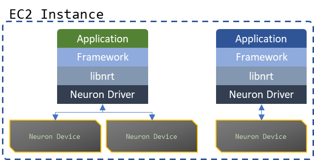
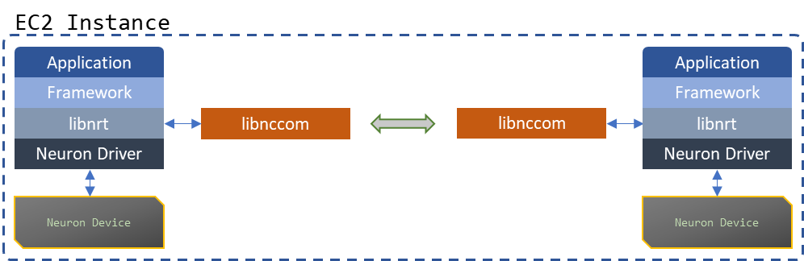
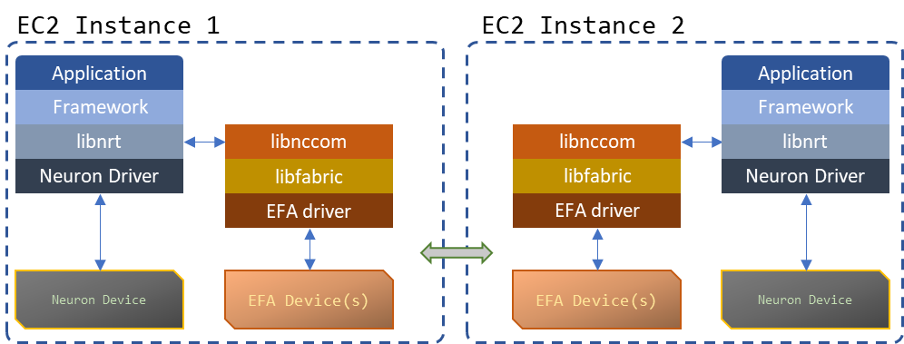
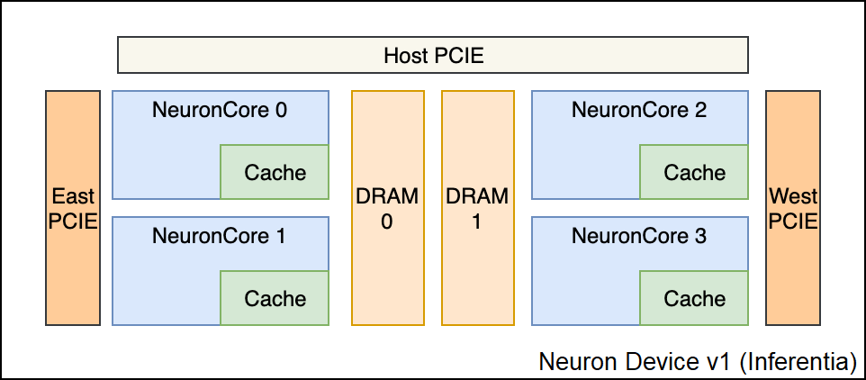
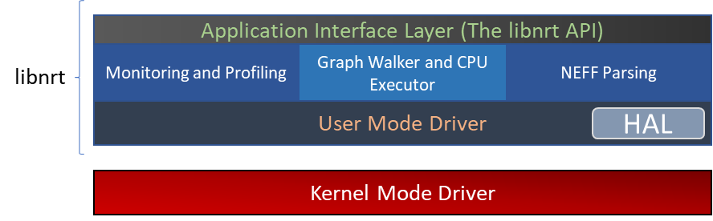
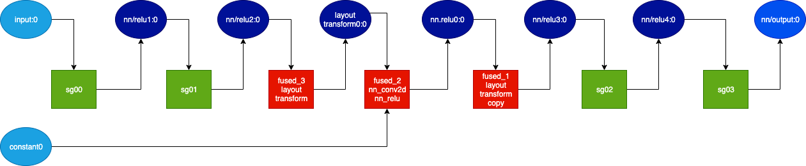
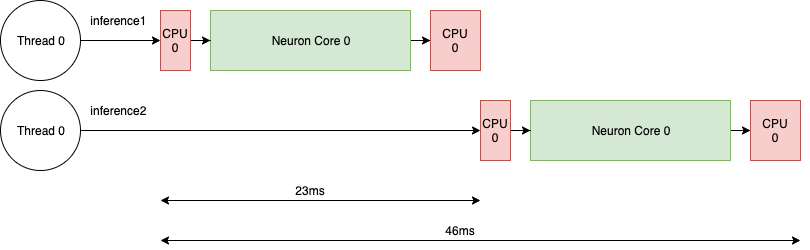
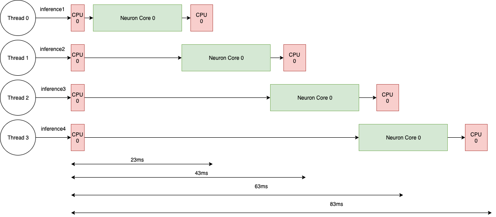
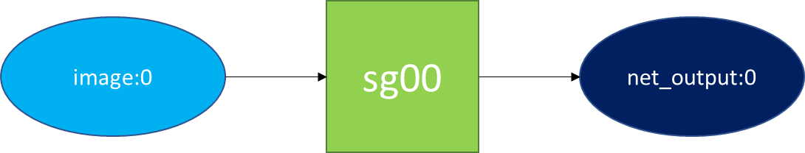

.. _nrt-api-guide:

Developer Guide - NeuronX Runtime
=================================

This guide is intended to support a deeper understanding of the Neuron Runtime and how ML applications are built using the Runtime APIs directly, and focuses on the information you need to know when building custom frameworks that call ``libnrt`` APIs directly from C/C++ apps. It is applicable to developers building their own ML frameworks; if you are using a popular existing framework such as PyTorch, JAX, or TensorFlow, the concepts and techniques discussed in this guide do not apply to your work.

.. note::
    The next few paragraphs provide a brief introduction to the Neuron hardware and the Neuron Runtime architecture. Customers who would rather skip this and jump straight to building their first ML
    application which runs without the aid of an ML framework, should go to :ref:`first_app`.

About the Neuron Runtime Library
--------------------------------

The Neuron Runtime Library (``libnrt``) is the intermediate layer between an application and a framework, and the Neuron driver and Neuron Devices. It provides a C API for initializing the Neuron hardware, staging models and input data, executing inferences and training iterations on the staged models, and retrieving output data. The vast majority of ML applications running on Neuron will follow one of the following 3 architectural templates:

    `Individual processes executing models on one or more Neuron Devices`

    `Processes working together on executing models within the same instance - libnccom (The Neuron Collective Communication Library) handles inter-worker communication`

    `Processes working together on executing models across multiple instances - libnccom, libfabric and the EFA driver handle communication`

.. _reqs:

Requirements
------------

A more comprehensive guide to installing Neuron software can be found in the :ref:`torch_quick_start` guide.

The Neuron Runtime requires the Neuron Driver, which is provided by the ``aws-neuron-dkms`` package. Run the commands below to install the driver for the indicated operating system:

AL2023:

.. code-block:: bash

    sudo dnf install aws-neuronx-dkms

Ubuntu:

.. code-block:: bash

    sudo apt-get install aws-neuronx-dkms

The Runtime Library consists of the ``libnrt.so`` and header files.  These artifacts are version-controlled and installed via the ``aws-neuronx-runtime-lib`` package. After installing the package, you will find the compied library file (``libnrt.so``) in
``/opt/aws/neuron/lib`` and the necessary header files to use the APIs it provides in ``/opt/aws/neuron/include``. Run the commands below to install the runtime library and headers for the indicated operating system:

AL2023:

.. code-block:: bash

    sudo dnf install aws-neuronx-runtime-lib

Ubuntu:

.. code-block:: bash

    sudo apt-get install aws-neuronx-runtime-lib

For applications that use distributed training or distributed inferences, the Neuron Collective Communication Library is required. Run the commands below to the library for the indicated operating system:

AL2023:

.. code-block:: bash

    sudo dnf install aws-neuronx-collectives

Ubuntu:

.. code-block:: bash

    sudo apt-get install aws-neuronx-collectives

In case of multi-instance training, you must also install the EFA driver and the Libfabric library (provided by the EFA installer). Run the command below to install it:

AL2023 & Ubuntu:

.. code-block:: bash

    curl -O https://efa-installer.amazonaws.com/aws-efa-installer-latest.tar.gz
    wget https://efa-installer.amazonaws.com/aws-efa-installer.key && gpg --import aws-efa-installer.key
    cat aws-efa-installer.key | gpg --fingerprint
    wget https://efa-installer.amazonaws.com/aws-efa-installer-latest.tar.gz.sig && gpg --verify ./aws-efa-installer-latest.tar.gz.sig

    tar -xvf aws-efa-installer-latest.tar.gz
    cd aws-efa-installer && sudo bash efa_installer.sh --yes
    cd
    sudo rm -rf aws-efa-installer-latest.tar.gz aws-efa-installer

.. _insttypes:

Introduction to Neuron Hardware
-------------------------------

Neuron Machine Learning Accelerators (or Neuron Devices) are custom accelerators designed to efficiently run  Machine Learning workloads such as inference using a given model or a distributed training job. Depending on the type of workload and its size, customers can opt for the following Neuron-equipped EC2 instances:

.. list-table::
    :widths: 40 40 40 40 40
    :header-rows: 1

    * - Workload type
      - Neuron Device Name
      - Instance type(s)
      - Devices Per Instance
      - Availability
    * - Inference
      - Inferentia II (v3)
      - inf2.xlarge, inf2.8xlarge
      - 1
      - Available Now!
    * - Inference
      - Inferentia II (v3)
      - inf2.24xlarge
      - 6
      - Available Now!
    * - Inference
      - Inferentia II (v3)
      - inf2.48xlarge
      - 12
      - Available Now!
    * - Inference
      - Inferentia (v1)
      - inf1.xlarge, inf1.2xlarge
      - 1
      - Available Now!
    * - Inference
      - Inferentia (v1)
      - inf1.6xlarge
      - 4
      - Available Now!
    * - Inference
      - Inferentia (v1)
      - inf1.24xlarge
      - 16
      - Available Now!
    * - Training
      - Trainium (v2)
      - trn1.2xlarge
      - 1
      - Available Now!
    * - Training
      - Trainium (v2)
      - trn1.32xlarge
      - 16
      - Available Now!

Neuron Device
^^^^^^^^^^^^^

Each Neuron Device consists of multiple execution units called "NeuronCores". They use high-bandwidth device memory and PCIe interfaces to coordinate with the host CPU and other Neuron Devices and components (depending on the Neuron Device version).

To get the number of NeuronCores per Neuron Device, the amount of Neuron Device memory, and the way devices are directly connected, use the ``neuron-ls`` tool by running the following command:

``neuron-ls --topology``

If successful, it will return output like this:

.. code-block:: bash

    instance-type: trn1.32xlarge
    instance-id: i-0633517e496256bf8
    +--------+--------+--------+---------------+---------+
    | NEURON | NEURON | NEURON |   CONNECTED   |   PCI   |
    | DEVICE | CORES  | MEMORY |    DEVICES    |   BDF   |
    +--------+--------+--------+---------------+---------+
    | 0      | 2      | 32 GB  | 12, 3, 4, 1   | 10:1c.0 |
    | 1      | 2      | 32 GB  | 13, 0, 5, 2   | 10:1d.0 |
    | 2      | 2      | 32 GB  | 14, 1, 6, 3   | a0:1c.0 |
    | 3      | 2      | 32 GB  | 15, 2, 7, 0   | a0:1d.0 |
    | 4      | 2      | 32 GB  | 0, 7, 8, 5    | 20:1b.0 |
    | 5      | 2      | 32 GB  | 1, 4, 9, 6    | 20:1c.0 |
    | 6      | 2      | 32 GB  | 2, 5, 10, 7   | 90:1b.0 |
    | 7      | 2      | 32 GB  | 3, 6, 11, 4   | 90:1c.0 |
    | 8      | 2      | 32 GB  | 4, 11, 12, 9  | 20:1d.0 |
    | 9      | 2      | 32 GB  | 5, 8, 13, 10  | 20:1e.0 |
    | 10     | 2      | 32 GB  | 6, 9, 14, 11  | 90:1d.0 |
    | 11     | 2      | 32 GB  | 7, 10, 15, 8  | 90:1e.0 |
    | 12     | 2      | 32 GB  | 8, 15, 0, 13  | 10:1e.0 |
    | 13     | 2      | 32 GB  | 9, 12, 1, 14  | 10:1b.0 |
    | 14     | 2      | 32 GB  | 10, 13, 2, 15 | a0:1e.0 |
    | 15     | 2      | 32 GB  | 11, 14, 3, 12 | a0:1b.0 |
    +--------+--------+--------+---------------+---------+
    Neuron Device Topology
          *        *        *        *
          │        │        │        │
          ▼        ▼        ▼        ▼
    *––►[ 0 ]◄––►[ 1 ]◄––►[ 2 ]◄––►[ 3 ]◄––*
          ▲        ▲        ▲        ▲
          │        │        │        │
          ▼        ▼        ▼        ▼
    *––►[ 4 ]◄––►[ 5 ]◄––►[ 6 ]◄––►[ 7 ]◄––*
          ▲        ▲        ▲        ▲
          │        │        │        │
          ▼        ▼        ▼        ▼
    *––►[ 8 ]◄––►[ 9 ]◄––►[10 ]◄––►[11 ]◄––*
          ▲        ▲        ▲        ▲
          │        │        │        │
          ▼        ▼        ▼        ▼
    *––►[12 ]◄––►[13 ]◄––►[14 ]◄––►[15 ]◄––*
          ▲        ▲        ▲        ▲
          │        │        │        │
          *        *        *        *

|nd_v1|

NeuronCore
^^^^^^^^^^

The NeuronCore is the primary execution unit within the accelerator. Each NeuronCore contains several execution engines
(for different types of compute operations such as tensor-based, vector, and scalar), Direct Memory Access (DMA) engines, and a local cache.

A NeuronCore can operate independently or together with other NeuronCores, depending on the nature of the workload and the way
a model is compiled and loaded to the NeuronCores in the accelerator. Each execution engine can access the cache and DRAM attached to the accelerator device.
Data is transferred between the host CPU and the accelerator device (as well as between the device DRAM and NeuronCores) using DMA, which enables more efficient data movement.

The Neuron Runtime Architecture
-------------------------------

|nrt_arch|

Application Interface Layer (The ``libnrt`` API)
^^^^^^^^^^^^^^^^^^^^^^^^^^^^^^^^^^^^^^^^^^^^^^^^^

The Application Interface Layer allows applications and frameworks to use the available Neuron Devices to run
inference or training workloads. A complete reference of the C interface can be found in :ref:`nrt_api`.

Monitoring and Profiling
^^^^^^^^^^^^^^^^^^^^^^^^

The Neuron Runtime is able to capture key execution metrics which can be read in real-time using ``neuron-monitor`` and
``neuron-top``. ``neuron-monitor`` allows forwarding those metrics to CloudWatch or a Prometheus server, enabling fleet-wide
monitoring - for more on that please refer to the ``neuron-monitor`` usage guide :ref:`neuron-monitor-ug`.
Profiling an execution is another feature of the Neuron Runtime - which provides an API for starting and stopping profiling,
as well as saving the profile data to a file, which can be used by tools such as the Neuron Tensorboard. This API is
documented in :ref:`api_profile` section.

.. _neff-format:

The NEFF format and NEFF Parser
^^^^^^^^^^^^^^^^^^^^^^^^^^^^^^^

A NEFF (Neuron Executable File Format) is a single file container for all the artifacts needed to execute a model on one or more NeuronCores.
A NEFF is the output of the Neuron Compiler (neuron-cc). It contains Neuron machine instructions, pseudo instructions (compiler-generated instructions
which are parsed and replaced with Neuron instructions by the Neuron Runtime when the model loads), tensor information, model parameters and other components
that support the model's execution on one or more NeuronCores.

Operators that are not supported by Neuron can be compiled into CPU-executable binary and included into the NEFF as well.

Usually there is only one subgraph (which is executed on a single NeuronCore) in a NEFF:

.. code-block:: bash

    NEFF Nodes:
        NODE       Executor    Name        Variable       Size    Type    Format            Shape    DataType    TimeSeries
           1    Neuron Core    sg00
                                            image:0    3259008      IN      NHWC    [1 3 552 984]
                                       net_output:0    1323972     OUT      NHWC    [1 78 69 123]                false

In this example, there is a single subgraph, one input, and one output:

|nrt_neff_single|

Some NEFFs can have multiple subgraphs (which are deployed by the runtime on separate NeuronCores) and multiple CPU operators, as demonstrated below:

.. code-block:: bash

    NEFF Nodes:
        NODE       Executor                             Name               Variable    Size    Type    Format        Shape    DataType    TimeSeries
           1    Neuron Core                             sg00
                                                                            input:0       2      IN      NHWC    [1 1 1 1]
                                                                         nn/relu1:0       2     OUT      NHWC    [1 1 1 1]                false
           1    Neuron Core                             sg01
                                                                         nn/relu1:0       2      IN      NHWC    [1 1 1 1]
                                                                         nn/relu2:0       2     OUT      NHWC    [1 1 1 1]                false
           2            CPU         fused_3_layout_transform
                                                                layout_transform0:0       0     OUT                     []
           4            CPU        fused_2_nn_conv2d_nn_relu
                                                                          constant0       2      IN              [1 1 1 1]     float16
                                                                         nn.relu0:0       0     OUT                     []
           5            CPU    fused_1_layout_transform_copy
                                                                         nn/relu3:0       0     OUT                     []
           6    Neuron Core                             sg02
                                                                         nn/relu3:0       2      IN      NHWC    [1 1 1 1]
                                                                         nn/relu4:0       2     OUT      NHWC    [1 1 1 1]                false
           6    Neuron Core                             sg03
                                                                         nn/relu4:0       2      IN      NHWC    [1 1 1 1]
                                                                        nn/output:0       2     OUT      NHWC    [1 1 1 1]                false

The output above is summarized by the graph below:

|nrt_neff|

The nodes marked with dark blue are intermediate tensors that are handled internally by the Neuron Runtime.
The other blue nodes are inputs/outputs. The green colored box indicates the operator is executed on the NeuronCore while
the red color box indicates the execution is done on the CPU.

The NEFF layer in Neuron Runtime is responsible for parsing a NEFF, validating it, and translating pseudo instructions into hardware specific
instructions and DMA descriptors.

Graph Walker and CPU Node Executor
^^^^^^^^^^^^^^^^^^^^^^^^^^^^^^^^^^

As shown in the previous section, a NEFF can contain one or more nodes. During execution, the Neuron Runtime Graph Walker executes each node
one by one and handles copying input and output between each of them. If a node needs to be executed by the CPU, then a corresponding library function, found
in a .so file in the NEFF, is dynamically loaded using ``dlopen()`` during model load and executed during model execution. Since this library function is executed in the calling
thread’s context, the workload can be efficiently parallelized using a multi-threaded approach.

In the example below, each invocation of ``nrt_execute()`` would take 23ms: the first CPU node takes 1ms, the NeuronCore execution takes 20ms and the second CPU node takes 2 ms,
so the total latency is 23ms and the throughput is 43 calls per second (1000/23).

|nrt_neff_s|

If multiple threads are used, subsequent executions would be pipelined inside the runtime, hence increasing the throughput in this case to ~50 (1000/20).

|nrt_neff_m|

User Mode Driver
^^^^^^^^^^^^^^^^

This is the lowest level component of the Neuron Runtime and handles programming the engines, managing memory,
creating DMA descriptors to move data from host and device, handling notifications etc.

Memory Management
~~~~~~~~~~~~~~~~~

The Neuron Runtime is responsible with managing Neuron Device and host memory for the running models. The application is responsibile with
deallocating every loaded model and allocated tensor so the proper deallocation method needs to be called.
For more details, refer to :ref:`nrt_api` documentation.
Tools such as ``neuron-top`` and ``neuron-monitor`` can be used to determine the amount of memory being used at any given time.

.. _first_app:

Building your first Neuron application
----------------------------------------

The simple application presented here loads a NEFF file using the provided binary files' contents as input tensors and saving the output tensors as
binary files. If a file isn't provided for an input tensor, that input tensor will be zero-filled.

Prerequisites
^^^^^^^^^^^^^

Before you start, you must have the following available in your local environment:

* A recent version of GCC C++ compiler
* An installation of the ``aws-neuronx-runtime-lib`` package as described in :ref:`reqs`

Running the built application requires:

* A Neuron-equipped EC2 compute instance as shown in :ref:`insttypes`
* Installing the ``aws-neuronx-runtime-lib`` and the ``aws-neuronx-dkms`` package on the instance as described in :ref:`reqs`
* A NEFF file

Obtain a NEFF file
^^^^^^^^^^^^^^^^^^

When you run a workload through a Neuron framework, the compiled NEFFs are placed in ``/var/tmp/neuron-compile-cache``.
Additionally, setting the ``NEURON_FRAMEWORK_DEBUG`` environment variable to ``1`` before running the workload enables
the compiled NEFFs to be written to the current directory.

Author your code
^^^^^^^^^^^^^^^^

For the purposes of this guide, use the code provided below. If you are developing your own application, review this code to understand how to use the Neuron Runtime in it.

.. code-block:: c

    #include <stdbool.h>
    #include <nrt/nrt.h>
    #include <nrt/nrt_experimental.h>

    #include <stdio.h>
    #include <string.h>
    #include <stdlib.h>
    #include <time.h>
    #include <errno.h>
    #include <sys/mman.h>
    #include <sys/stat.h>
    #include <pthread.h>
    #include <fcntl.h>
    #include <stdint.h>
    #include <unistd.h>

    // Function to mmap a file in the application's memory space,
    // it will return a pointer to the mmapped memory and the size
    // of the mmapped data will be written to *size
    void *mmap_file(const char *filepath, size_t *size) {
        struct stat sb;
        int fd = open(filepath, O_RDONLY);
        if (fd < 0 || fstat(fd, &sb) != 0) {
            fprintf(stderr, "Unable to open %s: %s\n", filepath, strerror(errno));
            return MAP_FAILED;
        }
        *size = sb.st_size;
        return mmap(NULL, sb.st_size, PROT_READ, MAP_PRIVATE, fd, 0);
    }

    #define P_ERR(...) fprintf(stderr, __VA_ARGS__)

    #define CHECK_RESULT(res, expected, ...)    \
        if (res != expected) {                  \
            fprintf(stderr, __VA_ARGS__);       \
            exit(-1);                           \
        }

    // struct used to load input tensors from files
    typedef struct {
        char *name;
        size_t size;
        void *data;
    } input_tensor_info_t;

    // simple container for input_tensor_info_t
    typedef struct {
        input_tensor_info_t *entries;
        int entry_count;
    } input_tensor_info_array_t;

    // Allocate tensorsets and tensors based on the info_array and returns a valid tensorset in out_tset
    // containing all the newly allocated tensors
    NRT_STATUS allocate_tensors(nrt_tensor_info_array_t *info_array, nrt_tensor_usage_t usage_type, nrt_tensor_set_t **out_tset) {
        NRT_STATUS result;
        int tensor_idx;
        nrt_tensor_info_t *tensor_info = NULL;
        nrt_tensor_t *tensor = NULL;

        // We allocate a nrt_tensor_set which acts as a containers for nrt_tensors
        result = nrt_allocate_tensor_set(out_tset);
        if (result != NRT_SUCCESS) {
            P_ERR("Couldn't allocate %s tensorset\n", usage_type == NRT_TENSOR_USAGE_INPUT ? "input" : "output");
        }

        for (tensor_idx = 0; tensor_idx < info_array->tensor_count; tensor_idx++) {
            tensor_info = &info_array->tensor_array[tensor_idx];
            if (tensor_info->usage != usage_type) {
                continue;
            }
            // Allocate the tensor with the name and size found in tensor_info_array
            result = nrt_tensor_allocate(NRT_TENSOR_PLACEMENT_DEVICE, 0, tensor_info->size,
                                         tensor_info->name, &tensor);
            if (result != NRT_SUCCESS) {
                P_ERR("Couldn't allocate tensor %s\n", tensor_info->name);
                return result;
            }
            // Finally add the tensors to the newly allocated tensor set
            result = nrt_add_tensor_to_tensor_set(*out_tset, tensor_info->name, tensor);
            if (result != NRT_SUCCESS) {
                P_ERR("Couldn't add tensor %s to tensorset\n", tensor_info->name);
                return result;
            }
        }
        return NRT_SUCCESS;
    }

    // Tensor iterator handler - returns false if the iteration needs to stop
    typedef bool (*tensor_handler)(nrt_tensor_t *, nrt_tensor_info_t *, NRT_STATUS *, void *);

    // Iterates through all the tensors in the given tensorset, based on the data in info_array for the given usage_type
    // and calls the handler function with the provided args pointer
    // Will return the first error returned by a handler
    NRT_STATUS iterate_tensors(nrt_tensor_set_t *tset, nrt_tensor_info_array_t *info_array, nrt_tensor_usage_t usage_type,
                               tensor_handler handler, void *args) {
        NRT_STATUS result = NRT_SUCCESS;
        NRT_STATUS final_result = NRT_SUCCESS;
        int tensor_idx;
        nrt_tensor_info_t *tensor_info = NULL;
        nrt_tensor_t *tensor = NULL;

        for (tensor_idx = 0; tensor_idx < info_array->tensor_count; tensor_idx++) {
            tensor_info = &info_array->tensor_array[tensor_idx];
            if (tensor_info->usage != usage_type) {
                continue;
            }
            result = nrt_get_tensor_from_tensor_set(tset, tensor_info->name, &tensor);
            if (result != NRT_SUCCESS) {
                P_ERR("Tensor %s not found in tensor set\n", tensor_info->name);
                continue;
            }
            result = NRT_SUCCESS;
            if ((*handler)(tensor, tensor_info, &result, args) == false) {
                return result;
            }
            if (final_result == NRT_SUCCESS && result != final_result) {
                final_result = result;
            }
        }
        return final_result;
    }

    // Tensor iteration handler that checks if a tensor has an input file associated with it
    // based on the CLI args
    bool handler_load_inputs(nrt_tensor_t *tensor, nrt_tensor_info_t *tensor_info, NRT_STATUS *result, void* args) {
        NRT_STATUS res;
        int idx;
        input_tensor_info_array_t *info_array = (input_tensor_info_array_t *)args;
        bool input_found = false;

        for (idx = 0; idx < info_array->entry_count; idx++) {
            if (strcmp(info_array->entries[idx].name, tensor_info->name) != 0) {
                continue;
            }
            if (info_array->entries[idx].size != tensor_info->size) {
                P_ERR("Input file for tensor %s has incorrect size %lu, expected %lu\n",
                      tensor_info->name, info_array->entries[idx].size, tensor_info->size);
                break;
            }
            res = nrt_tensor_write(tensor, info_array->entries[idx].data, 0, tensor_info->size);
            if (res != NRT_SUCCESS) {
                P_ERR("Unable to write content to input tensor %s\n", tensor_info->name);
            } else {
                input_found = true;
            }
        }
        if (!input_found) {
            fprintf(stderr, "Input tensor %s will be zero-filled\n", tensor_info->name);
        }
        *result = NRT_SUCCESS;
        return true;
    }

    // Tensor iteration handler that saves outputs
    bool handler_save_outputs(nrt_tensor_t *tensor, nrt_tensor_info_t *tensor_info, NRT_STATUS *result, void* args) {
        static char filename[280];

        int fd;
        // Allocating a buffer large enough to read the entire tensor
        void *tensor_data = malloc(tensor_info->size);

        *result = NRT_SUCCESS;
        if (tensor_data == NULL) {
            fprintf(stderr, "Unable to allocate memory for saving output tensor %s\n", tensor_info->name);
            *result = NRT_FAILURE;
            return true;
        }
        // Reading the tensor to the newly allocated buffer
        *result = nrt_tensor_read(tensor, tensor_data, 0, tensor_info->size);
        if (*result != NRT_SUCCESS) {
            fprintf(stderr, "Unable to read tensor %s\n", tensor_info->name);
            free(tensor_data);
            return true;
        }

        // Saving the tensor to a file
        snprintf(filename, 280, "%s.out", tensor_info->name);
        fd = open(filename, O_WRONLY | O_CREAT | O_TRUNC, 0644);
        if (fd < 0) {
            fprintf(stderr, "Unable to open %s for writing\n", filename);
            free(tensor_data);
            *result = NRT_FAILURE;
            return true;
        }
        if (write(fd, tensor_data, tensor_info->size) != tensor_info->size) {
            *result = NRT_FAILURE;
            fprintf(stderr, "Unable to write tensor %s contents to file %s\n", tensor_info->name, filename);
        }
        close(fd);

        free(tensor_data);
        return true;
    }

    // Tensor iteration handler that deallocates tensors
    bool handler_free_tensor(nrt_tensor_t *tensor, nrt_tensor_info_t *tensor_info, NRT_STATUS *result, void* args) {
        *result = NRT_SUCCESS;
        nrt_tensor_free(&tensor);
        return true;
    }

    int main(int argc, char *argv[]) {
        NRT_STATUS result;
        int idx = 0;
        int tensor_idx = 0;
        void *neff_data = NULL;
        size_t neff_size = 0;
        void *input_data = NULL;

        input_tensor_info_array_t input_tensor_info_array = {0};
        input_tensor_info_t *current_input = NULL;

        nrt_model_t *model = NULL;
        nrt_tensor_set_t *inputs = NULL;
        nrt_tensor_set_t *outputs = NULL;

        nrt_tensor_t *tensor = NULL;
        nrt_tensor_info_array_t *tensor_info_array = NULL;

        if (argc < 2) {
            fprintf(stderr, "Incorrect number of args, usage: exec_test file.neff [input_1_name] [input_1_file] ...\n");
            exit(-1);
        }

        // Try mmapping the NEFF file first, so we can fail fast if not found or
        // mmap fails
        neff_data = mmap_file(argv[1], &neff_size);
        if (neff_data == MAP_FAILED) {
            fprintf(stderr, "Unable to map file %s\n", argv[1]);
            exit(-1);
        }

        // mmap input tensor files (if any provided) and fill the input_tensor_info array
        if (argc > 3) {
            input_tensor_info_array.entries = malloc((argc - 2 / 2) * sizeof(input_tensor_info_t));
            for (idx = 2; idx < argc; idx += 2) {
                if (idx + 1 >= argc) {
                    break;
                }
                current_input = &input_tensor_info_array.entries[input_tensor_info_array.entry_count];
                input_data = mmap_file(argv[idx + 1], &current_input->size);
                if (input_data == MAP_FAILED) {
                    fprintf(stderr, "Unable to mmap inputs file %s\n", argv[idx + 1]);
                    continue;
                }
                current_input->name = argv[idx];
                current_input->data = input_data;
                input_tensor_info_array.entry_count++;
            }
        }

        // Before calling any nrt API, nrt_init must be called
        // Since this is not running as part of a framework, the correct parameter for 'framework' is
        // NRT_FRAMEWORK_TYPE_NO_FW and the others can be empty strings
        result = nrt_init(NRT_FRAMEWORK_TYPE_NO_FW, "", "");
        CHECK_RESULT(result, NRT_SUCCESS, "NRTLIB could not be initialized, error: %d\n", (int)result);

        // Loading the NEFF
        printf("Loading NEFF\n");
        result = nrt_load(neff_data, neff_size, -1, -1, &model);
        CHECK_RESULT(result, NRT_SUCCESS, "Unable to load NEFF\n");

        // In order to allocate tensors, first we need to call nrt_get_model_tensor_info which
        // will give us the model tensors' names and sizes in tensor_info_array
        printf("Getting IO tensor information\n");
        result = nrt_get_model_tensor_info(model, &tensor_info_array);
        CHECK_RESULT(result, NRT_SUCCESS, "Unable to get model tensor information\n");

        // Allocating tensors
        printf("Creating I/O data (%ld tensors)\n", tensor_info_array->tensor_count);
        result = allocate_tensors(tensor_info_array, NRT_TENSOR_USAGE_INPUT, &inputs);
        CHECK_RESULT(result, NRT_SUCCESS, "Error allocating input tensors\n");
        result = allocate_tensors(tensor_info_array, NRT_TENSOR_USAGE_OUTPUT, &outputs);
        CHECK_RESULT(result, NRT_SUCCESS, "Error allocating input tensors\n");

        // Loading input files (if provided)
        iterate_tensors(inputs, tensor_info_array, NRT_TENSOR_USAGE_INPUT, handler_load_inputs,
                        (void*) &input_tensor_info_array);

        // Executing model using the tensors in the inputs tensorset and writing the outputs to the tensors
        // in the outputs tensorset
        result = nrt_execute(model, inputs, outputs);
        CHECK_RESULT(result, NRT_SUCCESS, "Error during model execution: %d\n", result);

        // Saving outputs to files
        result = iterate_tensors(outputs, tensor_info_array, NRT_TENSOR_USAGE_OUTPUT, handler_save_outputs, NULL);
        if (result != NRT_SUCCESS) {
            P_ERR("Error saving outputs to files\n");
        }

        // Unloading the model
        result = nrt_unload(model);
        if (result != NRT_SUCCESS) {
            P_ERR("Unable to unload NEFF\n");
        }

        printf("Freeing tensors\n");
        iterate_tensors(inputs, tensor_info_array, NRT_TENSOR_USAGE_INPUT, handler_free_tensor, NULL);
        iterate_tensors(outputs, tensor_info_array, NRT_TENSOR_USAGE_OUTPUT, handler_free_tensor, NULL);

        nrt_destroy_tensor_set(&inputs);
        nrt_destroy_tensor_set(&outputs);

        printf("Deallocating model tensor info\n");
        // We are done with the tensor_info_array, we can dispose of it
        nrt_free_model_tensor_info(tensor_info_array);

        printf("Deallocating inputs tensor info\n");
        // Unmapping the input files
        for (tensor_idx = 0; tensor_idx < input_tensor_info_array.entry_count; tensor_idx++) {
            munmap(input_tensor_info_array.entries[tensor_idx].data, input_tensor_info_array.entries[tensor_idx].size);
        }
        if (input_tensor_info_array.entries) {
            free(input_tensor_info_array.entries);
        }

        // Clean-up the runtime
        printf("Cleaning up the runtime\n");
        nrt_close();

        printf("DONE\n");
    }

Building the example:

.. code-block:: bash

    gcc run_neff.c -o run_neff -lnrt -pthread -I/opt/aws/neuron/include -L/opt/aws/neuron/lib

Running the example:

.. code-block:: bash

    ./run_neff my.neff [input_1] [input_1.bin] [input_2] [input_2.bin] ...

Review of the example code
^^^^^^^^^^^^^^^^^^^^^^^^^^

This section breaks down the code example above to better illustrate the structure, flow, and calls in it.

Initialization and cleanup
~~~~~~~~~~~~~~~~~~~~~~~~~~

.. code-block:: c

    // ...
    result = nrt_init(NRT_FRAMEWORK_TYPE_NO_FW, "", "");
    // ...
    nrt_close();

The Neuron Runtime is initialized by calling ``nrt_init`` and all applications should call ``nrt_close`` once they're done
using it. For more details on these functions, go to the :ref:`api_init` section.

Loading the NEFF
~~~~~~~~~~~~~~~~

Once the contents of a NEFF file have been mapped to virtual memory using ``mmap``,  load the NEFF with ``nrt_load``.

.. code-block:: c

    // ...
    void *mmap_file(const char *filepath, size_t *size) {
        struct stat sb;
        int fd = open(filepath, O_RDONLY);
        if (fd < 0 || fstat(fd, &sb) != 0) {
            fprintf(stderr, "Unable to open %s: %s\n", filepath, strerror(errno));
            return MAP_FAILED;
        }
        *size = sb.st_size;
        return mmap(NULL, sb.st_size, PROT_READ, MAP_PRIVATE, fd, 0);
    }
    // ...
    neff_data = mmap_file(argv[1], &neff_size);

The runtime will decide the optimal placement for the model. Specifically, it chooses the optimal NeuronCore on which to deploy the model.

.. code-block:: c

    // ...
    result = nrt_load(neff_data, neff_size, -1, -1, &model);
    // ...

The call to ``nrt_load`` returns a valid model handle of type ``nrt_model_t*``, which you can use for other calls to the Runtime API (such as ``nrt_execute``).

For more details on the model API (including ``nrt_load``), see :ref:`api_model`.

Creating input/output tensors
~~~~~~~~~~~~~~~~~~~~~~~~~~~~~

The main container for tensors is the ``nrt_tensor_set_t*``. Tensors (``nrt_tensor_t*``) are not passed directly to the NEFF execution function (``nrt_execute``); rather,
they have to be wrapped as ``nrt_tensor_set_t*``. The ``allocate_tensors`` function allocates the tensorset and the tensors for the requested usage type
(``NRT_TENSOR_USAGE_INPUT`` or ``NRT_TENSOR_USAGE_OUTPUT``) and returns the tensorset containing the allocated tensors in ``out_tset``.

.. code-block:: c

    NRT_STATUS allocate_tensors(nrt_tensor_info_array_t *info_array, nrt_tensor_usage_t usage_type, nrt_tensor_set_t **out_tset) {
        // ...
        // We allocate a nrt_tensor_set which acts as a containers for nrt_tensors
        result = nrt_allocate_tensor_set(out_tset);
        // ...

        for (tensor_idx = 0; tensor_idx < info_array->tensor_count; tensor_idx++) {
            tensor_info = &info_array->tensor_array[tensor_idx];
            if (tensor_info->usage != usage_type) {
                continue;
            }
            // ...
            // Allocate the tensor with the name and size found in tensor_info_array
            result = nrt_tensor_allocate(NRT_TENSOR_PLACEMENT_DEVICE, 0, tensor_info->size,
                                         tensor_info->name, &tensor);
            // ...
            // Finally add the tensors to the newly allocated tensor set
            result = nrt_add_tensor_to_tensor_set(*out_tset, tensor_info->name, tensor);
            // ...
        }
        // ...
    }

Iterating through tensors in an nrt_tensor_set_t
~~~~~~~~~~~~~~~~~~~~~~~~~~~~~~~~~~~~~~~~~~~~~~~~

A helper function, ``iterate_tensors``, is defined and implemented to iterate through the ``nrt_tensor_t`` values in a tensorset and call the function
``handler`` for each of them. If the handler function returns ``false``, iteration ends. ``iterate_tensors`` returns the first error
reported by the handler function.

.. code-block:: c

    // Tensor iterator handler - returns false if the iteration needs to stop
    typedef bool (*tensor_handler)(nrt_tensor_t *, nrt_tensor_info_t *, NRT_STATUS *, void *);

    NRT_STATUS iterate_tensors(nrt_tensor_set_t *tset, nrt_tensor_info_array_t *info_array, nrt_tensor_usage_t usage_type,
                               tensor_handler handler, void *args) {
    // ...
    for (tensor_idx = 0; tensor_idx < info_array->tensor_count; tensor_idx++) {
        // ...
        result = nrt_get_tensor_from_tensor_set(tset, tensor_info->name, &tensor);
        // ...
        if ((*handler)(tensor, tensor_info, &result, args) == false) {
            return result;
        }
        // ...
    }

Deallocating input/output tensors
~~~~~~~~~~~~~~~~~~~~~~~~~~~~~~~~~

After the execution is complete, the tensors are deallocated using ``iterate_tensors`` and the tensorsets are deallocated
using ``nrt_destroy_tensor_set``:

.. code-block:: c

    iterate_tensors(inputs, tensor_info_array, NRT_TENSOR_USAGE_INPUT, handler_free_tensor, NULL);
    iterate_tensors(outputs, tensor_info_array, NRT_TENSOR_USAGE_OUTPUT, handler_free_tensor, NULL);

    nrt_destroy_tensor_set(&inputs);
    nrt_destroy_tensor_set(&outputs);

The ``handler_free_tensor`` function simply deallocates the given tensor:

.. code-block:: c

    bool handler_free_tensor(nrt_tensor_t *tensor, nrt_tensor_info_t *tensor_info, NRT_STATUS *result, void* args) {
        // ...
        nrt_tensor_free(&tensor);
        // ...
    }

Executing the NEFF
~~~~~~~~~~~~~~~~~~

Execute the NEFF by calling ``nrt_execute``. If ``nrt_execute`` completes successfully, the output tensors are
read and saved to files (one binary file per output tensor) using ``iterate_tensors``:

.. code-block:: c

    // Executing model using the tensors in the inputs tensorset and writing the outputs to the tensors
    // in the outputs tensorset
    result = nrt_execute(model, inputs, outputs);
    // ...
    // Saving outputs to files
    result = iterate_tensors(outputs, tensor_info_array, NRT_TENSOR_USAGE_OUTPUT, handler_save_outputs, NULL);

The iteration handler reads the tensor data and writes it to a file with the same name as the tensor:

.. code-block:: c

    bool handler_save_outputs(nrt_tensor_t *tensor, nrt_tensor_info_t *tensor_info, NRT_STATUS *result, void* args) {
        // ...
        void *tensor_data = malloc(tensor_info->size);
        // ...
        // Reading the tensor to the newly allocated buffer
        *result = nrt_tensor_read(tensor, tensor_data, 0, tensor_info->size);
        // ...

        // Saving the tensor to a file
        snprintf(filename, 280, "%s.out", tensor_info->name);
        fd = open(filename, O_WRONLY | O_CREAT | O_TRUNC, 0644);
        // ...
        if (write(fd, tensor_data, tensor_info->size) != tensor_info->size) {
            // ...
        }
        close(fd);

For more details on the execution API, go to the :ref:`api_exec` section.

.. _nrt_api:

The LIBNRT API
------------------

API Return Codes
^^^^^^^^^^^^^^^^

All API calls return an ``NRT_STATUS`` value representing the return status of the call. In case of an error, an error message
is logged (based on the logging settings). The table below contains all the possible error codes. Note that some error codes only apply to certain API calls. 
For more details on these errors, refer the :ref:`nrt-troubleshooting` docs.

.. list-table::
    :widths: 40 20 260
    :header-rows: 1

    * - Name
      - Return Code
      - Error
    * - ``NRT_SUCCESS``
      - 0
      - Call was successful
    * - ``NRT_FAILURE``
      - 1
      - Generic failure
    * - ``NRT_INVALID``
      - 2
      - Invalid NEFF, bad instruction, bad DMA descriptor, input tensor name/size does not match the model, etc.
    * - ``NRT_INVALID_HANDLE``
      - 3
      - Invalid handle (e.g. an invalid model handle)
    * - ``NRT_RESOURCE``
      - 4
      - Failed to allocate a resource for the requested operation
    * - ``NRT_TIMEOUT``
      - 5
      - Operation timed out
    * - ``NRT_HW_ERROR``
      - 6
      - Hardware failure
    * - ``NRT_QUEUE_FULL``
      - 7
      - Too many pending ``nrt_execute()`` requests. The runtime request queue is full. Cannot enqueue more ``nrt_execute()`` requests
    * - ``NRT_LOAD_NOT_ENOUGH_NC``
      - 9
      - The number of available NeuronCores is insufficient for the requested operation
    * - ``NRT_UNSUPPORTED_NEFF_VERSION``
      - 10
      - NEFF version unsupported
    * - ``NRT_UNINITIALIZED``
      - 13
      - Returned when attempting an API call when the library is not initialized
    * - ``NRT_CLOSED``
      - 14
      - Returned when attempting an API call after ``nrt_close()`` was called
    * - ``NRT_EXEC_BAD_INPUT``
      - 1002
      - Invalid input has been submitted to nrt_execute()
    * - ``NRT_EXEC_COMPLETED_WITH_NUM_ERR``
      - 1003
      - Execution completed with numerical errors (produced NaN)
    * - ``NRT_EXEC_COMPLETED_WITH_ERR``
      - 1004
      - Execution was completed with other errors, either logical (event double clear), or hardware (parity error)
    * - ``NRT_EXEC_NC_BUSY``
      - 1005
      - The NeuronCore is locked (in use) by another model/thread
    * - ``NRT_OOB``
      - 1006
      - One or more indirect memcopies and/or embedding updates are out of bound due to input corruptions
    * - ``NRT_EXEC_HW_ERR_COLLECTIVES``
      - 1200
      - Suspected hang in collectives operation due to hardware errors on this or other workers.
    * - ``NRT_EXEC_HW_ERR_HBM_UE``
      - 1201
      - HBM Unrepairable Uncorrectable hardware error caused incorrect results 
    * - ``NRT_EXEC_HW_ERR_NC_UE``
      - 1202
      - NeuronCore parity errors caused incorrect results
    * - ``NRT_EXEC_HW_ERR_DMA_ABORT``
      - 1203
      - The DMA engine encountered an error and halted execution
    * - ``NRT_EXEC_SW_NQ_OVERFLOW``
      - 1204
      - Execution timed out due to dropped notifications. Likely caused by Hardware DMA Generation Engine (DGE) notifications
    * - ``NRT_EXEC_HW_ERR_REPAIRABLE_HBM_UE``
      - 1205
      - HBM Repairable Uncorrectable hardware error caused incorrect results
    * - ``NRT_NETWORK_PROXY_FAILURE``
      - 1206
      - Network communication failed between Neuron hardware and Collectives

.. _api_init:

Initialization, configuration and teardown
^^^^^^^^^^^^^^^^^^^^^^^^^^^^^^^^^^^^^^^^^^

.. c:function:: NRT_STATUS nrt_init(nrt_framework_type_t framework, const char *fw_version, const char *fal_version)

    Initializes the Neuron Runtime’s internal state and the Neuron hardware’s state.
    This should be called before any other nrt_* call is attempted, although a small set of functions
    are exempt from this rule (such as ``nrt_get_total_nc_count`` and ``get_nrt_version``). Any call to the NRT
    library API will return ``NRT_FAILURE`` if ``nrt_init`` has not been called beforehand for any API call requires it.

    The runtime is configured by setting the appropriate environment variable before this API call.
    The list of available environment variables is found in the :ref:`api_config` section.

    :param framework: Can be one of:

        ``NRT_FRAMEWORK_TYPE_INVALID,                 // Invalid framework
        NRT_FRAMEWORK_TYPE_NO_FW,                   // No framework
        NRT_FRAMEWORK_TYPE_TENSORFLOW,              // Tensorflow
        NRT_FRAMEWORK_TYPE_PYTORCH,                 // Pytorch
        NRT_FRAMEWORK_TYPE_MXNET                    // Mxnet``

        This argument is used by our Neuron Tools to determine the type of application running,
        it has no other impact on the functioning of the runtime.
        Application using a custom framework or calling the Neuron Runtime directly should use ``NRT_FRAMEWORK_TYPE_NO_FW``.

    :param const char *fw_version: version of the framework on top of which this runtime is running
    :param const char *fal_version: version of the framework adapter on top of which this runtime is running

    Applications using `NRT_FRAMEWORK_TYPE_NO_FW` for the first argument should use two empty strings for the versions.

.. _api_config:

Environment variables used to configure the Runtime Library
~~~~~~~~~~~~~~~~~~~~~~~~~~~~~~~~~~~~~~~~~~~~~~~~~~~~~~~~~~~

``NEURON_RT_LOG_LOCATION=<CONSOLE/SYSLOG>, default=CONSOLE``
    Chooses the output target for the Neuron Runtime logs (either console or syslog).

``NEURON_RT_LOG_LEVEL=<ERROR/WARN/INFO/DEBUG/TRACE>, default=ERROR``
    Specifies the logging verbosity for the Neuron Runtime library, from ERROR (least verbose), to TRACE (most verbose).

``NEURON_RT_NUM_CORES=<n>``
    Specifies how many NeuronCores are needed for the application. During ``nrt_init`` the requested number of NeuronCores are **exclusively** associated with the calling processes and
    become unavailable to any other process attempting to use them. If there aren't enough NeuronCores available, ``nrt_init`` will return an error. Once the owner process has called ``nrt_close``
    or exited, the NeuronCores are released and become available  to be associated with another process. By default, all NeuronCores present on the instance will be made available to the caller.

``NEURON_RT_VISIBLE_CORES=<m,n,p-q>``
    Similarly to the previous, it allows the calling process to get exclusive access to a set of NeuronCores, but it allows explicitly specifying which NeuronCores are available for the application based on their zero-based indices.
    This variable can be a list of NeuronCores, for example: ``NEURON_RT_VISIBLE_CORES=3,4,5,6``, a range of NeuronCores, for example: ``NEURON_RT_VISIBLE_CORES=3-6``, or a combination of both: ``NEURON_RT_VISIBLE_CORES=3-5,6``.
    The resulting range must be contiguous, for example this is not valid: ``NEURON_RT_VISIBLE_CORES=3,5,6`` because 4 is missing from the list, and indices need to be provided in consecutive increasing order.

    .. note::

        If both ``NEURON_RT_VISIBLE_CORES`` are ``NEURON_RT_NUM_CORES`` are defined, ``NEURON_RT_VISIBLE_CORES`` will be used.

``NEURON_RT_ROOT_COMM_ID=<ip_address:port>``
    Mandatory for applications that run workloads containing Collective Communication operators, allows specifying the IP address and assign a port for the rank 0 worker in the Collective Compute worker pool.
    For example: ``NEURON_RT_ROOT_COMM_ID=10.0.1.2:46820``.

``NEURON_RT_STOCHASTIC_ROUNDING_SEED=<value>``
    Allows setting a value for the stochastic rounding seed. Has no effect on inf1.

``NEURON_RT_DEBUG_MEMLOG_MAX_SIZE=<value>, default=1024*1024``
    Allows changing the number of entries in the memory allocations log. This log contains an entry for every allocation and deallocation and will be dumped to a file in case of a memory allocation failure in CSV format.

.. c:function::  NRT_STATUS nrt_close()

    Closes all the devices used by the application (as defined by ``NEURON_RT_NUM_CORES``/``NEURON_RT_VISIBLE_CORES``)
    and cleans up the runtime state. Note that once ``nrt_close`` has been called, most nrt_* API calls will fail if attempted.

.. _api_model:

The Model API
^^^^^^^^^^^^^

.. c:function:: NRT_STATUS nrt_load(const void *neff_bytes, size_t size, int32_t start_nc, int32_t nc_count, nrt_model_t **model)

    Loads a NEFF file whose content is found in `neff_bytes`, with the given size, placing it on ``nc_count`` NeuronCores starting with NeuronCore index `start_nc`.
    If either ``nc_count`` or ``start_nc`` are -1, an optimal value for each will be determined automatically. The model can be configured using a list of environment
    variables read inside this API call which can be found in the :ref:`model_env` section. It returns a handle to the loaded model in the ``nrt_model_t*``
    pointer if the call succeeds. The returned handle represents the loaded model and can be used with calls that operate on an ``nrt_model_t*`` (such as ``nrt_execute``).

    :param neff_bytes: Pointer to existing NEFF file data
    :param size: Size of data in ``neff_bytes``
    :param start_nc: Index of the NeuronCore on which to stage the model. The first NeuronCore owned by the application will always have the index ``0`` - for example, even if when setting ``NEURON_RT_VISIBLE_CORES=3,4``, the two NeuronCores will be referred to as ``0`` and ``1``. If -1, an optimal index will be automatically determined (based on current NeuronCore usage).
    :param nc_count: Number of NeuronCores on which to stage the model. If its value is a multiple of the amount of NeuronCores needed by the model, the model will be replicated on the number of NeuronCores specified in the argument. This feature is called **TBD** and it will be explained in detail in a separate section. If its value is -1, the model will be staged a single time, using the number of cores needed by a single instance of the model.
    :param model: Model handle returned by the call which can be passed to other functions that operate on models (such as ``nrt_execute``).

.. _model_env:

Environment variables used to configure a model being loaded
~~~~~~~~~~~~~~~~~~~~~~~~~~~~~~~~~~~~~~~~~~~~~~~~~~~~~~~~~~~~

``NEURON_RT_EXEC_TIMEOUT=<n>, default=30 (inf1), default=600(trn1,inf2)``
    Maximum of time, in seconds, allowed for one execution before timing out - which will cause the call to ``nrt_execute`` to fail and return ``NRT_TIMEOUT``.

``NEURON_RT_VALIDATE_HASH=<true/false>, default=false``
    Verify the integrity of NEFF data being loaded by checking against a checksum found in the header.

``NEURON_RT_STOCHASTIC_ROUNDING_EN=<true/false>, default=false``
    Enable stochastic rounding.

.. c:function:: NRT_STATUS nrt_load_collectives(const void *neff_bytes, size_t size, int32_t start_nc, int32_t nc_count, uint32_t g_device_id, uint32_t g_device_count, nrt_model_t **model)

    Same as ``nrt_load`` (same environment variables can be used to configure the model), but must be used when loading NEFFs containing Collective Communication operators. Uses the same arguments as `nrt_load`, but adds 2 extra ones.

    :param neff_bytes: Pointer to existing NEFF file data
    :param size: Size of data in ``neff_bytes``
    :param start_nc: Index of NeuronCore on which to stage the model. If -1, an optimal index will be automatically determined (based on current NeuronCore usage).
    :param nc_count: Number of NeuronCores on which to stage the model. If its value is a multiple of the amount of NeuronCores needed by the model, the model will be replicated on the number of NeuronCores specified in the argument. This feature is called **TBD** and it will be explained in detail in a separate section. If its value is -1, the model will be staged a single time, using the number of cores needed by a single instance of the model.
    :param g_device_id: Globally unique ID within the Collective Communication world associated with this model instance.
    :param g_device_count: Size of the Collective Communication world (total number of participating unique IDs).
    :param model: Model handle returned by the call which can be passed to other functions that operate on models (such as ``nrt_execute``).

.. c:function:: NRT_STATUS nrt_unload(nrt_model_t *model)

    Unloads the given model and frees up device and host resources.

    :param model: Pointer to model to unload. All data associated with the model is deleted, do not reuse the pointer or try to deallocate it afterwards. Do not call ``nrt_unload`` again on the same ``nrt_model_t*`` pointer (think of it as a call to `free()`).

.. c:function:: NRT_STATUS nrt_get_model_nc_count(const nrt_model_t *model, uint32_t *nc_count)

    Gets the number of NeuronCores used by the model and writes that value at the address pointed by ``nc_count``.

    :param model: Valid pointer to an ``nrt_model_t``.
    :param nc_count: If the call completes successfully, the pointed address will contain the number of NeuronCores used by the model.

.. c:function:: NRT_STATUS nrt_get_model_tensor_info(nrt_model_t *model, nrt_tensor_info_array_t **tensor_info)

    Gets input/output tensor information for a given loaded model.

    :param model: Valid pointer to an ``nrt_model_t``.
    :param tensor_info: Pointer to a ``nrt_tensor_info_array_t*`` which will contain the tensor information data. The function allocates memory for the structure internally which can only be correctly freed by calling ``nrt_free_model_tensor_info``.
        The ``nrt_tensor_info_array_t`` struct and its dependencies are defined as follows:

        .. code-block:: c

            typedef struct nrt_tensor_info_array {
                uint64_t tensor_count;              // Total number of input/output tensors used by the model
                nrt_tensor_info_t tensor_array[];   // Array of tensor info representing those tensors
            } nrt_tensor_info_array_t;

            typedef struct nrt_tensor_info {
                char name[NRT_TENSOR_NAME_MAX];     // Name of the tensor
                nrt_tensor_usage_t usage;           // Type of the tensor
                size_t size;                        // Tensor size in bytes
                nrt_dtype_t dtype;                  // Data type
                uint32_t *shape;                    // An array representing data shape
                uint32_t ndim;                      // The number of dimensions (number of elements in the shape array)
            } nrt_tensor_info_t;

            // Usage type definitions for tensors
            typedef enum nrt_tensor_usage {
                NRT_TENSOR_USAGE_INPUT = 0,     // Tensor is used for input
                NRT_TENSOR_USAGE_OUTPUT,        // Tensor is used for output
            } nrt_tensor_usage_t;

            // Data type definitions for tensors
            typedef enum nrt_dtype {
                NRT_DTYPE_UNKNOWN = 0,
                NRT_DTYPE_FLOAT32,
                NRT_DTYPE_FLOAT16,
                NRT_DTYPE_BFLOAT16,
                NRT_DTYPE_INT8,
                NRT_DTYPE_UINT8,
                NRT_DTYPE_INT16,
                NRT_DTYPE_UINT16,
                NRT_DTYPE_INT32,
                NRT_DTYPE_UINT32,
                NRT_DTYPE_INT64,
                NRT_DTYPE_UINT64
            } nrt_dtype_t;

.. c:function:: NRT_STATUS nrt_free_model_tensor_info(nrt_tensor_info_array_t *tensor_info)

    Frees a ``nrt_tensor_info_array_t`` allocated by a call to ``nrt_get_model_tensor_info``. As with all deallocation functions, don’t call it more than once on the same pointer.

    :param tensor_info: ``nrt_tensor_info_array_t`` to deallocate.

.. c:function:: NRT_STATUS nrt_get_model_instance_count(nrt_model_t *model, uint32_t *instance_count)

    Returns the number of times this `nrt_model_t `is currently staged on the NeuronDevice(s) by writing it to the address pointed by ``instance_count``. It will always be >= 1. This value can be used to determine the number of threads that can optimally call ``nrt_execute`` on this ``nrt_model_t``.

    :param model: Valid pointer to an ``nrt_model_t``.
    :param instance_count: If the call completes successfully, the address will contain the instance count for this model

.. _api_tensor:

The Tensor API
^^^^^^^^^^^^^^

.. c:function:: NRT_STATUS nrt_tensor_allocate(nrt_tensor_placement_t tensor_placement, int logical_nc_id, size_t size, const char *name, nrt_tensor_t **tensor)

    Allocates a new tensor, placing it in either host virtual memory or device memory (based on the ``tensor_placement`` argument), on the specified NeuronCore index, of a given size, and attaches the given name to it - the name is only used for log messages.
    For applications running on Inferentia, ``tensor_placement`` should always be ``NRT_TENSOR_PLACEMENT_VIRTUAL``. For all other cases, ``NRT_TENSOR_PLACEMENT_DEVICE`` should be used. If successful, the ``tensor`` address will contain a valid pointer to the newly allocated ``nrt_tensor_t``.
    (depricated) ``tensor_placement`` set to ``NRT_TENSOR_PLACEMENT_HOST`` will allocate tensors in physical host memory. Tensors allocated with ``NRT_TENSOR_PLACEMENT_HOST`` cannot be larger than 4MB, the Kernel physical page size limit. We restrict tensors to a single page of host memory to simplify the generation of DMA descriptors during pre-execution setup.

    :param tensor_placement: Controls where the tensor will be placed, the definition of the ``nrt_tensor_placement_t`` enum is as follows:

        .. code-block:: c

            typedef enum {
                NRT_TENSOR_PLACEMENT_DEVICE,    // the tensor is allocated directly in device memory
                NRT_TENSOR_PLACEMENT_HOST,      // (depricated) the tensor is allocated in DMAable host memory (only for sizes < 4MB)
                NRT_TENSOR_PLACEMENT_VIRTUAL    // the tensor is allocated in host memory
            } nrt_tensor_placement_t;

    :param int logical_nc_id: Zero-based NeuronCore index on which to allocate the tensor (if ``tensor_placement`` is ``NRT_TENSOR_PLACEMENT_DEVICE``) or to which associate the tensor for all other cases.
    :param size: Size for the new tensor.
    :param name: Name for the new tensor.
    :param tensor: If the call completes successfully, the address will contain a valid ``nrt_tensor_t*`` pointer.

.. c:function:: void nrt_tensor_free(nrt_tensor_t **tensor)

    Frees a tensor allocated by a call to ``nrt_tensor_allocate`` and sets the nrt_tensor_t* pointer at address ``tensor`` to NULL.

    :param tensor: Pointer to a pointer to a previously allocated nrt_model_t. After the call returns, the ``nrt_model_t*`` pointer will be NULL.

.. c:function:: NRT_STATUS nrt_tensor_read(const nrt_tensor_t *tensor, void *buf, size_t offset, size_t size)

    Reads ``size`` bytes of data from a given tensor, starting at ``offset``, to ``buf`` starting at offset 0. ``buf`` needs to be allocated with a size of at least ``size`` bytes.

    :param tensor: Valid pointer to an ``nrt_tensor_t``.
    :param buf: Buffer where to write read data, it needs to be at least `size` bytes in size.
    :param offset: Offset within the tensor from which to begin reading.
    :param size: Size to read.

.. c:function:: NRT_STATUS nrt_tensor_write(nrt_tensor_t *tensor, const void *buf, size_t offset, size_t size)

    Writes ``size`` bytes of data to a given tensor, starting at ``offset``, from ``buf`` (starting at offset 0).

    :param tensor: Valid pointer to an ``nrt_tensor_t``.
    :param buf: Buffer containing ``size`` bytes of data to write to the tensor.
    :param offset: Offset within the tensor from which to begin writing.
    :param size: Size to write.

.. c:function:: NRT_STATUS nrt_tensor_copy(const nrt_tensor_t *src, size_t src_offset, nrt_tensor_t *dst, size_t dst_offset, size_t size)

    Copies ``size`` bytes of data from ``src`` (starting at ``src_offset``) into ``dst`` (starting at ``dst_offset``).
    When copying between two device tensors, they must both be allocated on the same HBM or the call returns ``NRT_INVALID``.

    :param src: Valid pointer to an ``nrt_tensor_t`` to copy from.
    :param src_offset: Offset within the source tensor from which to begin copying.
    :param dst: Valid pointer to an ``nrt_tensor_t`` to copy to.
    :param dst_offset: Offset within the destination tensor at which to begin copying.
    :param size: Size to copy.

.. c:function:: size_t nrt_tensor_get_size(const nrt_tensor_t *tensor)

    Returns the size, in bytes, of the given tensor.

    :param tensor: Valid pointer to an ``nrt_tensor_t``.
    :returns: Size in bytes of the given tensor.

.. c:function:: NRT_STATUS nrt_tensor_allocate_empty(const char *name, nrt_tensor_t **tensor)

    Allocates an empty tensor, i.e. the tensor structure w/o any attached storage.

    :param name: Name for the new tensor.
    :param tensor: If the call completes successfully, the address will contain a valid ``nrt_tensor_t*`` pointer.

.. c:function:: NRT_STATUS nrt_tensor_attach_buffer(nrt_tensor_t *tensor, void *buffer, size_t size)

    Attaches a caller-supplied buffer to a tensor. Any storage previously attached to the tensor is detached and freed if was owned by the tensor.
    The attached buffer is managed by the caller and must persist through the entire lifetime of the tensor - calling `nrt_tensor_free` will not deallocate it.
    This changes the memory placement of the nrt_tensor_t to ``NRT_TENSOR_PLACEMENT_VIRTUAL`` regardless of the initial memory placement type.

    :param tensor: Valid pointer to an ``nrt_tensor_t``.
    :param buffer: Buffer of ``size`` bytes to attach to the tensor.
    :param size: Size of attached buffer.

.. c:function:: NRT_STATUS nrt_tensor_allocate_slice(const nrt_tensor_t *tensor_source, size_t offset, size_t size, const char *name, nrt_tensor_t **tensor_slice)

    Allocates a new ``nrt_tensor_t`` that doesn’t have its own backing storage - instead, it will use a part (slice) of ``tensor_source``’s storage, starting at ``offset``
    with the given size. The shared backing storage is reference counted and it will not be deallocated until the last tensor using it is deallocated.

    :param tensor_source: Valid pointer to a ``nrt_tensor_t`` whose storage will be used by the new tensor.
    :param offset: Offset within the ``tensor_source`` used as origin for the 'slice'.
    :param size: Size of storage to be used by the new tensor.
    :param name: Name for the new tensor.
    :param tensor_slice: If the call completes successfully, the address will contain a valid, newly allocated, ``nrt_tensor_t*`` pointer.

.. c:function:: void *nrt_tensor_get_va(const nrt_tensor_t *tensor)

    Returns the virtual address for an allocated tensor.

    :param tensor: Valid pointer to an ``nrt_tensor_t``.
    :returns: Pointer to host memory used by the tensor.

.. c:function:: NRT_STATUS nrt_tensor_check_output_completion(const nrt_tensor_t *output_tensor, int64_t timeout, uint64_t expected_completion_count)

    Checks if the output tensor has been completely written to by the Neuron Runtime.
    It waits for up to ``timeout`` microseconds, or unlimited if ``timeout`` is negative, until the tensor reaches the expected completion count.
    If the ``timeout`` is given as unbounded, it emits a warning at the first 30 seconds.
    The caller is in charge of handling the timeout behavior.
    If the tensor is complete, it returns ``NRT_SUCCESS``;
    if the output tensor is given as NULL, it returns ``NRT_INVALID``;
    if the tensor does not reach the ``expected_completion_count`` within the timeout, it returns ``NRT_TIMEOUT``.

    :param output_tensor: Valid pointer to an ``nrt_tensor_t``, which is expected to be an output tensor.
    :param timeout: Maximum time to wait for the output tensor to be written to, in microseconds. If negative, it waits indefinitely until the tensor is complete.
    :param expected_completion_count: The number of completions expected by the caller.

_api_tensorset:

The Tensorset API
~~~~~~~~~~~~~~~~~

Tensorsets are containers for tensors.

.. c:function:: NRT_STATUS nrt_allocate_tensor_set(nrt_tensor_set_t **result)

    Allocates an empty ``nrt_tensor_set_t`` and places its address in ``result``.

    :param result: If the call completes successfully, this address will contain a pointer to a valid, newly allocated ``nrt_tensor_set_t``.

.. c:function:: void nrt_destroy_tensor_set(nrt_tensor_set_t **tensor_set)

    Frees a tensor set allocated by a call to ``nrt_allocate_tensor_set`` and sets the ``nrt_tensor_set_t*`` pointer at address ``tensor_set`` to NULL.

    :param tensor_set: Pointer to a pointer to a previously allocated ``nrt_tensor_set_t``. After the call returns, the ``nrt_tensor_set_t*`` pointer will be NULL.

.. c:function:: NRT_STATUS nrt_add_tensor_to_tensor_set(nrt_tensor_set_t *tensor_set, const char *tensor_name, nrt_tensor_t *tensor)

    Adds an ``nrt_tensor`` to a tensor_set under a given name. That name can be later used to retrieve the tensor.

    :param tensor_set: Pointer to a valid Tensorset where to add the tensor.
    :param tensor_name: Name that will be used to access the added tensor in the container. Does not need to be the same as the ``nrt_tensor_t``’s name.
    :param tensor: Pointer to a valid ``nrt_tensor_t`` to ad to the Tensorset.

.. c:function:: NRT_STATUS nrt_get_tensor_from_tensor_set(nrt_tensor_set_t *tensor_set, const char *tensor_name, nrt_tensor_t **tensor)

    Gets an ``nrt_tensor`` from the tensor set based on the name used when it was added by ``nrt_add_tensor_to_tensor_set`` and places its address
    at the address pointed by ``tensor``. If the tensor is not found, ``NRT_FAILURE`` is returned and nothing gets written at the address pointed by ``tensor``.

    :param tensor_set: Pointer to a valid Tensorset containing the tensor.
    :param tensor_name: Name associated with the searched ``nrt_tensor_t`` when it was added to this Tensorset. Might be different from the ``nrt_tensor_t``’s internal name.
    :param tensor: Address where the address of the found ``nrt_tensor_t`` will be placed.

.. _api_exec:

The Execution API
^^^^^^^^^^^^^^^^^

.. c:function:: NRT_STATUS nrt_execute(nrt_model_t *model, const nrt_tensor_set_t *input_set, nrt_tensor_set_t *output_set)

    Runs one execution of the given ``nrt_model_t`` using the provided input tensor set and writing the results to the provided output tensor set.

    :param model: Valid pointer to a `nrt_model_t` on which to run the execution.
    :param input_set: Tensorset containing input data.
    :param input_set: Tensor set where the output data will be written to.

.. c:function:: NRT_STATUS nrt_execute_repeat(nrt_model_t *model, const nrt_tensor_set_t *input_set, nrt_tensor_set_t *output_set, int repeat_count)

    Same as ``nrt_execute`` but it will repeat the execution ``repeat_count`` times using the outputs from the n - 1th iteration as inputs for the nth iteration.
    This requires a specially compiled NEFF and it's not a commonly used call.

    :param model: Valid pointer to a `nrt_model_t` on which to run the execution.
    :param input_set: Tensorset containing input data.
    :param input_set: Tensor set where the output data will be written to.
    :param repeat_count:  Number of times to repeat this execution.

.. _api_profile:

The Profiling API
^^^^^^^^^^^^^^^^^

.. c:function:: NRT_STATUS nrt_profile_start(nrt_model_t *model, const char *filename)

    Begins profiling of the execution of the given model. The profile data will be written to the file specified by the path in ``filename``.
    The file will be truncated if it exists.

    :param model: Valid pointer to a `nrt_model_t` which will be profiled by the Neuron Runtime during execution.
    :param filename: Path to a file where the profile will be written. If the file already exists, it will be truncated.

.. c:function:: NRT_STATUS nrt_profile_stop(const char *filename)

    Ends profiling of the execution of a model and writes profile data to ``filename``. ``filename`` needs to be the same path as the one used for ``nrt_profile_start``.

    :param filename: Path to a file where the profile will be written. If the file already exists, it will be truncated.

.. _api_debug_stream:

The Debug Stream API
^^^^^^^^^^^^^^^^^^^^

See :ref:`Neuron Debug Stream API Documentation <nrt-debug-stream-api>` for more details.

.. c:function:: NRT_STATUS nrt_debug_client_connect(int logical_nc_idx, int *stream_fd)

    Establishes a connection to a specified Logical Neuron Core's debug stream and returns a handle to the stream in the ``stream_fd`` parameter. Note that only one client
    can connect to a Logical Neuron Core's stream at any given time. Attempts to connect to a stream with multiple clients will result in a ``NRT_INVALID`` return status.

    :param logical_nc_idx: Core's debug stream to connect to
    :param stream_fd: Connection handle to reference and interact with the stream

    :returns: ``NRT_SUCCESS`` on success

.. c:function:: void nrt_debug_client_connect_close(int stream_fd)

    Closes a connection created by ``nrt_debug_client_connect``.

    :param stream_fd: Connection handle to close

.. c:function:: NRT_STATUS nrt_debug_client_read_one_event(int stream_fd, ndebug_stream_event_header_t *header, void **payload)

    Consumes a single event from the stream and return it in ``header`` and ``payload``. Note that it is the user's responsibility to free the payload pointer. Also keep
    in mind that this function must be called from the same process that owns the Logical Neuron Core. Calling this function from any other process results in undefined behavior.

    :param stream_fd: Stream to consume an event from
    :param header: Consumed event's header
    :param payload: Consumed event's payload (caller's responsibility to free this pointer)

    :returns: ``NRT_SUCCESS`` on success or ``NRT_QUEUE_EMPTY`` if no events are available

Other APIs
^^^^^^^^^^

.. c:function:: NRT_STATUS nrt_get_version(nrt_version_t *ver, size_t size)

    Fills a ``nrt_version_t`` struct with the provided size with version info. The ``size`` argument allows for backwards compatibility.
    if the struct changes in future releases.

    :param *ver: Pointer to a ``nrt_version_t`` structure which is currently defined as:

        .. code-block:: c

            typedef struct nrt_version {
                uint64_t rt_major;       // major version number
                uint64_t rt_minor;       // minor version number
                uint64_t rt_patch;       // patch version number
                uint64_t rt_maintenance; // maintainance version number
                char rt_detail[RT_VERSION_DETAIL_LEN]; // runtime version description string
                char git_hash[GIT_HASH_LEN];           // runtime git hash
            } nrt_version_t;

    :param size_t size: Size of the ``nrt_version_t`` structure, should always be ``sizeof(nrt_version_t)``

.. c:function:: NRT_STATUS nrt_get_total_nc_count(uint32_t *nc_count)

    Gets the total number of NeuronCores present on the current instance. The result is not affected by the values in
    ``NEURON_RT_NUM_CORES`` or ``NEURON_RT_VISIBLE_CORES`` and, in fact, this function can be called before calling ``nrt_init``.

    :param nc_count: If the call completes successfully, the address will contain the total number of NeuronCores present on the instance.

.. c:function:: NRT_STATUS nrt_get_visible_nc_count(uint32_t *nc_count)

    Gets the total number of NeuronCores available to the application after ``nrt_init`` has parsed the configuration environment variables ``NEURON_RT_NUM_CORES`` and ``NEURON_RT_VISIBLE_CORES``
    (if provided).

    :param nc_count: If the call completes successfully, the address will contain the total number of NeuronCores available to the application.

