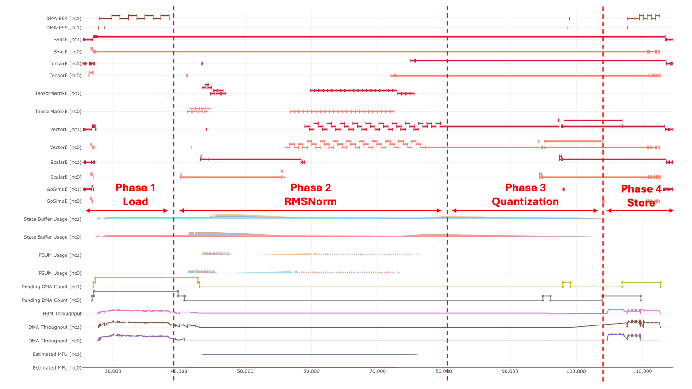
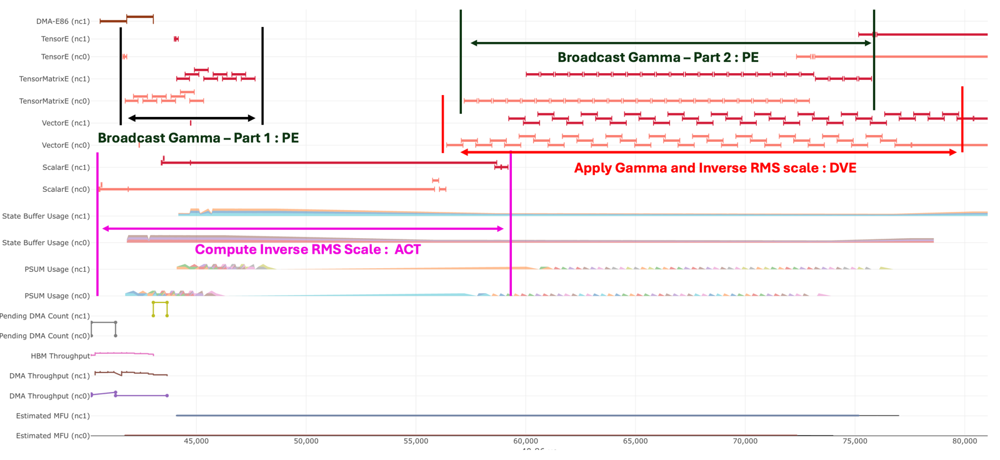
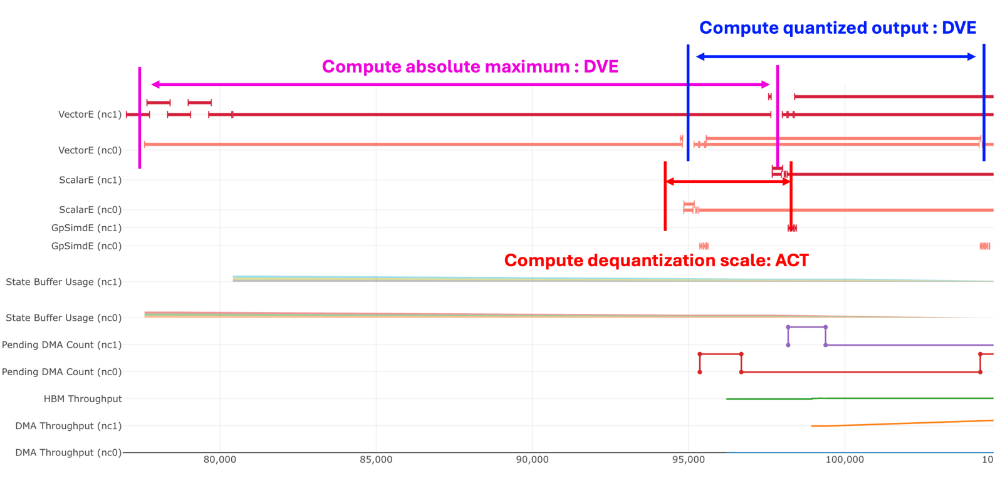

.. meta::
    :description: Design specification for the RMSNorm-Quant kernel included in the NKI Library .
    :date-modified: 12/02/2025

RMSNorm-Quant Kernel Design Specification
==========================================

This document describes the design of the RMSNorm-Quant kernel. It is intended to be a companion to the code to help readers understand what this kernel does, how it's designed, and how to use it.

For details on how to use this kernel, see the :doc:`RMSNorm-Quant Kernel API Reference </nki/library/api/rmsnorm-quant>`.

Background
----------

This kernel performs *optional* `RMS normalization <https://arxiv.org/abs/1910.07467>`_ followed by quantization to ``fp8``.

Motivation
^^^^^^^^^^
Performance
"""""""""""

It is expected that this kernel is typically used in an LLM FP8 inference model to replace the RMSNorm and FP8 quantization operators.

This kernel enables sequence-parallelism (SP) for the RMSNorm_Quant operation. In a non-SP LLM implementation, typically an allReduce collectives operation is followed by RMSNorm_Quant where the computation is duplicated across the entire [S,H] tensor on each TP (tensor parallel) worker. In SP, the allReduce+RMSNorm_Quant operation is instead replaced with reduceScatter + RMSNorm_Quant + allGather. The compute is accelerated because each worker only computes [S/TP_degree,H]. Furthermore, the allGather distributes an FP8 tensor, improving collective performance compared to bf16.

Neuron Support
""""""""""""""
Currently the Neuron software stack does not support packing the two tensors with different data types (an FP8 data tensor and FP32 quantization tensor) into one tensor. This kernel showcases how this can be achieved in NKI.

Next we'll examine the math this kernel performs.

RMSNorm
^^^^^^^

Math
""""

The input tensor typically has shape [B, S, H].

RMSNorm is independently performed on each [B,S].

The equation is:

.. math::

    \mathrm{RMSNorm}(x_i)=\frac{x_i}{\mathrm{RMS}(x)} \gamma_i \quad \text{for } i = 1 \dots H

where:

.. math::

    \mathrm{RMS}(x)=\sqrt{(\frac{1}{H} \sum_{i=1}^{H} x_i^2) + \epsilon} \\
    x = \text{each [B,S] with shape [H]} \\
    \gamma \text{ = gamma with shape [H]} \\
    \epsilon = \text{ small positive value for numerical stability}

Explained in English using common LLM terminology, each token (i.e. each element of the S dimension) is represented by a vector of shape [H] (i.e. a vector in the so-called 'embedding' space). Each token-vector is normalized by dividing each element in the vector by the RMS factor of the overall token-vector. This **RMS** factor is computed ‘right-to-left', meaning the **S**\ quares of the vector elements are computed, then the **M**\ ean, then the square-**R**\ oot. There is also a learned scaling factor called gamma; this is a shape [H] vector that scales (i.e. multiplied against) every token-vector.

Next we'll look at how the above math is implemented using NKI ISA instructions on the hardware.

Operator Graph
""""""""""""""

The following diagram depicts the flow of operations. The code is written generically with respect to input tensor shape and tile sizes. But to be more relatable, this diagram instead uses both typical LLM labels ([S,H]) for the code's outer-dimension and processing-dimension as well as tiling sizes that optimally fit Trainium 2. 

.. figure:: images/RMSNorm.drawio.svg
   :align: center

Quantization
^^^^^^^^^^^^

Math
""""

We subsequently apply AbsMax quantization to the RMS-Normalized input tensor whose shape is typically [B,S,H].

Quantization is independently performed on each [B,S].

The equation is:

.. math::
    M = \max_{i=1}^{H} |x_i| \\
    D = \frac{M}{240} \\
    Q = \frac{1}{D} \\
    \mathbf{x}_q = xQ

or equivalently

.. math::
    x_{q,i} = x_iQ \quad \text{for } i = 1, \dots, H

where

.. math::
    x = \text{each [B,S] with shape [H]} \\
    \mathbf{x}_q = \text{quantized } \mathbf{x} \\
    D = \text{de-quantization scale} \\
    Q = \text{quantization scale}

The above equation omits clipping/flooring details which are instead included later in this document.

Each token-vector is quantized by multiplying each element in the vector by the quantization scale (Q) of the given token-vector; or said equivalently, dividing by the dequantization scale (D). The dequantization scale is computed by finding the absolute-max value in the vector and dividing by 240 (a typical constant for 8-bit quantization).

Operator Graph
""""""""""""""

In the following operator graph you'll notice that the final output packs the data and scales together into a single tensor, as described in the Motivation section.

.. figure:: images/quant.drawio.svg
   :align: center

In summary, we've seen how the RMSNorm and Quantization math operations are implemented using NKI ISA instructions and examined the intermediate shapes and tiling decisions along the way.

Next we'll look at the kernel's API.

High-Level Design Considerations & Optimization Strategies
----------------------------------------------------------

Input Tensor Outer Dimension Collapse
^^^^^^^^^^^^^^^^^^^^^^^^^^^^^^^^^^^^^
The code provides a good description of this but it's briefly summarized here so the idea can be referenced below. The RMSNorm-Quantization computations happen strictly on the minor dimension of the input tensor (called the ‘processing dimension' in the code therefore all major dimensions are collapsed into one for simplification (called the ‘outer dimension' in the code). In other words, the input is collapsed into a 2D tensor.

Example:
    [B,S,H] is collapsed into [BxS, H] = [outer_dimension, processing_dimension]

Tiling
^^^^^^

The overall kernel (both RMSNorm and Quantization steps) is tiled on the major dimension of the 2D input tensor by a size equal to the hardware's maximum partition dimension of a tile. This ensures full utilization of the various hardware engines' input width.

Within the RMSNorm operation, the RMS-scale and gamma steps are further tiled on the minor dimension by a size equal to the hardware's maximum free dimension of the stationary operand of General Matrix Multiplication on TensorEngine. This is because the gamma-broadcast operation is ultimately performed via TensorEngine matrix multiplication so we maximize our use of the engine with maximally sized tiles. See `NKI Programming Model </nki/programming_model>` for more details on tile size constraints.

Example:

    Consider a typical LLM input tensor of the shape [Batch, Sequence, Hidden] with [B=1, S=1024, H=2048]. We'll set B=1 for simplicity so that we can ignore it entirely. The tensor is first tiled on the S dimension in a size of 128 (which is the maximum partition dimension of Trainium2), resulting in 1024 / 128 = 8 outer dimension tiles of shape [S=128, H=2048]. The inverse-RMS calculation is performed across the H dimension, meaning it is performed independently on every row of the tile.

    We subsequently tile on the H dimension in a size of 512 (the maximum matrix-multiply free-dimension on Trainium2), resulting in 2048 / 512 = 4 processing dimension tiles of shape [S=128, H=512]. The RMS scale (ScalarE) is applied, gamma is broadcast (TensorE), and gamma is applied (VectorE). You'll notice that pipeline parallelism is implemented by splitting the computation across 3 engines.

SBUF/PSUM Allocation
^^^^^^^^^^^^^^^^^^^^

The Stack Allocator is generally recommended for all kernels since it enables consistent and deterministic SBUF/PSUM memory allocations within the scope of the kernel. This is contrast to the default allocator which considers a larger scope outside the kernel, potentially resulting in varying allocations and consequent kernel performance variations.

SPMD Sharding
^^^^^^^^^^^^^

This kernel supports SPMD sharding as a way to split the computation across the constituent cores of a `Logical Neuron Core </about-neuron/arch/neuron-features/logical-neuroncore-config>`. It shards on the outer-most dimension.

See the `NKI Programming Guide </nki/programming_model>` for details on SPMD and how to enable it through your kernel invocation.

Gamma Broadcast
^^^^^^^^^^^^^^^

The bulk of the RMSNorm-Quantization operations rely on the Vector and Scalar engines as the core math does not involve matrix-multiplication at all, hence the TensorEngine would otherwise be idle. To improve pipeline parallelism we use a technique to broadcast the gamma vector across rows of a 2D matrix by performing matrix multiplication against a vector of ones, thereby distributing some of the work to the TensorEngine.

activation_reduce
^^^^^^^^^^^^^^^^^

This `instruction </nki/api/generated/nki.isa.activation_reduce>` is notable because it allows us to perform the reduce-add for free along with the square operation.

Design Implementation
---------------------

The commented code and the above sections should together deliver a good understanding of this kernel. However this section explains a few additional points to help understand the code.

CPU Golden
^^^^^^^^^^

The following is a simple Python equivalent to the kernel which can be another useful way of understanding the kernel's behaviour.

.. code-block:: python

   def rmsnorm_quant_ref(inp: np.ndarray, gamma: np.ndarray, eps: float = 1e-6) -> Tuple[np.ndarray, np.ndarray]:
       """RMSNorm + Quantization reference impl.

       - inp: shape [B, S, H]
       - output[0]: shape [B, S, H] in fp8e4, representing the quantized RMSNorm output of input
       - output[1]: shape [B, S, 4] in fp32 representing the per-row dequantization scale
       """
       assert(len(inp.shape) == 3)
       inp = inp.astype(np.float32)
       gamma = gamma.astype(np.float32)

       # Perform RMSNorm
       rms = np.sqrt(np.mean(np.square(inp), axis=-1, keepdims=True))
       norm = inp * np.reciprocal(rms + eps)
       norm *= gamma

       # Perform quantization
       norm_abs_max = np.abs(norm).max(axis=-1, keepdims=True)
       quant_scale = 240.0 / norm_abs_max
       norm_quant = norm * quant_scale
       assert(np.allclose(norm, norm_quant * np.reciprocal(quant_scale)))  # dequantization should yield same norm

       # Cast and return
       norm_quant = dt.static_cast(norm_quant, dt.float8_e4m3)
       dequant_scale = dt.static_cast(np.reciprocal(quant_scale), np.float32)

       return norm_quant, dequant_scale

Kernel Code Details
^^^^^^^^^^^^^^^^^^^

`rms_normalize_tile()` contains a loop to tile across the processing dimension. This loop contains the following directive:

.. code-block:: python

    directives=ncc.multi_buffer(constants.num_hw_psum_banks)

This enables the compiler to replicate the gamma PSUM allocation (into which the gamma-broadcast matmul result is stored), improving pipeline parallelism by enabling each loop iteration to write into a separate PSUM bank.

.. code-block:: python

    skip_middle_end_transformations

The compiler middle-end-transformation passes contain heuristic-driven optimizations, including loop-reordering and loop-fusion. While these passes could help improve performance, in some cases, they are not predictable. Kernels are generally hand-tuned to achieve optimal performance, so we turn them off.

Kernel API
----------

.. autodata:: rmsnorm_quant_kernel
   :noindex:

Evaluation
----------

Performance Targets
^^^^^^^^^^^^^^^^^^^

The section includes some example performance targets for real world model configurations on a Trainium 2 with LNC=2 configuration.

**Llama3.3 70B**

+--------------------+-------------+-----------------+--------+
| Target Latency (us)| Batch Count | Sequence Length | Hidden |
+====================+=============+=================+========+
| 458.2              | 1           | 2K              | 8192   |
+--------------------+-------------+-----------------+--------+
| 6,287.0            | 1           | 32K             | 8192   |
+--------------------+-------------+-----------------+--------+

**Llama3.1 405B**

+--------------------+-------------+-----------------+--------+
| Target Latency (us)| Batch Count | Sequence Length | Hidden |
+====================+=============+=================+========+
| 866.81             | 1           | 2K              | 16384  |
+--------------------+-------------+-----------------+--------+
| 13,214.40          | 1           | 32K             | 16384  |
+--------------------+-------------+-----------------+--------+

Performance Analysis
--------------------

Here we demonstrate a sample execution of this kernel and break it down in the Profiler.

**Test Parameters:**

  * LNC: 2 ( Note, two pairs of instructions in `nc0`, and `nc1` in captured figures )
  * Batch Size: 1
  * Sequence Length: 160
  * Hidden Size: 16,384
  * Data Type: `dt.bfloat16`
  * Quantization Data Type: `dt.float8_e4m3`
  * Quantization Only: `False`

The following picture shows the overall execution.

Phase 1: Load Inputs
^^^^^^^^^^^^^^^^^^^^

This phase involves two DMA load operations: one for the hidden tensor and one for the gamma tensor.

* **Hidden Tensor**: The DMA buffer size is calculated as `hidden_size * sizeof(dtype)`.

* **Gamma Tensor**: The code intends to load the entire `[1, H]` tensor in a single operation. However, it should be noted that the compiler performs optimizations for trivial dimensions, which can result in several small (e.g., 4-byte) DMA buffer loads.

Phase 2: RMSNorm
^^^^^^^^^^^^^^^^

* Compute Inverse RMS scale

    * This step involves two ACT (activation) instructions:

        * `activation_reduce`: Squares each element of the hidden tensor and performs a reduction (sum) across the hidden dimension.
        * `activation`: Adds a small constant `eps` for numerical stability, applies a scaling factor `(1 / H)`, and then computes the reciprocal square root of the result.

* Broadcast Gamma – Part 1 / Part 2

    * As previously mentioned, a multi-buffer strategy is used for PSUM. Assuming there are N PSUM banks, Part 1 of the broadcast operation replicates the gamma values of shape [1, `512`] to [128, 512] tiles, repeating this process N times.
    * The size `512` corresponds to the **free dimension limit** of the TensorEngine, meaning we must slice the H dimension (processing dimension) into chunks of 512.
    * The broadcast is divided into Part 1 and Part 2 because the inverse RMS scale value is needed before evicting data from the PSUM buffers after Part 1. The PSUM data is not evicted to the SBUF immediately; instead, it remains in place to be consumed by the `scalar_tensor_tensor` operation once `inverse_rms_scale` is ready. This behavior is intentional, as there is limited performance benefit in evicting PSUMs early. Part 2 of the gamma broadcast is fully pipelined with the subsequent `scalar_tensor_tensor` instruction, making early eviction unnecessary.

* Apply gamma and inverse RMS scale

    * This step is performed using the `scalar_tensor_tensor` instruction, with a free dimension size of 512, matching the limit of the TensorEngine. This allows the operation to be *efficiently pipelined* with the TensorEngine activity.

Phase 3: Quantization
^^^^^^^^^^^^^^^^^^^^^

The overall quantization process involves heavy use of the VectorEngine, primarily due to the `max` function. These instructions are executed **sequentially with no parallelism**, as each step depends on the result of the previous one.

* Compute absolute maximum

* Compute dequantization scale

    * `activation`: The dequantization scale is derived by dividing the absolute max by `_FP8_RANGE`

* Compute quantized output

    * `tensor_scalar`: clamp to `_MIN_DEQUANT_SCALE_VAL` for numerical stability
    * `reciprocal`:  compute the reciprocal to get the quantization scale
    * `tensor_scalar`: Apply quantization scale to produce the quantized result

Phase 4: Store output
^^^^^^^^^^^^^^^^^^^^^

Store quantized value with dequantizing scale

  * **Hidden Tensor**:
    The DMA buffer size is calculated as `hidden_size * sizeof(quant_dtype)`.
  * **Dequantization Scale:**
    The DMA buffer size is calculated as `4* sizeof(quant_dtype)`.