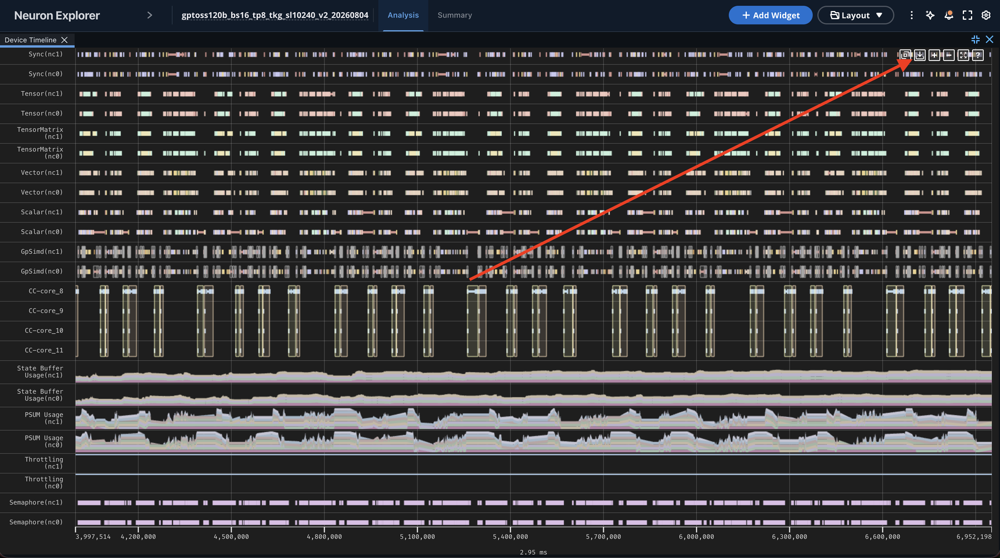
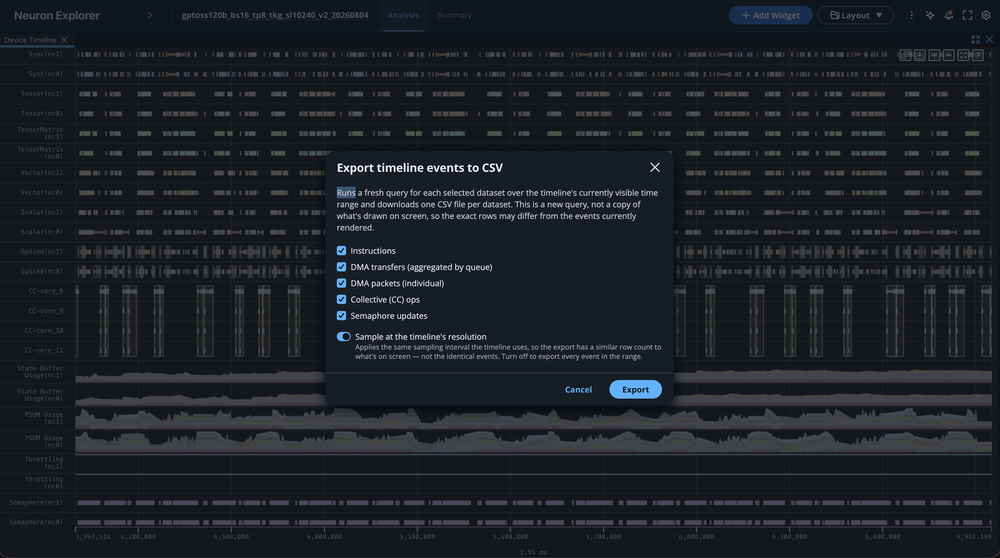

.. meta::
    :description: Learn how to programmatically analyze Neuron Explorer profile output using the Parquet tables and CSV exports from the UI.
    :date-modified: 08/17/2026

.. _neuron-explorer-analyze-profile-output:

Analyze Profile Output
======================

Task overview
-------------

This topic discusses how to programmatically analyze Neuron Explorer profile data. Neuron Explorer writes profiles as Parquet tables and can export CSV files from the UI.
You can then build your own tools or scripts for interacting with and analyzing this data.

Which one you want depends on the job:

.. list-table::
   :header-rows: 1
   :widths: 15 45 40

   * - Format
     - Use it for
     - How you get it
   * - Parquet
     - Scripted and repeatable analysis over a whole profile.
     - Written for every processed profile.
   * - CSV
     - A quick look at one region of the timeline in a spreadsheet.
     - Exported from the UI.

Prerequisites
-------------

* A processed profile. See :doc:`get-started` for capturing a profile and processing it.
* Python with ``pandas`` and ``pyarrow`` for the Parquet examples. You can also use another language with a Parquet-compatible library.

Parquet output
--------------

Parquet is the default output format and holds the complete profile data. The UI reads the same tables, so what you query matches what you see on screen.

Each processed profile is a directory of Parquet files, named after the table they hold:

.. code-block:: text

   my-profile@latest/
   ├── Instruction.parquet
   ├── DmaPacket.parquet
   ├── SemaphoreUpdate.parquet
   ├── Summary.parquet
   ├── SchemaFields.parquet
   └── ...

A profile processed with ``--data-path`` lands under ``<data-path>/profiles/global/<display-name>@latest/``. With ``--output-file`` the files go in the directory you name.

Large tables can be split across numbered files, such as ``BirInstruction_0.parquet`` and ``BirInstruction_1.parquet``. Use a glob to read every file in a split table.

The table name tells you what one row is. The main ones:

.. list-table::
   :header-rows: 1
   :widths: 40 60

   * - Table
     - One row is
   * - ``Instruction``
     - A compute engine instruction, with a start and end timestamp.
   * - ``DmaPacket``, ``DmaPacketAggregated``
     - A DMA transfer, individually or aggregated per queue.
   * - ``SemaphoreUpdate``
     - A semaphore set or wait.
   * - ``CcOp``, ``CcInstruction``
     - A collective communication operation, on the collective engines and on the CC-Cores respectively.
   * - ``DmaUsage``, ``HbmUsage``, ``SbufUsage``, ``PsumUsage``
     - A utilization sample at a point in time.
   * - ``Summary``, ``OpcodeSummary``
     - A metric computed across the whole profile.
   * - ``Metadata``, ``NeffHeader``
     - A piece of profile metadata.

Those are device-profile tables. A system profile writes ``SystemProfileEvents`` for runtime and framework events, and ``CpuUsage`` and ``HostMemUsage`` for host samples.

A table is only written if the profile holds that kind of activity. A workload with no collectives has no ``CcOp`` file.

Load a table into a dataframe:

.. code-block:: python

   import pandas as pd

   df = pd.read_parquet("my-profile@latest/Instruction.parquet")
   print(df.head())

From there it is ordinary dataframe work. To find where the time went, group by engine and opcode:

.. code-block:: python

   print(df.groupby(["engine", "opcode"])["duration_ns"]
           .agg(["count", "sum"])
           .sort_values("sum", ascending=False)
           .head(10))

.. code-block:: text

                           count     sum
   engine opcode
   Tensor MATMUL             879  305765
          LDWEIGHTS          879  148360
          EVENT_SEMAPHORE     48   84550
   Sync   EVENT_SEMAPHORE     66   83277
   Vector TENSOR_TENSOR       84   55204

For a table split across numbered files, read them together:

.. code-block:: python

   from glob import glob

   df = pd.concat(
       (pd.read_parquet(path) for path in glob("my-profile@latest/BirInstruction*.parquet")),
       ignore_index=True,
   )

For every table and field, with units and descriptions, see the :ref:`Profile Parquet Schema Reference <neuron-explorer-profile-schema-reference>`. The ``SchemaFields`` table in the profile carries the same information, so you can query the schema alongside the data.

CSV output
----------

CSV is the convenient path when you want a region of a profile in a spreadsheet. There are two ways to get it.

.. _neuron-explorer-export-timeline-csv:

Export timeline events to CSV
~~~~~~~~~~~~~~~~~~~~~~~~~~~~~

The Device Trace Viewer exports the events in the visible time range, one CSV file per table.

**1:** Zoom to the region you want to export.

Pan and zoom the Device Trace Viewer until the visible range holds the region of interest. See :doc:`overview-device-profiles` for the pan and zoom controls.

**2:** Click **Export to CSV** in the timeline toolbar, in the top-right corner of the widget.

**3:** Select the tables to export.

Each event category is a separate table and a separate file. Clear the checkboxes for the ones you do not need.

.. list-table::
   :header-rows: 1
   :widths: 35 30 35

   * - Option
     - Output file
     - Contents
   * - Instructions
     - ``Instruction.csv``
     - Compute engine instructions.
   * - DMA transfers (aggregated by queue)
     - ``DmaPacketAggregated.csv``
     - DMA activity aggregated per queue.
   * - DMA packets (individual)
     - ``DmaPacket.csv``
     - Individual DMA packets.
   * - Collective (CC) ops
     - ``CcInstruction.csv``
     - Collective communication operations.
   * - Semaphore updates
     - ``SemaphoreUpdate.csv``
     - Semaphore sets and waits.

**4:** Choose sampled or complete output.

**Sample at the timeline's resolution** is on by default and applies the same sampling interval the timeline uses to draw, so the row count is close to what is on screen. Turn it off to get every event in the range.

The timeline draws about one event per pixel, so an unsampled export of a wide range can be much larger than what you see, and the server can truncate it. Use an unsampled export for exact data over a narrow range, and the Parquet tables for whole-profile counts and durations.

**5:** Click **Export**.

The dialog closes and each file downloads as its query finishes, so files can arrive a few seconds apart.

Each row starts with a ``timeline_track`` column holding the track the event came from, followed by the fields of the matching Parquet table. Values are raw rather than formatted for display, so times and sizes stay numeric.

.. note::
   The export runs a fresh query over the visible range. It is not a copy of the pixels on screen, so the rows can differ from the events currently drawn even with sampling on.
