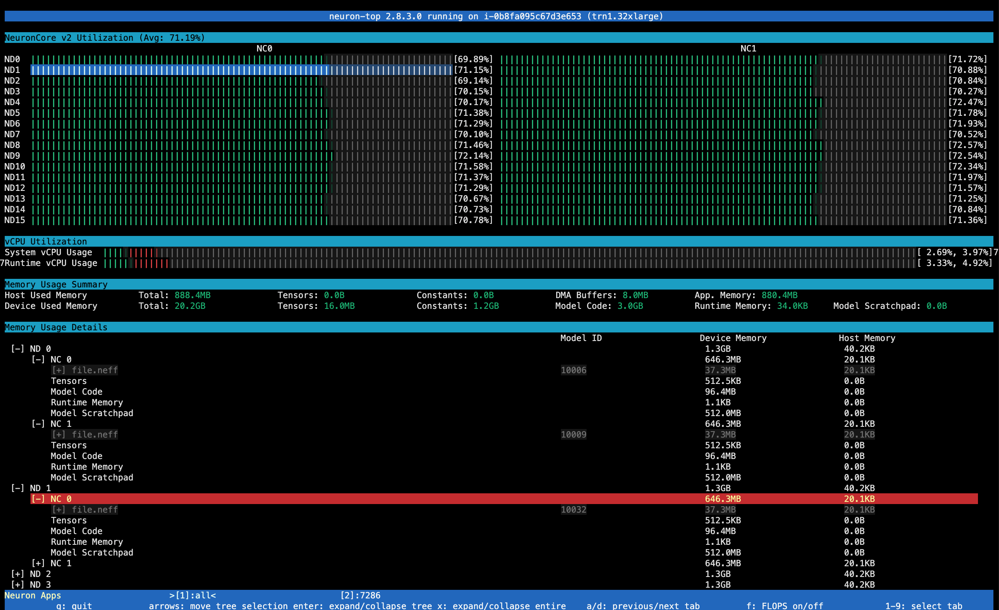

.. _neuron-top-ug:

Neuron Top User Guide
=====================

.. contents:: Table of contents
   :local:
   :depth: 2

Overview
--------
``neuron-top`` provides useful information about NeuronCore and vCPU utilization, memory usage,
loaded models, and Neuron applications.

.. note::
  If you are parsing ``neuron-top`` output in your automation environment, you can now replace it with ``neuron-monitor``
  (:ref:`neuron-monitor-ug`) which outputs data in a standardized, easier to parse JSON format.

Using neuron-top
----------------

Command line arguments
~~~~~~~~~~~~~~~~~~~~~~
Launch ``neuron-top`` by simply typing its name in the shell: ``neuron-top``.

User interface
~~~~~~~~~~~~~~

The user interface is divided in 4 sections. The data shown in these
sections applies to the currently selected tab - which can be the 'all' tab,
which aggregates data from all running Neuron processes, or a tab representing
a single Neuron process:

|image0|

* The ``Neuroncore Utilization`` section shows the NeuronCore utilization for the
  currently selected tab 

* The ``VCPU Utilization`` section shows:

  * ``System vCPU usage`` - the two percentages are user% and system%
  * ``Runtime vCPU usage`` - same breakdown

* The ``Memory Usage Summary`` section provides a breakdown of the total memory usage on the Neuron Device as well
  as on the host:

  * ``Host Used Memory`` - amount of host memory used by the selected application (or an aggregate of all applications if 'All' is selected)
    * ``Total`` - total amount of host memory used
    * ``Tensors`` - amount of host memory used for tensors
    * ``Constants`` - amount of host memory used for constants (for applications running training) or weights (for applications running inferences)
    * ``DMA Buffers`` - amount of host memory used for DMA transfers
    * ``App. Memory`` - amount of host memory used by the application that doesn't fall in any of the previous categories

  * ``Device Used Memory`` - amount of device memory used by the selected application (or an aggregate of all applications if 'All' is selected)
    * ``Total`` - total amount of device memory used
    * ``Tensors`` - amount of device memory used for tensors
    * ``Constants`` - amount of device memory used for constants (for applications running training) or weights (for applications running inferences)
    * ``Model Code`` - amount of device memory used for storing model executable code
    * ``Runtime Memory`` - amount of device memory used by the Neuron Runtime (outside of the previous categories)
    * ``Model Scratchpad`` - amount of device memory used for the shared model scratchpad, a shared buffer used for internal model variables and other
    auxiliary buffers

* ``Memory Usage Details`` contains memory usage data organized as a tree which can be expanded/collapsed. The columns are:

  * ``Model ID`` - the Neuron Runtime identifier for this model instance
  * ``Host Memory`` - amount of host memory used
  * ``Device Memory`` - amount of device memory used

The tree view shows the amount of memory used for the same categories shown in the ``Memory Usage Summary`` but in this section
they are attached to either a model (if the memory has been allocated at model load time for that model), or to a NeuronCore (if
the memory can't be associated with a model, but has been allocated for that NeuronCore).
The 'parent' shows the total amount of memory used - the sum of its children.

.. note::
  The up/down/left/right keys can be used to navigate the tree view. The 'x' key expands/collapses the
  entire tree.

The bottom bar shows which Neuron process' data is currently displayed by highlighting
its tag using a green font and marking it using a pair of '>', '<' characters. The 'all'
tab shows an aggregated view of all the Neuron processes currently running on the instance.

|image1|

.. note::

  The '1'-'9' keys select the current tab.'a'/'d' selects the previous/next
  tab on the bar.

.. |image1| image:: ../../images/nt-2.png
