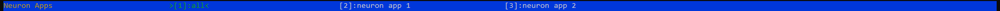

.. _neuron-top-ug:

Neuron Top User Guide
=====================

.. contents:: Table of contents
   :local:
   :depth: 2

Overview
--------
``neuron-top`` provides useful information about NeuronCore and vCPU utilization, memory usage,
loaded models, and Neuron applications.

.. note ::
  If you are parsing ``neuron-top`` output in your automation environment, you can now replace it with ``neuron-monitor``
  (:ref:`neuron-monitor-ug`) which outputs data in a standardized, easier to parse JSON format.

Using neuron-top
----------------

Command line arguments
~~~~~~~~~~~~~~~~~~~~~~
Launch ``neuron-top`` by simply typing its name in the shell: ``neuron-top``.

User interface
~~~~~~~~~~~~~~

The user interface is divided in 4 sections. The data shown in these
sections applies to the currently selected tab - which can be the 'all' tab,
which aggregates data from all running Neuron processes, or a tab representing
a single Neuron process:

|image0|

* The ``Neuroncore Utilization`` section shows the NeuronCore utilization for the
  currently selected tab 

* The ``VCPU and Memory Info`` section shows:

  * ``Total system vCPU usage`` - the two percentages are user% and system%
  * ``Runtime vCPU usage`` - same breakdown
  * ``Runtime Memory Host`` - amount of host memory used by the Application and total available
  * ``Runtime Memory Device`` - amount of device memory used by the Application

* ``Loaded Models`` is a tree view which can be expanded/collapsed. The columns are:

  * ``Model ID`` - an Application-level identifier for this model instance
  * ``Host Memory`` - amount of host memory used by the model, displayed hierarchically, where
    the 'parent' value is the sum of its 'children'
  * ``Device Memory`` - amount of device memory used by the model, displayed just like the Host Memory

.. note ::
  The up/down/left/right keys can be used to navigate the tree view. The 'x' key expands/collapses the
  entire tree.

The bottom bar shows which Neuron process' data is currently displayed by highlighting
its tag using a green font and marking it using a pair of '>', '<' characters. The 'all'
tab shows an aggregated view of all the Neuron processes currently running on the instance.

|image1|

.. note ::
  The '1'-'9' keys select the current tab.'a'/'d' selects the previous/next
  tab on the bar.

.. |image0| image:: ../../images/nt-1.png

