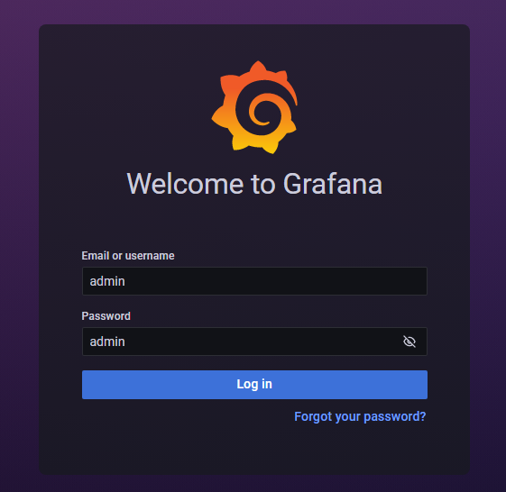

.. _track-system-monitor:

Track System Resource Utilization during Training with neuron-monitor using PyTorch Neuron
==========================================================================================

.. contents:: Table of Contents
   :local:
   :depth: 2

This tutorial explains how to monitor resource utilization using **neuron-monitor**, **Prometheus** and **Grafana** while running a multi-layer
perceptron MNIST model on Trainium using PyTorch Neuron.

Multi-layer Perceptron MNIST Model
----------------------------------

This tutorial is based on the MNIST example for PyTorch Neuron on Trainium.
For the full tutorial, please see :ref:`Multi-Layer Perceptron Training Tutorial <neuronx-mlp-training-tutorial>`.

The Training Job
----------------

For this tutorial, we will make the original script do more work thus giving us more system utilization data to observe. The training
loop is simply repeated 1000 times:

.. code:: python

    for run in range(0, 1000):
        print(f'Run {run}')
        model.train()
        ...

Save the following code as :download:`train_monitor.py <examples/pytorch/mnist_mlp/train_monitor.py>` and you can run it as
``python3 train_monitor.py`` on a Trn1 instance.

.. literalinclude:: /src/examples/pytorch/mnist_mlp/train_monitor.py
    :language: python

Setting up **Prometheus** and **Grafana**
-----------------------------------------

.. note::
   The setup presented in the following paragraphs can be extended to monitor any number of instances running training jobs or
   inference workloads. For this tutorial, we will set everything up on a single Trn1 instance running Amazon Linux 2.

Setting up **Prometheus**
~~~~~~~~~~~~~~~~~~~~~~~~~

For a more detailed guide on how to install **Prometheus** visit their official guide at https://prometheus.io/docs/prometheus/latest/getting_started/.

Download and unzip a prebuilt **Prometheus** binary on your Trn1 instance:

.. code:: bash

    wget https://github.com/prometheus/prometheus/releases/download/v2.38.0/prometheus-2.38.0.linux-amd64.tar.gz
    tar -xzvf prometheus-2.38.0.linux-amd64.tar.gz
    cd prometheus-2.38.0.linux-amd64/

Create a config and add a scrape target:

.. code:: bash

    vim prometheus.yml

.. code:: yml

    scrape_configs:
    - job_name:       'neuron'

    # Scrape target every 5 seconds.
    scrape_interval: 5s

      static_configs:
        - targets: ['localhost:8000']

Finally, start **Prometheus**:

.. code:: bash

    ./prometheus --config.file=prometheus.yml

Setting up **Grafana**
~~~~~~~~~~~~~~~~~~~~~~

For a more detailed guide on how to install **Grafana** visit their official guide at https://grafana.com/docs/grafana/latest/setup-grafana/installation/rpm/.

Add the Grafana repo to yum:

.. code:: bash

    sudo vim /etc/yum.repos.d/grafana.repo

    [grafana]
    name=grafana
    baseurl=https://packages.grafana.com/oss/rpm
    repo_gpgcheck=1
    enabled=1
    gpgcheck=1
    gpgkey=https://packages.grafana.com/gpg.key
    sslverify=1
    sslcacert=/etc/pki/tls/certs/ca-bundle.crt

Install and start **Grafana**:

.. code:: bash

    sudo yum install -y grafana
    sudo /bin/systemctl start grafana-server.service

By default, **Grafana** will run a HTTP server on port 3000. If you need to change that, update its config and restart the service:

.. code:: bash

    sudo vim /etc/grafana/grafana.ini
    ...
    sudo /bin/systemctl start grafana-server.service

Using your favorite web browser, access the Grafana webpage and add a new dashboard.

The default user and password are both 'admin':

Next, you'll add a Prometheus data source by going to ``Configuration`` -> ``Data Sources``:

... and adding the local **Prometheus** server as a data source:

Finally, upload the sample dashboard :download:`neuron-monitor-grafana.json <src/examples/neuron-monitor/neuron-monitor-grafana.json`
to **Grafana**:

Monitoring the Training Workload
--------------------------------

Start the training job which, due to the artificially added complexity, will take more than 15 minutes:

.. code:: bash

   python train_monitor.py

On the same instance, start ``neuron-monitor`` and its companion script, ``neuron-monitor-prometheus.py``:

.. code:: bash

   neuron-monitor | neuron-monitor-prometheus.py

Once they are running, you can use your web browser, access the **Grafana** server running on your Trn1 instance and
view a timeline of the system utilization.

The upper part of the dashboard contains:
 - a list of the currently monitored instances (for this tutorial there is a single Trn1 instance)
 - aggregated metrics for stats such as NeuronCore utilization, NeuronCores in use, iteration success rates, error rates etc.
 - a timeline of execution status rates and execution latencies

The lower part of the dashboard contains:
- one line of charts containing a timeline of Neuron resource utilization (NeuronCore, vCPU and memory utilization)
- one line of charts containing a timeline of host resource utilization (vCPU and memory utilization)

