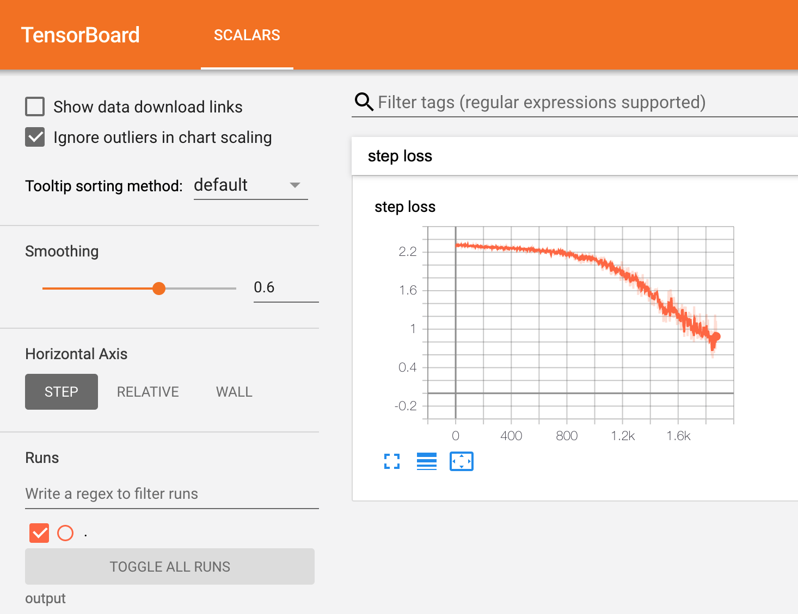

Track Training Progress in TensorBoard using PyTorch Neuron
============================================================

.. contents:: Table of Contents
   :local:
   :depth: 2

This tutorial explains how to track training progress in TensorBoard while running a multi-layer perceptron MNIST model on Trainium using PyTorch Neuron.

Multi-layer perceptron MNIST model
----------------------------------

This tutorial is based on the MNIST example for PyTorch Neuron on Trainium.
For the full tutorial, please see `Multi-Layer Perceptron Training Tutorial <../../frameworks/torch/torch-neuronx/tutorials/training/mlp.html>`__.

Output TensorBoard logs
-----------------------

To generate TensorBoard logs, we first modify the training script to use the ``SummaryWriter``:

.. code:: python

   from torch.utils.tensorboard import SummaryWriter
   writer = SummaryWriter('./output')

In the training loop, we can then use the ``add_scalar`` API to log the loss per step.

.. code:: python

   writer.add_scalar("step loss", loss, idx)

At the end of the script, add ``writer.flush()`` to ensure all logs are written.

Save the following code as :download:`train_tb.py <examples/pytorch/mnist_mlp/train_tb.py>` and run it as ``python3 train_tb.py`` on a Trn1 instance.
The generated logs can be found in the ``./output`` directory that was passed to ``SummaryWriter``.

.. literalinclude:: /src/examples/pytorch/mnist_mlp/train_tb.py
    :language: python

View loss in TensorBoard
------------------------

In order to view your training metrics, install TensorBoard in your Python environment:

.. code:: bash

   pip install tensorboard

Then, launch TensorBoard with the ``./output`` directory

.. code:: bash

   tensorboard --logdir ./output

Once running, open a new SSH connection to the instance and port-forward
TCP port 6006 (ex: -L 6006:127.0.0.1:6006). Once the tunnel is
established, TensorBoard can then be accessed via web browser at the
following URL: `http://localhost:6006 <http://localhost:6006/>`__.
Please note that you will not be able to access TensorBoard if you
disconnect your port-forwarding SSH session to the Trainium instance.

In TensorBoard, you can now see the loss per step plotted.
When capturing loss for multiple runs, you can plot them together on the same graph to compare runs.
Be sure to change the output directory for different runs, for example ``./output/run1`` for the first, ``./output/run2`` for the second, etc.