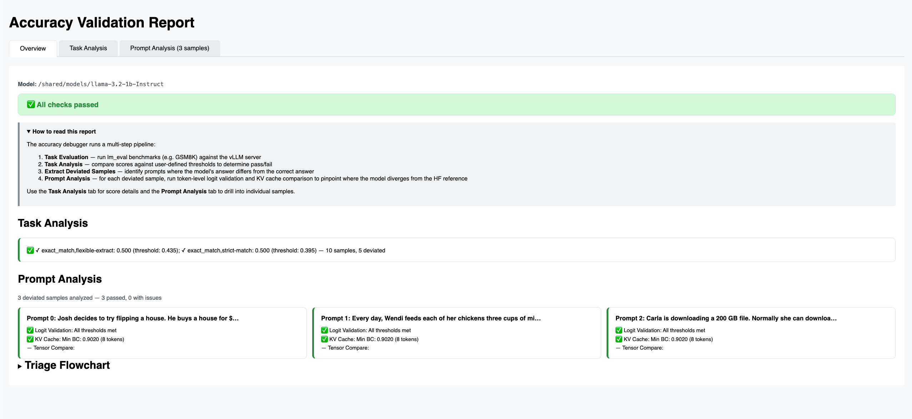
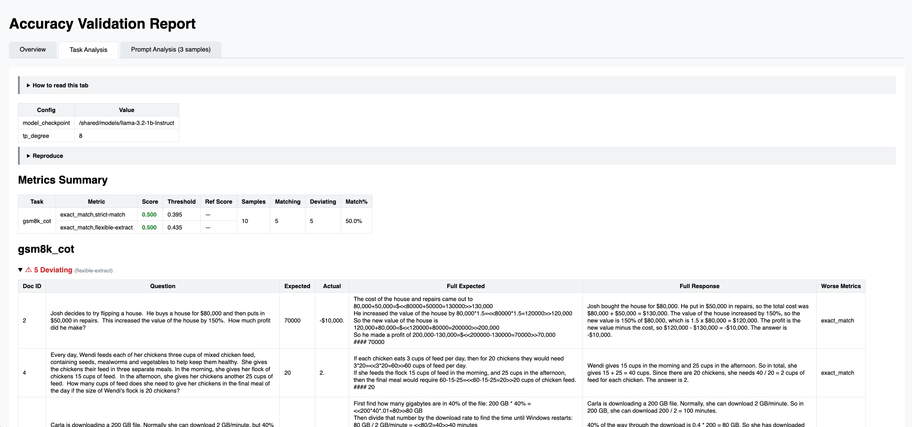
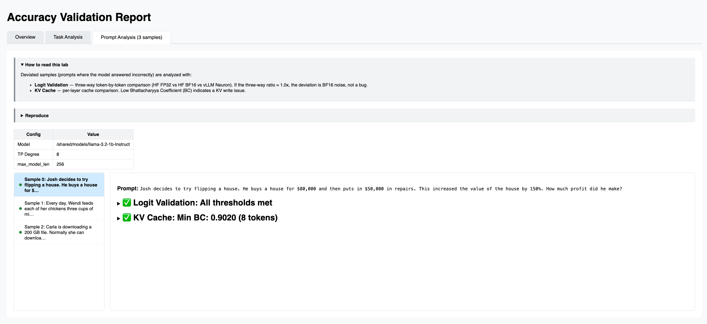

# Accuracy Debugging Design

<!-- meta: description: Accuracy debugging framework design -->
<!-- meta: content_type: conceptual-deep-dive -->
<!-- meta: date_updated: 2026-06-23 -->

## Overview

This document describes the end-to-end accuracy validation and debugging framework for vLLM Neuron. It covers three validation levels and introduces accuracy debugger that connects components into an automated pipeline: task-level evaluation → prompt-level analysis → module-level validation.

For detailed designs of individual components, see:

- [Logit validation](logit_validation_design.md) — Token-level logit comparison
- [KV cache analysis](kv_cache_analysis_design.md) — KV cache three-way comparison
- [Tensor capture](tensor_capture_design.md) — Extracting intermediate tensor values
- [Input snapshot](input_snapshot_design.md) — Capturing NRT-boundary inputs for off-chip replay
- [Tensor compare](tensor_compare_design.md) — Comparing tensors between environments
- [Tensor replacement](tensor_replacement_design.md) — Injecting reference tensors into forward pass
- [Module test guidelines](module_test_guidelines.md) — Per-module correctness tests

## Validation Levels

The framework operates at three levels. Each level runs independently as part of the CI test suite. The Accuracy Debugger (details listed below) connects Level 1 and Level 2 into an automated pipeline — when task evaluation identifies deviated prompts, it automatically feeds them into prompt-level analysis.

### Level 1: Task-Level Validation

Run dataset evaluations (lm_eval, longbench) against a vLLM server and compare aggregate scores against user-defined thresholds.

- Run accuracy benchmarks (e.g. GSM8K, MMLU Pro, BBH)
- Compare scores against thresholds (simple minimum or mean/std tolerance)
- Report pass/fail with per-dataset scores

**Pass/fail criteria:** Accuracy scores must meet thresholds defined by the user.

### Level 2: Prompt-Level Validation

Validate model outputs at the token level using pre-defined prompts. These tests run as standing regression checks in CI, independent of task evaluation results.

**Setup:** A fixed set of curated prompts is stored in the codebase. For each prompt, the test starts a vLLM server (or uses offline `vllm.LLM`), computes HF reference logits (FP32 + BF16), and runs token-by-token comparison with teacher forcing.

- **Logit validation** — Three-way comparison (HF FP32 vs HF BF16 vs Neuron) using top-k error maps at k={5, 50, 1000, all} and divergence detection. See [Logit validation](logit_validation_design.md).

**Pass/fail criteria:** Logit divergence within tolerance maps.

### Level 3: Module-Level Validation

Per-module correctness tests validate individual model components (attention, MLP, RMSNorm, embedding, RoPE, decoder layer) against HuggingFace reference implementations. These run in CPU mode and on hardware.

See [Module test guidelines](module_test_guidelines.md) for details.

**Pass/fail criteria:** Output tensors match HF reference within tolerance.

## Accuracy Debugger

The Accuracy Debugger connects the three levels into an automated pipeline.

### Pipeline

``` text
1. Task Evaluation    — run a dataset eval (lm_eval; longbench analysis is not
                        supported currently) against a running vLLM server → results dir
2. Task Analysis      — LmEvalAnalyzer consumes the results dir, compares scores
                        against thresholds (Level 1), and extracts the deviated
                        prompts (samples the model answered incorrectly)
3. Prompt Analysis    — per-prompt logit validation + KV cache + tensor compare (Level 2),
                        using in-process offline vllm.LLM instance(s)
4. Report             — interactive HTML report with all analysis artifacts
```

Task Evaluation (1) and Prompt Analysis (3) both need the Neuron cores: the eval
runs against an online `vllm serve`, while prompt analysis spins up its own
in-process `vllm.LLM`. The online eval server must therefore be stopped before
prompt analysis begins, so the two phases do not contend for cores.

``` text
   run dataset eval     stop eval server
   against vLLM server  (free Neuron cores)
        → results dir          │
              │                 │
              ▼                 ▼
┌──────────────────────┐              ┌────────────────────────────────────────┐
│   Task Analysis      │              │   Prompt Analysis                      │
│                      │              │  ┌─────────────────────────────────┐   │
│  run_task_analysis(  │  deviated    │  │ Shared LLM (logprobs mode)      │   │
│    LmEvalAnalyzer,   │  prompts     │  │                                 │   │
│    results_dir,      │─────────────▶│  │  LogitValPlugin   KvCachePlugin │   │
│    thresholds)       │              │  └─────────────────────────────────┘   │
│                      │              │                                        │
│  → scores,           │              │  ┌─────────────────────────────────┐   │
│    thresholds,       │              │  │ Own LLM (tensor capture mode)   │   │
│    deviated prompts  │              │  │                                 │   │
│                      │              │  │  TensorComparePlugin            │   │
└──────────────────────┘              │  └─────────────────────────────────┘   │
                                      └───────────────────┬────────────────────┘
                                                          │
                                                          ▼
                                                Report Generation
                                               (combined_report.html)
```

`run_task_analysis` (with `LmEvalAnalyzer`) takes the pre-computed results
directory and only compares scores against thresholds to produce the deviated
prompts — it does not run the eval or touch a server.

### Task Analysis

Analyzes pre-computed eval results: compares scores against thresholds and identifies deviated prompts (samples where the model answered incorrectly). The debugger does not run the eval itself — the caller runs their eval harness and passes the results in, keeping the debugger decoupled from any particular eval runner.

**API:** `run_task_analysis()`

``` python
from vllm_neuron.accuracy.lm_eval import run_accuracy_gsm8k_cot
from vllm_neuron.accuracy.accuracy_debugger import run_task_analysis
from vllm_neuron.accuracy.accuracy_debugger.task_plugins.lm_eval_analyzer import LmEvalAnalyzer

# Run the eval yourself against a server you started, then analyze the results.
_scores, results_dir = run_accuracy_gsm8k_cot(
    base_url="http://localhost:8000", model="/path/to/model",
    results_dir="./eval_out", limit=200,
)
result = run_task_analysis(
    LmEvalAnalyzer(),
    input_task_results=results_dir,  # eval results dir (or a results dict)
    thresholds={"exact_match,flexible-extract": 0.435},
    output_dir="./accuracy_report",
)
# result.passed, result.scores, result.thresholds, result.deviated_prompts
```

`input_task_results` accepts either a path to an existing lm_eval results directory or a results dict. The analyzer's `resolve_results_dir` interprets it, so `run_task_analysis` stays eval-runner agnostic.

**Task plugin:** `LmEvalAnalyzer` (`task_plugins/lm_eval_analyzer.py`) compares lm_eval sample outputs per prompt, classifies each as matching or deviated, and computes per-task summary metrics. Supports target-only mode (no reference baseline) and aggregation for multi-subset tasks (e.g. mmlu_pro subtasks).

### Prompt Analysis

Analyzes specific prompts with pluggable analysis steps to pinpoint where the model diverges from the HF reference. Uses **offline serving** (`vllm.LLM`) because it needs direct access to KV caches and internal tensors not exposed via the HTTP API.

**API:** `run_prompt_analysis()`

``` python
from vllm_neuron.accuracy.accuracy_debugger import run_prompt_analysis

cfg = {"server": {"model": "/path/to/model", "tp_degree": 8, "max_model_len": 256}}

# Logit validation + KV cache (share one LLM)
result = run_prompt_analysis(
    server_config=cfg,
    prompts=task_result.deviated_prompts[:3],
    plugin_steps=[LogitValPlugin(), KvCachePlugin()],
    output_dir="./accuracy_report",
)

# Tensor compare (manages its own LLM with tensor capture)
tc_result = run_prompt_analysis(
    server_config=cfg,
    prompts=task_result.deviated_prompts[:3],
    plugin_steps=[TensorComparePlugin(
        modules=["model.embed_tokens", "model.layers.0-31", "lm_head"],
        tp_size=8,
    )],
    output_dir="./accuracy_report",
    output_length=3,
)
# result.plugin_results — per-plugin pass/fail keyed by plugin name
```

Pass `max_model_len` in `server_config` to control compiled model length (smaller = faster compilation).

**Prompt plugins** are extensible via the `PromptPlugin` interface:

``` python
class PromptPlugin(abc.ABC):
    name: str
    needs_shared_llm: bool = True  # False for plugins that manage their own LLM
    def pre_llm(self, ctx: PluginContext) -> None: ...   # before LLM creation
    def run(self, ctx: PluginContext) -> dict: ...        # run analysis
    def save(self, ctx: PluginContext, results: dict) -> None: ...
```

When `needs_shared_llm = False`, the orchestrator skips creating the shared `vllm.LLM` instance and reference goldens — the plugin is responsible for managing its own inference engine.

Built-in plugins (registered in `prompt_plugins/__init__.py:PLUGIN_REGISTRY`):

- `LogitValPlugin` — Three-way logit validation (HF FP32 vs HF BF16 vs Neuron) with teacher forcing. See [Logit validation](logit_validation_design.md).

  **Three-way pass/fail criteria:**

  The logit validation uses a three-way comparison to distinguish vllm-neuron bugs from dtype-inherent BF16 noise. Three models are compared:

  - **FP32 (baseline)** — HuggingFace FP32 model on CPU (ground truth)
  - **BF16 (expected)** — HuggingFace BF16 model on CPU (expected dtype noise)
  - **Neuron (target)** — vllm-neuron BF16 model on Neuron hardware (under test)

  Per-token metrics:

  - **L-inf ratio** = `tgt_linf / base_linf` — how much worse Neuron is vs BF16 baseline. Ratio ≈ 1.0 means Neuron matches BF16 noise; ratio \>\> 1.0 means excess error.
  - **L2 ratio** = `tgt_l2 / base_l2` — same as above for L2 norm.
  - **BC (Bhattacharyya Coefficient)** — similarity between the error distributions of BF16-vs-FP32 and Neuron-vs-FP32. BC ≥ 0.99 means nearly identical error profiles.

  Aggregate pass/fail decision (in priority order):

  | Check | Threshold | Meaning |
  |----|----|----|
  | σ-ratio | ≤ 1.0 | Aggregate error standard deviation of target ≤ baseline. If passed, target is at least as accurate as BF16 CPU — no bug. |
  | Aggregate BC | ≥ 0.99 | Error distributions are statistically indistinguishable from BF16 noise. |
  | Aggregate L-inf ratio (max across tokens) | \< 1.5× | Worst-case token error is within 1.5× of BF16 baseline. |
  | Aggregate L2 ratio (max across tokens) | \< 1.5× | Worst-case token L2 error is within 1.5× of BF16 baseline. |
  | Two-way threshold (static fallback) | K5 \< 0.011, K50 \< 0.02, K1000 \< 0.03, All \< 0.05 | Fixed top-k error thresholds. Used as fallback when three-way data is unavailable. |

  The overall verdict **passes** if any of: σ-ratio ≤ 1.0, aggregate BC passes, or all two-way thresholds are met. The three-way checks can rescue a test that fails static thresholds but whose errors are within BF16 noise.

  **Interpreting failures:**

  - All three-way checks FAIL + ratio \>\> 1.5× → genuine vllm-neuron bug (e.g. token 0 with ratio 7.25× indicates a prefill issue).
  - Three-way checks FAIL but ratio is 1.0–2.0× → borderline; may be prompt-dependent or compilation-target-dependent. Check if `max_model_len` matches the calibration target used by other logit tests.

- `KvCachePlugin` — KV cache three-way comparison. Extracts HF KV caches in `pre_llm()` (before LLM creation to avoid OOM), then extracts vLLM paged KV after generation and reconstructs contiguous caches for comparison.

  **What works:**

  - Three-way comparison (HF FP32 vs HF BF16 vs vLLM Neuron) for Llama models
  - Per-layer, per-head K and V error metrics (cosine similarity, L-inf, L2)
  - Bhattacharyya Coefficient (BC) to classify errors as BF16-inherent vs anomalous
  - Paged KV → contiguous reconstruction via `reconstruct_contiguous_kv()`

  **Current limitations:**

  - Only analyzes the first prompt due to memory constraints
  - Does not use teacher forcing per decode step — runs a single forward pass
  - Reconstruction assumes Llama-style KV layout; new architectures may need custom reconstruction logic
  - Large models (70B+) may OOM when loading HF FP32 + BF16 + vLLM simultaneously
  - No automated pass/fail threshold — BC values must be interpreted manually

- `TensorComparePlugin` — Three-way intermediate tensor comparison at every module in the model (embed, layernorm, attention, MLP, lm_head). Captures tensors from HF FP32, HF BF16, and vLLM Neuron, then compares per-module using `compare_captures_three_way()` with reconstruction and alignment. See [Tensor compare](tensor_compare_design.md).

  **How it works:**

  1. `pre_llm()` — Loads HF model twice (FP32 and BF16) on CPU, wraps each with `TensorCaptureModel`, runs autoregressive generation capturing intermediate tensors at each forward pass (prefill + decode steps).
  2. `run()` — Creates its own Neuron LLM with `tensor_capture` config enabled, runs the same prompts to capture Neuron tensors, then performs three-way comparison using `compare_captures_three_way()` with Llama reconstruction.
  3. `save()` — Writes a JSON summary of per-module L-inf ratio, L2 ratio, and BC.

  **Key design decisions:**

  - Sets `needs_shared_llm = False` — manages its own Neuron LLM with tensor capture configuration, independent of the shared LLM used by LogitVal/KvCache.
  - Must run in a separate `run_prompt_analysis()` call from plugins that use the shared LLM (both cannot occupy Neuron cores simultaneously).
  - Uses `align_decode_captures()` to match HF and Neuron decode steps by position.
  - Copies `ctx.server_cfg` dicts to avoid mutating shared context.

  **Pass/fail criteria:**

  - L2 ratio \< `max_l2_ratio` (default 3.0) for all modules in both prefill and decode phases. Any shape mismatch also fails.
  - The threshold is configurable via the constructor: `TensorComparePlugin(max_l2_ratio=5.0)`.

  **What it tells you that LogitVal/KvCache cannot:**

  - Which specific module (layer, attention, MLP) first introduces excess error.
  - Whether the error originates in prefill or decode.
  - Per-token error progression through the model layers.

  **Current limitations:**

  - GPT-OSS on trn2 is supported with the default reconstruction. GPT-OSS on
    trn3 requires a custom `reconstruction_fn` to unshuffle the hidden dimension
    before comparison.
  - Runs HF models on CPU (slow for large models).
  - Captures a couple layers for all specified modules — disk usage can be significant.

### Report Generation

After running task and/or prompt analysis, generate an interactive HTML report:

**API:** `generate_report()`

``` python
from vllm_neuron.accuracy.accuracy_debugger import generate_report

report_path = generate_report("./accuracy_report")
# Returns: ./accuracy_report/combined_report.html
```

The report uses composable plugins (`report_plugins/`) that each parse analysis artifacts and produce HTML sections. Built-in report plugins:

- `TaskAnalysisPlugin` — Renders metrics table with pass/fail indicators, deviating/matching sample lists, and reproduce commands.
- `LogitValidationPlugin` — Embeds interactive plotly charts for per-token error maps, three-way comparison, and divergence markers.
- `KVAnalysisPlugin` — Embeds per-layer KV heatmaps and BC summaries.

#### Understanding the Report

The HTML report has three tabs:

**Overview Tab** — Shows overall pass/fail status, summary cards for each analyzed prompt, and a triage flowchart.



- Status banner: green (all passed), yellow (minor deviations), red (failures).
- Task Analysis section: whether scores met thresholds.
- Prompt Analysis section: one card per prompt with logit/KV results.

**Task Analysis Tab** — Per-task scores, thresholds, and sample comparisons.



- Metrics Summary table: score vs threshold with pass/fail indicators.
- Deviating samples (expanded): question, expected answer, actual response.
- Matching samples (collapsed): correctly answered samples.
- Reproduce section: copy-paste commands to re-run the analysis.

**Prompt Analysis Tab** — Per-prompt logit and KV analysis with interactive plots.



- Sidebar: lists analyzed prompts with pass/fail dots.
- Logit Validation: per-token L-inf/L2 error, BC, divergent token markers.
- KV Cache: per-layer heatmaps with L-inf error and BC per attention head.

**Reading logit validation results:**

- Three-way ratio ≈ 1.0x → dtype-inherent BF16 noise, not a bug.
- Three-way ratio \>\> 1.0x → vllm-neuron-specific excess error.
- BC ≥ 0.99 → error distributions nearly identical (good).
- Token 0 fails → prefill bug.
- Tokens 1+ fail, token 0 passes → decode or KV cache bug.

### Output Structure

``` text
accuracy_report/
├── combined_report.html          # interactive report with all tabs
├── run_config.json               # task and prompt eval configuration
├── eval_results/                 # raw lm_eval output
│   └── <model>/
│       ├── results_*.json        # aggregate scores
│       └── samples_*.jsonl       # per-sample predictions
├── task_analysis/
│   ├── task_report.txt           # scores vs thresholds, pass/fail
│   ├── task_status.json          # machine-readable scores + thresholds
│   ├── results_summary.json      # per-sample match/deviation details
│   └── deviated_prompts.json     # extracted prompts for prompt analysis
├── prompt_analysis/
│   ├── prompt_report.txt         # per-prompt validation summary
│   └── prompt_0/
│       ├── prompt.txt            # the prompt text
│       ├── validation_log.txt    # full validation output
│       ├── logit_validation/
│       │   └── logit_analysis_b0.html  # interactive logit plot
│       └── kv_analysis/
│           ├── kv_report.html     # interactive KV heatmap
│           └── kv_caches.pt       # raw KV tensors
└── tensor_compare/
    ├── comparison_summary.json   # per-module L-inf/L2 ratios and BC
    ├── hf_fp32/                  # HF FP32 captured tensors
    │   └── dp0/
    │       ├── prefill_s*/       # prefill captures per module
    │       └── decode_b*/        # decode captures per module
    ├── hf_bf16/                  # HF BF16 captured tensors
    │   └── dp0/
    └── neuron/                   # Neuron captured tensors
        └── dp0/
```

### Failure Triage

``` text
Logit validation fails
│
├─ Token 0 fails
│   └─ Prefill bug → check Tensor Compare for first divergent module
│
├─ Tokens 1+ fail, token 0 passes
│   ├─ KV Cache → high error at early tokens = KV write bug
│   └─ Tensor Compare on decode steps
│
├─ Three-way ratio ≈ 1.0x, BC ≥ 0.99
│   └─ Dtype-inherent error (BF16 noise), not a vllm-neuron bug
│
└─ Three-way ratio >> 1.0x
    └─ vllm-neuron-specific bug → Tensor Compare to isolate the layer
```

## Glossary

| Term | Definition |
|----|----|
| Task-level analysis | Evaluating model accuracy on a dataset and comparing aggregate scores |
| Prompt-level analysis | Analyzing individual deviated prompts with logit/KV/tensor comparison |
| Logit validation | Token-by-token logit comparison using top-k error maps and divergence metrics |
| Teacher forcing | Running inference with ground-truth tokens forced at each step, isolating per-token errors from autoregressive drift |
| Three-way comparison | Comparing across FP32 baseline, BF16 CPU, and BF16 Neuron with dynamic thresholds derived from baseline-to-expected error |
| Bhattacharyya coefficient (BC) | Statistical measure of overlap between error distributions, used to determine if Neuron errors are within expected BF16 range |
| Tensor compare | Layer-by-layer intermediate tensor comparison between HF and Neuron, using reconstruction to handle TP sharding and bucket padding |
| Deviated prompt | A prompt where the model produced a different (worse) answer vs reference |

## References

- [Dataset evaluation](dataset_eval_design.md)
- [Logit validation](logit_validation_design.md)
- [KV cache analysis](kv_cache_analysis_design.md)
- [Tensor capture](tensor_capture_design.md)
- [Input snapshot](input_snapshot_design.md)
- [Tensor compare](tensor_compare_design.md)
- [Tensor replacement](tensor_replacement_design.md)
- [Module test guidelines](module_test_guidelines.md)
