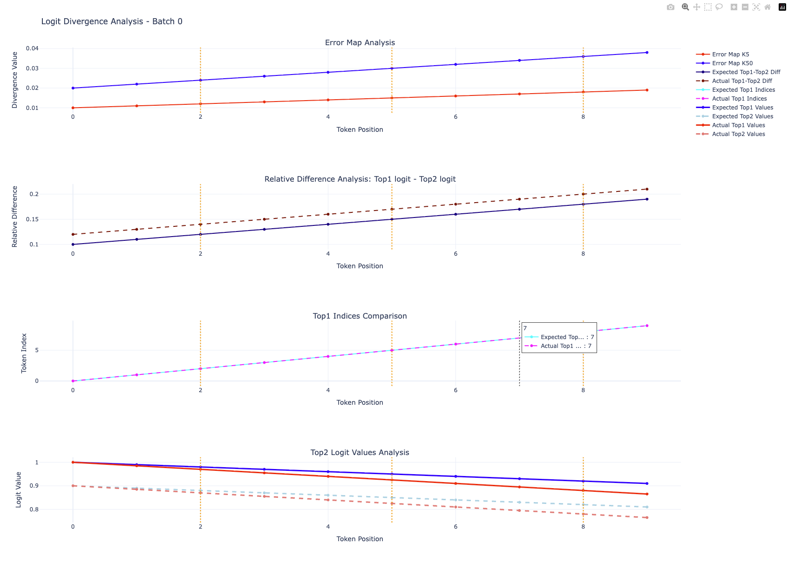

# vLLM Neuron Logit Validation Design

<!-- meta: description: Logit-level accuracy validation for vLLM Neuron — compares raw model logits (before sampling) between a HuggingFace reference and Trainium/Inferentia target using teacher forcing, top-k tolerance maps, and two-way vs three-way (FP32 baseline / BF16 expected / Neuron target) comparison with Bhattacharyya-coefficient and sigma-ratio pass criteria; covers the logit_validation and multi_prompt_logit_validation APIs, golden caching, and HTML visualization. -->
<!-- meta: content_type: conceptual-deep-dive -->
<!-- meta: date_updated: 2026-07-31 -->

## Overview

The vLLM Neuron logit validation framework provides logit-level validation and visualization for comparing model outputs across different hardware platforms. This enables detection of numerical drift and hardware-specific differences.

## Core Components

### Logit Validation Engine

**Purpose**: Compare raw logits between reference and target models with configurable tolerances.

**API** (`vllm_neuron.accuracy.logit_validation.logit_validation`):

``` python
logit_validation(
    input_ids: List[List[int]],
    generate_fn: Callable[
        [torch.Tensor], Union[torch.Tensor, Tuple[torch.Tensor, torch.Tensor]]
    ],
    expected_logits: torch.Tensor,
    tol_map: dict = None,
    baseline_logits: torch.Tensor = None,
    visualize: bool = False,
    save_logits: bool = True,
    output_dir: str = "validation_output",
) -> bool
```

### Visualization System

**Purpose**: Generate interactive HTML reports for logit comparison results.

**API** (`vllm_neuron.accuracy.logit_visualization.visualize_logit_results`):

``` python
visualize_logit_results(
    results: List[List[Dict]],
    output_dir: str = "logit_validation_plots",
    max_tokens: int = 5,
    save_logits: bool = True,
) -> None
```

**Direct Logits Comparison** (`vllm_neuron.accuracy.logit_visualization.visualize_logits`):

``` python
visualize_logits(
    target_logits: torch.Tensor,
    baseline_logits: torch.Tensor,
    output_dir: str = "logit_plots",
    tol_map: dict = None,
) -> None
```

### Tolerance Configuration

**Default Tolerances** (`vllm_neuron.accuracy.constants.DEFAULT_TOLERANCE_MAP`), keyed by top-k slice as `(atol, rtol)`:

``` python
DEFAULT_TOLERANCE_MAP = {
    "5": (1e-5, 0.011),
    "50": (1e-5, 0.02),
    "1000": (1e-5, 0.03),
    "all": (1e-5, 0.05),
}
```

### Teacher Forcing Strategy

Both the reference and target models are fed the same reference tokens at every
decode step, rather than each sampling its own continuation. This isolates
hardware precision effects from context drift: without teacher forcing, a
single divergent token early in generation would cascade into a completely
different continuation, making a per-token logit comparison meaningless.

## File Outputs

**Validation Artifacts**:

- `reference_logits.pt`: Expected logits tensor
- `target_logits.pt`: Actual model outputs

**Visualization Files**:

- `logit_analysis_b{batch}.html`: Interactive plots
- `logit_analysis_summary.json`: Results summary

### Expected Visualization Output



### Subgraph Analysis

**Error Map Analysis (Top)**  

- Tracks divergence values across top-k tokens for different k values (k=5, k=50, k=1000, k=all)
- The divergence shows the relative error between target and reference (top-k logits)
- If there's token divergence, it will be marked as vertical orange lines
- X-axis: token id (0-indexed)
- Y-axis: Divergence value (for different k values)

**Relative Difference Analysis (Middle-Top)**  

- Measures Top1 logit - Top2 logit difference for both expected and actual models
- The diff (between Top1 and Top2 logit) needs to be compared against unit of least precision (ULP)
- When the diff (Top1 - Top2 \< ULP), it could lead to wrong token selection due to precision issues.
- X-axis: token id (0-indexed)
- Y-axis: Relative difference (always larger than 0)

**Top1 Indices Comparison (Middle-Bottom)**  

- Compares which tokens are predicted as most likely (Top1) between models
- Lines show expected (cyan) vs actual (pink) Top1 token indices
- Diverging lines indicate different token selection
- X-axis: token id (0-indexed)
- Y-axis: Token index (0-N vocabulary range)

**Top2 Logit Values Analysis (Bottom)**  

- Shows the actual logit values for top-2 logit values
- The prediction values should match between expected and actual prediction. It helps validate numerical precision across hardware platforms
- X-axis: token id (0-indexed)
- Y-axis: Logit value (this can be cross checked with the dtype precision graph)

### Usage Examples

Basic validation (visualization disabled by default):

``` python
passed = logit_validation(
    input_ids=input_ids,
    generate_fn=target_fn,
    expected_logits=reference_logits,
    visualize=False,  # set to True to also write an HTML plot
    save_logits=True,
    output_dir="validation_results",
)
```

### Direct Logits Visualization

``` python
visualize_logits(
    target_logits=neuron_logits,
    baseline_logits=cpu_logits,
    output_dir="logit_comparison",
)
```

### Multi-Prompt Logit Validation

**Features**: Validate logits across multiple prompts with aggregate thresholds.

**API** (`vllm_neuron.accuracy.logit_validation.multi_prompt_logit_validation`):

``` python
multi_prompt_logit_validation(
    prompts_input_ids: List[List[List[int]]],
    generate_fn: Callable[
        [torch.Tensor], Union[torch.Tensor, Tuple[torch.Tensor, torch.Tensor]]
    ],
    prompts_expected_logits: List[torch.Tensor],
    prompts_baseline_logits: List[torch.Tensor] = None,  # enables three-way mode
    aggregate_config: dict = None,
    tol_map: dict = None,
) -> MultiPromptValidationResult
```

`MultiPromptValidationResult` (from `vllm_neuron.accuracy.types`) has fields:

- `passed: bool` — True if all prompts pass two-way validation
- `per_prompt_results: List[Tuple[bool, Optional[List[List[dict]]]]]` — per-prompt `(passed, results)`
- `aggregate_metrics: Dict[str, Any]` — cross-prompt aggregate threshold results

## Two-Way vs Three-Way Comparison

Both `logit_validation` and `multi_prompt_logit_validation` run in one of two
modes, selected by whether a baseline is supplied (`baseline_logits` /
`prompts_baseline_logits`).

**Two-way** (no baseline): compares the target (Neuron) logits directly against
whatever reference the caller passes as `expected_logits`, using the fixed
top-k tolerance map. For each top-k slice the relative error must stay under
that slice's threshold (the `rtol` entry of the `(atol, rtol)` tuple in
`DEFAULT_TOLERANCE_MAP`).

The reference is the caller's choice. The on-device logit test flow passes the
**FP32** goldens (`fp32_logits`) as `expected_logits` for its two-way check —
i.e. it compares Neuron directly against FP32 ground truth.

``` text
expected (caller's reference, e.g. HF FP32)  ──► compared against ──►  target (Neuron)
pass if per-top-k relative error < tol_map[k] rtol
```

**Three-way** (baseline supplied): compares three models to separate
vllm-neuron bugs from dtype-inherent BF16 noise:

- **FP32 (baseline)** — HuggingFace FP32 on CPU (ground truth; drives teacher forcing)
- **BF16 (expected)** — HuggingFace BF16 on CPU (the dtype-noise reference)
- **Neuron (target)** — vllm-neuron BF16 on hardware (under test)

Errors are measured relative to the FP32 baseline, so the target's error can be
compared against the BF16-vs-FP32 error. If the target's error looks like BF16
noise, it passes even when it exceeds the static two-way thresholds:

``` text
base error = |FP32 − HF BF16|      (dtype-inherent noise)
tgt  error = |FP32 − Neuron BF16|  (what we're testing)
pass if the target error is statistically indistinguishable from the baseline
```

The overall verdict is an **OR** of three independent routes — it passes if
**any** of these holds:

- all prompts pass the static two-way top-k thresholds, **or**
- aggregate σ-ratio ≤ `1.0` (`agg_sigma_ratio_threshold`), **or**
- aggregate BC ≥ `0.99` (`agg_bc_threshold`).

So the σ-ratio / BC checks can *rescue* a test whose errors exceed the fixed
two-way thresholds but are still statistically within BF16 noise. The per-token
L-inf / L2 ratios (default multiplier `1.5`) are reported as diagnostics and
for interpreting *where* a target deviates, but they do not gate the aggregate
verdict. Interpreting a failure (e.g. a large token-0 ratio indicating a
prefill issue) is covered in
[Accuracy debugging design → `LogitValPlugin`](accuracy_debugging_design.md).

## Example Scripts

- `examples/vllm_neuron/accuracy/run_logit_validation_offline.py` - Offline serving (LLM class)
- `examples/vllm_neuron/accuracy/run_logit_validation_online.py` - Online serving (OpenAI API)

## Golden Caching

Computing HuggingFace reference logits (FP32 baseline + BF16 expected) is expensive and deterministic for a given model + prompts + output length. The golden caching system avoids recomputation across test runs.

### Architecture

Two-tier cache: **local disk** → **S3** (optional).

- `vllm_neuron/utils/golden_cache.py`: Generic `get_or_compute_goldens()` with content-addressed keys (hash of `key_config` dict).
- `vllm_neuron/accuracy/goldens/reference_logits.py`: `get_cached_reference_goldens()` wraps the generic cache with logit-validation-specific defaults (builds the `key_config`, threads `model_loader`/FP8 params into `generate_three_way_reference_logits`). Exported from `vllm_neuron.accuracy.goldens`. The `model_loader` parameter lets callers inject a model-specific override loader.

Each cached golden is stored as a directory containing:

- `golden.pt`: Tensor data (FP32 logits, BF16 logits, input IDs)
- `metadata.json`: Framework version, key config (human-readable)

Cache location: `$VLLM_NEURON_GOLDEN_CACHE_DIR` (default: `~/.cache/vllm/neuron/goldens`).

### Usage

``` python
from vllm_neuron.accuracy.goldens import get_cached_reference_goldens

goldens = get_cached_reference_goldens(
    model_id="meta-llama/Llama-3.2-1B-Instruct",
    model_checkpoint=checkpoint_path,
    model_config=config,
    tokenizer=tokenizer,
    prompts=["The capital of France is", ...],
    output_length=16,
)

# goldens["fp32_logits"]  - FP32 baseline (list, one entry per prompt)
# goldens["dtype_logits"] - BF16 expected, teacher-forced (list, one per prompt)
# goldens["input_ids"]    - Tokenized prompts (list, one per prompt)

# Normalize each prompt's token ids to List[List[int]] before validating.
prompts_input_ids = [
    [list(ids) for ids in prompt] for prompt in goldens["input_ids"]
]

result = multi_prompt_logit_validation(
    prompts_input_ids=prompts_input_ids,
    generate_fn=neuron_generate_fn,
    prompts_expected_logits=goldens["dtype_logits"],
    prompts_baseline_logits=goldens["fp32_logits"],
)
print("PASSED" if result.passed else "FAILED")
```

### Key Config

The cache key is a hash of fields that affect the golden output:

- `model_id`, `prompts`, `output_length`, `dtype`
- `kv_cache_dtype` (only when not "auto")
- Fields like `tensor_parallel_size` are excluded (they don't affect reference logits)

See `vllm_neuron/utils/golden_cache.py` for the full key-hashing and cache-assembly logic.
