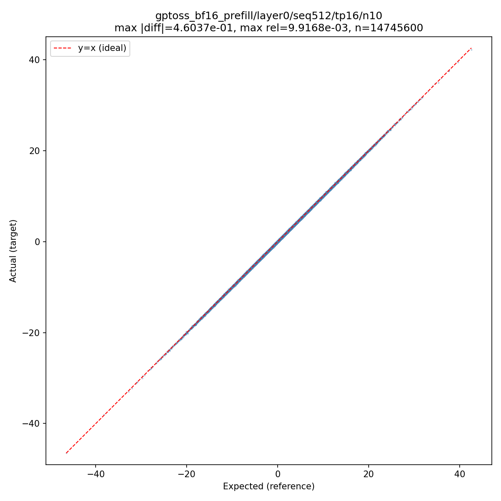
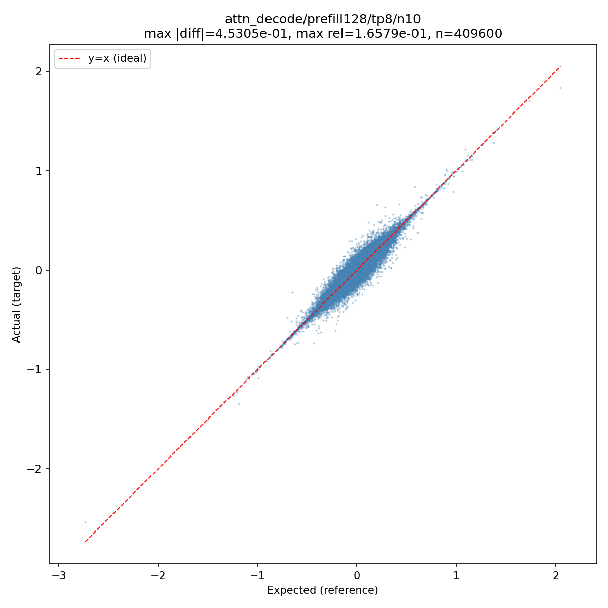
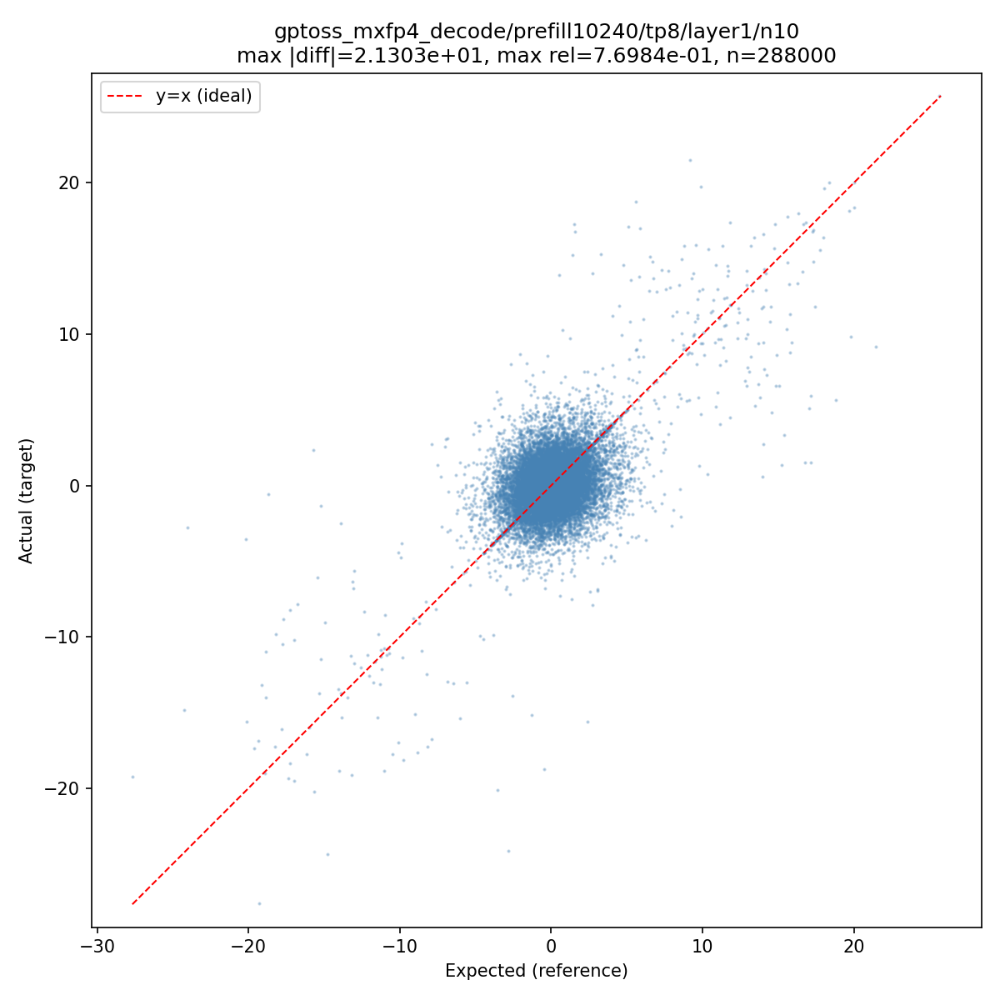
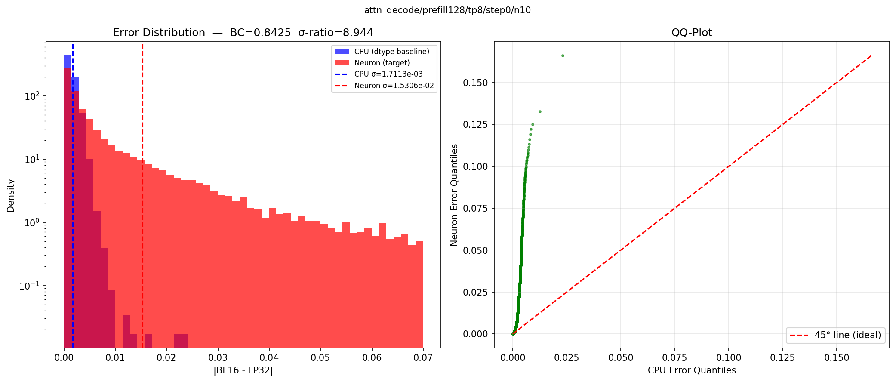

# Module-Level Accuracy Test Guidelines

<!-- meta: description: Module-level accuracy test guidelines -->
<!-- meta: content_type: reference-best-practices -->
<!-- meta: date_updated: 2026-06-22 -->

## Why Module-Level Testing Matters

Module-level tests validate individual building blocks (Attention, MLP, RMSNorm, Embeddings, MoE Router) in isolation before integration. Issues caught at this stage are significantly faster to debug than issues found in full-model validation.

The staged enablement process is:

``` text
Module → N-Layer → Full Model → E2E Eval
```

Each stage validates accuracy before proceeding. Module tests are the foundation.

## Understanding Numerical Error

### The Threshold Problem

Traditional accuracy testing uses a single relative error threshold:

``` text
relative_error = max(abs(target - reference)) / max(abs(reference))
assert relative_error < THRESHOLD
```

This works and is widely used across the industry. The challenge is choosing `THRESHOLD` — it depends on:

- **Scope**: Full model (~0.01), 4 layers (~0.005), single op (~1e-5)
- **Data type**: FP16 vs BF16 have different error patterns
- **Operation type**: Softmax, matmul, layernorm have different numerical properties
- **Input characteristics**: Small values, large values, mixed ranges
- **Weight range**: Error profiles vary significantly with weight magnitude. Experiments show that for BF16 MatMul at depth 1, P99 error ranges from 0.40–0.49% across weight ranges 0.01–15.0. For Attention, error grows exponentially with weight range — safe range is 0.01–0.20.

With domain expertise, engineers can set appropriate thresholds for each scenario. This is the standard approach and it works well for fast iteration during development.

### Two-Way Comparison

Two-way comparison is the standard approach: compare the target output directly against a reference. For module tests, we compare vLLM Neuron output against the FP32 golden reference (not BF16) to catch all numerical deviations.

``` python
from vllm_neuron.accuracy.testing import assert_close

# Compare vLLM Neuron output against FP32 golden
# rtol=1e-2 (1%) for attention, rtol=1e-2 (1%) for MLP
assert_close(neuron_output, fp32_output, rtol=1e-2, atol=1e-2, name="attn_prefill")
```

This differs from `torch.allclose` in how relative tolerance is computed. `torch.allclose` uses per-element normalization (`|a - b| <= atol + rtol * |b|`), where each element's own magnitude sets the scale. `assert_close` normalizes by the **global maximum** of the expected tensor (`(|a - b| - atol) / max(|expected|) <= rtol`), so rtol is relative to the tensor's overall scale. This avoids false failures on near-zero elements where per-element normalization amplifies noise. On failure, it reports mismatch count, max relative error, and max absolute error with element indices.

**When to use**: Fast iteration, regression testing, CI/CD pipeline checks, any scenario where you have a known-good threshold.

**Role in module tests**: Two-way `assert_close` is used as a per-sample diagnostic — failures are logged (with a `NOTE:` prefix) but do not gate the test. This provides engineers with immediate visibility into which samples exceed the threshold, without requiring per-scenario threshold tuning. The three-way `assert_close_three_way` is the statistical accuracy gate.

### Three-Way Comparison

Three-way comparison adds diagnostic power by introducing an FP32 baseline. Instead of comparing Neuron output directly to a reference at the same precision, we compare **both** against a common FP32 baseline:

``` text
Error₁ = |Neuron_BF16 − Baseline_FP32|    (target error)
Error₂ = |CPU_BF16    − Baseline_FP32|    (dtype reference error)
```

This answers the key question: **"Is this error from Neuron, or just from BF16?"**

- If Error₁ ≈ Error₂ → Neuron matches expected quantization behavior
- If Error₁ \>\> Error₂ → There is a hardware/implementation-specific issue

``` python
from vllm_neuron.accuracy.testing import assert_close_three_way

assert_close_three_way(
    hf_output_fp32,    # FP32 baseline
    hf_output_bf16,    # BF16(or other target dtype) on CPU (dtype error expected)
    neuron_output,     # BF16(or other target dtype) on Neuron (actual)
    name="attn_prefill/layer0/seq128/tp8",
)
```

**Why this helps**: Static thresholds can fail across different model weights and inputs because error profiles vary significantly. Three-way comparison provides an empirical, input-adaptive approach — Error₂ captures the expected precision loss for the specific weights and inputs being tested, serving as a dynamic reference.

**When to use**: Initial hardware validation, investigating failures, production sign-off, any scenario where you want automatic triage of whether an error is dtype-inherent or target-specific.

#### Computing the Three References

``` python
import copy

# hf_module is BF16, input is BF16
with torch.no_grad():
    # 1. FP32 baseline — the "ground truth"
    output_fp32 = copy.deepcopy(hf_module).float()(input.float()).detach()

    # 2. Target Dtype(BF16, etc) on CPU — the dtype error reference
    output_bf16 = hf_module(input).detach()

# 3. BF16 on Neuron — produced by running the vLLM Neuron module on device
```

#### Metrics

The three-way comparison reports four metrics. Two are **aggregated** across all inputs (used for the statistical gate), and two are **per-input worst-case** (used as hard guards against outliers).

Aggregated metrics (computed over all N inputs concatenated):

- **σ-ratio** (sigma ratio): `RMS(all_target_errors) / RMS(all_reference_errors)`. Answers "overall, is vLLM Neuron as accurate as the reference?" A value ≤ 1.0 means vLLM Neuron is at least as accurate as the CPU/GPU reference across all inputs combined.
- **BC** (Bhattacharyya Coefficient): Overlap between the target and reference error distributions (0–1). Answers "do the error distributions have the same shape?" BC ≥ 0.99 means nearly identical distributions.

Per-input worst-case metrics (max across individual inputs):

- **worst L-inf ratio**: For each input `i`, compute `max(|vLLM Neuron_error_i|) / max(|Ref_error_i|)`, then take the max across all inputs. Answers "is any single element in any input significantly worse?"
- **worst L2 ratio**: For each input `i`, compute `‖vLLM Neuron_error_i‖₂ / ‖Ref_error_i‖₂`, then take the max across all inputs. Answers "is any single input systematically worse?"

The distinction matters: σ-ratio can be low (good) even if one input has a high L2 ratio, because the aggregate is dominated by the majority of good inputs. The per-input guards catch these outliers.

#### Pass/Fail Criteria

The three-way comparison uses two metrics for pass/fail:

1. **Bhattacharyya Coefficient (BC)**: Measures overlap between the target and reference error distributions. BC ≥ 0.99 means the distributions are nearly identical — the target introduces no additional error beyond what the dtype already causes.
2. **σ-ratio** (sigma ratio): The ratio of aggregated target L2 error to aggregated reference L2 error. If σ-ratio ≤ 1.0, the target is actually *more accurate* than the reference, which is always a pass regardless of BC.

The pass condition is:

``` text
PASS if (BC >= bc_threshold OR σ-ratio <= 1.0)
     AND worst L-inf ratio < max_linf_ratio (default 5.0)
     AND worst L2 ratio   < max_l2_ratio   (default 3.0)
```

The hard ratio guards are a safety net that catches extreme element-wise deviations even when the overall distribution looks acceptable. They ensure that no individual sample has vLLM Neuron errors more than 5× (L-inf) or 3× (L2) worse than the CPU reference. Passing tests typically show L-inf ratios well under 3× and L2 ratios under 2×.

BC interpretation:

- BC = 1.0 → Identical distributions (perfect match)
- BC ≥ 0.99 → Excellent similarity (production ready)
- 0.95 ≤ BC \< 0.99 → Marginal — review plots to determine if acceptable
- BC \< 0.95 → Distributions diverge (likely a bug)

BC is self-normalizing — the same metric and threshold (BC ≥ 0.99) applies identically to single operations and complete models, without per-scenario tuning.

#### Multi-Input Testing

A single input may not provide enough error values for stable BC computation. Run N different inputs through the same compiled graph and aggregate the three-way comparison across all samples:

``` python
all_fp32, all_bf16, all_vllm_neuron = [], [], []
for sample in range(N_SAMPLES):
    torch.manual_seed(sample)
    # ... generate input, compute fp32/bf16/vllm_neuron outputs ...
    all_fp32.append(output_fp32)
    all_bf16.append(output_bf16)
    all_vllm_neuron.append(output_vllm_neuron)

# Aggregated three-way across all samples
assert_close_three_way(all_fp32, all_bf16, all_vllm_neuron, name="decode/layer0")
```

`assert_close_three_way` accepts lists of tensors and aggregates σ-ratio and BC across all samples. N=10 is a good default — it provides enough error values for stable statistics while keeping test runtime reasonable.

## Visual Debugging

When a test fails, numerical metrics alone may not tell the full story. The `vllm_neuron.accuracy.plotting` module provides visual diagnostics.

### Error Distribution Histograms

Overlay CPU and Neuron error distributions. If they overlap, the error is dtype-inherent. If they diverge, it's target-specific.

``` python
from vllm_neuron.accuracy.plotting import plot_error_distributions

plot_error_distributions(
    base_errors, tgt_errors,
    name="attn_prefill/layer0/seq1024/tp8",
    output_path="debug_errors.png",
)
```

### QQ-Plots

Plot Neuron error quantiles vs CPU error quantiles. Points on the 45° diagonal mean distributions match. Systematic deviation from the diagonal indicates a configuration or implementation issue.

Example: RMSNorm with incorrect epsilon (1e-6 vs 1e-5). The QQ-plot immediately reveals systematic error — Neuron errors are consistently larger than reference. After fixing epsilon, points align with the 45° line.

``` python
from vllm_neuron.accuracy.plotting import plot_error_qqplot

plot_error_qqplot(
    base_errors, tgt_errors,
    name="attn_prefill/layer0/seq1024/tp8",
    output_path="debug_qqplot.png",
)
```

### Scatter Plots (Two-Way)

For two-way comparison, scatter the actual values against expected values. Points should cluster along the y=x line. Deviation from the line shows where errors concentrate.

``` python
from vllm_neuron.accuracy.plotting import plot_scatter

plot_scatter(
    neuron_output, hf_output,
    name="attn_prefill/layer0",
    output_path="debug_scatter.png",
)
```

### Convenience: Three-Way Plots

Generate both histogram and QQ-plot from three tensors in one call:

``` python
from vllm_neuron.accuracy.plotting import plot_three_way

plot_three_way(fp32_ref, bf16_cpu, bf16_neuron, name="attn/layer0")
```

`assert_close_three_way` automatically generates these plots on failure when `plot_on_failure=True` (the default). Plots are saved to `accuracy_debug/` or a custom `output_dir`.

### Interpreting the Plots

**Scatter plots** show actual (Neuron) vs expected (reference) values. Each element of the output tensor is one point. A perfect result is a tight line along y=x.

*Passing — tight y=x line:*



All points lie directly on the y=x line. The title shows max |diff| and max relative error — both small. This is what a healthy module looks like.

*Failing (moderate) — visible spread:*



Points cluster around y=x but with visible spread. The max relative error (~16%) confirms significant deviation. This pattern typically indicates a systematic issue (e.g., TP-related accumulation error) rather than random noise.

*Failing (severe) — cloud:*



Points form a diffuse cloud rather than a line. The output is essentially uncorrelated with the reference. This indicates a fundamental issue — wrong mask, incorrect weight mapping, or a kernel bug.

**Error distribution plots** (generated on three-way failure) show two overlaid histograms: CPU BF16 error (blue) and Neuron error (red), both measured against the FP32 baseline. The dashed lines show σ (RMS error) for each. The QQ-plot on the right compares quantiles — points on the 45° line mean the distributions match.

*Failing — Neuron errors much wider than CPU:*



The red (Neuron) distribution extends far beyond the blue (CPU) distribution. The σ-ratio in the title (8.9×) quantifies this: Neuron errors are ~9× larger than BF16 CPU errors. The QQ-plot shows points far above the 45° line, confirming Neuron errors are systematically larger at every quantile. BC=0.84 confirms the distributions are clearly different.

When the distributions overlap (BC ≥ 0.99), the QQ-plot points will lie on or near the 45° line, and the σ values will be similar — this means the error is purely from the dtype, not from the target.

## Test Structure

### Two Categories of Module Tests

**1. Synthetic-weight unit tests** (`unit_tests.py`)

Use random weights. Test shape correctness, CPU-vs-Neuron compilation, basic numerical properties (e.g., RMSNorm produces unit variance). Do not require real checkpoints.

**2. Real-weight accuracy tests** (`attention_tests.py`, `mlp_tests.py`)

Use real checkpoint weights. Compare vLLM Neuron output against HuggingFace reference. These benefit most from three-way comparison because the error reference adapts to the actual weight distribution.

### Anatomy of a Real-Weight Accuracy Test

Each test combines per-sample two-way validation (informational, logged but not gating) with aggregated three-way validation (the real accuracy gate) across N=10 inputs:

``` text
1. Resolve checkpoint (get_model_checkpoint)
2. Load HF reference module with real weights (BF16 + FP32 copy)
3. Create vLLM Neuron executor with model_load closure
4. For each of N_SAMPLES inputs:
   a. Generate random hidden_state with torch.manual_seed(sample)
   b. Compute FP32 golden and BF16 reference from HF module
   c. Dispatch to vLLM Neuron executor, collect output
   d. Rank consistency check across TP ranks
5. Two-way: informational only (logged, not gating)
   - Count failures, print NOTE if any exceed rtol
6. plot_scatter (always generated for visual diagnostics)
7. assert_close_three_way — the real accuracy gate
8. Shutdown executor in finally block
```

The two-way check provides diagnostic information per sample. The three-way check provides statistical validation across all samples — if σ-ratio ≤ 1.0 (vLLM Neuron more accurate than CPU/GPU reference) or BC ≥ 0.99 (error distributions match), the test passes.

## Practical Guidelines

### Loading HF Reference Modules

Load only the module under test directly from safetensors — this avoids loading the entire model into memory:

``` python
from safetensors import safe_open
from transformers import AutoConfig

def load_hf_attention_from_safetensors(checkpoint_path, layer_idx):
    hf_config = AutoConfig.from_pretrained(checkpoint_path)
    hf_attn = HFAttentionClass(hf_config, layer_idx=layer_idx)

    index_path = os.path.join(checkpoint_path, "model.safetensors.index.json")
    with open(index_path) as f:
        weight_map = json.load(f)["weight_map"]

    weight_names = [
        f"model.layers.{layer_idx}.self_attn.q_proj.weight",
        f"model.layers.{layer_idx}.self_attn.k_proj.weight",
        # ...
    ]
    state = {}
    for name in weight_names:
        shard_path = os.path.join(checkpoint_path, weight_map[name])
        with safe_open(shard_path, framework="pt", device="cpu") as f:
            local_name = name.replace(f"model.layers.{layer_idx}.self_attn.", "")
            state[local_name] = f.get_tensor(name).to(torch.bfloat16)

    hf_attn.load_state_dict(state, strict=True)
    return hf_attn.to(torch.bfloat16), hf_config
```

### Checkpoint Resolution

Use `get_model_checkpoint()` for portable checkpoint resolution (local cache → S3 → HuggingFace):

``` python
from test.vllm_neuron.utils.logit_test_utils import get_model_checkpoint
model_checkpoint = get_model_checkpoint(model_id)
```

Or use a local path directly when the checkpoint is pre-downloaded:

``` python
MODEL_PATH = "/path/to/your/model/checkpoint"
```

### vLLM Neuron Weight Loading

Use `SafetensorsCheckpoint` with the appropriate loader:

``` python
checkpoint = SafetensorsCheckpoint(model_checkpoint)
if cpu_mode:
    state = checkpoint.load_sharded(
        rank=rank, world_size=ws, model=module,
        mappings=mappings, device=device,
    ).state_dict
else:
    state = checkpoint.load_sharded_pipelined(
        rank=rank, world_size=ws, model=module,
        mappings=mappings, device=device,
    ).state_dict
module.load_state_dict(state, strict=False, assign=True)
```

### Parameterize Grid

Cover multiple axes to catch shape-specific and parallelism-specific issues:

- **seq_len**: powers of 2 covering auto-bucket ranges — prefill: 128 to 16K, decode: 1 to 128
- **world_size**: single (1), small TP (2, 8), large TP (32)
- **layer_idx**: if layers have non-uniform architecture (e.g., alternating sliding window and full attention), test one layer of each architecture
- **prefill + decode**: test both paths for all modules — prefill exercises the context-encoding kernel, decode exercises the token-generation kernel

Exclude invalid combinations from the parametrize grid rather than skipping at runtime where possible. For cases that are harder to exclude statically:

``` python
if seq_len % world_size != 0:
    pytest.skip(f"seq_len={seq_len} not divisible by world_size={world_size}")
```

### Sequence Parallelism and Context Parallelism

With SP or CP, each rank processes a different slice of the sequence. Outputs from different ranks are **not expected to match** — each rank holds its own slice. The preferred approach is to reconstruct the full output from all ranks before comparison:

``` python
# Reconstruct full output from per-rank slices
full_output = torch.cat([output for output in outputs], dim=0)
assert_close_three_way(hf_output_fp32, hf_output_bf16, full_output, ...)
```

Similarly for expert parallelism (EP) — reconstruct the full output before comparison rather than comparing individual rank slices.

### Executor Lifecycle

Always use `try/finally` to ensure executor shutdown:

``` python
executor = MPExecutor(...)
try:
    executor.dispatch(...)
    outputs = executor.collect()
    # assertions
finally:
    executor.shutdown()
```

## Quick Reference

| Scenario | Tool |
| ---- | ---- |
| Fast accuracy check with known threshold | `assert_close` (two-way) |
| Accuracy check with automatic triage | `assert_close_three_way` (three-way) |
| Shape / dtype checks | `assert tensor.shape == ...` |
| Debug: where do errors concentrate? | `plot_scatter` (two-way) or `plot_error_distributions` (three-way) |
| Debug: is error systematic or statistical? | `plot_error_qqplot` |
