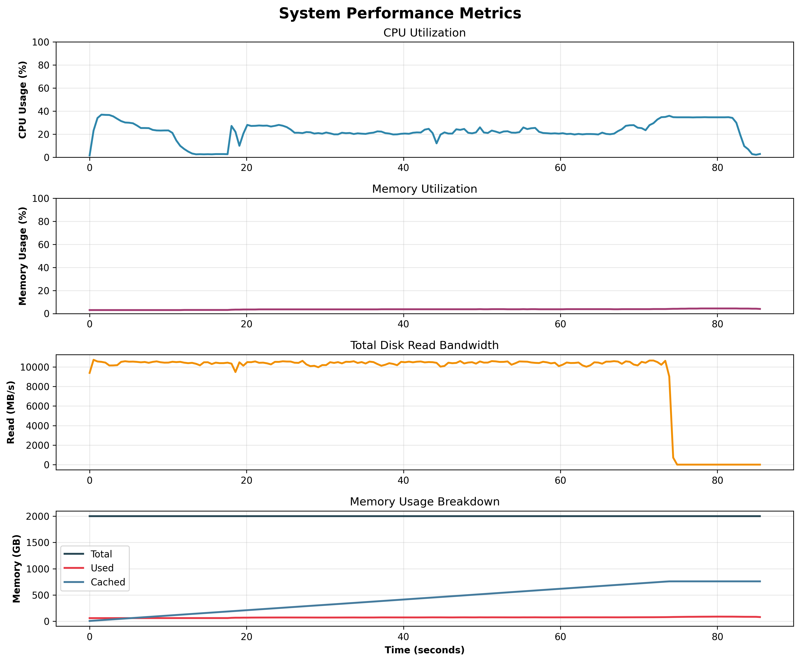
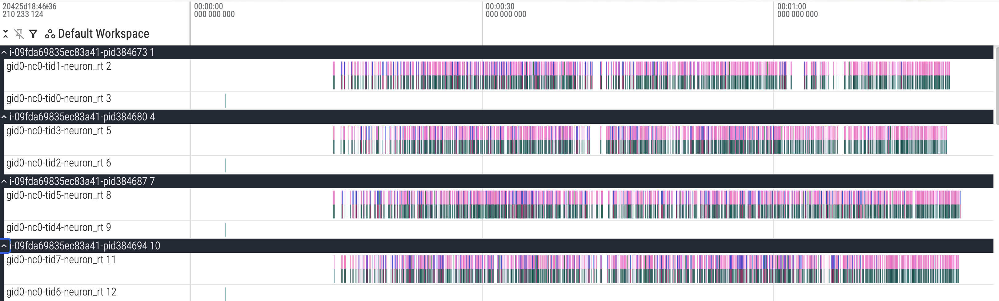
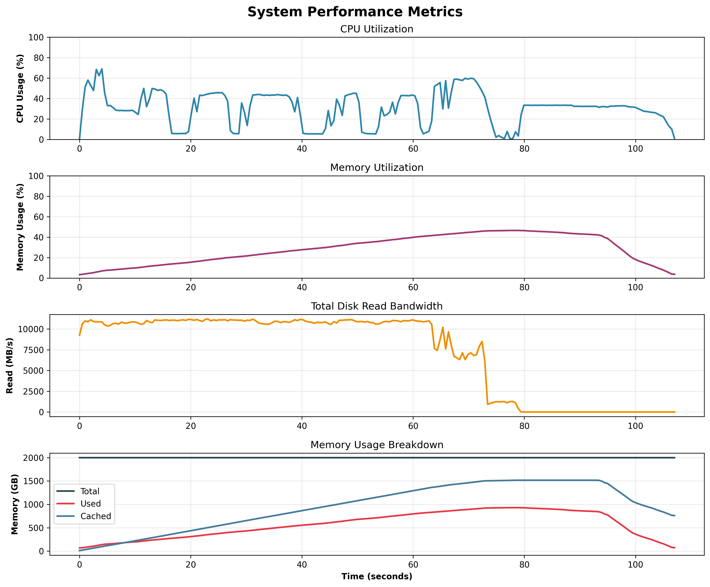

# Checkpoint Loading Framework Capability

<!-- meta: description: Checkpoint loading with parallelism -->
<!-- meta: content_type: conceptual-deep-dive -->
<!-- meta: date_updated: 2026-06-23 -->

## Overview

The vLLM Neuron framework provides multi-process checkpoint loading capabilities that enable customers to quickly and efficiently load a SafeTensors checkpoint from disk, perform any transformations/sharding of weights, and send to each Neuron device.

## Problem Statement

There are a few challenges with checkpoint loading:

1. **Memory Utilization** - Naively in a multi-process setup, if each process loads a full checkpoint into memory, and then chooses its required slice from each tensor, this would result in high memory utilization across the system and be extremely slow (one exception for this is very small models).
2. **Speed** - Given that checkpoint loading is something that happens at server startup and while developers are iterating on model implementations, it is crucial to makes this run as fast as possible. Models such as Llama3.1 405B (~750 GB) currently take around 15-20 minutes to load from disk to device in the existing single-process NxDI.
3. **Usability** - We'd like the process of checkpoint loading to be intuitive to customers.

## Solutions

Memory utilization is the key problem that must be solved in order to run a large model using a multi-process setup. Fundamentally, we just need to have each process only load the weights it needs, rather than the full checkpoint. Below are two ways that we can achieve this:

1. **Use Weight Format With Slicing** - The Safetensors format allows for reading slices of weight tensors from disk.
2. **Use Shared Memory** - Another approach is to load the full checkpoint from disk to shared memory that each process can access.

With the approaches above, each process can specifically load only the portions of a weight that it needs into memory, solving the memory utilization problem.

## Approach 1 - Weight Format With Slicing (w/ OS Page Cache)

This approach requires each process (in parallel) to do the following for checkpoint loading:

1. Initialize Neuron Runtime in a parallel thread while loading OS page cache (this is a key optimization to enable fast sharding across non-contiguous dimensions)
2. Populate OS page cache with weights (this is an optimization)
3. Read the portion of each weight tensor needed (based on rank) from disk to memory
4. Process the tensor as needed (padding, fusing, etc.)
5. Send each weight tensor to device

Note: We can pipeline operations 2-5 to speed up checkpoint loading in some cases. The amount of pipelining that can be done depends on modeling code and checkpoint. For simple maximized pipelining, modeling code should match checkpoint.

### Code

For full examples, see the following examples:

1. `weight_loading_page_cache.py` - Optimized code that pipelines the execution of multi-process checkpoint loading
2. `weight_loading_page_cache_ux.py` - Example showing how weight transformations (padding, fusing) + sharding can be integrated into modeling code

``` python
# Shared Utility Function
def populate_os_page_cache(model_path: str, rank: int) -> None:
    # Read through portion of model weights to load into OS page cache
```

### System Resource Utilization

To validate system resource usage is as expected with this approach, data was collected while running checkpoint loading for Llama3.1 405B.

- We can see that the majority of time is spent loading data from disk to the OS page cache
- We can also see that very little memory is used by the user processes thanks to the OS page cache



### Benchmarking

Below are some results from benchmarking (fully optimized setup), where E2E time is defined as the time it takes from the point when all processes have been spun up, till they have completed. Cold start is the first run (empty caches), while warm start is the second run (this reflects what loading times will look like when developing code)

| Model | TP Degree / Server Count | Cold Start E2E Time | Warm Start E2E Time |
|----|----|----|----|
| GPT-OSS 120B | 64 / 1 | 12 seconds | 12 seconds |
| GPT-OSS 120B | 8 / 8 | 25 seconds | 25 seconds |
| Llama3 405B | 64 / 1 | 85 seconds | 61 seconds |
| Llama3 405B | 32 / 2 | 100 seconds | 75 seconds |

For small models, we get bottlenecked by Neuron Runtime initialization. For large models, bottlenecks are disk reads and non-contiguous memory access (required for sharding)

### Neuron Runtime Profiling

From running with profiling enabled, we can see the pipelined execution in action. The blocks are a bunch of nrt_tensor_allocates and nrt_tensor_writes.



## Approach 2 - Shared Memory

This approach requires each process (in parallel) to do the following for checkpoint loading:

1. Initialize Neuron Runtime in a parallel thread while loading OS page cache (this is an optimization)
2. Read portion of weights (based on rank) and write to shared memory
3. Read the portion of each weight tensor needed (based on rank) from shared memory
4. Process the tensor as needed (padding, fusing, etc.)
5. Send each weight tensor to device

Note: We can pipeline operations 2-5 to speed up checkpoint loading in some cases. The amount of pipelining that can be done depends on modeling code and checkpoint. For simple maximized pipelining, modeling code should match checkpoint.

### Shared Memory Code

For full examples, see the following examples:

1. `weight_loading_shared_memory.py` - Optimized code that pipelines the execution of multi-process checkpoint loading
2. `weight_loading_shared_memory_ux.py` - Example showing how weight transformations (padding, fusing) + sharding can be integrated into modeling code

``` python
# Shared Utility
class SharedMemoryManager():
    def put_tensor(tensor: Tensor, name: str) -> None
    def get_tensor(name: str) -> Tensor
    def cleanup() -> None
```

### Shared Memory Resource Utilization

To validate system resource usage is as expected with this approach, data was collected while running checkpoint loading for Llama3.1 405B.

- We can see that the majority of time is spent loading data from disk to the OS page cache



### Shared Memory Benchmarking

Below are some results from benchmarking, where E2E time is defined as the time it takes from the point when all processes have been spun up, till they have completed. Cold start is the first run (empty caches), while warm start is the second run (this reflects what loading times will look like when developing code)

| Model        | TP Degree | Cold Start E2E Time | E2E Time   |
|--------------|-----------|---------------------|------------|
| GPT-OSS 120B | 64        | 14 seconds          | 14 seconds |
| Llama3 405B  | 64        | 100 seconds         | 75 seconds |

For small models, we get bottlenecked by Neuron Runtime initialization. For large models, bottlenecks are disk reads and non-contiguous memory access (required for sharding)

### Comparison: OS Page Cache vs Shared Memory

| Aspect | Shared Memory Approach | OS Page Cache Approach | Preferred |
|----|----|----|----|
| **Memory Management** | Applications need to explicitly manage memory | No explicit shared memory management required by the application | OS Page Cache |
| **Memory Utilization** | Applications need to allocate memory for the full checkpoint for each serving server (e.g., vLLM server) per instance | Each server can share the same memory without added complexity | OS Page Cache |
| **Speed** | Creating shared memory and cleaning it up adds some overhead | Fastest due to not needing to create and clean up shared memory | OS Page Cache |
| **Weight Format Flexibility** | Models have the flexibility of using any format of model weight | Limited to formats that support reading slices of weights (e.g., SafeTensors) | Shared Memory |
| **Weight Loading Flexibility** | Customers can choose to transform full tensors or transform sharded tensors | Each rank can only transform a shard of each tensor (note this is the approach in vLLM) | Shared Memory |
